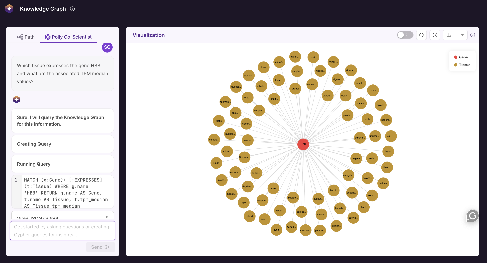

# Polly Co-Scientist

**Polly Co-Scientist** is an AI-powered research assistant developed to help scientists transform complex biomedical data into actionable scientific insights with ease. It transforms natural language queries into Cypher commands to interact with Polly's Knowledge Graph, allowing users to explore relationships, simulate biological reasoning, and generate hypotheses, without **writing a single line of code.**

 <center> Polly Co-Scientist</center>


## Data Distribution and Sources Used

Polly KG integrates data from multiple open-source and authoritative biomedical databases. Below is a list of sources and their versions:


| DB Name     | Source                                                                                           | Version     |
|-------------|------------------------------------------------------------------------------------------------|-------------|
| MONDO       | [MONDO Ontology](https://mondo.org)                                                            | v2025-02-04 |
| HPO         | [HPO Ontology](https://hpo.jax.org/app/download)                                               | v2025-01-16 |
| NCBI        | [NCBI Download](https://www.ncbi.nlm.nih.gov/home/download/)                                  | release-113 |
| GO          | [Gene Ontology](https://geneontology.org/docs/download-ontology/)                              | v2025-02-06 |
| Reactome    | [Reactome Data](https://reactome.org/download-data)                                            | v91         |
| ChEMBL      | [ChEMBL Downloads](https://chembl.gitbook.io/chembl-interface-documentation/downloads)         | ChEMBL35    |
| OpenTargets | [OpenTargets Platform](https://platform.opentargets.org/downloads) <br> - associationByDatatypeDirect: target-disease associations <br> - diseaseToPhenotype: disease-phenotype mappings <br> - diseases: disease names and IDs <br> - indication: clinical trial indications <br> - interaction: target interactions <br> - targets: target info and tractability | v24.9       |
| UniProt     | [UniProtKB](https://www.uniprot.org/uniprotkb)                                                | 2021_03     |


## Key Capabilities

- **Ease of Use**: Designed with a user-friendly interface that simplifies KG exploration. 
- **Natural Language Interface**: Query the Knowledge Graph using simple English, no need to learn Cypher or write Python code.  
- **Automated Query Conversion**: Intelligently translates natural language input into Cypher queries and executes them on the Knowledge Graph.  
- **Dual Output**: View results in both text (summary and Cypher) and graphical (node-edge) formats. 


---


## How to Query the Knowledge Graph with Natural Language

Polly Co-Scientist enables you to interact with the biomedical Knowledge Graph using simple, natural language — no technical expertise required.

You can choose from two options:

- **Use Predefined Templates**: Select from templatized queries available directly within the Polly Co-Scientist interface to quickly explore common biomedical relationships.
- **Run Custom Queries**: Type your own questions in plain English to retrieve insights tailored to your specific research needs.


### Running Custom Queries on the Knowledge Graph Using Natural Language

#### Step 1: Type Your Query in English
Use the chat interface to enter your research question in natural language.

**Example**:  
`Which tissue expresses the gene HBB, and what are the associated TPM median values?`

 <center> Query Example</center>


#### Step 2: Review the Auto-Generated Cypher Query
Polly Co-Scientist automatically translates your natural language input into a Cypher query and JSON output. Both are displayed for reference and executed without requiring manual input.

**Example**:
```cypher
MATCH (g:Gene)<-[:EXPRESSES]-(t:Tissue) WHERE g.name = 'HBB' RETURN g.name AS Gene, t.name AS Tissue, t.tpm_median AS Tissue_tpm_median
```

 <center> Cypher Query</center>


#### Step 3: View the Results

The output is generated in 2 parts:

- **Text Output:**
A simple readable summary of the query results is displayed.

  Example:
  `The gene HBB is expressed in a wide range of tissues including the adrenal gland, breast, thyroid gland, uterus, prostate gland, bladder, and various parts of the brain and gastrointestinal tract, among others. However, the median TPM (transcripts per million) values for HBB expression in these tissues are not available in the data provided. This suggests that while the gene is present across diverse tissues, specific expression levels were not measured or reported in this dataset.`


- **Graph Output:**
A visual representation of the results is displayed on the Knowledge Graph viewer.

 <center> Output of the Query</center>

User can click the zoom icon on the right to expand the Knowledge Graph view for easier exploration and full-screen display.

 <center> Entire Knowledge Graph Window</center>


