# About the Application

## Polly KG Explorer

**Polly KG Explorer** is an interactive tool and a part of the Polly KG ecosystem on Polly. It is designed to help researchers explore and analyze the Polly Knowledge Base, which consists of harmonized biomedical data. It enables users to uncover relationships between biological entities and generate data-driven hypotheses.

**How to Open Polly KG Explorer**

Click the **Polly KG Explorer icon** located on the far-right panel of the **default Co-Scientist page**. A confirmation dialog will appear indicating that you are switching from Co-Scientist to KG Explorer. Click Continue to proceed to the Polly KG Explorer page. It will **open KG Explorer Landing page**. 

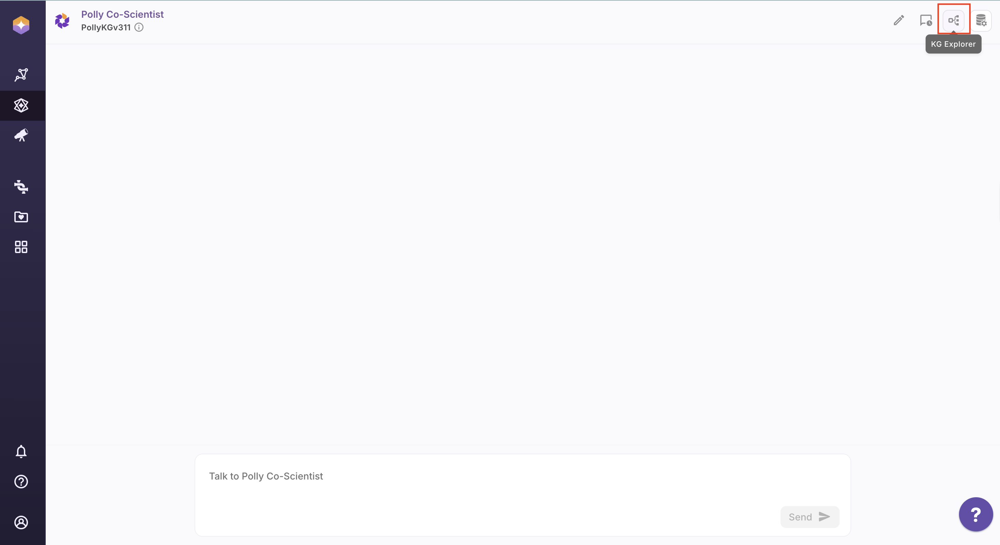 <center> Polly KG Explorer Button</center>

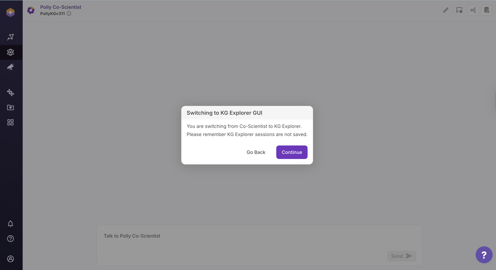 <center> Polly KG Explorer Switch Tab</center>

## Layout of Polly KG Explorer

The Polly KG Explorer interface is organized into distinct regions, each serving a specific functional role in the exploration workflow.

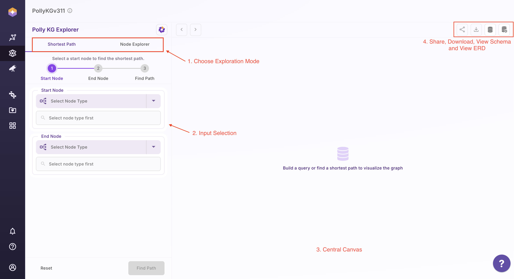 <center> Layout of Polly KG Explorer</center>

<center> Table 1. Components of Polly KG Explorer</center>

| S. No. | Region            | Purpose                                                                 |
|------:|-------------------|-------------------------------------------------------------------------|
| 1     | Top Left Tabs     | Choose the exploration mode: **Shortest Path** or **Node Explorer**   |
| 2     | Left Panel        | Input selection (node type, select associations) and CTA buttons   |
| 3     | Centre Canvas     | Display graph results and interactive visualizations                    |
| 4     | Top Right Buttons | Access share, download, view schema and view ERD tools            |


## 1. View Schema

Select the database icon in the top-right corner to open the schema view.

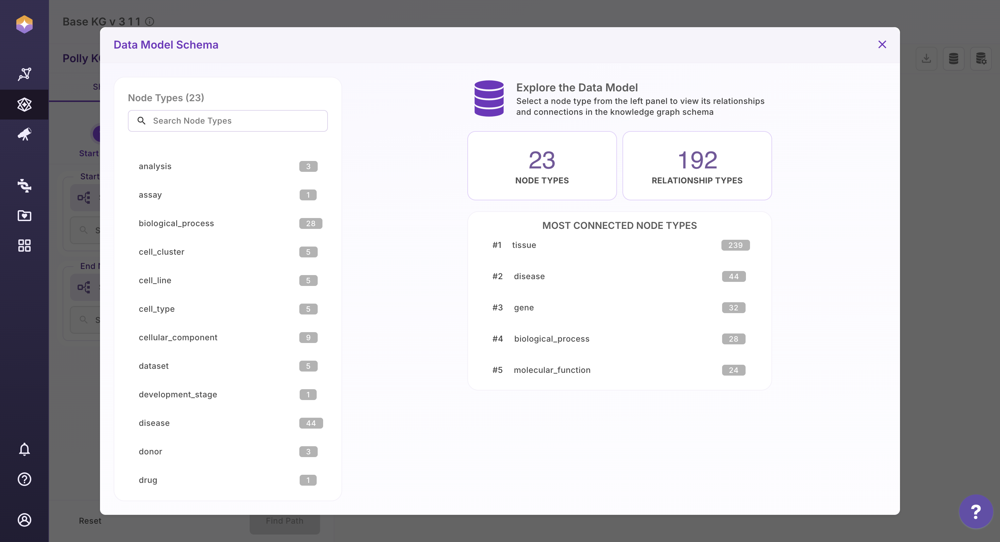 <center> View Schema</center>

The schema panel displays:

- All available **node types** along with the count of their incoming and outgoing associations
  
- The different **relationship types** present in the Knowledge Graph
  
- The **properties and data types** of each property in a given associations


This view provides a clear understanding of the Knowledge Graph structure, helping users navigate data confidently and explore relationships more effectively.

**Video on User interaction**

<video width="100%" controls>
  <source src="../img/KG/Video1.mp4" type="video/mp4">
  Your browser does not support the video tag.
</video>


---

## 2. Shortest Path

The Shortest Path feature helps you identify the most direct connection between two entities in the Knowledge Graph. In graph theory, a shortest path problem is the problem of finding a path between two nodes in a graph such that the sum of the weights of its constituent edges is minimized.

Within the Polly KG Explorer, this feature is powered by Neo4j’s native shortest path algorithms.

**Key Distinction:**

- `shortestPath(...)` → returns one shortest path
  
- `allShortestPaths(...)` → returns all paths tied for minimum hop length


Detailed technical documentation for these methods is available in the [Neo4j Cypher manual](https://neo4j.com/docs/cypher-manual/current/patterns/shortest-paths/).


### How to Use Shortest Path
- Open the **Shortest Path** tab
- Select the start node type from the dropdown
- Enter the search term for the start node
- Select the end node type from the dropdown
- Enter the search term for the end node
- Click **Find Path** to generate the result

Once the graph is rendered, you can:

- Click **View Query** to see the Cypher query used
  
- Use the **Reset** button to clear selections and start a new search


An example output graph is shown below for reference.

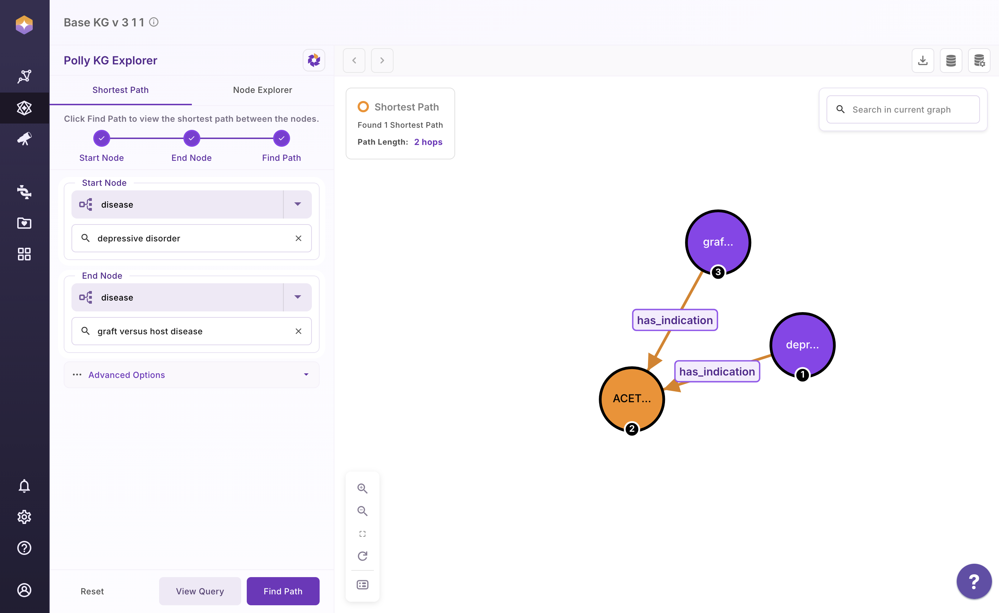 <center> Shortest Path</center>

The shortest path query that was executed:
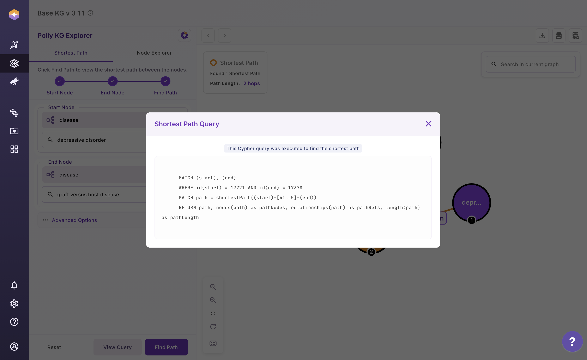 <center> Cypher Query used to calculate Shortest Path for the selected nodes</center>


### Query Explanation for Shortest Path

```

MATCH (start), (end)

any node in the graph as  `start`
any node in the graph as `end`

WHERE id(start) = 17721 AND id(end) = 17378
internal db ids for the node terms as specified by the user

MATCH path = shortestPath((start)-[*1..5]-(end))
RETURN path,
       nodes(path) as pathNodes,
       relationships(path) as pathRels,
       length(path) as pathLength

| Output               | What it will fetch                          |
|----------------------|----------------------------------------------|
| `path`               | Full visual path                             |
| `nodes(path)`        | Ordered list of all nodes in the path        |
| `relationships(path)`| Ordered list of all relationships            |
| `length(path)`       | Number of edges in the path                  |


```

**Video on User interaction**

<video width="100%" controls>
  <source src="../img/KG/Video2.mp4" type="video/mp4">
  Your browser does not support the video tag.
</video>


**Scientifc Literature connecting Depressive Disorder & graft versus host disease to Acetylcysteine**

```

- Depressive Disorder:
[ScienceDirect article](https://www.sciencedirect.com/science/article/abs/pii/S0163834324002238)

- Graft-Versus-Host Disease (GVHD)
An immune system disorder that occurs after allogeneic hematopoietic stem cell transplant and is a reaction of donor immune cells against host tissues. Activated donor T cells damage host epithelial cells after an inflammatory cascade that begins with the preparative regimen. [NCBI](https://www.ncbi.nlm.nih.gov/) 

Literature review shows studies done in both Depressive disorder and graft versus host disease involving NAC

```


### For All Shortest Path 
To discover all possible shortest connections between two nodes:

- Click on **Advanced Options**
  
- Click on **Find all Shortest Path**, or
  
- Limit the search depth (maximum of 5 hops)
  
- Click **Find Path**

- Users are shown a table with all paths as a dataframe. Scroll and identify the path you are interested in to visualize as a sub-graph. 

- Users can also verify the query by clicking on **View Query** once the graph is rendered

- Use the **Reset Button** to remove your previous selections and start afresh


Shown below is an example graph with all shortest paths.

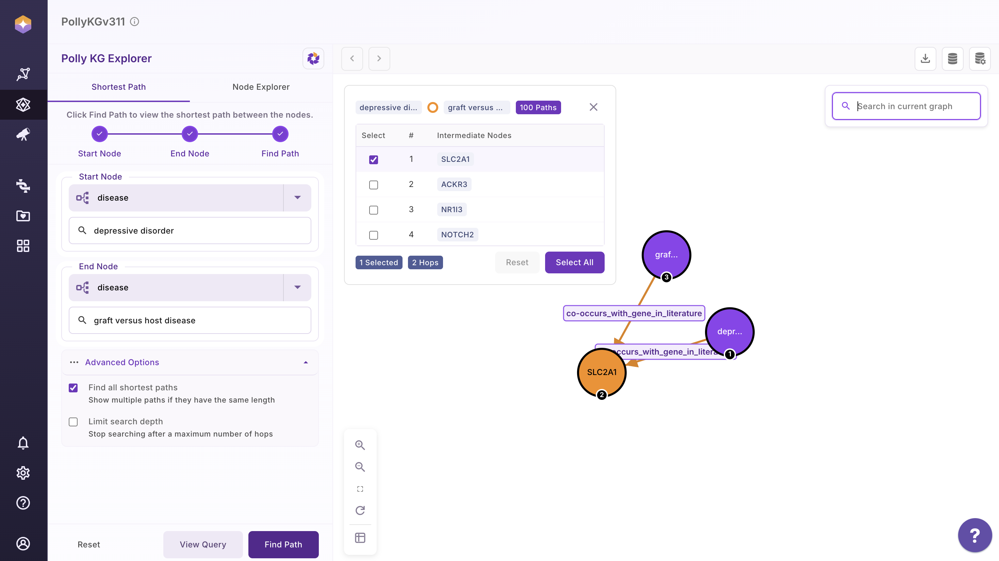 <center> All Shortest Path</center>


Users can Select All and render all shortest path and reset using the Reset button  

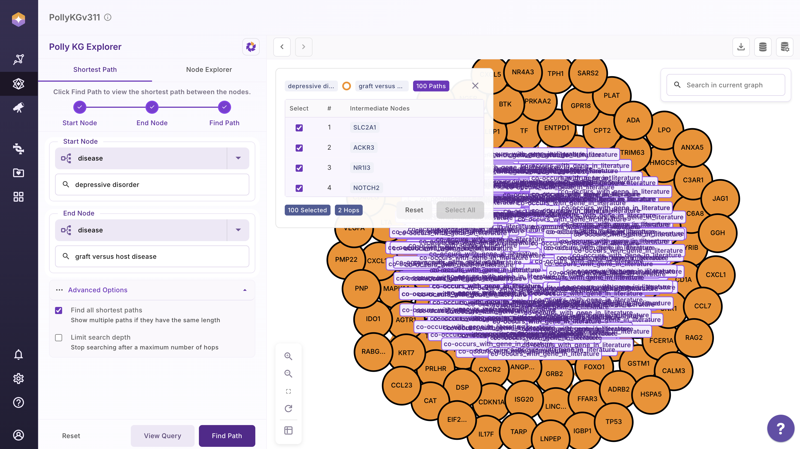 <center>  Cypher Query used for All Shortest Path Calculation</center>


### Query Explanation for All Shortest Path

```

MATCH (start), (end)

any node in the graph as start
any node in the graph as end

WHERE id(start) = 17721 AND id(end) = 17378
internal db ids for the node terms as specified by the user

MATCH path = allShortestPaths((start)-[*1..5]-(end))

| Syntax               | What it does                                      |
|----------------------|---------------------------------------------------|
| `allShortestPaths`   | Returns every path with the minimum possible length |
| `(start)`            | Starting node (ID `17721`)                         |
| `[*1..5]`            | Any relationship type, 1 to 5 hops                 |
| `-`                  | Undirected                                        |
| `(end)`              | End node (ID `17378`)                              |


WITH path LIMIT 100

Caps the result set to at most 100 shortest paths to prevent UI crashes

RETURN path,
       nodes(path) AS pathNodes,
       relationships(path) AS pathRels,
       length(path) AS pathLength

| Output                | What it will fetch              |
|-----------------------|----------------------------------|
| `path`                | Visual graph path                |
| `nodes(path)`         | Ordered list of nodes            |
| `relationships(path)` | Ordered list of relationships    |
| `length(path)`        | Hop count                        |

```

       
**Video on User interaction**

<video width="100%" controls>
  <source src="../img/KG/video3.mp4" type="video/mp4">
  Your browser does not support the video tag.
</video>


---

## 3. Node Explorer

The Node Explorer allows you to visualize a selected node and interactively expand its immediate neighbors. You can also apply filters based on properties stored on relationships to refine what is displayed in the graph.

### How to Use Node Explorer
- Click on the **Node Explorer** tab
- Select the node type from the dropdown
- Select the target Node and a modal opens showing additional properties for that node that enables users to select nodes of interest

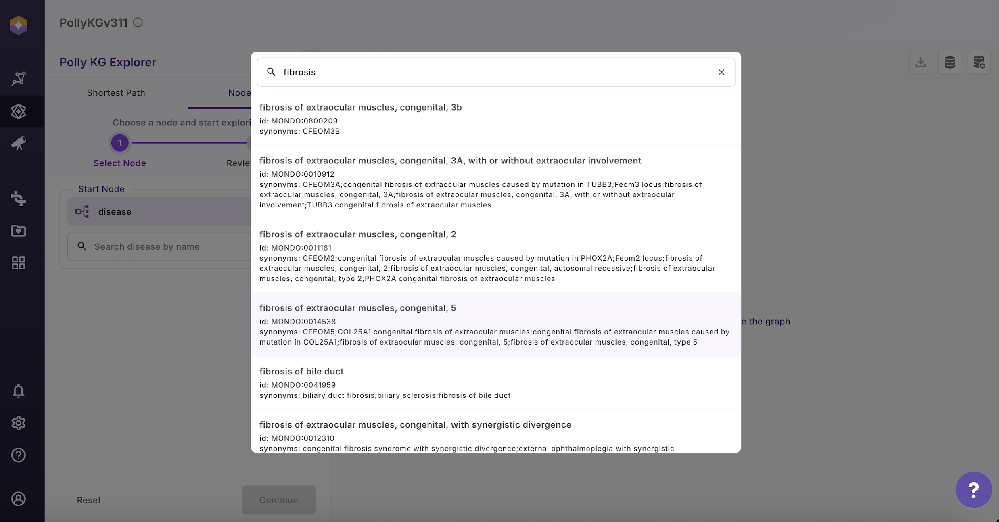 <center>  Node Explorer</center>

- Select the node you are interested in
- Select the association that you are interested in
- A modal opens that allows users to filter based on the edge properties and also see the description of each edge property that lets users to select edge properties intuitively for filtering
- Upon filtering, a next page shows all the filtered values that users can Deselect and only select the specific one they are interested in or apply all
- In the last page, users can see the cypher query that run in the backend to fetch the results 

**Video on User interaction**

<video width="100%" controls>
  <source src="../img/KG/video4.mp4" type="video/mp4">
  Your browser does not support the video tag.
</video>


**Note:** Please note that the number of edges fetched given a Node term is based on schema and therefore, some associations may not have a Target node that will be shown on the UI as 

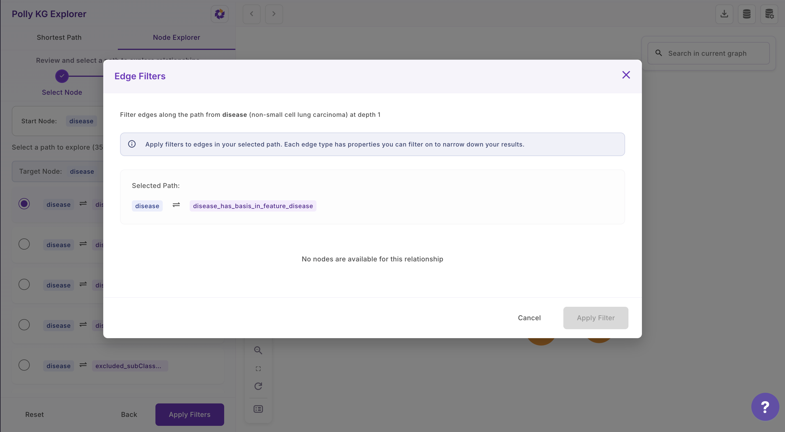 <center>  Edge Filters</center>


**Video on how to see properties of Nodes and Edges**

<video width="100%" controls>
  <source src="../img/KG/video5.mp4" type="video/mp4">
  Your browser does not support the video tag.
</video>


**Expand Network**

Interacting with Nodes in the Subgraph:

1. Select a Node: Click on any node within the subgraph to begin exploration.

2. View First-Degree Neighbors: A modal panel opens on the right, displaying the **first-degree neighbors** of the selected node.

3. Filter and Expand: Click **Filter & Expand** to apply filters based on **edge properties**. Alternatively, click **View Nodes** to search for and explore specific terms.

4. Apply Filters: Select or deselect the desired filter options. Click **Apply** to update the subgraph view.

5. Navigate Changes: Use the **Previous** button to remove the most recent node expansion. Use the **Next** button to undo the change and reapply the expansion.


**Video on User interaction**

<video width="100%" controls>
  <source src="../img/KG/video6.mp4" type="video/mp4">
  Your browser does not support the video tag.
</video>
Users can use this Journey to keep expanding the network iteratively.


## 4. Shareable State of Knowledge Graph

The KG Explorer allows you to easily share your current workspace state with others.

Click the **Share icon** located in the top-right corner of the KG Explorer interface. A confirmation message “KG link copied successfully” will appear, indicating that a unique, shareable link has been copied to your clipboard. This shareable state preserves your active configuration and is available across both the Shortest Path and Node Explorer tabs.

You can share this link with collaborators to provide direct access to the same Knowledge Graph view and state for seamless collaboration and reproducibility.


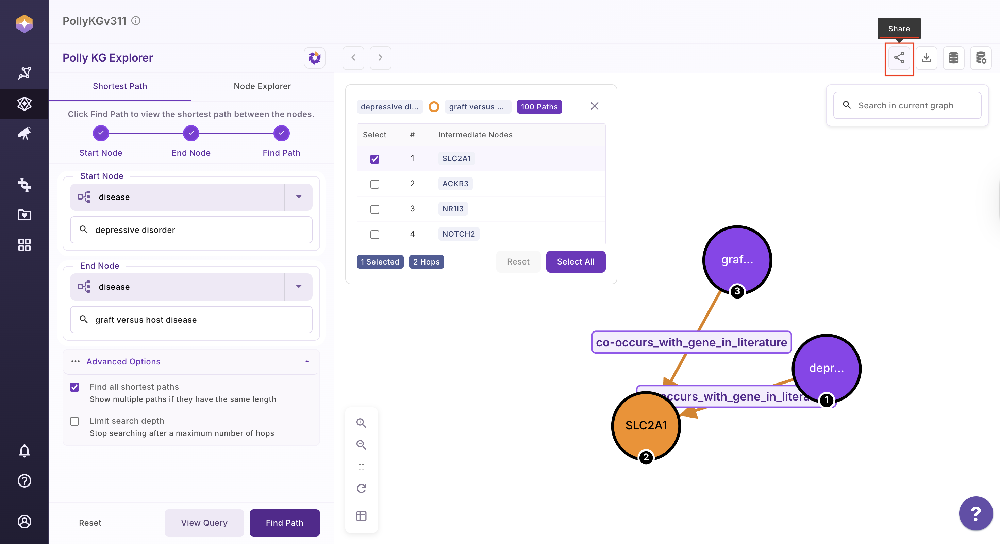 <center> Share Current State</center>
