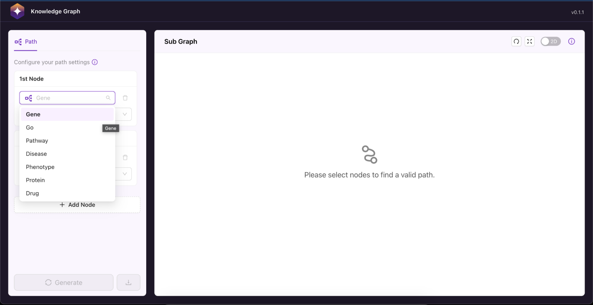
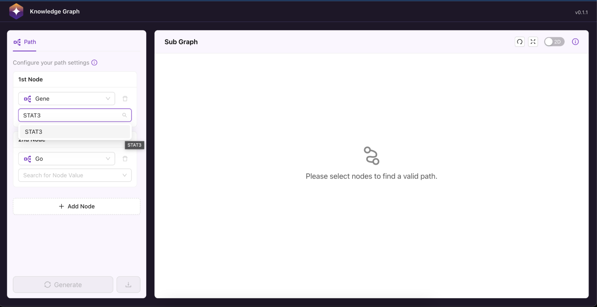
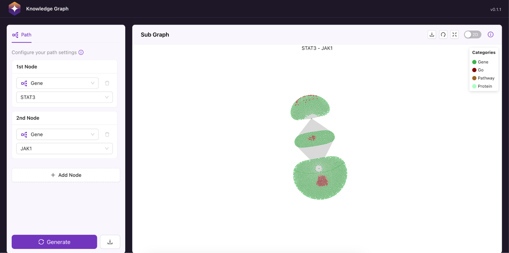
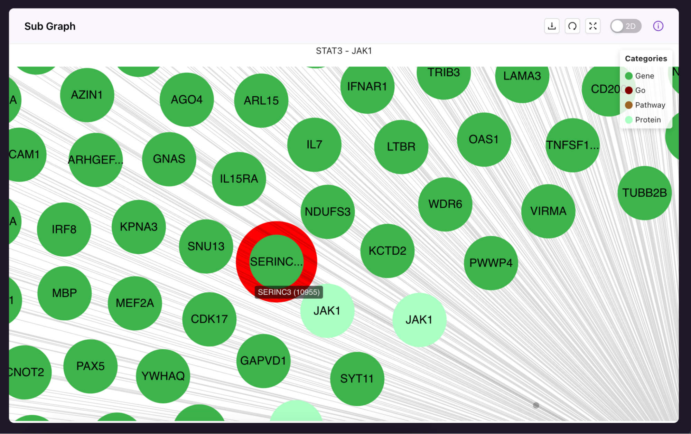
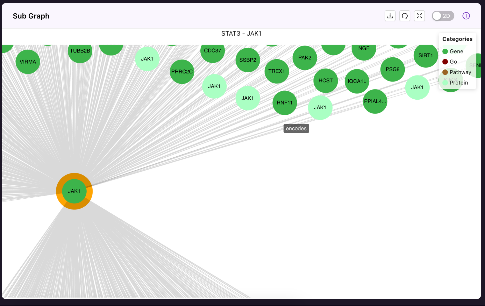
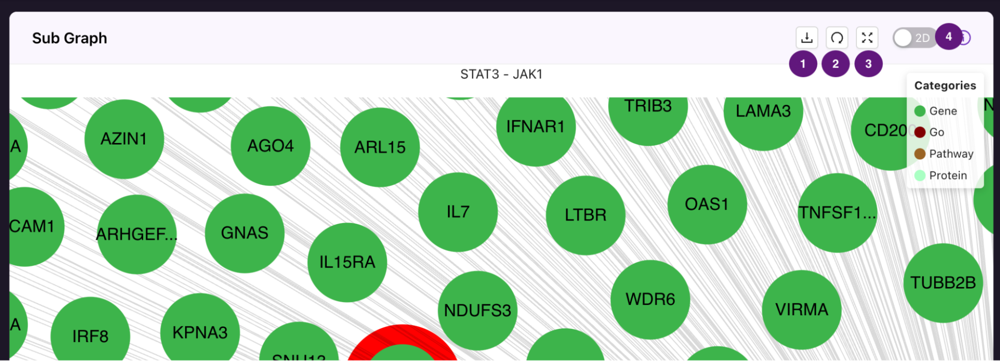

# About the Application

## Navigating the Application

### Interface Overview

The Polly KG Explorer application interface is divided into key areas designed to streamline the exploration of the knowledge graph:

- **Node Selection Panel**: Enables users to define search criteria by selecting entity categories and values. It also provides an option to download node and edge information for the filtered data.
- **Subgraph Visualization Area**: Displays the generated subgraph based on the selected filters, allowing users to explore relationships between entities.
- **Controls & Settings**: Provides tools to customize the visualization and adjust display preferences for a more tailored user experience.

 
 Screenshot showing 1. Node selection Panel, 2. Sub-graph Visualisation Area, and 3. Controls and Settings.

 **Note:** The Download icon in the Node selection panel exports the node and edges information. The download icon in the Controls and Settings in the Sub graph visualisation area exports the generated sub graph as PNG. 

## Using the Application

### Selecting Nodes & Generating a Subgraph

1. In the Node selection area, users must select at least two nodes by choosing a category (e.g., Genes, Proteins, Diseases) and specifying values.
2. Additional nodes can be added if needed. Users can search up to 3 nodes.

 
 Use the dropdown to select the needed node types.

 
 Type in the required node value and select from the dropdown. For example, in the above screenshot, STAT3 gene is being searched and selected from the list.

3. Click “Generate” to create or update the subgraph in the Sub-graph Visualization Area.

 
 On clicking the “Generate” button the sub-graph showing the interactions between the selected nodes is rendered.

## Navigating & Interacting with the Subgraph

### Exploring the Generated Graph

#### Exploring the Nodes

- Each node displays a name with a six-character limit. The full name and corresponding source-based ID are visible on hover.  
- Node colors indicate their respective categories, which can be referenced in the graph legend.  
- Searched nodes appear visibly larger than other nodes for easy identification.  
- The graph includes all interactions between the selected nodes, along with the immediate interactions (first neighbors/1-hop connections) of the searched nodes.  
- Nodes can be selected and repositioned to adjust spacing and explore relationships more effectively.

 
 The node details - node name (ID) will be shown on hover over the respective node.  The node colour is based on the node category. The colour code for node is reflected in the categories legend on the top left corner.

#### Exploring the Edges

- On hover over, edge details - the edge label is displayed.  

 
 The edge details are shown hovering over the edges. Here it indicates that the JAK1 gene ( dark green node) encodes the JAK1 protein (light green node).

**Note:** If a searched node has no interactions with the other node(s), it would be shown as a separate node with just its neighbour interactions (hop of 1).

#### Exploring the Sub Graph

- **Zoom & Reset**: Use the zoom controls or mouse scroll to zoom in/out. Click Reset View to restore the default position.  
- **Graph Legend**: The legend displays the different node categories present in the sub graph displayed.  
- **2D/3D Toggle**: Click Toggle View to switch between 2D and 3D visualizations.  
- **Saving the Graph**: The generated sub graph can be exported using the download button.  
- The graph title displays the searched node names, separated by a hyphen ("-").

 
 The navigation tools 1 - Export graph, 2 - reset the graph post zoom operations, 3 - full screen view and 4 - to toggle between 2D and 3D.

### Things to Know When Exploring the Sub Graph Generated

- All paths between the searched nodes are shown with a hop of 1.  
- The immediate first neighbours of the searched nodes are also shown.

### Downloading & Exporting Data

#### Downloading Subgraph Data
- Click the **Download** button in the node selection area to export the subgraph data as a TSV file.  
- The TSV file contains information on the selected nodes and their relationships (edges) within the subgraph.  

**Note**: The data related to the sub graph generated would be downloaded.

#### Exporting the Sub-Graph
- To save a static image of the graph, click the **Download** button in the top right corner of the sub graph visualisation area. This downloads the graph as a **PNG** image.

### KG Data and Supported Resources

- As per this version of the application, **PollyKG (v0.1.0)** is being supported.  
- Please note that the Polly KG can be updated irrespective of the application update.  

