# Accessing OmixAtlas
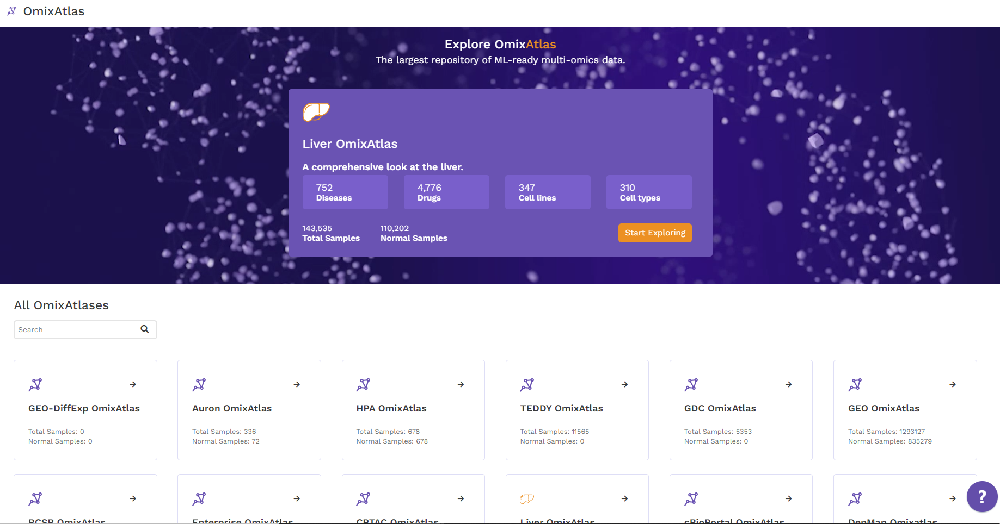

The OmixAtlas landing page offers an overview of the various public and proprietary OmixAtlases available on Polly. The numbers of total and normal samples are displayed under each OmixAtlas. A search feature is also available to browse the collection of OmixAtlases.

# OmixAtlas Summary Page
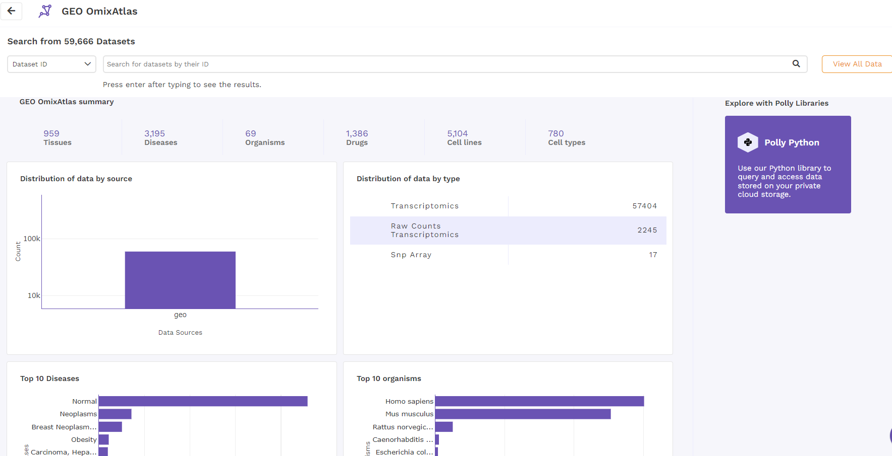

Once the user chooses an OmixAtlas, a summary page offers an overview of the OmixAtlas.The number of total datasets is visible just above the search bar. General details such as the number of tissues, diseases, organisms, etc. are displayed above a graphical summary as shown in the figure. To view 
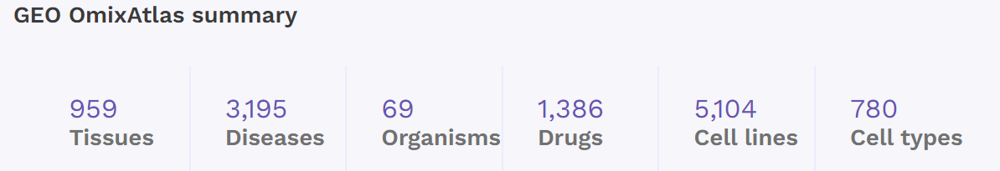
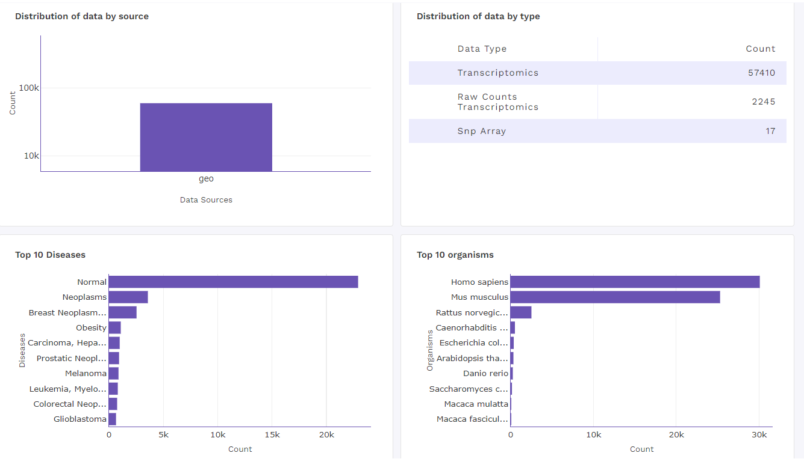

# Card View
In this view, datasets are arranged as a list of horizontal cards. Each card contains a short summary of the dataset followed by color-coded metadata tags that define the characteristics of the dataset. Metadata information includes ontology backed annotations such as organism, disease, tissue, drug, cell type, cell line, etc.
Card view offers a first-pass view of all the datasets that are queryable and searchable on an OmixAtlas. The search results can be narrowed down using the dynamic filtering options on the left side.

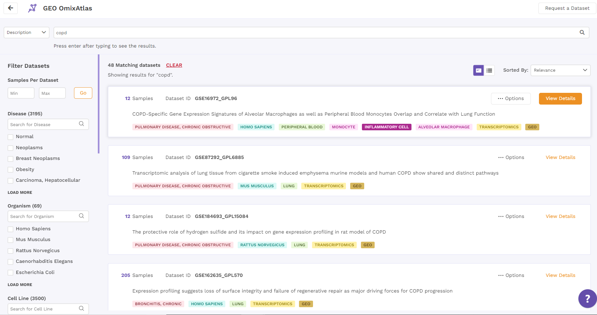
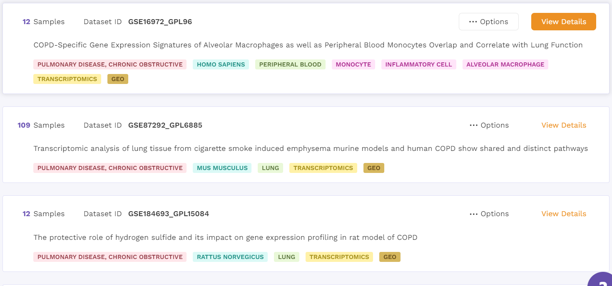

# Table View
In table view, the results are organized as tables on the OmixAtlas interface with metadata fields presented as columns. Users can sort across metadata fields such as dataset id, no. of samples, description, drugs, cell type, cell line, disease and so on. The results show up in order of relevance to their search query.

There is also a sorting function available next to the column header to view the sorted results in ascending or descending order. 

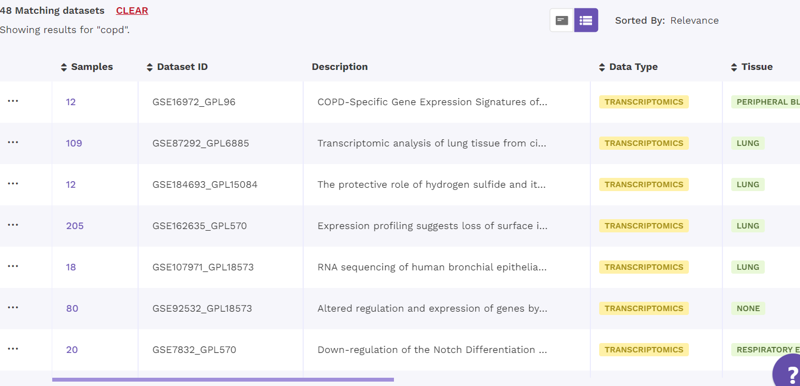
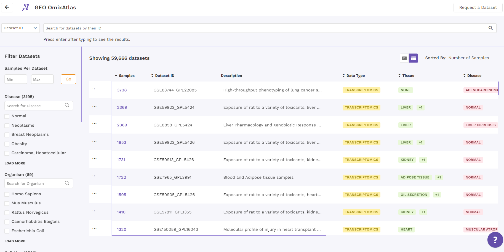

# Description Search
Relevant keywords from dataset descriptions have been harmonized using controlled vocabularies so that they are searchable. Users can select description search from the dropdown menu to the left of the search bar to choose between searching using the dataset id and the description. The results from a description can be sorted with respect to the number of samples, dataset id or relevance when in card view. 

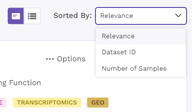
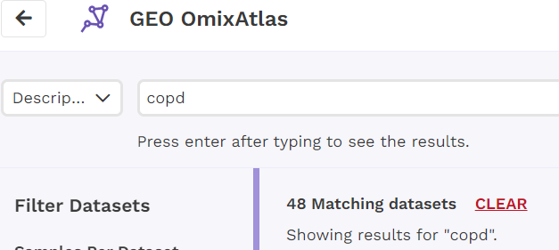
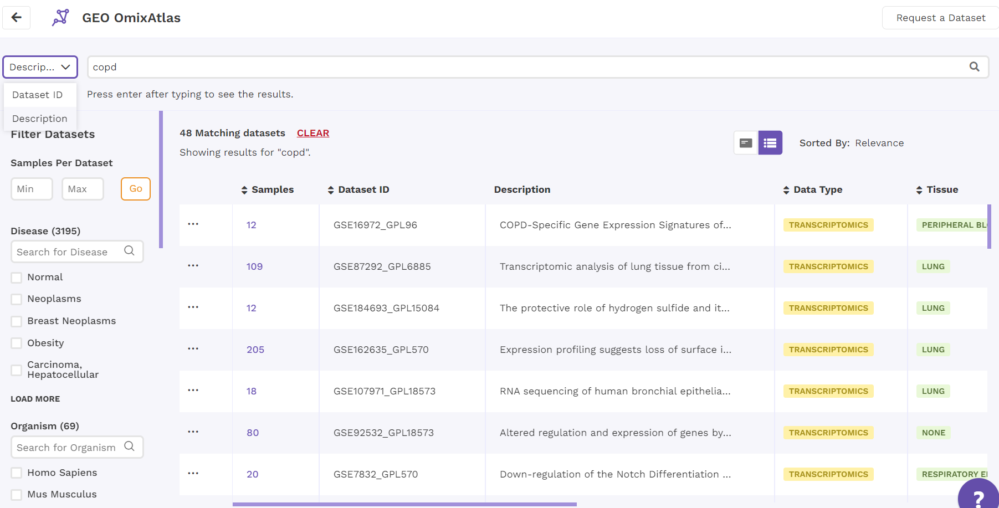

# Search Bar
This search bar is driven by Elasticsearch where users can search for keywords which are present across:
Source metadata fields such as title, description and overall design and 
Curated metadata fields such as tissue, drug, cell line, cell type, disease, organism, gene, gene modification and dataset id. 
It allows fuzzy search as well. For example, "transcriptomics" in the search keyword will show results for "transcriptome" or "transcript" as well.

This search bar supports the following operations to help users with some advanced operations such as AND (&), OR (|), NOT (~), EXACT (“text”)

While parsing the search keyword, the algorithm assigns the following priority for different operators:- Brackets () > AND (&) > OR (|) > NOT (~)

Some of the Search examples are as follows:-
(ITIH1 upregulation |  FN1 downregulation) & “Fatty liver” 
“Tyrosine kinase inhibitor” & NAFLD & (African | European)
(Hepatocellular carcinoma | HCC) ~ Radiotherapy
CDK7 & “CBM signaling pathway” & inhibition
(somatic mutation) & (hepatocellular | renal) & (cancer | carcinoma)

# Search for Disease based on Ontology
The disease ontology based recommendation uses ontology tree mapping to shortlist exact and relevant matches to the keyword entered on the disease level metadata filter. The controlled vocabulary used is from MESH & MONDO disease ontologies.
This feature is currently available only in public repositories excluding gnomAD and UKBiobank.

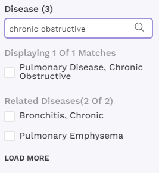

# Dataset Download over UI
To download a dataset, the user can click on the three dots next to the chosen dataset, either in card view or table view. Further, the dataset can be downloaded from the view details page as well.

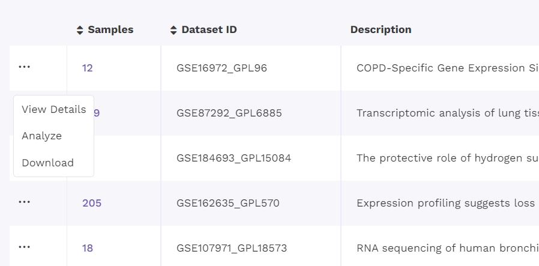
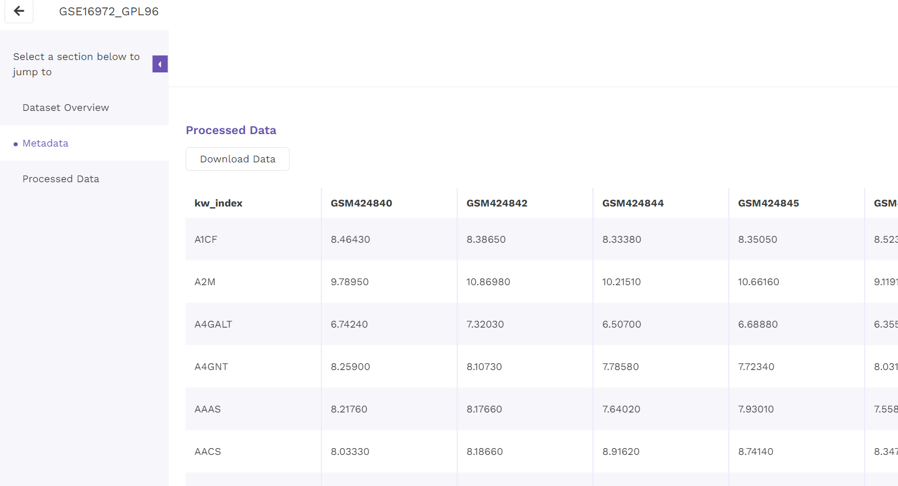

# View Details
1. Dataset Overview

On clicking the view details option from the dropdown menu of the respective dataset from the results page, users are directed to the view details page. There are three main sections starting with the dataset overview that includes the abstract, the number of samples, the link to the source and the metadata tags associated with the dataset.

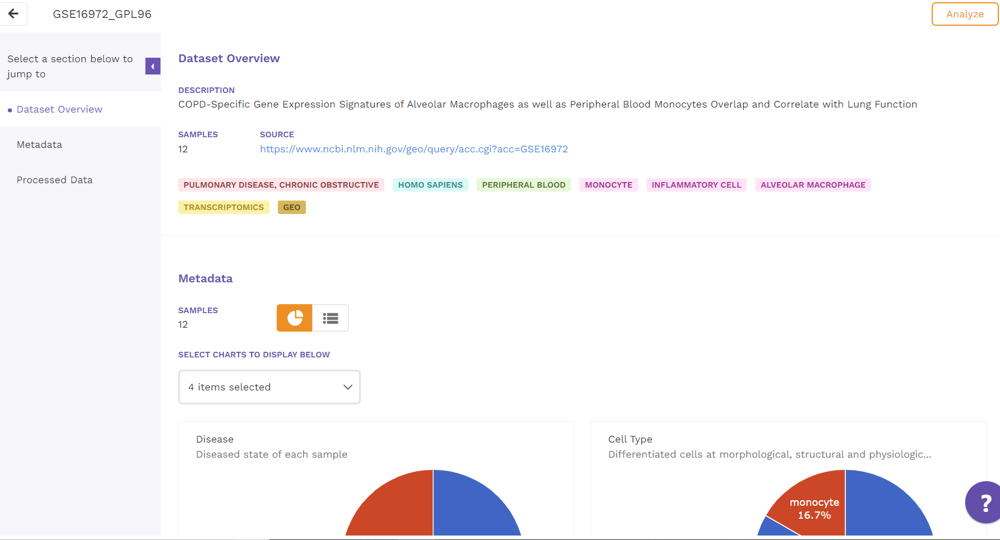
 
2. Sample Metadata
The metadata section comes next. Here, a dashboard showcasing charts is displayed for different metadata attributes such as disease, cell type and tissue type. There is also an option to view the metadata in a tabular format - a comprehensive snapshot of the biological characteristics of samples used in the dataset. 
 
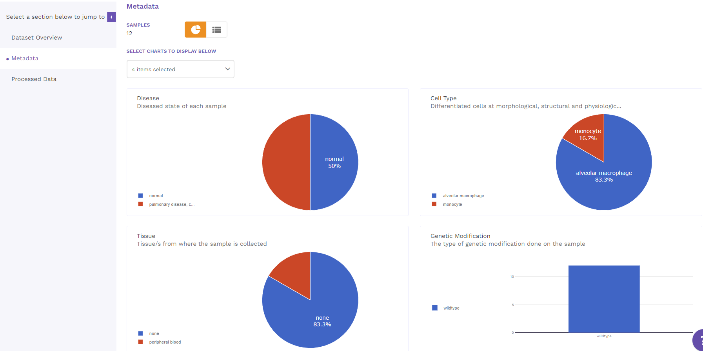
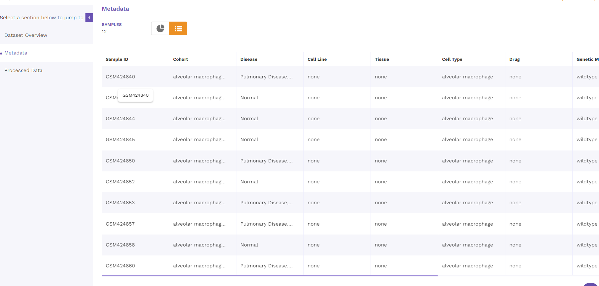

3. Processed Data

Finally, the processed data with normalized values is presented as a table that is available for downloading. 
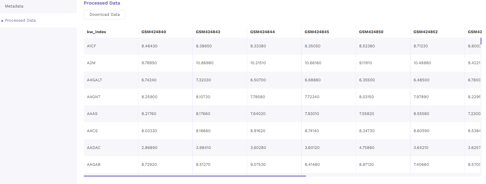
