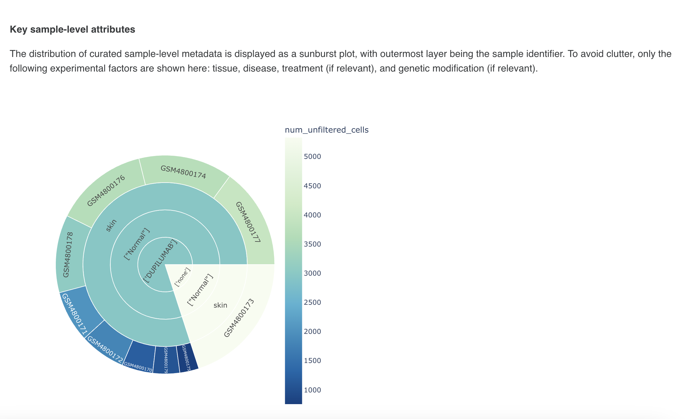
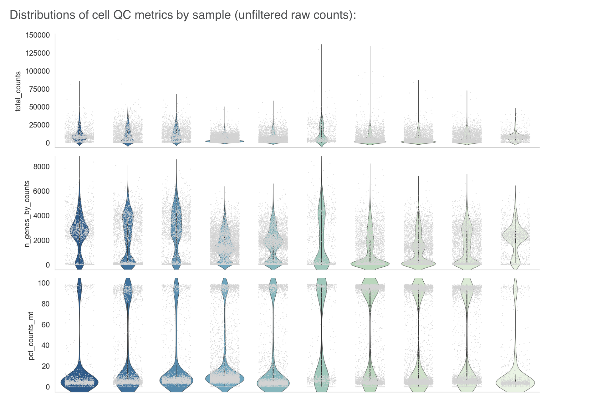
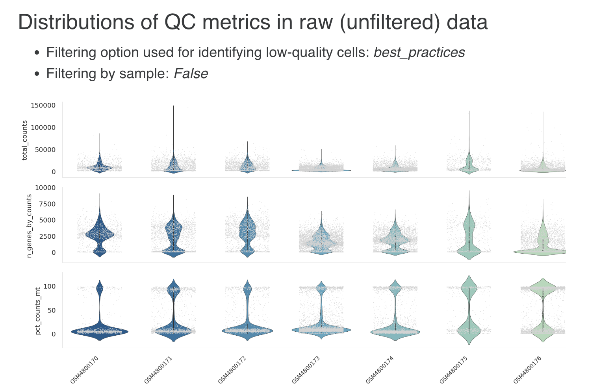
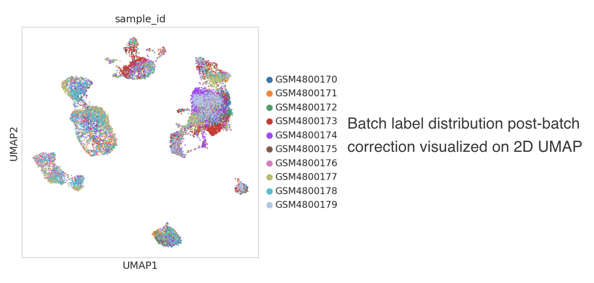
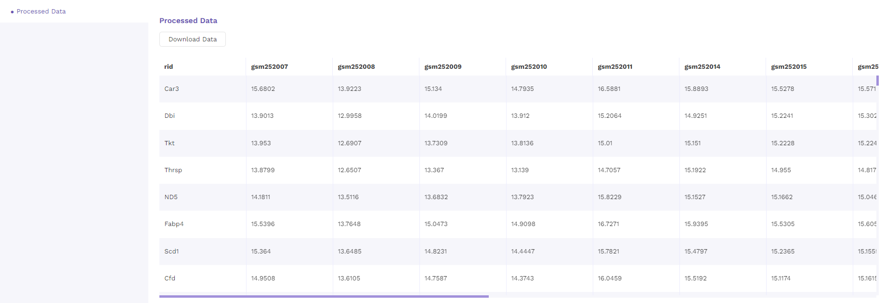

# Accessing OmixAtlas

The OmixAtlas landing page offers an overview of the various public and proprietary OmixAtlases available on Polly.

## 1. OmixAtlas Homepage

Following information is displayed on the homepage of Omixatlas -

 
**Figure 1.** OmmixAtlas Homepage

(A - search feature; B - Numbers of total samples and datasets)

The numbers of total and normal samples are displayed under each OmixAtlas. A search feature is also available to browse the collection of OmixAtlases.

## 2. OmixAtlas Summary Page

Once the user chooses an OmixAtlas, a summary page offers an overview of the OmixAtlas.The number of total datasets is visible just above the search bar (refer to A in Figure 2). General details such as the number of tissues, diseases, organisms, drugs, cell types and cell lines are displayed above a graphical summary as shown in the figure (refer to C in Figure 2).

 
**Figure 2.** OmmixAtlas Summary Page (A - Total number of Datasets, B - Search Bar, C - OmixAtlas Summary)

### 2.1 Distribution of data by source

The graph on top left indicates the distribution of data by source. Figure 3 shows the distribution of data by source from two different OmixAtlases.

 
**Figure 3.** Distribution of Data by Source

### 2.2 Distribution of data by type

The graph on top right indicates the distribution of data by data type. Figure 4 shows the distribution of data by type from two different OmixAtlases.

 
**Figure 4.** Distribution of Data by Type

### 2.3 Top 10 Diseases

The graph on bottom left indicates the top 10 diseases (based on number of datasets) present in the OmixAtlas distribution of data by data type. Figure 5 shows the graph from two different OmixAtlases.

 
**Figure 5.** Top 10 Diseases

Figure 5: Top 10 Diseases

### 2.4 Top 10 Organisms

The graph on bottom right indicates the top 10 organisms (based on number of datasets) present in the OmixAtlas distribution of data by data type. Figure 6 shows the graph from two different OmixAtlases.

 
**Figure 6.** Top 10 Organisms

## 3. View all data

There are two formats that users can see datasets - Card view and Table view.

### 3.1 Card View

In this view, datasets are arranged as a list of horizontal cards. Each card contains a short summary of the dataset followed by color-coded metadata tags that define the characteristics of the dataset. Metadata information includes ontology backed annotations such as organism, disease, tissue, drug, cell type, cell line, etc. Card view offers a first-pass view of all the datasets that are queryable and searchable on an OmixAtlas. The search bar can be used to search for keywords that are present across source metadata (title, description etc) and curated metadata (such as drug, tissue, cell type etc) [Link here].The search results can be narrowed down using the dynamic filtering options on the left side.

 
**Figure 7.** Card View (A - Request a Dataset, B - Search Bar, C - Filter options, D - Collapsable filter, E - Switch between Card View and Table View, F - Sorting Function)

#### 3.1.1 Datasets under Card View

The individual dataset consists under card view consists of the following -

a. Title : This describes the title of the study the dataset is taken from.

 
**Figure 8.** Dataset Title

b. Summary: This section describes the abstract of the study taken from the publication. Users can click on 'more' function to check the full abstract.

 
**Figure 9.** Dataset Summary

c. Overall Design: This section describes the study design and methodology taken from the publication. Users can click on 'more' function to check the full study design.

 
**Figure 10.** Overall Design

#### 3.1.2 Options under Card View

There is an Options function on top right under the individual card containing the dataset.

 
**Figure 11.** Options under Card View

Upon clicking, users can choose from the following -

- Analyze - upon choosing analyze, there will be options to open the dataset using different applications to analyze the dataset.

 
**Figure 12.** Analyze function under Card View

- Copy to Workspaces - Users can choose to copy the dataset to the desired workspace.

 
**Figure 13.** Copy to Workspaces Function under Card View

- Download - Users can download the dataset in case they want to analyze the dataset using a different application.

 
**Figure 14.** Download Function under Card View

### 3.2 Table View

In table view, the results are organized as tables on the OmixAtlas interface with metadata fields presented as columns. Users can sort across metadata fields such as dataset id, no. of samples, description, drugs, cell type, cell line, disease and so on. The results show up in order of relevance to their search query. There is also a sorting function available next to the column header to view the sorted results in ascending or descending order.

 
**Figure 15.** Table Card View

Users can customize columns in a table by clicking on the 'Gear' icon and selecting the required columns. Users can also fix columns by clicking on the 'Pin' icon.

 
**Figure 16.** Customizable Table

### 3.3 Color codes

Each curated dataset in OmixAtlas is curated into different fields that are also color coded for easy identification. Following are the color codes decoded -

- Pink - Disease
- Turquoise - Organism
- Purple - Cell Type
- Blue - Cell Line
- Orange - Drug
- Green - Tissue
- Yellow - Data Type
- Mustard - Source

## 4. Sorting Data

### 4.1 Card View

Under the card view, datasets can be sorted by Relevance, Dataset ID, Number of Samples and Recent Datasets from top right drop-down menu.

 
**Figure 17.** Sorting Function under Card View

### 4.2 Table View

Under the table view, datasets can be sorted by the sorting function available next to the column header to view the sorted results in ascending or descending order.

 
**Figure 18.** Sorting using Column Header

## 5. View Details

On clicking the view details option from the dropdown menu of the respective dataset from the results page, users are directed to the view details page. There are three main sections that can be seen on the left side of the page and described below.

 
**Figure 19.** Dataset Details

### 5.1 Dataset Overview

Dataset overview includes the description of the dataset, number of samples, link to the source and the metadata tags associated with the dataset.

 
**Figure 20.** Dataset Overview

### 5.2 Metadata

The metadata section consists of a dashboard showcasing charts displayed for different metadata attributes such as disease, cell type and tissue type. There is an option to view the metadata either in graphical format or a tabular format.

The graphical format displays pie-charts/histograms for different attributes. Users can click on legends to select and filter the graphs.

 
**Figure 21.** Metadata in Graphical Format

The tabular format consists of a comprehensive snapshot of the biological characteristics of samples used in the dataset. We plan to make this format more schema driven in the future.

 
**Figure 22.** Metadata in Tabular Format

### 5.3 Processed Data

The processed data with normalized values is presented as a table that is available for downloading.

 
**Figure 23.** Processed Data

## 6. Request a Dataset

If the dataset is not present, users can request a dataset to be added to OmixAtlas by going to the 'Request a Dataset' function on top right of OmixAtlas summary page. Users need to fill a short form to request a dataset that needs to be added.

 
**Figure 24.** Request a Dataset

## 7. Polly Basic

With two types of OmixAtlasses - Source and Destination, users can move the dataset from source to their destinaiton atlas using Polly credits.

 
**Figure 25.** Move Dataset

After clicking 'Move Data', users get a notification via email when the dataset is moved.

