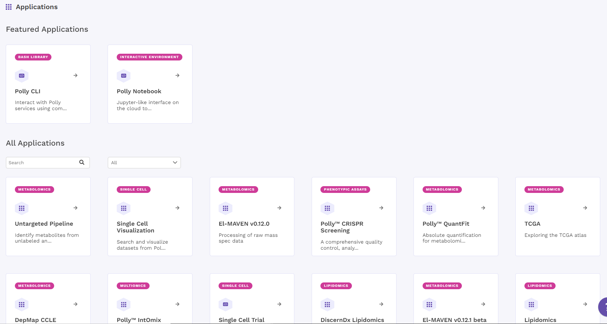
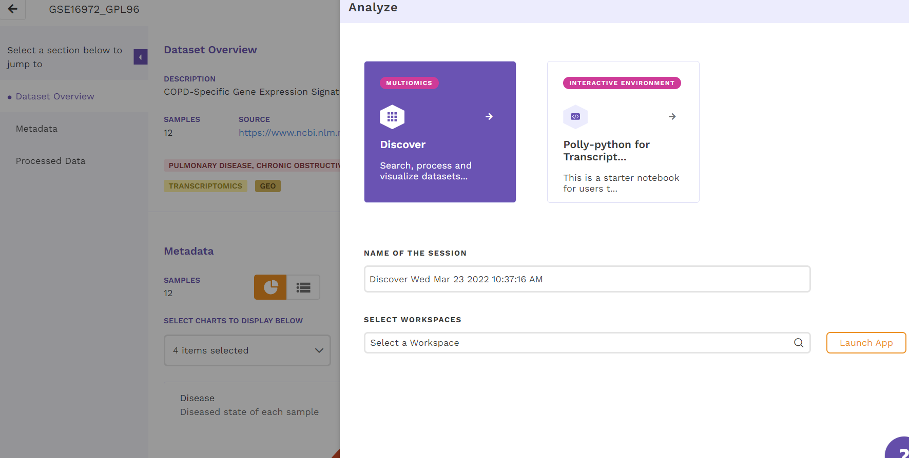
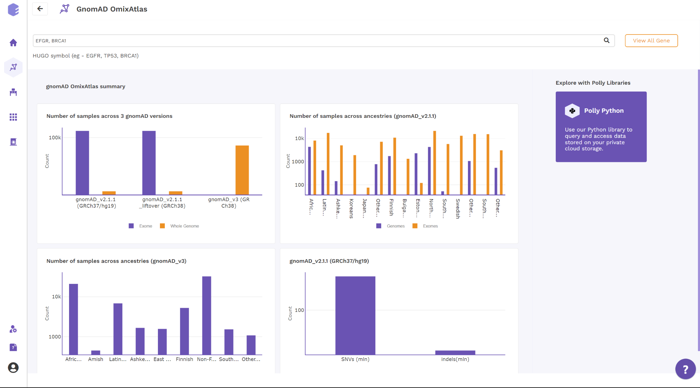
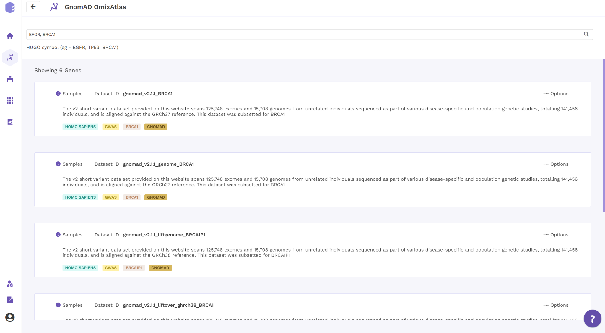
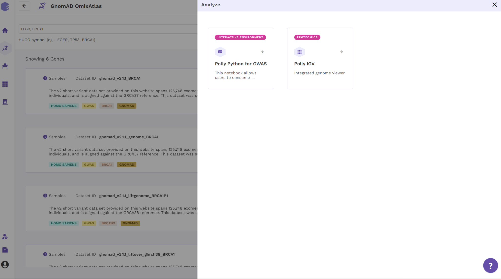
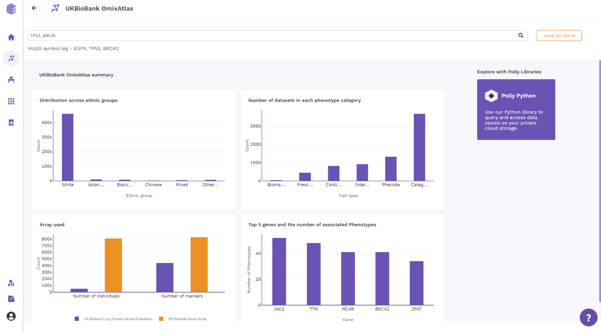

# APPLICATIONS

# GENE BASED OMIX ATLAS
**Currently there are two Gene Based OmixAtlases namely gnomAD and UKBioBank.** 

||**repo\_name**|**Data type**|
| :- | :- | :- |
|**1**|**gnomAD**|**gwas**|
|**2**|**UKBioBank**|**gwas**|

1. gnomAD OmixAtlas offers the unique advantage of searching for one or more genes across gnomAD v2.1.1, gnomAD v2.1.1 liftover and gnomAD v3.1

Users can search for relevant genes from the Summary Page using the HUGO Gene Symbols and view the list of genes across all 3 versions of gnomAD in the Card View 

Each Gene Card has an Options Menu that enables the user to either download the corresponding .vcf on local drive or visualize the variants using IGV-web or analyse programmatically using Hail. The TAGS 

 on the cards enable the user to identify the gene and other important metadata.

2. UKBioBank OmixAtlas offers the unique advantage of searching for one or more genes 362054 datasets

Users can search for relevant genes from the Summary Page using the HUGO Gene Symbols and view the list of genes across in the Card View. Users can also search for gene based on the Phenotype Category 

Each Gene Card has an Options Menu that enables the user to either download the corresponding .vcf on local drive or visualize the variants using IGV-web or analyse programmatically using Hail. The TAGS 

 on the cards enable the user to identify the gene and other important metadata.
