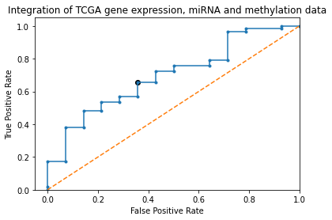
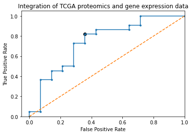

 <font size="6"> **Predicting survivability of patients with Hepatocellular Carcinoma**</font> 

 <font size="4"> How well can multi-omics data predict survival of patients diagnosed with Hepatocellular carcinoma? </font>

Hepatocellular carcinoma (HCC) is one of the most prevalent liver cancers. The incidents and mortality rate in HCC are on the rise. HCC shows high level of heterogeneity and complex etiological factors which make its prognosis challenging. It creates a need for developing tools to predict patient survival which will greatly improve patient care. In the current study, multiomics molecular data from HCC patients, comprising of mRNA gene expression, miRNA expression, methylation and proteomics have been used to understand the differences in survival based on molecular changes in the body.

We have used curated biomedical molecular data present in Liver OmixAtlas on Polly to make machine learning models for predictive analysis. We show how multiomics data in the Liver Omixaltas can be accessed, searched and downloaded on Amazon Sagemaker, and used for building predictive machine learning models. We trained an XGBoost classifier on Amazon Sagemaker to predict patient survival in HCC patients.

# Setup the notebook


```python
## Install polly python
!pip3 install polly-python
```


```python
#Import required libraries

from polly.omixatlas import OmixAtlas

import pandas as pd
import numpy as np
from numpy import sqrt
from numpy import argmax
import seaborn as sns

import json
from json import dumps
import boto3
import re

import io
import os
import sys
import time
from time import strftime, gmtime

import itertools
from cmapPy.pandasGEXpress.parse_gct import parse

import keras
from keras.utils import to_categorical
from keras.optimizers import SGD

from keras.layers import Dense
from keras.models import Sequential
from keras.callbacks import EarlyStopping

from sklearn.impute import SimpleImputer
from sklearn.preprocessing import MinMaxScaler
from sklearn.preprocessing import RobustScaler
from sklearn.preprocessing import StandardScaler
from sklearn.model_selection import train_test_split
from sklearn.feature_selection import SelectKBest
from sklearn.feature_selection import f_classif
from sklearn.feature_selection import mutual_info_classif
from sklearn.metrics import precision_recall_curve
from sklearn.metrics import roc_curve
from sklearn.metrics import roc_auc_score
import matplotlib.pyplot as plt

#Sagemaker specific functions to build and train models on AWS Sagemaker
import sagemaker
from sagemaker import get_execution_role
from sagemaker.inputs import TrainingInput
from sagemaker.serializers import CSVSerializer

from IPython.display import display

pd.set_option('max_colwidth', 100)
```

Define custom functions for use in this study 


```python
def scaler (df_input):
    df = df_input.copy()
    col=df.columns
    row=df.index
    df.fillna(df.mean(),inplace=True)
    x = df.values #returns a numpy array
    min_max_scaler = MinMaxScaler()
    x_scaled = min_max_scaler.fit_transform(x)
    df = pd.DataFrame(x_scaled)
    df.columns=col
    df.index=row
    return (df)
```


```python
def select_features (df_input,target_input,number_of_features):
    df = df_input.copy()
    target = target_input.copy()
    fs = SelectKBest(score_func=f_classif, k=number_of_features)
    #fs = SelectKBest(score_func=mutual_info_classif, k=inp_nodes)
    # learn relationship from training data
    fs.fit(df,target)
    # transform train input data
    #X_train_fs = fs.transform(X_train)
    cols = fs.get_support(indices=True)
    df_new = df.iloc[:,cols]
    return(df_new,fs)
```


```python
def calc_model_scores (test_data,thr):
    confusion_mat =pd.crosstab(index=test_data.iloc[:, 0], columns=np.where(predictions > thr, 1, 0))
#    sensitivity = confusion_mat[1][1] / ( confusion_mat[1][1] + confusion_mat[0][1] )
    specificity = confusion_mat[0][0] / ( confusion_mat[0][0] + confusion_mat[1][0] )
    precision = confusion_mat[1][1] / ( confusion_mat[1][1] + confusion_mat[1][0] )
    return (specificity,precision)
```

# Get data from Liver OmixAtlas

The **Liver OmixAltas** is a high quality curated repository of liver datasets from genomics, transcriptomics, proteomics and metabolomics experiments. **Liver OmixAltas** is a part of **Polly**, an AI enabled cloud based platform for biomedical molecular data analysis.

The datasets in the Liver OmixAltas are ML ready and may be used to easily build ML models. Here we demonstrate how the datasets from the **Liver OmixAltas** could be searched, evaluated, analysed in a **code-first** approach and used to bulid machine learning applications to enable biological discoveries.

### Connect to Liver OmixAtlas

##### Connect to Liver OmixAtlas securely through your unique authentication credentials


```python
#AUTH_TOKEN = "Your unique Polly Authentication Token"
library_client = OmixAtlas(AUTH_TOKEN)
```

##### Start exploring the data


```python
## See a list of all available omixatlas
library_client.get_all_omixatlas()
```


    {'data': [{'repo_name': 'liveromix_atlas',
       'repo_id': '1615965444377',
       'indexes': {'gct_metadata': 'liveromix_atlas_gct_metadata',
        'h5ad_metadata': 'liveromix_atlas_h5ad_metadata',
        'csv': 'liveromix_atlas_csv',
        'files': 'liveromix_atlas_files',
        'json': 'liveromix_atlas_json',
        'ipynb': 'liveromix_atlas_ipynb',
        'gct_data': 'liveromix_atlas_gct_data',
        'h5ad_data': 'liveromix_atlas_h5ad_data'},
       'dataset_count': 6760,
       'disease_count': 761,
       'diseases': ['normal',
        'carcinoma, hepatocellular',
        'obesity',
        'neoplasms',
        'fatty liver',
        'non-alcoholic fatty liver disease',
        'chemical and drug induced liver injury',
        'insulin resistance',
        'diabetes mellitus',
        'diabetes mellitus, type 2',
        'coronaviridae infections',
        'metabolic syndrome',
        'hepatitis c',
        'liver neoplasms',
        'breast neoplasms',
        'colorectal neoplasms',
        'metabolic diseases',
        'glucose intolerance',
        'liver diseases',
        'hepatitis b'],
       'organism_count': 22,
       'organisms': ['homo sapiens',
        'mus musculus',
        'rattus norvegicus',
        'danio rerio',
        'sus scrofa domesticus',
        'macaca mulatta',
        'dicentrarchus labrax',
        'mus spretus',
        'oncorhynchus mykiss',
        'marmota monax',
        'pan troglodytes',
        'capra hircus',
        'chlorocebus aethiops',
        'macaca fascicularis',
        'mus musculus domesticus',
        'arvicanthis niloticus',
        'cebus capucinus',
        'neotoma lepida',
        'papio cynocephalus',
        'papio hamadryas'],
       'sources': ['geo',
        'lincs',
        'tcga',
        'metabolomics workbench',
        'metabolights',
        'ccle',
        'cptac',
        'depmap',
        'human protein atlas',
        'gtex'],
       'datatypes': ['transcriptomics',
        'mutation',
        'metabolomics',
        'single cell',
        'proteomics',
        'lipidomics',
        'mirna',
        'drug screens',
        'gene dependency',
        'gene effect'],
       'sample_count': 1738079}]}


```python
LiverOmixAtlas_summary = library_client.omixatlas_summary("elucidata.liveromix_atlas")
pd.DataFrame.from_dict(LiverOmixAtlas_summary, orient="index")
```


<div>
<style scoped>
    .dataframe tbody tr th:only-of-type {
        vertical-align: middle;
    }

    .dataframe tbody tr th {
        vertical-align: top;
    }

    .dataframe thead th {
        text-align: right;
    }
</style>
<table border="1" class="dataframe">
  <thead>
    <tr style="text-align: right;">
      <th></th>
      <th>repo_name</th>
      <th>repo_id</th>
      <th>indexes</th>
      <th>dataset_count</th>
      <th>disease_count</th>
      <th>diseases</th>
      <th>organism_count</th>
      <th>organisms</th>
      <th>sources</th>
      <th>datatypes</th>
      <th>sample_count</th>
    </tr>
  </thead>
  <tbody>
    <tr>
      <th>data</th>
      <td>liveromix_atlas</td>
      <td>1615965444377</td>
      <td>{'gct_metadata': 'liveromix_atlas_gct_metadata', 'h5ad_metadata': 'liveromix_atlas_h5ad_metadata...</td>
      <td>6760</td>
      <td>761</td>
      <td>[normal, carcinoma, hepatocellular, obesity, neoplasms, fatty liver, non-alcoholic fatty liver d...</td>
      <td>22</td>
      <td>[homo sapiens, mus musculus, rattus norvegicus, danio rerio, sus scrofa domesticus, macaca mulat...</td>
      <td>[geo, lincs, tcga, metabolomics workbench, metabolights, ccle, cptac, depmap, human protein atla...</td>
      <td>[transcriptomics, mutation, metabolomics, single cell, proteomics, lipidomics, mirna, drug scree...</td>
      <td>1738079</td>
    </tr>
  </tbody>
</table>
</div>


```python
#Liver OmixAtlas
print ("There are", LiverOmixAtlas_summary['data'].get('sample_count'), "samples in Liver OmixAtlas.\n")
print ("There are", len(LiverOmixAtlas_summary['data'].get('sources')), "Data sources in Liver OmixAtlas.\n The sources are:\n", LiverOmixAtlas_summary['data'].get('sources'))
print ("\nThere are", len(LiverOmixAtlas_summary['data'].get('datatypes')), "Data types in Liver OmixAtlas.\n The types are",LiverOmixAtlas_summary['data'].get('datatypes'))

```

    There are 1738079 samples in Liver OmixAtlas.
    
    There are 10 Data sources in Liver OmixAtlas.
     The sources are:
     ['geo', 'lincs', 'tcga', 'metabolomics workbench', 'metabolights', 'ccle', 'cptac', 'depmap', 'human protein atlas', 'gtex']
    
    There are 10 Data types in Liver OmixAtlas.
     The types are ['transcriptomics', 'mutation', 'metabolomics', 'single cell', 'proteomics', 'lipidomics', 'mirna', 'drug screens', 'gene dependency', 'gene effect']


### Query metadata in Liver OmixAtlas

- All data in Liver OmixAtlas are structured and and stored in indexes that can be queries through Polly python   

- Metadata fields are curated and tagged with ontologies, which simplifies finding relevant datasets     

- To filter and search the metadata in any of the indexes in Liver OmixAtlas, the following function can be used: 

<font size = 3><center>**query_metadata (** *query written in SQL* **)**</center></font>

- The SQL queries have the following syntax:

<font size = 3><center>**SELECT** *field names* **FROM** *index_name* **WHERE** *conditions*</center></font>

For a list of curated fields, indices and conditions available for querying, please visit [docs.elucidata.io](docs.elucidata.io) 


```python
# Search datasets where the curated field "disease: is  Hepatocellular carcinoma 
query = """SELECT dataset_id, dataset_source, kw_data_type FROM liveromix_atlas_files 
                    WHERE disease = 'Carcinoma, Hepatocellular'
                    AND organism="Homo sapiens"
                   """
library_client.query_metadata(query).head()
```

    Showing 1 - 100 of 1185 matching results


<div>
<style scoped>
    .dataframe tbody tr th:only-of-type {
        vertical-align: middle;
    }

    .dataframe tbody tr th {
        vertical-align: top;
    }

    .dataframe thead th {
        text-align: right;
    }
</style>
<table border="1" class="dataframe">
  <thead>
    <tr style="text-align: right;">
      <th></th>
      <th>dataset_id</th>
      <th>dataset_source</th>
      <th>kw_data_type</th>
    </tr>
  </thead>
  <tbody>
    <tr>
      <th>0</th>
      <td>DEPMAP_19Q4_primary-screen-mfi_liver</td>
      <td>DEPMAP</td>
      <td>Drug Screens</td>
    </tr>
    <tr>
      <th>1</th>
      <td>MTBLS105_m_mtbls105_GC_SIM_mass_spectrometry</td>
      <td>Metabolights</td>
      <td>Metabolomics</td>
    </tr>
    <tr>
      <th>2</th>
      <td>MTBLS17_m_live_mtbls17pos_metabolite profiling_mass spectrometry</td>
      <td>Metabolights</td>
      <td>Metabolomics</td>
    </tr>
    <tr>
      <th>3</th>
      <td>MTBLS582_m_mtbls582_NEG_mass_spectrometry</td>
      <td>Metabolights</td>
      <td>Lipidomics</td>
    </tr>
    <tr>
      <th>4</th>
      <td>MTBLS19_m_neg_MTBLS19_metabolite profiling_mass spectrometry</td>
      <td>Metabolights</td>
      <td>Metabolomics</td>
    </tr>
  </tbody>
</table>
</div>


Let's search for **mRNA**, **Methylation**, and **miRNA** data from **"TCGA"**


```python
query = """SELECT dataset_id,dataset_source,kw_data_type FROM liveromix_atlas_files 
                    WHERE dataset_source = 'TCGA'
                    AND (kw_data_type = 'Methylation' 
                    OR kw_data_type = 'MiRNA'
                    OR kw_data_type = 'Transcriptomics')
                   """
library_client.query_metadata(query)
```


<div>
<style scoped>
    .dataframe tbody tr th:only-of-type {
        vertical-align: middle;
    }

    .dataframe tbody tr th {
        vertical-align: top;
    }

    .dataframe thead th {
        text-align: right;
    }
</style>
<table border="1" class="dataframe">
  <thead>
    <tr style="text-align: right;">
      <th></th>
      <th>dataset_id</th>
      <th>dataset_source</th>
      <th>kw_data_type</th>
    </tr>
  </thead>
  <tbody>
    <tr>
      <th>0</th>
      <td>LIHC_RNASeq_TCGA</td>
      <td>TCGA</td>
      <td>Transcriptomics</td>
    </tr>
    <tr>
      <th>1</th>
      <td>LIHC_Methylation_TCGA</td>
      <td>TCGA</td>
      <td>Methylation</td>
    </tr>
    <tr>
      <th>2</th>
      <td>LIHC_MiRNA_TCGA</td>
      <td>TCGA</td>
      <td>MiRNA</td>
    </tr>
  </tbody>
</table>
</div>


```python
# Sneak peak at the samples of the TCGA RNASeq dataset
liver_HCC_query = """SELECT patient, gender_x,weight,vital_status,age_at_diagnosis,kw_curated_drug 
                     FROM liveromix_atlas_gct_metadata
                     WHERE MATCH_PHRASE(kw_doc_id,'LIHC_MiRNA_TCGA.gct')
                     AND kw_curated_disease = 'Carcinoma, Hepatocellular'
                    """
library_client.query_metadata(liver_HCC_query)
```

    Showing 1 - 100 of 368 matching results


<div>
<style scoped>
    .dataframe tbody tr th:only-of-type {
        vertical-align: middle;
    }

    .dataframe tbody tr th {
        vertical-align: top;
    }

    .dataframe thead th {
        text-align: right;
    }
</style>
<table border="1" class="dataframe">
  <thead>
    <tr style="text-align: right;">
      <th></th>
      <th>age_at_diagnosis</th>
      <th>vital_status</th>
      <th>kw_curated_drug</th>
      <th>gender_x</th>
    </tr>
  </thead>
  <tbody>
    <tr>
      <th>0</th>
      <td>64</td>
      <td>Dead</td>
      <td>none</td>
      <td>MALE</td>
    </tr>
    <tr>
      <th>1</th>
      <td>45</td>
      <td>Alive</td>
      <td>none</td>
      <td>MALE</td>
    </tr>
    <tr>
      <th>2</th>
      <td>74</td>
      <td>Dead</td>
      <td>none</td>
      <td>FEMALE</td>
    </tr>
    <tr>
      <th>3</th>
      <td>76</td>
      <td>Dead</td>
      <td>none</td>
      <td>MALE</td>
    </tr>
    <tr>
      <th>4</th>
      <td>69</td>
      <td>Dead</td>
      <td>none</td>
      <td>MALE</td>
    </tr>
    <tr>
      <th>...</th>
      <td>...</td>
      <td>...</td>
      <td>...</td>
      <td>...</td>
    </tr>
    <tr>
      <th>95</th>
      <td>50</td>
      <td>Alive</td>
      <td>none</td>
      <td>MALE</td>
    </tr>
    <tr>
      <th>96</th>
      <td>61</td>
      <td>Alive</td>
      <td>none</td>
      <td>MALE</td>
    </tr>
    <tr>
      <th>97</th>
      <td>45</td>
      <td>Alive</td>
      <td>none</td>
      <td>MALE</td>
    </tr>
    <tr>
      <th>98</th>
      <td>59</td>
      <td>Alive</td>
      <td>none</td>
      <td>MALE</td>
    </tr>
    <tr>
      <th>99</th>
      <td>47</td>
      <td>Alive</td>
      <td>none</td>
      <td>MALE</td>
    </tr>
  </tbody>
</table>
<p>100 rows × 4 columns</p>
</div>


### Download and explore data

#### Download the data


```python
%%time
# mRNA
url = library_client.download_data(LiverOmixAtlasID ,"LIHC_RNASeq_TCGA")['data']
os.system(f"wget -O 'RNASeq_TCGA.gct' '{url}'")

# Methylation
url = library_client.download_data(LiverOmixAtlasID ,"LIHC_Methylation_TCGA")['data']
os.system(f"wget -O 'Methylation_TCGA.gct' '{url}'")

##miRNA
url = library_client.download_data(LiverOmixAtlasID ,"LIHC_MiRNA_TCGA")['data']
os.system(f"wget -O 'miRNA_TCGA.gct' '{url}'")
```

    CPU times: user 45.8 ms, sys: 43 ms, total: 88.8 ms
    Wall time: 3min 20s


    0


```python
%%time
RNAseq = parse('./RNASeq_TCGA.gct')
miRNA=parse('./miRNA_TCGA.gct')
methylation = parse('./Methylation_TCGA.gct')
```

    CPU times: user 1min 47s, sys: 9.72 s, total: 1min 57s
    Wall time: 1min 56s


#### Anatomy of a file from Liver OmixAtlas

Data from OmixAtlas are made available in a tab-delimited text file that contains numerical data, sample metadata, and molecule metadata in one file. You can read more about the file format [here](http://software.broadinstitute.org/software/igv/GCT). 

We store all data except single cell in the above format. This file can be read both in R and Python using [cmapR](https://github.com/cmap/cmapR) (for R) and [cmapPy](https://github.com/cmap/cmapPy) (for Python).

Schematic of a file from OmixAtlas is shown below. 


##### RNA Seq


```python
mRNA_data = RNAseq.data_df
mRNA_clinical_metadata = RNAseq.col_metadata_df
```


```python
## RNAseq data
print(mRNA_data.shape)
mRNA_data.head()
```

    (55150, 424)


<div>
<style scoped>
    .dataframe tbody tr th:only-of-type {
        vertical-align: middle;
    }

    .dataframe tbody tr th {
        vertical-align: top;
    }

    .dataframe thead th {
        text-align: right;
    }
</style>
<table border="1" class="dataframe">
  <thead>
    <tr style="text-align: right;">
      <th>cid</th>
      <th>TCGA-2V-A95S-01A-11R-A37K-07</th>
      <th>TCGA-2Y-A9GS-01A-12R-A38B-07</th>
      <th>TCGA-2Y-A9GT-01A-11R-A38B-07</th>
      <th>TCGA-2Y-A9GU-01A-11R-A38B-07</th>
      <th>TCGA-2Y-A9GV-01A-11R-A38B-07</th>
      <th>TCGA-2Y-A9GW-01A-11R-A38B-07</th>
      <th>TCGA-2Y-A9GX-01A-11R-A38B-07</th>
      <th>TCGA-2Y-A9GY-01A-11R-A38B-07</th>
      <th>TCGA-2Y-A9GZ-01A-11R-A39D-07</th>
      <th>TCGA-2Y-A9H0-01A-11R-A38B-07</th>
      <th>...</th>
      <th>TCGA-ZP-A9CZ-01A-11R-A38B-07</th>
      <th>TCGA-ZP-A9D0-01A-11R-A37K-07</th>
      <th>TCGA-ZP-A9D1-01A-11R-A38B-07</th>
      <th>TCGA-ZP-A9D2-01A-11R-A38B-07</th>
      <th>TCGA-ZP-A9D4-01A-11R-A37K-07</th>
      <th>TCGA-ZS-A9CD-01A-11R-A37K-07</th>
      <th>TCGA-ZS-A9CE-01A-11R-A37K-07</th>
      <th>TCGA-ZS-A9CF-01A-11R-A38B-07</th>
      <th>TCGA-ZS-A9CF-02A-11R-A38B-07</th>
      <th>TCGA-ZS-A9CG-01A-11R-A37K-07</th>
    </tr>
    <tr>
      <th>rid</th>
      <th></th>
      <th></th>
      <th></th>
      <th></th>
      <th></th>
      <th></th>
      <th></th>
      <th></th>
      <th></th>
      <th></th>
      <th></th>
      <th></th>
      <th></th>
      <th></th>
      <th></th>
      <th></th>
      <th></th>
      <th></th>
      <th></th>
      <th></th>
      <th></th>
    </tr>
  </thead>
  <tbody>
    <tr>
      <th>A1BG</th>
      <td>11.917100</td>
      <td>21.028200</td>
      <td>36.681301</td>
      <td>5.592400</td>
      <td>54.891602</td>
      <td>35.642101</td>
      <td>23.647499</td>
      <td>14.373200</td>
      <td>34.453400</td>
      <td>13.606100</td>
      <td>...</td>
      <td>3.745400</td>
      <td>16.570700</td>
      <td>42.079102</td>
      <td>0.901100</td>
      <td>33.202000</td>
      <td>31.043699</td>
      <td>76.237999</td>
      <td>10.690800</td>
      <td>4.919900</td>
      <td>11.379600</td>
    </tr>
    <tr>
      <th>A1BG-AS1</th>
      <td>0.747300</td>
      <td>0.391800</td>
      <td>0.895400</td>
      <td>0.401100</td>
      <td>1.648900</td>
      <td>0.767600</td>
      <td>0.616300</td>
      <td>0.631200</td>
      <td>0.586800</td>
      <td>0.216600</td>
      <td>...</td>
      <td>0.254000</td>
      <td>0.335200</td>
      <td>0.939800</td>
      <td>0.124300</td>
      <td>0.991800</td>
      <td>0.711700</td>
      <td>1.425500</td>
      <td>0.308000</td>
      <td>0.176200</td>
      <td>0.249200</td>
    </tr>
    <tr>
      <th>A1CF</th>
      <td>11.924300</td>
      <td>20.720501</td>
      <td>23.214701</td>
      <td>20.749001</td>
      <td>35.263802</td>
      <td>14.596900</td>
      <td>19.933201</td>
      <td>14.940600</td>
      <td>24.861200</td>
      <td>15.977200</td>
      <td>...</td>
      <td>10.641700</td>
      <td>31.215799</td>
      <td>21.604500</td>
      <td>14.597700</td>
      <td>24.132999</td>
      <td>14.091300</td>
      <td>21.233801</td>
      <td>27.838499</td>
      <td>38.641499</td>
      <td>27.304100</td>
    </tr>
    <tr>
      <th>A2M</th>
      <td>1597.332153</td>
      <td>206.478897</td>
      <td>86.888100</td>
      <td>1092.083862</td>
      <td>47.521400</td>
      <td>207.761398</td>
      <td>314.530396</td>
      <td>77.185799</td>
      <td>1264.943848</td>
      <td>39.180302</td>
      <td>...</td>
      <td>405.148804</td>
      <td>391.102386</td>
      <td>272.949799</td>
      <td>622.039917</td>
      <td>42.260101</td>
      <td>383.690308</td>
      <td>87.236603</td>
      <td>165.254700</td>
      <td>212.805695</td>
      <td>53.025299</td>
    </tr>
    <tr>
      <th>A2M-AS1</th>
      <td>3.059200</td>
      <td>0.399400</td>
      <td>0.230400</td>
      <td>0.969900</td>
      <td>0.240500</td>
      <td>0.302500</td>
      <td>0.504100</td>
      <td>0.412000</td>
      <td>0.574500</td>
      <td>0.480800</td>
      <td>...</td>
      <td>0.598200</td>
      <td>0.527600</td>
      <td>0.333700</td>
      <td>0.981800</td>
      <td>0.916000</td>
      <td>0.485800</td>
      <td>0.412500</td>
      <td>0.742500</td>
      <td>0.546700</td>
      <td>0.579000</td>
    </tr>
  </tbody>
</table>
<p>5 rows × 424 columns</p>
</div>


```python
## Clinical Metadata
print(mRNA_clinical_metadata.shape)
mRNA_clinical_metadata.head(n=2)
```

    (424, 301)


<div>
<style scoped>
    .dataframe tbody tr th:only-of-type {
        vertical-align: middle;
    }

    .dataframe tbody tr th {
        vertical-align: top;
    }

    .dataframe thead th {
        text-align: right;
    }
</style>
<table border="1" class="dataframe">
  <thead>
    <tr style="text-align: right;">
      <th>chd</th>
      <th>patient</th>
      <th>barcode</th>
      <th>sample</th>
      <th>shortLetterCode</th>
      <th>definition</th>
      <th>sample_submitter_id</th>
      <th>sample_type_id</th>
      <th>sample_id</th>
      <th>sample_type</th>
      <th>state</th>
      <th>...</th>
      <th>total_dose.drug_5</th>
      <th>tx_on_clinical_trial.drug_5</th>
      <th>kw_curated_disease</th>
      <th>kw_curated_drug</th>
      <th>kw_curated_tissue</th>
      <th>kw_curated_cell_type</th>
      <th>kw_curated_cell_line</th>
      <th>kw_curated_genetic_mod_type</th>
      <th>kw_curated_modified_gene</th>
      <th>kw_curated_gene</th>
    </tr>
    <tr>
      <th>cid</th>
      <th></th>
      <th></th>
      <th></th>
      <th></th>
      <th></th>
      <th></th>
      <th></th>
      <th></th>
      <th></th>
      <th></th>
      <th></th>
      <th></th>
      <th></th>
      <th></th>
      <th></th>
      <th></th>
      <th></th>
      <th></th>
      <th></th>
      <th></th>
      <th></th>
    </tr>
  </thead>
  <tbody>
    <tr>
      <th>TCGA-2V-A95S-01A-11R-A37K-07</th>
      <td>TCGA-2V-A95S</td>
      <td>TCGA-2V-A95S-01A-11R-A37K-07</td>
      <td>TCGA-2V-A95S-01A</td>
      <td>TP</td>
      <td>Primary solid Tumor</td>
      <td>TCGA-2V-A95S-01A</td>
      <td>1</td>
      <td>d7873cbc-8d52-4869-b11a-4a23cb213dbd</td>
      <td>Primary Tumor</td>
      <td>released</td>
      <td>...</td>
      <td>NaN</td>
      <td>NaN</td>
      <td>Carcinoma, Hepatocellular</td>
      <td>none</td>
      <td>liver</td>
      <td>none</td>
      <td>none</td>
      <td>none</td>
      <td>none</td>
      <td>none</td>
    </tr>
    <tr>
      <th>TCGA-2Y-A9GS-01A-12R-A38B-07</th>
      <td>TCGA-2Y-A9GS</td>
      <td>TCGA-2Y-A9GS-01A-12R-A38B-07</td>
      <td>TCGA-2Y-A9GS-01A</td>
      <td>TP</td>
      <td>Primary solid Tumor</td>
      <td>TCGA-2Y-A9GS-01A</td>
      <td>1</td>
      <td>6ffc6d98-5f3c-4672-a390-98e0076d3e5a</td>
      <td>Primary Tumor</td>
      <td>released</td>
      <td>...</td>
      <td>NaN</td>
      <td>NaN</td>
      <td>Carcinoma, Hepatocellular</td>
      <td>none</td>
      <td>liver</td>
      <td>none</td>
      <td>none</td>
      <td>none</td>
      <td>none</td>
      <td>none</td>
    </tr>
  </tbody>
</table>
<p>2 rows × 301 columns</p>
</div>


##### miRNA


```python
miRNA_data = miRNA.data_df
miRNA_clinical_metadata = miRNA.col_metadata_df
```


```python
miRNA_clinical_metadata.head(n=2)
```


<div>
<style scoped>
    .dataframe tbody tr th:only-of-type {
        vertical-align: middle;
    }

    .dataframe tbody tr th {
        vertical-align: top;
    }

    .dataframe thead th {
        text-align: right;
    }
</style>
<table border="1" class="dataframe">
  <thead>
    <tr style="text-align: right;">
      <th>chd</th>
      <th>bcr_patient_barcode</th>
      <th>bcr_patient_uuid.x</th>
      <th>form_completion_date</th>
      <th>prospective_collection</th>
      <th>retrospective_collection</th>
      <th>gender.x</th>
      <th>height_cm_at_diagnosis</th>
      <th>weight_kg_at_diagnosis</th>
      <th>race.x</th>
      <th>ethnicity</th>
      <th>...</th>
      <th>total_dose.drug_5</th>
      <th>tx_on_clinical_trial.drug_5</th>
      <th>kw_curated_disease</th>
      <th>kw_curated_drug</th>
      <th>kw_curated_tissue</th>
      <th>kw_curated_cell_type</th>
      <th>kw_curated_cell_line</th>
      <th>kw_curated_genetic_mod_type</th>
      <th>kw_curated_modified_gene</th>
      <th>kw_curated_gene</th>
    </tr>
    <tr>
      <th>cid</th>
      <th></th>
      <th></th>
      <th></th>
      <th></th>
      <th></th>
      <th></th>
      <th></th>
      <th></th>
      <th></th>
      <th></th>
      <th></th>
      <th></th>
      <th></th>
      <th></th>
      <th></th>
      <th></th>
      <th></th>
      <th></th>
      <th></th>
      <th></th>
      <th></th>
    </tr>
  </thead>
  <tbody>
    <tr>
      <th>TCGA-3X-AAV9-01A-72R-A41D-13</th>
      <td>TCGA-3X-AAV9</td>
      <td>41B97B11-ACAA-4FBC-B3B0-0ABC1BCAC13B</td>
      <td>2014-7-9</td>
      <td>YES</td>
      <td>NO</td>
      <td>MALE</td>
      <td>169</td>
      <td>52</td>
      <td>ASIAN</td>
      <td>NOT HISPANIC OR LATINO</td>
      <td>...</td>
      <td>NaN</td>
      <td>NaN</td>
      <td>Cholangiocarcinoma</td>
      <td>gemcitabine</td>
      <td>liver</td>
      <td>none</td>
      <td>none</td>
      <td>none</td>
      <td>none</td>
      <td>none</td>
    </tr>
    <tr>
      <th>TCGA-3X-AAVA-01A-11R-A41D-13</th>
      <td>TCGA-3X-AAVA</td>
      <td>NaN</td>
      <td>2014-9-2</td>
      <td>YES</td>
      <td>NO</td>
      <td>FEMALE</td>
      <td>[Not Available]</td>
      <td>92</td>
      <td>WHITE</td>
      <td>NOT HISPANIC OR LATINO</td>
      <td>...</td>
      <td>NaN</td>
      <td>NaN</td>
      <td>Cholangiocarcinoma</td>
      <td>none</td>
      <td>liver</td>
      <td>none</td>
      <td>none</td>
      <td>none</td>
      <td>none</td>
      <td>none</td>
    </tr>
  </tbody>
</table>
<p>2 rows × 473 columns</p>
</div>


```python
miRNA_data.head()
```


<div>
<style scoped>
    .dataframe tbody tr th:only-of-type {
        vertical-align: middle;
    }

    .dataframe tbody tr th {
        vertical-align: top;
    }

    .dataframe thead th {
        text-align: right;
    }
</style>
<table border="1" class="dataframe">
  <thead>
    <tr style="text-align: right;">
      <th>cid</th>
      <th>TCGA-3X-AAV9-01A-72R-A41D-13</th>
      <th>TCGA-3X-AAVA-01A-11R-A41D-13</th>
      <th>TCGA-3X-AAVB-01A-31R-A41D-13</th>
      <th>TCGA-3X-AAVC-01A-21R-A41D-13</th>
      <th>TCGA-3X-AAVE-01A-11R-A41D-13</th>
      <th>TCGA-4G-AAZO-01A-12R-A41D-13</th>
      <th>TCGA-4G-AAZT-01A-11R-A41D-13</th>
      <th>TCGA-W5-AA2G-01A-11R-A41D-13</th>
      <th>TCGA-W5-AA2H-01A-31R-A41D-13</th>
      <th>TCGA-W5-AA2I-01A-32R-A41D-13</th>
      <th>...</th>
      <th>TCGA-ZP-A9CZ-01A-11R-A38M-13</th>
      <th>TCGA-ZP-A9D0-01A-11R-A37G-13</th>
      <th>TCGA-ZP-A9D1-01A-11R-A38M-13</th>
      <th>TCGA-ZP-A9D2-01A-11R-A38M-13</th>
      <th>TCGA-ZP-A9D4-01A-11R-A37G-13</th>
      <th>TCGA-ZS-A9CD-01A-11R-A37G-13</th>
      <th>TCGA-ZS-A9CE-01A-11R-A37G-13</th>
      <th>TCGA-ZS-A9CF-01A-11R-A38M-13</th>
      <th>TCGA-ZS-A9CF-02A-11R-A38M-13</th>
      <th>TCGA-ZS-A9CG-01A-11R-A37G-13</th>
    </tr>
    <tr>
      <th>rid</th>
      <th></th>
      <th></th>
      <th></th>
      <th></th>
      <th></th>
      <th></th>
      <th></th>
      <th></th>
      <th></th>
      <th></th>
      <th></th>
      <th></th>
      <th></th>
      <th></th>
      <th></th>
      <th></th>
      <th></th>
      <th></th>
      <th></th>
      <th></th>
      <th></th>
    </tr>
  </thead>
  <tbody>
    <tr>
      <th>hsa-let-7a-1</th>
      <td>51254.0</td>
      <td>39980.0</td>
      <td>63775.0</td>
      <td>26495.0</td>
      <td>36932.0</td>
      <td>36191.0</td>
      <td>56303.0</td>
      <td>16321.0</td>
      <td>28795.0</td>
      <td>74316.0</td>
      <td>...</td>
      <td>52938.0</td>
      <td>16776.0</td>
      <td>69317.0</td>
      <td>171154.0</td>
      <td>96759.0</td>
      <td>55623.0</td>
      <td>50480.0</td>
      <td>17572.0</td>
      <td>38205.0</td>
      <td>31753.0</td>
    </tr>
    <tr>
      <th>hsa-let-7a-2</th>
      <td>51237.0</td>
      <td>39889.0</td>
      <td>63280.0</td>
      <td>26414.0</td>
      <td>36851.0</td>
      <td>35811.0</td>
      <td>55881.0</td>
      <td>16123.0</td>
      <td>28983.0</td>
      <td>74013.0</td>
      <td>...</td>
      <td>52711.0</td>
      <td>16823.0</td>
      <td>68920.0</td>
      <td>170668.0</td>
      <td>96075.0</td>
      <td>55043.0</td>
      <td>50690.0</td>
      <td>17220.0</td>
      <td>38360.0</td>
      <td>31748.0</td>
    </tr>
    <tr>
      <th>hsa-let-7a-3</th>
      <td>51547.0</td>
      <td>40122.0</td>
      <td>63843.0</td>
      <td>26516.0</td>
      <td>37080.0</td>
      <td>35932.0</td>
      <td>55916.0</td>
      <td>16401.0</td>
      <td>29107.0</td>
      <td>74240.0</td>
      <td>...</td>
      <td>53462.0</td>
      <td>16789.0</td>
      <td>69111.0</td>
      <td>171967.0</td>
      <td>96524.0</td>
      <td>55823.0</td>
      <td>50334.0</td>
      <td>17441.0</td>
      <td>37997.0</td>
      <td>31951.0</td>
    </tr>
    <tr>
      <th>hsa-let-7b</th>
      <td>58928.0</td>
      <td>35010.0</td>
      <td>123804.0</td>
      <td>51860.0</td>
      <td>94942.0</td>
      <td>104700.0</td>
      <td>122456.0</td>
      <td>29012.0</td>
      <td>48260.0</td>
      <td>129869.0</td>
      <td>...</td>
      <td>40468.0</td>
      <td>12161.0</td>
      <td>57190.0</td>
      <td>153612.0</td>
      <td>30183.0</td>
      <td>39523.0</td>
      <td>19917.0</td>
      <td>7705.0</td>
      <td>13594.0</td>
      <td>15313.0</td>
    </tr>
    <tr>
      <th>hsa-let-7c</th>
      <td>13027.0</td>
      <td>3246.0</td>
      <td>9751.0</td>
      <td>760.0</td>
      <td>4719.0</td>
      <td>2551.0</td>
      <td>10657.0</td>
      <td>4719.0</td>
      <td>5890.0</td>
      <td>8765.0</td>
      <td>...</td>
      <td>3993.0</td>
      <td>6911.0</td>
      <td>11636.0</td>
      <td>54955.0</td>
      <td>23409.0</td>
      <td>12444.0</td>
      <td>13665.0</td>
      <td>10837.0</td>
      <td>10167.0</td>
      <td>15896.0</td>
    </tr>
  </tbody>
</table>
<p>5 rows × 470 columns</p>
</div>


##### Methylation


```python
methylation_clinical_metadata=methylation.col_metadata_df
methylation_row_metadata =methylation.row_metadata_df
methylation_data = methylation.data_df
```


```python
print(mRNA_data.shape)
methylation_data.head()
```

    (55150, 424)


<div>
<style scoped>
    .dataframe tbody tr th:only-of-type {
        vertical-align: middle;
    }

    .dataframe tbody tr th {
        vertical-align: top;
    }

    .dataframe thead th {
        text-align: right;
    }
</style>
<table border="1" class="dataframe">
  <thead>
    <tr style="text-align: right;">
      <th>cid</th>
      <th>TCGA-3X-AAV9-01A</th>
      <th>TCGA-3X-AAVA-01A</th>
      <th>TCGA-3X-AAVB-01A</th>
      <th>TCGA-3X-AAVC-01A</th>
      <th>TCGA-3X-AAVE-01A</th>
      <th>TCGA-4G-AAZO-01A</th>
      <th>TCGA-4G-AAZT-01A</th>
      <th>TCGA-W5-AA2G-01A</th>
      <th>TCGA-W5-AA2H-01A</th>
      <th>TCGA-W5-AA2I-01A</th>
      <th>...</th>
      <th>TCGA-ZP-A9CY-01A</th>
      <th>TCGA-ZP-A9CZ-01A</th>
      <th>TCGA-ZP-A9D0-01A</th>
      <th>TCGA-ZP-A9D1-01A</th>
      <th>TCGA-ZP-A9D2-01A</th>
      <th>TCGA-ZP-A9D4-01A</th>
      <th>TCGA-ZS-A9CD-01A</th>
      <th>TCGA-ZS-A9CE-01A</th>
      <th>TCGA-ZS-A9CF-01A</th>
      <th>TCGA-ZS-A9CG-01A</th>
    </tr>
    <tr>
      <th>rid</th>
      <th></th>
      <th></th>
      <th></th>
      <th></th>
      <th></th>
      <th></th>
      <th></th>
      <th></th>
      <th></th>
      <th></th>
      <th></th>
      <th></th>
      <th></th>
      <th></th>
      <th></th>
      <th></th>
      <th></th>
      <th></th>
      <th></th>
      <th></th>
      <th></th>
    </tr>
  </thead>
  <tbody>
    <tr>
      <th>cg00000029</th>
      <td>0.3229</td>
      <td>0.7775</td>
      <td>0.1783</td>
      <td>0.2703</td>
      <td>0.3544</td>
      <td>0.0927</td>
      <td>0.4644</td>
      <td>0.2530</td>
      <td>0.6578</td>
      <td>0.2955</td>
      <td>...</td>
      <td>0.5281</td>
      <td>0.5359</td>
      <td>0.0627</td>
      <td>0.4779</td>
      <td>0.1095</td>
      <td>0.4714</td>
      <td>0.3926</td>
      <td>0.2869</td>
      <td>0.3893</td>
      <td>0.6463</td>
    </tr>
    <tr>
      <th>cg00000165</th>
      <td>0.3006</td>
      <td>0.8422</td>
      <td>0.5066</td>
      <td>0.6171</td>
      <td>0.6062</td>
      <td>0.8236</td>
      <td>0.8102</td>
      <td>0.3912</td>
      <td>0.1545</td>
      <td>0.5948</td>
      <td>...</td>
      <td>0.1060</td>
      <td>0.1836</td>
      <td>0.1096</td>
      <td>0.3656</td>
      <td>0.1689</td>
      <td>0.0723</td>
      <td>0.1695</td>
      <td>0.1049</td>
      <td>0.2693</td>
      <td>0.1057</td>
    </tr>
    <tr>
      <th>cg00000236</th>
      <td>0.8113</td>
      <td>0.9038</td>
      <td>0.8004</td>
      <td>0.7859</td>
      <td>0.7704</td>
      <td>0.9164</td>
      <td>0.8624</td>
      <td>0.8673</td>
      <td>0.8496</td>
      <td>0.8605</td>
      <td>...</td>
      <td>0.9116</td>
      <td>0.9191</td>
      <td>0.8876</td>
      <td>0.9071</td>
      <td>0.8826</td>
      <td>0.8019</td>
      <td>0.9055</td>
      <td>0.8502</td>
      <td>0.9333</td>
      <td>0.8646</td>
    </tr>
    <tr>
      <th>cg00000289</th>
      <td>0.4520</td>
      <td>0.7854</td>
      <td>0.4609</td>
      <td>0.4687</td>
      <td>0.5380</td>
      <td>0.6688</td>
      <td>0.4158</td>
      <td>0.3960</td>
      <td>0.4886</td>
      <td>0.4068</td>
      <td>...</td>
      <td>0.7106</td>
      <td>0.7780</td>
      <td>0.6112</td>
      <td>0.7120</td>
      <td>0.5343</td>
      <td>0.4567</td>
      <td>0.5433</td>
      <td>0.5267</td>
      <td>0.8235</td>
      <td>0.5573</td>
    </tr>
    <tr>
      <th>cg00000292</th>
      <td>0.7696</td>
      <td>0.9321</td>
      <td>0.6640</td>
      <td>0.5996</td>
      <td>0.9076</td>
      <td>0.9052</td>
      <td>0.7657</td>
      <td>0.8122</td>
      <td>0.8800</td>
      <td>0.9213</td>
      <td>...</td>
      <td>0.6566</td>
      <td>0.7851</td>
      <td>0.6045</td>
      <td>0.7161</td>
      <td>0.7560</td>
      <td>0.9317</td>
      <td>0.7580</td>
      <td>0.8163</td>
      <td>0.6648</td>
      <td>0.7203</td>
    </tr>
  </tbody>
</table>
<p>5 rows × 420 columns</p>
</div>


```python
print(methylation_clinical_metadata.shape)
methylation_clinical_metadata.head(n=2)
```

    (420, 473)


<div>
<style scoped>
    .dataframe tbody tr th:only-of-type {
        vertical-align: middle;
    }

    .dataframe tbody tr th {
        vertical-align: top;
    }

    .dataframe thead th {
        text-align: right;
    }
</style>
<table border="1" class="dataframe">
  <thead>
    <tr style="text-align: right;">
      <th>chd</th>
      <th>bcr_patient_barcode</th>
      <th>bcr_patient_uuid.x</th>
      <th>form_completion_date</th>
      <th>prospective_collection</th>
      <th>retrospective_collection</th>
      <th>gender.x</th>
      <th>height_cm_at_diagnosis</th>
      <th>weight_kg_at_diagnosis</th>
      <th>race.x</th>
      <th>ethnicity</th>
      <th>...</th>
      <th>total_dose.drug_5</th>
      <th>tx_on_clinical_trial.drug_5</th>
      <th>kw_curated_disease</th>
      <th>kw_curated_drug</th>
      <th>kw_curated_tissue</th>
      <th>kw_curated_cell_type</th>
      <th>kw_curated_cell_line</th>
      <th>kw_curated_genetic_mod_type</th>
      <th>kw_curated_modified_gene</th>
      <th>kw_curated_gene</th>
    </tr>
    <tr>
      <th>cid</th>
      <th></th>
      <th></th>
      <th></th>
      <th></th>
      <th></th>
      <th></th>
      <th></th>
      <th></th>
      <th></th>
      <th></th>
      <th></th>
      <th></th>
      <th></th>
      <th></th>
      <th></th>
      <th></th>
      <th></th>
      <th></th>
      <th></th>
      <th></th>
      <th></th>
    </tr>
  </thead>
  <tbody>
    <tr>
      <th>TCGA-3X-AAV9-01A</th>
      <td>TCGA-3X-AAV9</td>
      <td>41B97B11-ACAA-4FBC-B3B0-0ABC1BCAC13B</td>
      <td>2014-7-9</td>
      <td>YES</td>
      <td>NO</td>
      <td>MALE</td>
      <td>169</td>
      <td>52</td>
      <td>ASIAN</td>
      <td>NOT HISPANIC OR LATINO</td>
      <td>...</td>
      <td>NaN</td>
      <td>NaN</td>
      <td>Cholangiocarcinoma</td>
      <td>gemcitabine</td>
      <td>liver</td>
      <td>none</td>
      <td>none</td>
      <td>none</td>
      <td>none</td>
      <td>none</td>
    </tr>
    <tr>
      <th>TCGA-3X-AAVA-01A</th>
      <td>TCGA-3X-AAVA</td>
      <td>NaN</td>
      <td>2014-9-2</td>
      <td>YES</td>
      <td>NO</td>
      <td>FEMALE</td>
      <td>[Not Available]</td>
      <td>92</td>
      <td>WHITE</td>
      <td>NOT HISPANIC OR LATINO</td>
      <td>...</td>
      <td>NaN</td>
      <td>NaN</td>
      <td>Cholangiocarcinoma</td>
      <td>none</td>
      <td>liver</td>
      <td>none</td>
      <td>none</td>
      <td>none</td>
      <td>none</td>
      <td>none</td>
    </tr>
  </tbody>
</table>
<p>2 rows × 473 columns</p>
</div>


```python
methylation_row_metadata.head()
```


<div>
<style scoped>
    .dataframe tbody tr th:only-of-type {
        vertical-align: middle;
    }

    .dataframe tbody tr th {
        vertical-align: top;
    }

    .dataframe thead th {
        text-align: right;
    }
</style>
<table border="1" class="dataframe">
  <thead>
    <tr style="text-align: right;">
      <th>rhd</th>
      <th>symbol</th>
      <th>chromosome</th>
      <th>chromosome_start</th>
      <th>chromosome_end</th>
      <th>strand</th>
    </tr>
    <tr>
      <th>rid</th>
      <th></th>
      <th></th>
      <th></th>
      <th></th>
      <th></th>
    </tr>
  </thead>
  <tbody>
    <tr>
      <th>cg00000029</th>
      <td>RBL2</td>
      <td>chr16</td>
      <td>53434200</td>
      <td>53434201</td>
      <td>.</td>
    </tr>
    <tr>
      <th>cg00000165</th>
      <td>.</td>
      <td>chr1</td>
      <td>90729117</td>
      <td>90729118</td>
      <td>.</td>
    </tr>
    <tr>
      <th>cg00000236</th>
      <td>VDAC3</td>
      <td>chr8</td>
      <td>42405776</td>
      <td>42405777</td>
      <td>.</td>
    </tr>
    <tr>
      <th>cg00000289</th>
      <td>ACTN1</td>
      <td>chr14</td>
      <td>68874422</td>
      <td>68874423</td>
      <td>.</td>
    </tr>
    <tr>
      <th>cg00000292</th>
      <td>ATP2A1</td>
      <td>chr16</td>
      <td>28878779</td>
      <td>28878780</td>
      <td>.</td>
    </tr>
  </tbody>
</table>
</div>


# Prepare data for ML model 
- Integrate miRNA, methylation and RNAseq data

### Find common patients


```python
### For integration of mRNA, methylation and miRNA data
common_patient_samples = set(miRNA_clinical_metadata.index.str.slice(0,16)) & set(methylation_clinical_metadata.index) & set(mRNA_clinical_metadata.index.str.slice(0,16))

# Save all metadata fields for common patient samples in a separate df
common_clinical_metadata=methylation_clinical_metadata.loc[methylation_clinical_metadata.index.intersection(common_patient_samples)]

# Make sure that all samples are from HCC
hepatocellular_clinical_metadata=common_clinical_metadata[common_clinical_metadata['kw_curated_disease'].str.contains("Hepatocellular")]
hepatocellular_patient_samples = hepatocellular_clinical_metadata.index

print ("Number of HCC patients with all 3 types of data:",len(hepatocellular_patient_samples))
```

    Number of HCC patients with all 3 types of data: 358


### Prepare Target (survival)

Metadata fields in the datasets are annotated with rich information. One such field is the vital_status of the patients. Patients are classified as "dead" or "alive" in this field which is used as the target for the machine learning model


```python
# Each sample in the TCGA data has a survivability information of the patient under "vital_status".
convert_target_categories_to_num = { 'Dead':0,'Alive':1}
target_status = hepatocellular_clinical_metadata['vital_status'].replace(convert_target_categories_to_num)
omix_target = target_status
omix_target
```


    TCGA-2V-A95S-01A    1
    TCGA-2Y-A9GS-01A    0
    TCGA-2Y-A9GT-01A    0
    TCGA-2Y-A9GU-01A    1
    TCGA-2Y-A9GV-01A    0
                       ..
    TCGA-ZP-A9D4-01A    1
    TCGA-ZS-A9CD-01A    0
    TCGA-ZS-A9CE-01A    1
    TCGA-ZS-A9CF-01A    1
    TCGA-ZS-A9CG-01A    1
    Name: vital_status, Length: 358, dtype: int64


### Select features, and combine data

#### Filter features with missing values, remove non-protein coding genes, remove methylation sites not associated with a gene


```python
## Filter out non protein coding genes 
PC_genes=pd.read_csv('./human_protein_coding_genes.csv')
mRNA_data_subset = mRNA_data.loc[set(PC_genes['external_gene_name']) & set(mRNA_data.index)]
#Filter out transcripts that have zero value in >90% samples
mRNA_data_subset = mRNA_data_subset.loc[(mRNA_data_subset.iloc[:]==0).sum(axis=1)<=0.9*len(mRNA_data.columns)]
```


```python
## Filter out miRNA that have zero value in >90% samples
miRNA_data_subset = miRNA_data.loc[(miRNA_data.iloc[:]==0).sum(axis=1)<=0.9*len(miRNA_data.columns)]
```


```python
## Filter out the methylation sites not associated with genes
methylation_data.insert(0,"symbol", methylation_row_metadata['symbol'])
meth_data_genes = methylation_data[methylation_data['symbol']!="."]
methylation_data.drop(['symbol'],axis=1,inplace=True)
meth_data_genes=meth_data_genes.set_index('symbol')
meth_data_genes_mean=meth_data_genes.groupby(level=0, axis=0).mean()
meth_data_genes_mean.index = [i+"-m" for i in meth_data_genes_mean.index]
```


```python
## Subset the data matrix for common patient IDs

miRNA_data_subset.columns = miRNA_data_subset.columns.str.slice(0,16)
miRNA_data_c = miRNA_data_subset[miRNA_data_subset.columns.intersection(hepatocellular_patient_samples)].T

# mRNA_data
mRNA_data_subset.columns = mRNA_data_subset.columns.str.slice(0,16)
mRNA_data_c = mRNA_data_subset[mRNA_data_subset.columns.intersection(hepatocellular_patient_samples)].T

#methylation_data
methylation_data_c = meth_data_genes_mean[meth_data_genes_mean.columns.intersection(hepatocellular_patient_samples)].T

print(miRNA_data_c.shape)
print(mRNA_data_c.shape)
print(methylation_data_c.shape)
```

    (358, 1014)
    (358, 17752)
    (358, 37834)


We have our datasets ready. We have 358 patients with features each for mRNA, miRNA and gene methylation datatype.

#### Scale the feature values and select a subset of features to train the model

We used "f_classif" function from sklearn library to pick 50 features by their level of assiciation with the target. This is a reasonable feature selection approach for categorical targets and is based on the Analysis of Variance (ANOVA) statistical test. 


```python
%%time
number_of_features = 50
#mRNA
(mRNA_data_r,mRNA_data_t)=select_features(scaler(mRNA_data_c),omix_target,number_of_features)
#miRNA
(miRNA_data_r,miRNA_data_t)=select_features(scaler(miRNA_data_c),omix_target,number_of_features)
#methylation 
(methylation_data_r,methylation_data_t)=select_features(scaler(methylation_data_c),omix_target,number_of_features)

df_multi_omix =pd.concat([mRNA_data_r,miRNA_data_r,methylation_data_r],axis=1)

# Add target status to the combined data
df_multi_omix.insert(0,"target_status",omix_target)
df_multi_omix.head()
```

    CPU times: user 16.1 s, sys: 206 ms, total: 16.3 s
    Wall time: 16 s


<div>
<style scoped>
    .dataframe tbody tr th:only-of-type {
        vertical-align: middle;
    }

    .dataframe tbody tr th {
        vertical-align: top;
    }

    .dataframe thead th {
        text-align: right;
    }
</style>
<table border="1" class="dataframe">
  <thead>
    <tr style="text-align: right;">
      <th></th>
      <th>target_status</th>
      <th>UROD</th>
      <th>ADM</th>
      <th>CALML3</th>
      <th>MIA3</th>
      <th>LMAN2</th>
      <th>SPP1</th>
      <th>NPR1</th>
      <th>C5AR1</th>
      <th>DPYSL4</th>
      <th>...</th>
      <th>SLC25A46-m</th>
      <th>SNX13-m</th>
      <th>SNX14-m</th>
      <th>STX19,ARL13B-m</th>
      <th>TAS2R14,PRR4,PRH1-PRR4,PRH1-m</th>
      <th>TOP2B-m</th>
      <th>WDHD1-m</th>
      <th>WDR36-m</th>
      <th>ZFP91-CNTF,LPXN,ZFP91-m</th>
      <th>ZFYVE9,ANAPC10P1,DNAJC19P7-m</th>
    </tr>
    <tr>
      <th>cid</th>
      <th></th>
      <th></th>
      <th></th>
      <th></th>
      <th></th>
      <th></th>
      <th></th>
      <th></th>
      <th></th>
      <th></th>
      <th></th>
      <th></th>
      <th></th>
      <th></th>
      <th></th>
      <th></th>
      <th></th>
      <th></th>
      <th></th>
      <th></th>
      <th></th>
    </tr>
  </thead>
  <tbody>
    <tr>
      <th>TCGA-2V-A95S-01A</th>
      <td>1</td>
      <td>0.350931</td>
      <td>0.063025</td>
      <td>0.000000</td>
      <td>0.239127</td>
      <td>0.447321</td>
      <td>0.024340</td>
      <td>0.049615</td>
      <td>0.200006</td>
      <td>0.003030</td>
      <td>...</td>
      <td>0.331473</td>
      <td>0.460845</td>
      <td>0.437189</td>
      <td>0.430030</td>
      <td>0.439843</td>
      <td>0.663571</td>
      <td>0.329029</td>
      <td>0.310680</td>
      <td>0.159260</td>
      <td>0.706306</td>
    </tr>
    <tr>
      <th>TCGA-2Y-A9GS-01A</th>
      <td>0</td>
      <td>0.330576</td>
      <td>0.043873</td>
      <td>0.000888</td>
      <td>0.241953</td>
      <td>0.302373</td>
      <td>0.102054</td>
      <td>0.048672</td>
      <td>0.132324</td>
      <td>0.317306</td>
      <td>...</td>
      <td>0.823100</td>
      <td>0.780861</td>
      <td>0.774765</td>
      <td>0.758653</td>
      <td>0.780535</td>
      <td>0.553318</td>
      <td>0.554020</td>
      <td>0.712449</td>
      <td>0.217137</td>
      <td>0.949596</td>
    </tr>
    <tr>
      <th>TCGA-2Y-A9GT-01A</th>
      <td>0</td>
      <td>0.105416</td>
      <td>0.015812</td>
      <td>0.001366</td>
      <td>0.225875</td>
      <td>0.095111</td>
      <td>0.000161</td>
      <td>0.093284</td>
      <td>0.094293</td>
      <td>0.000000</td>
      <td>...</td>
      <td>0.851653</td>
      <td>0.946941</td>
      <td>0.920679</td>
      <td>0.925027</td>
      <td>0.929589</td>
      <td>0.432411</td>
      <td>0.884867</td>
      <td>0.882836</td>
      <td>0.099664</td>
      <td>0.967707</td>
    </tr>
    <tr>
      <th>TCGA-2Y-A9GU-01A</th>
      <td>1</td>
      <td>0.141459</td>
      <td>0.022447</td>
      <td>0.000371</td>
      <td>0.348462</td>
      <td>0.128599</td>
      <td>0.000227</td>
      <td>0.066311</td>
      <td>0.031270</td>
      <td>0.132951</td>
      <td>...</td>
      <td>0.868828</td>
      <td>0.900914</td>
      <td>0.821435</td>
      <td>0.453826</td>
      <td>0.900327</td>
      <td>0.410615</td>
      <td>0.820662</td>
      <td>0.748169</td>
      <td>0.130672</td>
      <td>0.945232</td>
    </tr>
    <tr>
      <th>TCGA-2Y-A9GV-01A</th>
      <td>0</td>
      <td>0.201834</td>
      <td>0.061414</td>
      <td>0.000451</td>
      <td>0.307097</td>
      <td>0.155852</td>
      <td>0.000773</td>
      <td>0.084776</td>
      <td>0.336336</td>
      <td>0.018904</td>
      <td>...</td>
      <td>0.818055</td>
      <td>0.817490</td>
      <td>0.812027</td>
      <td>0.795971</td>
      <td>0.804311</td>
      <td>0.493109</td>
      <td>0.686977</td>
      <td>0.694052</td>
      <td>0.127392</td>
      <td>0.854244</td>
    </tr>
  </tbody>
</table>
<p>5 rows × 151 columns</p>
</div>


# Train, deploy and evaluate the model
- Integration of miRNA, methylation and RNAseq

### Split data into training, validation and testing sets

We will train the model on a subset of patients samples. Lets divide the integrated omics dataset into training, validation, and test sets. The training data will be used to train the ML model. The validation dataset will be used to avoid overfitting of the model. The test dataset will be used to evaluate the performance of the final fitted model.

Training dataset:60%

Validation dataset:20%

Test dataset:20% 


```python
train_data, validation_data, test_data = np.split(
    df_multi_omix.sample(frac=1, random_state=1729),
    [int(0.6 * len(df_multi_omix)), int(0.8 * len(df_multi_omix))],)

print ("Training Dataset {} samples".format(len(train_data)))
print ("Validation Dataset {} samples".format(len(validation_data)))
print ("Test Dataset {} samples".format(len(test_data)))

train_data.to_csv("train.csv", header=False, index=False)
validation_data.to_csv("validation.csv", header=False, index=False)
```

    Training Dataset 214 samples
    Validation Dataset 72 samples
    Test Dataset 72 samples


### Setup Sagemaker and upload training and validataion data to S3

Let specify parameters used by Sagemaker

- The SageMaker role ARN used to give learning and hosting access to your data
- S3 bucket to store data


```python
sess = sagemaker.Session()
bucket = sess.default_bucket()
prefix = "sagemaker/LiverOmix-xgboost-CS1"

role = get_execution_role()
```


```python
boto3.Session().resource("s3").Bucket(bucket).Object(
    os.path.join(prefix, "train/train.csv")
).upload_file("train.csv")
boto3.Session().resource("s3").Bucket(bucket).Object(
    os.path.join(prefix, "validation/validation.csv")
).upload_file("validation.csv")
```

### Build and train the model

Lets now build and train the model on Sagemaker. The code snippet below accomplishes

- defines xgboost as the classifier
- sets a machine for training job
- sets hyperparameters of training
- fits the model on the training set


```python
%%time
container = sagemaker.image_uris.retrieve("xgboost", boto3.Session().region_name, "1")

s3_input_train = TrainingInput(
    s3_data="s3://{}/{}/train/".format(bucket, prefix), content_type="csv"
)
s3_input_validation = TrainingInput(
    s3_data="s3://{}/{}/validation/".format(bucket, prefix), content_type="csv"
)

sess = sagemaker.Session()

xgb = sagemaker.estimator.Estimator(
    container,
    role,
    instance_count=1,
    instance_type="ml.m4.xlarge",
    output_path="s3://{}/{}/output".format(bucket, prefix),
    sagemaker_session=sess,
)
xgb.set_hyperparameters(
    max_depth=5,
    eta=0.2,
    gamma=4,
    min_child_weight=6,
    subsample=0.8,
    silent=0,
    objective="binary:logistic",
    num_round=100,
)

xgb.fit({"train": s3_input_train, "validation": s3_input_validation})
```

    2021-07-22 04:27:51 Starting - Starting the training job...
    2021-07-22 04:28:15 Starting - Launching requested ML instancesProfilerReport-1626928071: InProgress
    ......
    2021-07-22 04:29:15 Starting - Preparing the instances for training......
    2021-07-22 04:30:19 Downloading - Downloading input data...
    2021-07-22 04:30:36 Training - Downloading the training image..Arguments: train
    [2021-07-22:04:30:58:INFO] Running standalone xgboost training.
    [2021-07-22:04:30:58:INFO] File size need to be processed in the node: 0.41mb. Available memory size in the node: 8408.65mb
    [2021-07-22:04:30:58:INFO] Determined delimiter of CSV input is ','
    [04:30:58] S3DistributionType set as FullyReplicated
    [04:30:58] 214x150 matrix with 32100 entries loaded from /opt/ml/input/data/train?format=csv&label_column=0&delimiter=,
    [2021-07-22:04:30:58:INFO] Determined delimiter of CSV input is ','
    [04:30:58] S3DistributionType set as FullyReplicated
    [04:30:58] 72x150 matrix with 10800 entries loaded from /opt/ml/input/data/validation?format=csv&label_column=0&delimiter=,
    [04:30:58] src/tree/updater_prune.cc:74: tree pruning end, 1 roots, 4 extra nodes, 2 pruned nodes, max_depth=2
    [0]#011train-error:0.214953#011validation-error:0.291667
    [04:30:58] src/tree/updater_prune.cc:74: tree pruning end, 1 roots, 6 extra nodes, 2 pruned nodes, max_depth=3
    [1]#011train-error:0.196262#011validation-error:0.277778
    [04:30:58] src/tree/updater_prune.cc:74: tree pruning end, 1 roots, 4 extra nodes, 2 pruned nodes, max_depth=2
    [2]#011train-error:0.186916#011validation-error:0.291667
    [04:30:58] src/tree/updater_prune.cc:74: tree pruning end, 1 roots, 4 extra nodes, 2 pruned nodes, max_depth=2
    [3]#011train-error:0.172897#011validation-error:0.319444
    [04:30:58] src/tree/updater_prune.cc:74: tree pruning end, 1 roots, 4 extra nodes, 2 pruned nodes, max_depth=2
    [4]#011train-error:0.182243#011validation-error:0.319444
    [04:30:58] src/tree/updater_prune.cc:74: tree pruning end, 1 roots, 6 extra nodes, 0 pruned nodes, max_depth=3
    [5]#011train-error:0.14486#011validation-error:0.263889
    [04:30:58] src/tree/updater_prune.cc:74: tree pruning end, 1 roots, 6 extra nodes, 0 pruned nodes, max_depth=2
    [6]#011train-error:0.130841#011validation-error:0.263889
    [04:30:58] src/tree/updater_prune.cc:74: tree pruning end, 1 roots, 4 extra nodes, 0 pruned nodes, max_depth=2
    [7]#011train-error:0.130841#011validation-error:0.291667
    [04:30:58] src/tree/updater_prune.cc:74: tree pruning end, 1 roots, 6 extra nodes, 0 pruned nodes, max_depth=2
    [8]#011train-error:0.126168#011validation-error:0.291667
    [04:30:58] src/tree/updater_prune.cc:74: tree pruning end, 1 roots, 6 extra nodes, 0 pruned nodes, max_depth=3
    [9]#011train-error:0.126168#011validation-error:0.291667
    [04:30:58] src/tree/updater_prune.cc:74: tree pruning end, 1 roots, 4 extra nodes, 0 pruned nodes, max_depth=2
    [10]#011train-error:0.126168#011validation-error:0.291667
    [04:30:58] src/tree/updater_prune.cc:74: tree pruning end, 1 roots, 4 extra nodes, 2 pruned nodes, max_depth=2
    [11]#011train-error:0.130841#011validation-error:0.291667
    [04:30:58] src/tree/updater_prune.cc:74: tree pruning end, 1 roots, 6 extra nodes, 0 pruned nodes, max_depth=3
    [12]#011train-error:0.11215#011validation-error:0.277778
    [04:30:58] src/tree/updater_prune.cc:74: tree pruning end, 1 roots, 4 extra nodes, 0 pruned nodes, max_depth=2
    [13]#011train-error:0.116822#011validation-error:0.277778
    [04:30:58] src/tree/updater_prune.cc:74: tree pruning end, 1 roots, 2 extra nodes, 2 pruned nodes, max_depth=1
    [14]#011train-error:0.116822#011validation-error:0.291667
    [04:30:58] src/tree/updater_prune.cc:74: tree pruning end, 1 roots, 4 extra nodes, 2 pruned nodes, max_depth=2
    [15]#011train-error:0.11215#011validation-error:0.277778
    [04:30:58] src/tree/updater_prune.cc:74: tree pruning end, 1 roots, 4 extra nodes, 0 pruned nodes, max_depth=2
    [16]#011train-error:0.126168#011validation-error:0.277778
    [04:30:58] src/tree/updater_prune.cc:74: tree pruning end, 1 roots, 2 extra nodes, 2 pruned nodes, max_depth=1
    [17]#011train-error:0.107477#011validation-error:0.277778
    [04:30:58] src/tree/updater_prune.cc:74: tree pruning end, 1 roots, 4 extra nodes, 0 pruned nodes, max_depth=2
    [18]#011train-error:0.11215#011validation-error:0.277778
    [04:30:58] src/tree/updater_prune.cc:74: tree pruning end, 1 roots, 4 extra nodes, 0 pruned nodes, max_depth=2
    [19]#011train-error:0.11215#011validation-error:0.277778
    [04:30:58] src/tree/updater_prune.cc:74: tree pruning end, 1 roots, 2 extra nodes, 2 pruned nodes, max_depth=1
    [20]#011train-error:0.098131#011validation-error:0.291667
    [04:30:58] src/tree/updater_prune.cc:74: tree pruning end, 1 roots, 2 extra nodes, 2 pruned nodes, max_depth=1
    [21]#011train-error:0.102804#011validation-error:0.291667
    [04:30:58] src/tree/updater_prune.cc:74: tree pruning end, 1 roots, 2 extra nodes, 0 pruned nodes, max_depth=1
    [22]#011train-error:0.098131#011validation-error:0.291667
    [04:30:58] src/tree/updater_prune.cc:74: tree pruning end, 1 roots, 4 extra nodes, 0 pruned nodes, max_depth=2
    [23]#011train-error:0.070093#011validation-error:0.291667
    [04:30:58] src/tree/updater_prune.cc:74: tree pruning end, 1 roots, 2 extra nodes, 2 pruned nodes, max_depth=1
    [24]#011train-error:0.079439#011validation-error:0.291667
    [04:30:58] src/tree/updater_prune.cc:74: tree pruning end, 1 roots, 2 extra nodes, 2 pruned nodes, max_depth=1
    [25]#011train-error:0.079439#011validation-error:0.291667
    [04:30:58] src/tree/updater_prune.cc:74: tree pruning end, 1 roots, 0 extra nodes, 4 pruned nodes, max_depth=0
    [26]#011train-error:0.079439#011validation-error:0.291667
    [04:30:58] src/tree/updater_prune.cc:74: tree pruning end, 1 roots, 4 extra nodes, 0 pruned nodes, max_depth=2
    [27]#011train-error:0.088785#011validation-error:0.291667
    [04:30:58] src/tree/updater_prune.cc:74: tree pruning end, 1 roots, 0 extra nodes, 4 pruned nodes, max_depth=0
    [28]#011train-error:0.084112#011validation-error:0.291667
    [04:30:58] src/tree/updater_prune.cc:74: tree pruning end, 1 roots, 0 extra nodes, 4 pruned nodes, max_depth=0
    [29]#011train-error:0.079439#011validation-error:0.291667
    [04:30:58] src/tree/updater_prune.cc:74: tree pruning end, 1 roots, 2 extra nodes, 2 pruned nodes, max_depth=1
    [30]#011train-error:0.079439#011validation-error:0.291667
    [04:30:58] src/tree/updater_prune.cc:74: tree pruning end, 1 roots, 0 extra nodes, 2 pruned nodes, max_depth=0
    [31]#011train-error:0.079439#011validation-error:0.291667
    [04:30:58] src/tree/updater_prune.cc:74: tree pruning end, 1 roots, 2 extra nodes, 2 pruned nodes, max_depth=1
    [32]#011train-error:0.079439#011validation-error:0.291667
    [04:30:58] src/tree/updater_prune.cc:74: tree pruning end, 1 roots, 2 extra nodes, 0 pruned nodes, max_depth=1
    [33]#011train-error:0.070093#011validation-error:0.291667
    [04:30:58] src/tree/updater_prune.cc:74: tree pruning end, 1 roots, 2 extra nodes, 2 pruned nodes, max_depth=1
    [34]#011train-error:0.079439#011validation-error:0.291667
    [04:30:58] src/tree/updater_prune.cc:74: tree pruning end, 1 roots, 2 extra nodes, 2 pruned nodes, max_depth=1
    [35]#011train-error:0.079439#011validation-error:0.277778
    [04:30:58] src/tree/updater_prune.cc:74: tree pruning end, 1 roots, 0 extra nodes, 4 pruned nodes, max_depth=0
    [36]#011train-error:0.079439#011validation-error:0.277778
    [04:30:58] src/tree/updater_prune.cc:74: tree pruning end, 1 roots, 0 extra nodes, 2 pruned nodes, max_depth=0
    [37]#011train-error:0.079439#011validation-error:0.277778
    [04:30:58] src/tree/updater_prune.cc:74: tree pruning end, 1 roots, 0 extra nodes, 2 pruned nodes, max_depth=0
    [38]#011train-error:0.079439#011validation-error:0.277778
    [04:30:58] src/tree/updater_prune.cc:74: tree pruning end, 1 roots, 0 extra nodes, 2 pruned nodes, max_depth=0
    [39]#011train-error:0.079439#011validation-error:0.291667
    [04:30:58] src/tree/updater_prune.cc:74: tree pruning end, 1 roots, 0 extra nodes, 4 pruned nodes, max_depth=0
    [40]#011train-error:0.079439#011validation-error:0.277778
    [04:30:58] src/tree/updater_prune.cc:74: tree pruning end, 1 roots, 0 extra nodes, 4 pruned nodes, max_depth=0
    [41]#011train-error:0.079439#011validation-error:0.277778
    [04:30:58] src/tree/updater_prune.cc:74: tree pruning end, 1 roots, 0 extra nodes, 4 pruned nodes, max_depth=0
    [42]#011train-error:0.079439#011validation-error:0.277778
    [04:30:58] src/tree/updater_prune.cc:74: tree pruning end, 1 roots, 0 extra nodes, 2 pruned nodes, max_depth=0
    [43]#011train-error:0.079439#011validation-error:0.277778
    [04:30:58] src/tree/updater_prune.cc:74: tree pruning end, 1 roots, 0 extra nodes, 2 pruned nodes, max_depth=0
    [44]#011train-error:0.079439#011validation-error:0.277778
    [04:30:58] src/tree/updater_prune.cc:74: tree pruning end, 1 roots, 0 extra nodes, 2 pruned nodes, max_depth=0
    [45]#011train-error:0.079439#011validation-error:0.277778
    [04:30:58] src/tree/updater_prune.cc:74: tree pruning end, 1 roots, 2 extra nodes, 0 pruned nodes, max_depth=1
    [46]#011train-error:0.074766#011validation-error:0.291667
    [04:30:58] src/tree/updater_prune.cc:74: tree pruning end, 1 roots, 0 extra nodes, 2 pruned nodes, max_depth=0
    [47]#011train-error:0.074766#011validation-error:0.291667
    [04:30:58] src/tree/updater_prune.cc:74: tree pruning end, 1 roots, 2 extra nodes, 0 pruned nodes, max_depth=1
    [48]#011train-error:0.074766#011validation-error:0.291667
    [04:30:58] src/tree/updater_prune.cc:74: tree pruning end, 1 roots, 0 extra nodes, 2 pruned nodes, max_depth=0
    [49]#011train-error:0.074766#011validation-error:0.291667
    [04:30:58] src/tree/updater_prune.cc:74: tree pruning end, 1 roots, 0 extra nodes, 2 pruned nodes, max_depth=0
    [50]#011train-error:0.074766#011validation-error:0.291667
    [04:30:58] src/tree/updater_prune.cc:74: tree pruning end, 1 roots, 0 extra nodes, 4 pruned nodes, max_depth=0
    [51]#011train-error:0.074766#011validation-error:0.291667
    [04:30:58] src/tree/updater_prune.cc:74: tree pruning end, 1 roots, 0 extra nodes, 2 pruned nodes, max_depth=0
    [52]#011train-error:0.074766#011validation-error:0.291667
    [04:30:58] src/tree/updater_prune.cc:74: tree pruning end, 1 roots, 0 extra nodes, 4 pruned nodes, max_depth=0
    [53]#011train-error:0.074766#011validation-error:0.291667
    [04:30:58] src/tree/updater_prune.cc:74: tree pruning end, 1 roots, 0 extra nodes, 4 pruned nodes, max_depth=0
    [54]#011train-error:0.074766#011validation-error:0.291667
    [04:30:58] src/tree/updater_prune.cc:74: tree pruning end, 1 roots, 2 extra nodes, 2 pruned nodes, max_depth=1
    [55]#011train-error:0.070093#011validation-error:0.291667
    [04:30:58] src/tree/updater_prune.cc:74: tree pruning end, 1 roots, 2 extra nodes, 0 pruned nodes, max_depth=1
    [56]#011train-error:0.065421#011validation-error:0.291667
    [04:30:58] src/tree/updater_prune.cc:74: tree pruning end, 1 roots, 0 extra nodes, 2 pruned nodes, max_depth=0
    [57]#011train-error:0.065421#011validation-error:0.291667
    [04:30:58] src/tree/updater_prune.cc:74: tree pruning end, 1 roots, 0 extra nodes, 2 pruned nodes, max_depth=0
    [58]#011train-error:0.065421#011validation-error:0.291667
    [04:30:58] src/tree/updater_prune.cc:74: tree pruning end, 1 roots, 0 extra nodes, 2 pruned nodes, max_depth=0
    [59]#011train-error:0.065421#011validation-error:0.291667
    [04:30:58] src/tree/updater_prune.cc:74: tree pruning end, 1 roots, 0 extra nodes, 4 pruned nodes, max_depth=0
    [60]#011train-error:0.065421#011validation-error:0.291667
    [04:30:58] src/tree/updater_prune.cc:74: tree pruning end, 1 roots, 0 extra nodes, 2 pruned nodes, max_depth=0
    [61]#011train-error:0.065421#011validation-error:0.291667
    [04:30:58] src/tree/updater_prune.cc:74: tree pruning end, 1 roots, 0 extra nodes, 4 pruned nodes, max_depth=0
    [62]#011train-error:0.065421#011validation-error:0.291667
    [04:30:58] src/tree/updater_prune.cc:74: tree pruning end, 1 roots, 0 extra nodes, 2 pruned nodes, max_depth=0
    [63]#011train-error:0.065421#011validation-error:0.291667
    [04:30:58] src/tree/updater_prune.cc:74: tree pruning end, 1 roots, 0 extra nodes, 4 pruned nodes, max_depth=0
    [64]#011train-error:0.065421#011validation-error:0.291667
    [04:30:58] src/tree/updater_prune.cc:74: tree pruning end, 1 roots, 0 extra nodes, 4 pruned nodes, max_depth=0
    [65]#011train-error:0.065421#011validation-error:0.291667
    [04:30:58] src/tree/updater_prune.cc:74: tree pruning end, 1 roots, 0 extra nodes, 4 pruned nodes, max_depth=0
    [66]#011train-error:0.065421#011validation-error:0.291667
    [04:30:58] src/tree/updater_prune.cc:74: tree pruning end, 1 roots, 0 extra nodes, 2 pruned nodes, max_depth=0
    [67]#011train-error:0.065421#011validation-error:0.291667
    [04:30:58] src/tree/updater_prune.cc:74: tree pruning end, 1 roots, 0 extra nodes, 4 pruned nodes, max_depth=0
    [68]#011train-error:0.065421#011validation-error:0.291667
    [04:30:58] src/tree/updater_prune.cc:74: tree pruning end, 1 roots, 0 extra nodes, 4 pruned nodes, max_depth=0
    [69]#011train-error:0.065421#011validation-error:0.291667
    [04:30:58] src/tree/updater_prune.cc:74: tree pruning end, 1 roots, 4 extra nodes, 0 pruned nodes, max_depth=2
    [70]#011train-error:0.056075#011validation-error:0.291667
    [04:30:58] src/tree/updater_prune.cc:74: tree pruning end, 1 roots, 0 extra nodes, 2 pruned nodes, max_depth=0
    [71]#011train-error:0.056075#011validation-error:0.291667
    [04:30:58] src/tree/updater_prune.cc:74: tree pruning end, 1 roots, 0 extra nodes, 2 pruned nodes, max_depth=0
    [72]#011train-error:0.056075#011validation-error:0.291667
    [04:30:58] src/tree/updater_prune.cc:74: tree pruning end, 1 roots, 0 extra nodes, 2 pruned nodes, max_depth=0
    [73]#011train-error:0.056075#011validation-error:0.291667
    [04:30:58] src/tree/updater_prune.cc:74: tree pruning end, 1 roots, 4 extra nodes, 0 pruned nodes, max_depth=2
    [74]#011train-error:0.056075#011validation-error:0.291667
    [04:30:58] src/tree/updater_prune.cc:74: tree pruning end, 1 roots, 0 extra nodes, 4 pruned nodes, max_depth=0
    [75]#011train-error:0.056075#011validation-error:0.291667
    [04:30:58] src/tree/updater_prune.cc:74: tree pruning end, 1 roots, 0 extra nodes, 2 pruned nodes, max_depth=0
    [76]#011train-error:0.051402#011validation-error:0.305556
    [04:30:58] src/tree/updater_prune.cc:74: tree pruning end, 1 roots, 0 extra nodes, 4 pruned nodes, max_depth=0
    [77]#011train-error:0.051402#011validation-error:0.305556
    [04:30:58] src/tree/updater_prune.cc:74: tree pruning end, 1 roots, 0 extra nodes, 2 pruned nodes, max_depth=0
    [78]#011train-error:0.051402#011validation-error:0.305556
    [04:30:58] src/tree/updater_prune.cc:74: tree pruning end, 1 roots, 0 extra nodes, 4 pruned nodes, max_depth=0
    [79]#011train-error:0.051402#011validation-error:0.305556
    [04:30:58] src/tree/updater_prune.cc:74: tree pruning end, 1 roots, 0 extra nodes, 2 pruned nodes, max_depth=0
    [80]#011train-error:0.051402#011validation-error:0.305556
    [04:30:58] src/tree/updater_prune.cc:74: tree pruning end, 1 roots, 0 extra nodes, 4 pruned nodes, max_depth=0
    [81]#011train-error:0.051402#011validation-error:0.305556
    [04:30:58] src/tree/updater_prune.cc:74: tree pruning end, 1 roots, 0 extra nodes, 2 pruned nodes, max_depth=0
    [82]#011train-error:0.056075#011validation-error:0.305556
    [04:30:58] src/tree/updater_prune.cc:74: tree pruning end, 1 roots, 0 extra nodes, 2 pruned nodes, max_depth=0
    [83]#011train-error:0.051402#011validation-error:0.305556
    [04:30:58] src/tree/updater_prune.cc:74: tree pruning end, 1 roots, 2 extra nodes, 0 pruned nodes, max_depth=1
    [84]#011train-error:0.051402#011validation-error:0.305556
    [04:30:58] src/tree/updater_prune.cc:74: tree pruning end, 1 roots, 0 extra nodes, 2 pruned nodes, max_depth=0
    [85]#011train-error:0.051402#011validation-error:0.305556
    [04:30:58] src/tree/updater_prune.cc:74: tree pruning end, 1 roots, 0 extra nodes, 2 pruned nodes, max_depth=0
    [86]#011train-error:0.051402#011validation-error:0.305556
    [04:30:58] src/tree/updater_prune.cc:74: tree pruning end, 1 roots, 0 extra nodes, 2 pruned nodes, max_depth=0
    [87]#011train-error:0.051402#011validation-error:0.305556
    [04:30:58] src/tree/updater_prune.cc:74: tree pruning end, 1 roots, 0 extra nodes, 2 pruned nodes, max_depth=0
    [88]#011train-error:0.051402#011validation-error:0.305556
    [04:30:58] src/tree/updater_prune.cc:74: tree pruning end, 1 roots, 0 extra nodes, 4 pruned nodes, max_depth=0
    [89]#011train-error:0.051402#011validation-error:0.305556
    [04:30:58] src/tree/updater_prune.cc:74: tree pruning end, 1 roots, 2 extra nodes, 0 pruned nodes, max_depth=1
    [90]#011train-error:0.051402#011validation-error:0.305556
    [04:30:58] src/tree/updater_prune.cc:74: tree pruning end, 1 roots, 0 extra nodes, 4 pruned nodes, max_depth=0
    [91]#011train-error:0.051402#011validation-error:0.305556
    [04:30:58] src/tree/updater_prune.cc:74: tree pruning end, 1 roots, 0 extra nodes, 4 pruned nodes, max_depth=0
    [92]#011train-error:0.051402#011validation-error:0.305556
    [04:30:58] src/tree/updater_prune.cc:74: tree pruning end, 1 roots, 0 extra nodes, 2 pruned nodes, max_depth=0
    [93]#011train-error:0.051402#011validation-error:0.291667
    [04:30:58] src/tree/updater_prune.cc:74: tree pruning end, 1 roots, 0 extra nodes, 2 pruned nodes, max_depth=0
    [94]#011train-error:0.051402#011validation-error:0.305556
    [04:30:58] src/tree/updater_prune.cc:74: tree pruning end, 1 roots, 0 extra nodes, 4 pruned nodes, max_depth=0
    [95]#011train-error:0.051402#011validation-error:0.305556
    [04:30:58] src/tree/updater_prune.cc:74: tree pruning end, 1 roots, 0 extra nodes, 2 pruned nodes, max_depth=0
    [96]#011train-error:0.051402#011validation-error:0.305556
    [04:30:58] src/tree/updater_prune.cc:74: tree pruning end, 1 roots, 0 extra nodes, 4 pruned nodes, max_depth=0
    [97]#011train-error:0.051402#011validation-error:0.305556
    [04:30:58] src/tree/updater_prune.cc:74: tree pruning end, 1 roots, 0 extra nodes, 4 pruned nodes, max_depth=0
    [98]#011train-error:0.051402#011validation-error:0.305556
    [04:30:58] src/tree/updater_prune.cc:74: tree pruning end, 1 roots, 0 extra nodes, 4 pruned nodes, max_depth=0
    [99]#011train-error:0.051402#011validation-error:0.305556
    
    2021-07-22 04:31:15 Uploading - Uploading generated training model
    2021-07-22 04:31:15 Completed - Training job completed
    Training seconds: 52
    Billable seconds: 52
    CPU times: user 574 ms, sys: 20.3 ms, total: 594 ms
    Wall time: 3min 42s


### Deploy model

The fitted model in above steps is deployed for making predictions in the following way`

The predictor can be used to predict the outcome of the test samples (the parients whose survival outcome is not known)


```python
%%time
xgb_predictor = xgb.deploy(
    initial_instance_count=1, instance_type="ml.m4.xlarge", serializer=CSVSerializer()
)
```

    -------------!CPU times: user 229 ms, sys: 18.1 ms, total: 247 ms
    Wall time: 6min 31s


Lets predict the outcome of the test samples


```python
print ( "{} Test samples with {} features each ".format(test_data.shape[0],test_data.shape[1]))

predictions=""
for i in range(0,len(test_data)):
    pred=""
    pred = xgb_predictor.predict(test_data.iloc[i,1:].to_numpy()).decode("utf-8")
    #print (pred)
    predictions = ",".join([predictions, str(pred)])
    
predictions = np.fromstring(predictions[1:], sep=",")

## Delete endpoints on Sagemaker
xgb_predictor.delete_endpoint()
```

    72 Test samples with 151 features each 


### Evaluate model performance


```python
xgb_test_target = list(test_data['target_status'])
xgb_test_predictions_po = predictions

auc_test = roc_auc_score(xgb_test_target, xgb_test_predictions_po)

fpr_test, tpr_test, thresholds = roc_curve(xgb_test_target, xgb_test_predictions_po)

precision, recall, thresholds_ = precision_recall_curve(xgb_test_target, xgb_test_predictions_po)

gmeans = sqrt(tpr_test * (1-fpr_test))

ix = argmax(gmeans)

(specificity,precision)=calc_model_scores(test_data,thresholds[ix])

plt.plot(fpr_test, tpr_test, marker='.', label='XgBoost')
plt.plot([0,1], [0,1], linestyle='--', label='Random')
plt.scatter(fpr_test[ix], tpr_test[ix], marker='o', color='black', label='Best')
plt.xlim(xmin=-0.05,xmax=1)
plt.ylim(ymin=0,ymax=1.05)
# axis labels
plt.xlabel('False Positive Rate')
plt.ylabel('True Positive Rate')
#plot title
analysis_title = 'Integration of TCGA gene expression, miRNA and methylation data'
plt.title(analysis_title)

# show the plot
plt.show()

print('Best Threshold: %f ' % (thresholds[ix]))
print('Model: auc=%.3f ' % (auc_test))
print('Model: specificity=%.3f ' % (specificity))
print('Model: precision=%.3f ' % (precision))
```


    

    


    Best Threshold: 0.794912 
    Model: auc=0.697 
    Model: specificity=0.643 
    Model: precision=0.881 


# Explore and Iterate!
- Find proteomics data in Liver OmixAtlas
- Run the model for Proteomics data from CPTAC
- Integrate Proteomics and RNAseq data from TCGA

### Find data that investigate other omics (e.g. proteomics) in hepatocellular carcinoma


```python
query = """SELECT dataset_id,description,dataset_source FROM liveromix_atlas_files 
                    WHERE disease = "Carcinoma, Hepatocellular"
                    AND kw_data_type = "Proteomics"
                    AND organism = "Homo sapiens"
                   """
library_client.query_metadata(query)
```


<div>
<style scoped>
    .dataframe tbody tr th:only-of-type {
        vertical-align: middle;
    }

    .dataframe tbody tr th {
        vertical-align: top;
    }

    .dataframe thead th {
        text-align: right;
    }
</style>
<table border="1" class="dataframe">
  <thead>
    <tr style="text-align: right;">
      <th></th>
      <th>dataset_id</th>
      <th>dataset_source</th>
      <th>description</th>
    </tr>
  </thead>
  <tbody>
    <tr>
      <th>0</th>
      <td>CCLE_Proteomics_LIVER</td>
      <td>CCLE</td>
      <td>Proteomic profile of liver cell lines</td>
    </tr>
    <tr>
      <th>1</th>
      <td>HBV_Related_Hepatocellular_Carcinoma_Proteomics_Log_CPTAC</td>
      <td>CPTAC</td>
      <td>Integrated Proteogenomic Characterization of HBV-Related Hepatocellular Carcinoma</td>
    </tr>
    <tr>
      <th>2</th>
      <td>LIHC_Proteomics_TCGA</td>
      <td>TCGA</td>
      <td>Liver hepatocellular carcinoma proteomics data</td>
    </tr>
    <tr>
      <th>3</th>
      <td>HBV_Related_Hepatocellular_Carcinoma_Proteomics_Unshared_Log_CPTAC</td>
      <td>CPTAC</td>
      <td>Integrated Proteogenomic Characterization of HBV-Related Hepatocellular Carcinoma</td>
    </tr>
  </tbody>
</table>
</div>


### Prepare CPTAC data


```python
##Get CPTAC data from Liver OmixAtlas
url = library_client.download_data(LiverOmixAtlasID ,"HBV_Related_Hepatocellular_Carcinoma_Proteomics_Log_CPTAC")['data']
os.system(f"wget -O 'Proteomics_CPTAC.gct' '{url}'")

proteomics_cptac = parse('./Proteomics_CPTAC.gct')

cptac_clinical_metadata = proteomics_cptac.col_metadata_df
cptac_row_metadata = proteomics_cptac.row_metadata_df
cptac_data = proteomics_cptac.data_df
print ("Number of samples in CPTAC :", cptac_data.shape[1])
print ("Number of proteins in CPTAC :", cptac_data.shape[0])
```

    Number of samples in CPTAC : 318
    Number of proteins in CPTAC : 10249


```python
cptac_clinical_metadata
```


<div>
<style scoped>
    .dataframe tbody tr th:only-of-type {
        vertical-align: middle;
    }

    .dataframe tbody tr th {
        vertical-align: top;
    }

    .dataframe thead th {
        text-align: right;
    }
</style>
<table border="1" class="dataframe">
  <thead>
    <tr style="text-align: right;">
      <th>chd</th>
      <th>Gender</th>
      <th>Age</th>
      <th>Pathological Type</th>
      <th>Tumor differentiation</th>
      <th>Medical History of Liver Cirrhosis</th>
      <th>Cirrhotic Nodule Size -cm</th>
      <th>Number of Tumors</th>
      <th>Tumor Size -cm</th>
      <th>Tumor thrombus</th>
      <th>Porta Hepatis Lymph Node</th>
      <th>...</th>
      <th>case_para_tumor_ID</th>
      <th>case_tumor_ID</th>
      <th>kw_curated_disease</th>
      <th>kw_curated_drug</th>
      <th>kw_curated_tissue</th>
      <th>kw_curated_cell_type</th>
      <th>kw_curated_cell_line</th>
      <th>kw_curated_genetic_mod_type</th>
      <th>kw_curated_modified_gene</th>
      <th>kw_curated_gene</th>
    </tr>
    <tr>
      <th>cid</th>
      <th></th>
      <th></th>
      <th></th>
      <th></th>
      <th></th>
      <th></th>
      <th></th>
      <th></th>
      <th></th>
      <th></th>
      <th></th>
      <th></th>
      <th></th>
      <th></th>
      <th></th>
      <th></th>
      <th></th>
      <th></th>
      <th></th>
      <th></th>
      <th></th>
    </tr>
  </thead>
  <tbody>
    <tr>
      <th>P662.Log.Ratio</th>
      <td>male</td>
      <td>59</td>
      <td>HCC</td>
      <td>3.0</td>
      <td>1</td>
      <td>0.3-0.6</td>
      <td>5</td>
      <td>9.0</td>
      <td>0</td>
      <td>0</td>
      <td>...</td>
      <td>100_P662</td>
      <td>NaN</td>
      <td>Carcinoma, Hepatocellular</td>
      <td>none</td>
      <td>liver</td>
      <td>none</td>
      <td>none</td>
      <td>none</td>
      <td>none</td>
      <td>none</td>
    </tr>
    <tr>
      <th>T661.Log.Ratio</th>
      <td>male</td>
      <td>59</td>
      <td>HCC</td>
      <td>3.0</td>
      <td>1</td>
      <td>0.3-0.6</td>
      <td>5</td>
      <td>9.0</td>
      <td>0</td>
      <td>0</td>
      <td>...</td>
      <td>NaN</td>
      <td>100_T661</td>
      <td>Carcinoma, Hepatocellular</td>
      <td>none</td>
      <td>liver</td>
      <td>none</td>
      <td>none</td>
      <td>none</td>
      <td>none</td>
      <td>none</td>
    </tr>
    <tr>
      <th>P664.Log.Ratio</th>
      <td>male</td>
      <td>45</td>
      <td>HCC</td>
      <td>3.0</td>
      <td>1</td>
      <td>NaN</td>
      <td>2</td>
      <td>7.0</td>
      <td>0</td>
      <td>0</td>
      <td>...</td>
      <td>101_P664</td>
      <td>NaN</td>
      <td>Carcinoma, Hepatocellular</td>
      <td>none</td>
      <td>liver</td>
      <td>none</td>
      <td>none</td>
      <td>none</td>
      <td>none</td>
      <td>none</td>
    </tr>
    <tr>
      <th>T663.Log.Ratio</th>
      <td>male</td>
      <td>45</td>
      <td>HCC</td>
      <td>3.0</td>
      <td>1</td>
      <td>NaN</td>
      <td>2</td>
      <td>7.0</td>
      <td>0</td>
      <td>0</td>
      <td>...</td>
      <td>NaN</td>
      <td>101_T663</td>
      <td>Carcinoma, Hepatocellular</td>
      <td>none</td>
      <td>liver</td>
      <td>none</td>
      <td>none</td>
      <td>none</td>
      <td>none</td>
      <td>none</td>
    </tr>
    <tr>
      <th>P666.Log.Ratio</th>
      <td>male</td>
      <td>48</td>
      <td>HCC</td>
      <td>3.0</td>
      <td>1</td>
      <td>NaN</td>
      <td>1</td>
      <td>15.0</td>
      <td>0</td>
      <td>0</td>
      <td>...</td>
      <td>102_P666</td>
      <td>NaN</td>
      <td>Carcinoma, Hepatocellular</td>
      <td>none</td>
      <td>liver</td>
      <td>none</td>
      <td>none</td>
      <td>none</td>
      <td>none</td>
      <td>none</td>
    </tr>
    <tr>
      <th>...</th>
      <td>...</td>
      <td>...</td>
      <td>...</td>
      <td>...</td>
      <td>...</td>
      <td>...</td>
      <td>...</td>
      <td>...</td>
      <td>...</td>
      <td>...</td>
      <td>...</td>
      <td>...</td>
      <td>...</td>
      <td>...</td>
      <td>...</td>
      <td>...</td>
      <td>...</td>
      <td>...</td>
      <td>...</td>
      <td>...</td>
      <td>...</td>
    </tr>
    <tr>
      <th>T641.Log.Ratio</th>
      <td>female</td>
      <td>47</td>
      <td>HCC</td>
      <td>2.0</td>
      <td>1</td>
      <td>0.5-0.8</td>
      <td>21</td>
      <td>12.0</td>
      <td>0</td>
      <td>0</td>
      <td>...</td>
      <td>NaN</td>
      <td>98_T641</td>
      <td>Carcinoma, Hepatocellular</td>
      <td>none</td>
      <td>liver</td>
      <td>none</td>
      <td>none</td>
      <td>none</td>
      <td>none</td>
      <td>none</td>
    </tr>
    <tr>
      <th>P648.Log.Ratio</th>
      <td>male</td>
      <td>38</td>
      <td>HCC</td>
      <td>3.0</td>
      <td>0</td>
      <td>0</td>
      <td>1</td>
      <td>1.5</td>
      <td>0</td>
      <td>0</td>
      <td>...</td>
      <td>99_P648</td>
      <td>NaN</td>
      <td>Carcinoma, Hepatocellular</td>
      <td>none</td>
      <td>liver</td>
      <td>none</td>
      <td>none</td>
      <td>none</td>
      <td>none</td>
      <td>none</td>
    </tr>
    <tr>
      <th>T647.Log.Ratio</th>
      <td>male</td>
      <td>38</td>
      <td>HCC</td>
      <td>3.0</td>
      <td>0</td>
      <td>0</td>
      <td>1</td>
      <td>1.5</td>
      <td>0</td>
      <td>0</td>
      <td>...</td>
      <td>NaN</td>
      <td>99_T647</td>
      <td>Carcinoma, Hepatocellular</td>
      <td>none</td>
      <td>liver</td>
      <td>none</td>
      <td>none</td>
      <td>none</td>
      <td>none</td>
      <td>none</td>
    </tr>
    <tr>
      <th>P142.Log.Ratio</th>
      <td>male</td>
      <td>81</td>
      <td>HCC</td>
      <td>3.0</td>
      <td>1</td>
      <td>0</td>
      <td>1</td>
      <td>3.5</td>
      <td>0</td>
      <td>0</td>
      <td>...</td>
      <td>9_P142</td>
      <td>NaN</td>
      <td>Carcinoma, Hepatocellular</td>
      <td>none</td>
      <td>liver</td>
      <td>none</td>
      <td>none</td>
      <td>none</td>
      <td>none</td>
      <td>none</td>
    </tr>
    <tr>
      <th>T141.Log.Ratio</th>
      <td>male</td>
      <td>81</td>
      <td>HCC</td>
      <td>3.0</td>
      <td>1</td>
      <td>0</td>
      <td>1</td>
      <td>3.5</td>
      <td>0</td>
      <td>0</td>
      <td>...</td>
      <td>NaN</td>
      <td>9_T141</td>
      <td>Carcinoma, Hepatocellular</td>
      <td>none</td>
      <td>liver</td>
      <td>none</td>
      <td>none</td>
      <td>none</td>
      <td>none</td>
      <td>none</td>
    </tr>
  </tbody>
</table>
<p>318 rows × 45 columns</p>
</div>


```python
cptac_data
```


<div>
<style scoped>
    .dataframe tbody tr th:only-of-type {
        vertical-align: middle;
    }

    .dataframe tbody tr th {
        vertical-align: top;
    }

    .dataframe thead th {
        text-align: right;
    }
</style>
<table border="1" class="dataframe">
  <thead>
    <tr style="text-align: right;">
      <th>cid</th>
      <th>P662.Log.Ratio</th>
      <th>T661.Log.Ratio</th>
      <th>P664.Log.Ratio</th>
      <th>T663.Log.Ratio</th>
      <th>P666.Log.Ratio</th>
      <th>T665.Log.Ratio</th>
      <th>P672.Log.Ratio</th>
      <th>T671.Log.Ratio</th>
      <th>P686.Log.Ratio</th>
      <th>T685.Log.Ratio</th>
      <th>...</th>
      <th>P628.Log.Ratio</th>
      <th>T627.Log.Ratio</th>
      <th>P636.Log.Ratio</th>
      <th>T635.Log.Ratio</th>
      <th>P642.Log.Ratio</th>
      <th>T641.Log.Ratio</th>
      <th>P648.Log.Ratio</th>
      <th>T647.Log.Ratio</th>
      <th>P142.Log.Ratio</th>
      <th>T141.Log.Ratio</th>
    </tr>
    <tr>
      <th>rid</th>
      <th></th>
      <th></th>
      <th></th>
      <th></th>
      <th></th>
      <th></th>
      <th></th>
      <th></th>
      <th></th>
      <th></th>
      <th></th>
      <th></th>
      <th></th>
      <th></th>
      <th></th>
      <th></th>
      <th></th>
      <th></th>
      <th></th>
      <th></th>
      <th></th>
    </tr>
  </thead>
  <tbody>
    <tr>
      <th>A1BG</th>
      <td>0.1619</td>
      <td>-0.5344</td>
      <td>0.1710</td>
      <td>-0.2367</td>
      <td>0.2463</td>
      <td>0.4328</td>
      <td>0.4239</td>
      <td>0.6348</td>
      <td>0.1348</td>
      <td>-0.4140</td>
      <td>...</td>
      <td>0.2004</td>
      <td>0.3228</td>
      <td>0.4741</td>
      <td>0.3805</td>
      <td>0.4098</td>
      <td>-0.0368</td>
      <td>0.3503</td>
      <td>-0.1856</td>
      <td>0.4571</td>
      <td>0.1942</td>
    </tr>
    <tr>
      <th>A1CF</th>
      <td>-0.0120</td>
      <td>-0.5636</td>
      <td>0.2067</td>
      <td>-0.0414</td>
      <td>0.1150</td>
      <td>-0.1723</td>
      <td>-0.1058</td>
      <td>-0.6785</td>
      <td>0.1402</td>
      <td>0.4488</td>
      <td>...</td>
      <td>0.1910</td>
      <td>-0.2467</td>
      <td>0.2814</td>
      <td>0.0431</td>
      <td>0.0973</td>
      <td>-0.2288</td>
      <td>0.2549</td>
      <td>-0.1918</td>
      <td>0.2884</td>
      <td>0.0060</td>
    </tr>
    <tr>
      <th>A2M</th>
      <td>-0.0505</td>
      <td>-0.3813</td>
      <td>-0.3245</td>
      <td>-0.3484</td>
      <td>0.2137</td>
      <td>0.3326</td>
      <td>0.4012</td>
      <td>1.3889</td>
      <td>-0.0064</td>
      <td>-0.5011</td>
      <td>...</td>
      <td>-0.3156</td>
      <td>-0.1826</td>
      <td>0.2675</td>
      <td>-0.7570</td>
      <td>-0.1639</td>
      <td>-0.1292</td>
      <td>-0.3486</td>
      <td>-0.7844</td>
      <td>-0.0766</td>
      <td>-0.8378</td>
    </tr>
    <tr>
      <th>AAAS</th>
      <td>0.1360</td>
      <td>0.8762</td>
      <td>0.0060</td>
      <td>0.5522</td>
      <td>0.1452</td>
      <td>0.8371</td>
      <td>0.2284</td>
      <td>0.5082</td>
      <td>-0.1454</td>
      <td>0.3608</td>
      <td>...</td>
      <td>-0.0498</td>
      <td>-0.0323</td>
      <td>-0.0834</td>
      <td>0.4753</td>
      <td>0.0384</td>
      <td>0.1320</td>
      <td>0.1967</td>
      <td>0.5792</td>
      <td>-0.1309</td>
      <td>-0.0508</td>
    </tr>
    <tr>
      <th>AACS</th>
      <td>-0.5036</td>
      <td>1.1004</td>
      <td>-0.2298</td>
      <td>1.1012</td>
      <td>-0.4295</td>
      <td>0.1119</td>
      <td>-0.6112</td>
      <td>0.3105</td>
      <td>-0.7119</td>
      <td>-0.0041</td>
      <td>...</td>
      <td>-0.7844</td>
      <td>-0.9750</td>
      <td>-0.8274</td>
      <td>0.6949</td>
      <td>-0.2933</td>
      <td>0.7110</td>
      <td>-0.5234</td>
      <td>0.3569</td>
      <td>-0.6164</td>
      <td>0.0314</td>
    </tr>
    <tr>
      <th>...</th>
      <td>...</td>
      <td>...</td>
      <td>...</td>
      <td>...</td>
      <td>...</td>
      <td>...</td>
      <td>...</td>
      <td>...</td>
      <td>...</td>
      <td>...</td>
      <td>...</td>
      <td>...</td>
      <td>...</td>
      <td>...</td>
      <td>...</td>
      <td>...</td>
      <td>...</td>
      <td>...</td>
      <td>...</td>
      <td>...</td>
      <td>...</td>
    </tr>
    <tr>
      <th>ZXDC</th>
      <td>-0.1318</td>
      <td>1.0138</td>
      <td>0.0633</td>
      <td>0.5827</td>
      <td>0.2195</td>
      <td>0.7093</td>
      <td>0.1113</td>
      <td>0.3271</td>
      <td>NaN</td>
      <td>NaN</td>
      <td>...</td>
      <td>0.0363</td>
      <td>-0.1311</td>
      <td>-0.0399</td>
      <td>0.2888</td>
      <td>-0.8801</td>
      <td>0.2737</td>
      <td>-0.3633</td>
      <td>0.1979</td>
      <td>-0.0236</td>
      <td>0.0262</td>
    </tr>
    <tr>
      <th>ZYG11B</th>
      <td>0.1257</td>
      <td>0.0262</td>
      <td>0.1331</td>
      <td>0.2770</td>
      <td>0.2333</td>
      <td>0.2033</td>
      <td>0.1664</td>
      <td>0.0717</td>
      <td>-0.2405</td>
      <td>0.0996</td>
      <td>...</td>
      <td>0.2791</td>
      <td>0.1608</td>
      <td>0.2355</td>
      <td>-0.1057</td>
      <td>0.2212</td>
      <td>0.1653</td>
      <td>0.2023</td>
      <td>0.0387</td>
      <td>0.0218</td>
      <td>0.0838</td>
    </tr>
    <tr>
      <th>ZYX</th>
      <td>-0.1171</td>
      <td>0.7311</td>
      <td>-0.2638</td>
      <td>-0.1775</td>
      <td>-0.2756</td>
      <td>-0.2011</td>
      <td>0.1251</td>
      <td>0.2755</td>
      <td>-0.1383</td>
      <td>-0.0269</td>
      <td>...</td>
      <td>-0.1191</td>
      <td>0.2385</td>
      <td>-0.3882</td>
      <td>0.6872</td>
      <td>0.0124</td>
      <td>0.0374</td>
      <td>-0.3259</td>
      <td>0.2653</td>
      <td>-0.1422</td>
      <td>0.2414</td>
    </tr>
    <tr>
      <th>ZZEF1</th>
      <td>0.2267</td>
      <td>0.0160</td>
      <td>0.3071</td>
      <td>-0.3804</td>
      <td>0.3293</td>
      <td>-0.1170</td>
      <td>0.2385</td>
      <td>-0.2141</td>
      <td>0.2422</td>
      <td>-0.0867</td>
      <td>...</td>
      <td>0.4223</td>
      <td>-0.0399</td>
      <td>0.2895</td>
      <td>-0.2155</td>
      <td>0.1518</td>
      <td>0.2327</td>
      <td>0.2169</td>
      <td>-0.3742</td>
      <td>0.2000</td>
      <td>0.1488</td>
    </tr>
    <tr>
      <th>ZZZ3</th>
      <td>0.0277</td>
      <td>0.5395</td>
      <td>-0.1530</td>
      <td>0.4732</td>
      <td>-0.6678</td>
      <td>0.0165</td>
      <td>0.3655</td>
      <td>0.2115</td>
      <td>0.6485</td>
      <td>-0.2887</td>
      <td>...</td>
      <td>NaN</td>
      <td>NaN</td>
      <td>NaN</td>
      <td>NaN</td>
      <td>NaN</td>
      <td>NaN</td>
      <td>-0.0937</td>
      <td>0.4703</td>
      <td>NaN</td>
      <td>NaN</td>
    </tr>
  </tbody>
</table>
<p>10249 rows × 318 columns</p>
</div>


```python
## Find patients with survival data available
cptac_clinical_metadata_survival=cptac_clinical_metadata[~cptac_clinical_metadata['Physical state of the latest follow-up'].isin([np.nan])]
print("Number of patients with survival data available:", len(cptac_clinical_metadata_survival.index))

## Prepare target - survival
convert_target_categories_to_num = { 'Dead':0,'dead':0,'surviving':1}
target_status = cptac_clinical_metadata_survival['Physical state of the latest follow-up'].replace(convert_target_categories_to_num)
omix_target = target_status
#omix_target

# Subset data for patients with survival data available

cptac_data_c = cptac_data[cptac_data.columns.intersection(cptac_clinical_metadata_survival.index)].T

## Scale and select features
number_of_features = 50

(cptac_data_r,cptac_data_t)=select_features(scaler(cptac_data_c),omix_target,number_of_features)

df_multi_omix =pd.concat([cptac_data_r],axis=1)

# Add target status to the combined data
df_multi_omix.insert(0,"target_status",omix_target)
df_multi_omix
```

    Number of patients with survival data available: 300


<div>
<style scoped>
    .dataframe tbody tr th:only-of-type {
        vertical-align: middle;
    }

    .dataframe tbody tr th {
        vertical-align: top;
    }

    .dataframe thead th {
        text-align: right;
    }
</style>
<table border="1" class="dataframe">
  <thead>
    <tr style="text-align: right;">
      <th>rid</th>
      <th>target_status</th>
      <th>ACSM2B</th>
      <th>AGTRAP</th>
      <th>ALDH1A1</th>
      <th>APOC3</th>
      <th>ATP6AP1</th>
      <th>ATP6V0A2</th>
      <th>BPHL</th>
      <th>CA9</th>
      <th>CAPN5</th>
      <th>...</th>
      <th>SIK3</th>
      <th>SLC23A1</th>
      <th>SNX8</th>
      <th>SPP1</th>
      <th>TFR2</th>
      <th>THNSL1</th>
      <th>TLE3</th>
      <th>TMEM51</th>
      <th>TMX3</th>
      <th>UFM1</th>
    </tr>
    <tr>
      <th>cid</th>
      <th></th>
      <th></th>
      <th></th>
      <th></th>
      <th></th>
      <th></th>
      <th></th>
      <th></th>
      <th></th>
      <th></th>
      <th></th>
      <th></th>
      <th></th>
      <th></th>
      <th></th>
      <th></th>
      <th></th>
      <th></th>
      <th></th>
      <th></th>
      <th></th>
    </tr>
  </thead>
  <tbody>
    <tr>
      <th>P662.Log.Ratio</th>
      <td>1</td>
      <td>0.685993</td>
      <td>0.291909</td>
      <td>0.817992</td>
      <td>0.603752</td>
      <td>0.383547</td>
      <td>0.508514</td>
      <td>0.599468</td>
      <td>0.337423</td>
      <td>0.714776</td>
      <td>...</td>
      <td>0.559383</td>
      <td>0.505987</td>
      <td>0.432599</td>
      <td>0.456935</td>
      <td>0.539315</td>
      <td>0.613624</td>
      <td>0.221476</td>
      <td>0.553944</td>
      <td>0.423482</td>
      <td>0.634719</td>
    </tr>
    <tr>
      <th>T661.Log.Ratio</th>
      <td>1</td>
      <td>0.077392</td>
      <td>0.421895</td>
      <td>0.136398</td>
      <td>0.048854</td>
      <td>0.782383</td>
      <td>0.846895</td>
      <td>0.000000</td>
      <td>0.337423</td>
      <td>0.349427</td>
      <td>...</td>
      <td>0.387436</td>
      <td>0.080670</td>
      <td>0.371722</td>
      <td>0.475315</td>
      <td>0.265464</td>
      <td>0.064928</td>
      <td>0.575429</td>
      <td>0.553944</td>
      <td>0.779068</td>
      <td>0.564557</td>
    </tr>
    <tr>
      <th>P664.Log.Ratio</th>
      <td>1</td>
      <td>0.813124</td>
      <td>0.257444</td>
      <td>0.807442</td>
      <td>0.623706</td>
      <td>0.248124</td>
      <td>0.461202</td>
      <td>0.605417</td>
      <td>0.337423</td>
      <td>0.729208</td>
      <td>...</td>
      <td>0.659319</td>
      <td>0.574602</td>
      <td>0.380071</td>
      <td>0.581214</td>
      <td>0.585476</td>
      <td>0.672723</td>
      <td>0.173566</td>
      <td>0.553944</td>
      <td>0.339714</td>
      <td>0.605539</td>
    </tr>
    <tr>
      <th>T663.Log.Ratio</th>
      <td>1</td>
      <td>0.606657</td>
      <td>0.548914</td>
      <td>0.870217</td>
      <td>0.589757</td>
      <td>0.532716</td>
      <td>0.733108</td>
      <td>0.473931</td>
      <td>0.337423</td>
      <td>0.766520</td>
      <td>...</td>
      <td>0.310532</td>
      <td>0.363817</td>
      <td>0.409818</td>
      <td>0.725092</td>
      <td>0.375702</td>
      <td>0.379585</td>
      <td>0.340665</td>
      <td>0.553944</td>
      <td>0.441012</td>
      <td>0.504300</td>
    </tr>
    <tr>
      <th>P666.Log.Ratio</th>
      <td>0</td>
      <td>0.738758</td>
      <td>0.302970</td>
      <td>0.813164</td>
      <td>0.591447</td>
      <td>0.332632</td>
      <td>0.477933</td>
      <td>0.556161</td>
      <td>0.337423</td>
      <td>0.737849</td>
      <td>...</td>
      <td>0.615233</td>
      <td>0.532760</td>
      <td>0.472331</td>
      <td>0.519206</td>
      <td>0.647826</td>
      <td>0.516511</td>
      <td>0.185123</td>
      <td>0.553944</td>
      <td>0.369326</td>
      <td>0.601032</td>
    </tr>
    <tr>
      <th>...</th>
      <td>...</td>
      <td>...</td>
      <td>...</td>
      <td>...</td>
      <td>...</td>
      <td>...</td>
      <td>...</td>
      <td>...</td>
      <td>...</td>
      <td>...</td>
      <td>...</td>
      <td>...</td>
      <td>...</td>
      <td>...</td>
      <td>...</td>
      <td>...</td>
      <td>...</td>
      <td>...</td>
      <td>...</td>
      <td>...</td>
      <td>...</td>
    </tr>
    <tr>
      <th>T641.Log.Ratio</th>
      <td>0</td>
      <td>0.425921</td>
      <td>0.415705</td>
      <td>0.612634</td>
      <td>0.620716</td>
      <td>0.102602</td>
      <td>0.493571</td>
      <td>0.598403</td>
      <td>0.337423</td>
      <td>0.672190</td>
      <td>...</td>
      <td>0.498740</td>
      <td>0.340493</td>
      <td>0.336774</td>
      <td>0.343458</td>
      <td>0.461209</td>
      <td>0.327184</td>
      <td>0.375897</td>
      <td>0.553944</td>
      <td>0.294845</td>
      <td>0.583595</td>
    </tr>
    <tr>
      <th>P648.Log.Ratio</th>
      <td>1</td>
      <td>0.741519</td>
      <td>0.241329</td>
      <td>0.897172</td>
      <td>0.644980</td>
      <td>0.243285</td>
      <td>0.505436</td>
      <td>0.739659</td>
      <td>0.337423</td>
      <td>0.680183</td>
      <td>...</td>
      <td>0.713686</td>
      <td>0.596161</td>
      <td>0.429746</td>
      <td>0.463686</td>
      <td>0.756799</td>
      <td>0.721993</td>
      <td>0.173413</td>
      <td>0.553944</td>
      <td>0.296409</td>
      <td>0.657316</td>
    </tr>
    <tr>
      <th>T647.Log.Ratio</th>
      <td>1</td>
      <td>0.495273</td>
      <td>0.090942</td>
      <td>0.599603</td>
      <td>0.881581</td>
      <td>0.757627</td>
      <td>0.784541</td>
      <td>0.474151</td>
      <td>0.337423</td>
      <td>0.683030</td>
      <td>...</td>
      <td>0.847081</td>
      <td>0.364848</td>
      <td>0.316677</td>
      <td>0.459976</td>
      <td>0.652791</td>
      <td>0.419336</td>
      <td>0.157171</td>
      <td>0.553944</td>
      <td>0.375059</td>
      <td>0.603879</td>
    </tr>
    <tr>
      <th>P142.Log.Ratio</th>
      <td>1</td>
      <td>0.770960</td>
      <td>0.573783</td>
      <td>0.744402</td>
      <td>0.588760</td>
      <td>0.356406</td>
      <td>0.483394</td>
      <td>0.535400</td>
      <td>0.337423</td>
      <td>0.722704</td>
      <td>...</td>
      <td>0.508427</td>
      <td>0.460127</td>
      <td>0.450556</td>
      <td>0.427832</td>
      <td>0.612797</td>
      <td>0.660879</td>
      <td>0.187160</td>
      <td>0.516316</td>
      <td>0.310386</td>
      <td>0.808908</td>
    </tr>
    <tr>
      <th>T141.Log.Ratio</th>
      <td>1</td>
      <td>0.596608</td>
      <td>0.407941</td>
      <td>0.755879</td>
      <td>0.710364</td>
      <td>0.418052</td>
      <td>0.626471</td>
      <td>0.504525</td>
      <td>0.337423</td>
      <td>0.692512</td>
      <td>...</td>
      <td>0.507191</td>
      <td>0.335469</td>
      <td>0.250640</td>
      <td>0.486943</td>
      <td>0.380049</td>
      <td>0.560076</td>
      <td>0.241281</td>
      <td>0.447956</td>
      <td>0.450535</td>
      <td>0.688097</td>
    </tr>
  </tbody>
</table>
<p>300 rows × 51 columns</p>
</div>


### Train, deploy and evaluate the model with CPTAC data

#### Define a function to perform, train and deploy and ML model on sagemaker


```python
def evaluate_ML_model(df_multi_omix):
    ### Split data into training and testing
    train_data, validation_data, test_data = np.split(
    df_multi_omix.sample(frac=1, random_state=1729),
    [int(0.6 * len(df_multi_omix)), int(0.8 * len(df_multi_omix))],)

    print ("Training Dataset {} samples".format(len(train_data)))
    print ("Validation Dataset {} samples".format(len(validation_data)))
    print ("Test Dataset {} samples".format(len(test_data)))

    train_data.to_csv("train.csv", header=False, index=False)
    validation_data.to_csv("validation.csv", header=False, index=False)
    
    ### setup sagemaker and upload training and validation data to S3
    sess = sagemaker.Session()
    bucket = sess.default_bucket()
    prefix = "sagemaker/LiverOmix-xgboost-CS1"

    role = get_execution_role()
    boto3.Session().resource("s3").Bucket(bucket).Object(
    os.path.join(prefix, "train/train.csv")
    ).upload_file("train.csv")
    boto3.Session().resource("s3").Bucket(bucket).Object(
    os.path.join(prefix, "validation/validation.csv")
    ).upload_file("validation.csv")
    
    ### Build and train the model
    print("\nTraining the model")
    container = sagemaker.image_uris.retrieve("xgboost", boto3.Session().region_name, "1")

    s3_input_train = TrainingInput(
        s3_data="s3://{}/{}/train/".format(bucket, prefix), content_type="csv"
    )
    s3_input_validation = TrainingInput(
        s3_data="s3://{}/{}/validation/".format(bucket, prefix), content_type="csv"
    )

    sess = sagemaker.Session()

    xgb = sagemaker.estimator.Estimator(
        container,
        role,
        instance_count=1,
        instance_type="ml.m4.xlarge",
        output_path="s3://{}/{}/output".format(bucket, prefix),
        sagemaker_session=sess,
    )
    xgb.set_hyperparameters(
        max_depth=5,
        eta=0.2,
        gamma=4,
        min_child_weight=6,
        subsample=0.8,
        silent=0,
        objective="binary:logistic",
        num_round=100,
    )

    xgb.fit({"train": s3_input_train, "validation": s3_input_validation})
    
    ### Deploy model
    print("\nDeploying the model")
    xgb_predictor = xgb.deploy(
    initial_instance_count=1, instance_type="ml.m4.xlarge", serializer=CSVSerializer())
    
    ### Predict the outcome for test samples:
    print ( "{} Test samples with {} features each ".format(test_data.shape[0],test_data.shape[1]))

    predictions=""
    for i in range(0,len(test_data)):
        pred=""
        pred = xgb_predictor.predict(test_data.iloc[i,1:].to_numpy()).decode("utf-8")
        #print (pred)
        predictions = ",".join([predictions, str(pred)])

    predictions = np.fromstring(predictions[1:], sep=",")

    ## Delete endpoints on Sagemaker
    xgb_predictor.delete_endpoint()

    
    return (test_data,predictions)


```

#### Train, deploy and make predictions


```python
%%time
test_data,predictions = evaluate_ML_model(df_multi_omix)
```

    Training Dataset 180 samples
    Validation Dataset 60 samples
    Test Dataset 60 samples
    
    Training the model
    2021-07-22 04:38:21 Starting - Starting the training job...
    2021-07-22 04:38:44 Starting - Launching requested ML instancesProfilerReport-1626928700: InProgress
    ......
    2021-07-22 04:39:44 Starting - Preparing the instances for training......
    2021-07-22 04:40:50 Downloading - Downloading input data
    2021-07-22 04:40:50 Training - Downloading the training image...
    2021-07-22 04:41:16 Uploading - Uploading generated training modelArguments: train
    [2021-07-22:04:41:12:INFO] Running standalone xgboost training.
    [2021-07-22:04:41:12:INFO] File size need to be processed in the node: 0.12mb. Available memory size in the node: 8417.88mb
    [2021-07-22:04:41:12:INFO] Determined delimiter of CSV input is ','
    [04:41:12] S3DistributionType set as FullyReplicated
    [04:41:12] 180x50 matrix with 9000 entries loaded from /opt/ml/input/data/train?format=csv&label_column=0&delimiter=,
    [2021-07-22:04:41:12:INFO] Determined delimiter of CSV input is ','
    [04:41:12] S3DistributionType set as FullyReplicated
    [04:41:12] 60x50 matrix with 3000 entries loaded from /opt/ml/input/data/validation?format=csv&label_column=0&delimiter=,
    [04:41:12] src/tree/updater_prune.cc:74: tree pruning end, 1 roots, 6 extra nodes, 0 pruned nodes, max_depth=2
    [0]#011train-error:0.233333#011validation-error:0.3
    [04:41:12] src/tree/updater_prune.cc:74: tree pruning end, 1 roots, 4 extra nodes, 2 pruned nodes, max_depth=2
    [1]#011train-error:0.222222#011validation-error:0.266667
    [04:41:12] src/tree/updater_prune.cc:74: tree pruning end, 1 roots, 6 extra nodes, 0 pruned nodes, max_depth=2
    [2]#011train-error:0.188889#011validation-error:0.266667
    [04:41:12] src/tree/updater_prune.cc:74: tree pruning end, 1 roots, 2 extra nodes, 4 pruned nodes, max_depth=1
    [3]#011train-error:0.194444#011validation-error:0.3
    [04:41:12] src/tree/updater_prune.cc:74: tree pruning end, 1 roots, 6 extra nodes, 2 pruned nodes, max_depth=2
    [4]#011train-error:0.183333#011validation-error:0.266667
    [04:41:12] src/tree/updater_prune.cc:74: tree pruning end, 1 roots, 6 extra nodes, 0 pruned nodes, max_depth=3
    [5]#011train-error:0.188889#011validation-error:0.316667
    [04:41:12] src/tree/updater_prune.cc:74: tree pruning end, 1 roots, 4 extra nodes, 0 pruned nodes, max_depth=2
    [6]#011train-error:0.188889#011validation-error:0.266667
    [04:41:12] src/tree/updater_prune.cc:74: tree pruning end, 1 roots, 4 extra nodes, 0 pruned nodes, max_depth=2
    [7]#011train-error:0.183333#011validation-error:0.3
    [04:41:12] src/tree/updater_prune.cc:74: tree pruning end, 1 roots, 4 extra nodes, 0 pruned nodes, max_depth=2
    [8]#011train-error:0.183333#011validation-error:0.266667
    [04:41:12] src/tree/updater_prune.cc:74: tree pruning end, 1 roots, 4 extra nodes, 0 pruned nodes, max_depth=2
    [9]#011train-error:0.166667#011validation-error:0.3
    [04:41:12] src/tree/updater_prune.cc:74: tree pruning end, 1 roots, 4 extra nodes, 2 pruned nodes, max_depth=2
    [10]#011train-error:0.155556#011validation-error:0.3
    [04:41:12] src/tree/updater_prune.cc:74: tree pruning end, 1 roots, 4 extra nodes, 0 pruned nodes, max_depth=2
    [11]#011train-error:0.172222#011validation-error:0.283333
    [04:41:12] src/tree/updater_prune.cc:74: tree pruning end, 1 roots, 2 extra nodes, 2 pruned nodes, max_depth=1
    [12]#011train-error:0.177778#011validation-error:0.283333
    [04:41:12] src/tree/updater_prune.cc:74: tree pruning end, 1 roots, 0 extra nodes, 4 pruned nodes, max_depth=0
    [13]#011train-error:0.183333#011validation-error:0.266667
    [04:41:12] src/tree/updater_prune.cc:74: tree pruning end, 1 roots, 4 extra nodes, 2 pruned nodes, max_depth=2
    [14]#011train-error:0.183333#011validation-error:0.25
    [04:41:12] src/tree/updater_prune.cc:74: tree pruning end, 1 roots, 4 extra nodes, 0 pruned nodes, max_depth=2
    [15]#011train-error:0.183333#011validation-error:0.283333
    [04:41:12] src/tree/updater_prune.cc:74: tree pruning end, 1 roots, 4 extra nodes, 2 pruned nodes, max_depth=2
    [16]#011train-error:0.172222#011validation-error:0.266667
    [04:41:12] src/tree/updater_prune.cc:74: tree pruning end, 1 roots, 0 extra nodes, 4 pruned nodes, max_depth=0
    [17]#011train-error:0.172222#011validation-error:0.283333
    [04:41:12] src/tree/updater_prune.cc:74: tree pruning end, 1 roots, 2 extra nodes, 2 pruned nodes, max_depth=1
    [18]#011train-error:0.172222#011validation-error:0.266667
    [04:41:12] src/tree/updater_prune.cc:74: tree pruning end, 1 roots, 0 extra nodes, 4 pruned nodes, max_depth=0
    [19]#011train-error:0.172222#011validation-error:0.266667
    [20]#011train-error:0.166667#011validation-error:0.283333
    [21]#011train-error:0.161111#011validation-error:0.283333
    [22]#011train-error:0.161111#011validation-error:0.266667
    [23]#011train-error:0.161111#011validation-error:0.266667
    [04:41:12] src/tree/updater_prune.cc:74: tree pruning end, 1 roots, 2 extra nodes, 2 pruned nodes, max_depth=1
    [04:41:12] src/tree/updater_prune.cc:74: tree pruning end, 1 roots, 0 extra nodes, 4 pruned nodes, max_depth=0
    [04:41:12] src/tree/updater_prune.cc:74: tree pruning end, 1 roots, 4 extra nodes, 0 pruned nodes, max_depth=2
    [04:41:12] src/tree/updater_prune.cc:74: tree pruning end, 1 roots, 0 extra nodes, 6 pruned nodes, max_depth=0
    [04:41:12] src/tree/updater_prune.cc:74: tree pruning end, 1 roots, 4 extra nodes, 0 pruned nodes, max_depth=2
    [24]#011train-error:0.15#011validation-error:0.283333
    [04:41:12] src/tree/updater_prune.cc:74: tree pruning end, 1 roots, 0 extra nodes, 4 pruned nodes, max_depth=0
    [25]#011train-error:0.155556#011validation-error:0.283333
    [04:41:12] src/tree/updater_prune.cc:74: tree pruning end, 1 roots, 2 extra nodes, 0 pruned nodes, max_depth=1
    [26]#011train-error:0.161111#011validation-error:0.283333
    [04:41:12] src/tree/updater_prune.cc:74: tree pruning end, 1 roots, 0 extra nodes, 4 pruned nodes, max_depth=0
    [27]#011train-error:0.15#011validation-error:0.283333
    [04:41:12] src/tree/updater_prune.cc:74: tree pruning end, 1 roots, 2 extra nodes, 0 pruned nodes, max_depth=1
    [28]#011train-error:0.161111#011validation-error:0.283333
    [04:41:12] src/tree/updater_prune.cc:74: tree pruning end, 1 roots, 0 extra nodes, 4 pruned nodes, max_depth=0
    [29]#011train-error:0.161111#011validation-error:0.283333
    [04:41:12] src/tree/updater_prune.cc:74: tree pruning end, 1 roots, 0 extra nodes, 4 pruned nodes, max_depth=0
    [30]#011train-error:0.161111#011validation-error:0.283333
    [04:41:12] src/tree/updater_prune.cc:74: tree pruning end, 1 roots, 4 extra nodes, 0 pruned nodes, max_depth=2
    [31]#011train-error:0.161111#011validation-error:0.283333
    [04:41:12] src/tree/updater_prune.cc:74: tree pruning end, 1 roots, 0 extra nodes, 4 pruned nodes, max_depth=0
    [32]#011train-error:0.155556#011validation-error:0.283333
    [04:41:12] src/tree/updater_prune.cc:74: tree pruning end, 1 roots, 0 extra nodes, 4 pruned nodes, max_depth=0
    [33]#011train-error:0.155556#011validation-error:0.283333
    [04:41:12] src/tree/updater_prune.cc:74: tree pruning end, 1 roots, 0 extra nodes, 4 pruned nodes, max_depth=0
    [34]#011train-error:0.15#011validation-error:0.283333
    [04:41:12] src/tree/updater_prune.cc:74: tree pruning end, 1 roots, 0 extra nodes, 4 pruned nodes, max_depth=0
    [35]#011train-error:0.144444#011validation-error:0.283333
    [04:41:12] src/tree/updater_prune.cc:74: tree pruning end, 1 roots, 2 extra nodes, 2 pruned nodes, max_depth=1
    [36]#011train-error:0.15#011validation-error:0.283333
    [04:41:12] src/tree/updater_prune.cc:74: tree pruning end, 1 roots, 0 extra nodes, 4 pruned nodes, max_depth=0
    [37]#011train-error:0.155556#011validation-error:0.283333
    [04:41:12] src/tree/updater_prune.cc:74: tree pruning end, 1 roots, 2 extra nodes, 2 pruned nodes, max_depth=1
    [38]#011train-error:0.15#011validation-error:0.283333
    [04:41:12] src/tree/updater_prune.cc:74: tree pruning end, 1 roots, 4 extra nodes, 0 pruned nodes, max_depth=2
    [39]#011train-error:0.138889#011validation-error:0.283333
    [04:41:12] src/tree/updater_prune.cc:74: tree pruning end, 1 roots, 4 extra nodes, 0 pruned nodes, max_depth=2
    [40]#011train-error:0.144444#011validation-error:0.3
    [04:41:12] src/tree/updater_prune.cc:74: tree pruning end, 1 roots, 0 extra nodes, 4 pruned nodes, max_depth=0
    [41]#011train-error:0.127778#011validation-error:0.283333
    [04:41:12] src/tree/updater_prune.cc:74: tree pruning end, 1 roots, 0 extra nodes, 4 pruned nodes, max_depth=0
    [42]#011train-error:0.127778#011validation-error:0.283333
    [04:41:12] src/tree/updater_prune.cc:74: tree pruning end, 1 roots, 0 extra nodes, 4 pruned nodes, max_depth=0
    [43]#011train-error:0.127778#011validation-error:0.283333
    [04:41:12] src/tree/updater_prune.cc:74: tree pruning end, 1 roots, 0 extra nodes, 4 pruned nodes, max_depth=0
    [44]#011train-error:0.127778#011validation-error:0.283333
    [04:41:12] src/tree/updater_prune.cc:74: tree pruning end, 1 roots, 2 extra nodes, 2 pruned nodes, max_depth=1
    [45]#011train-error:0.144444#011validation-error:0.3
    [04:41:12] src/tree/updater_prune.cc:74: tree pruning end, 1 roots, 0 extra nodes, 4 pruned nodes, max_depth=0
    [46]#011train-error:0.144444#011validation-error:0.283333
    [04:41:12] src/tree/updater_prune.cc:74: tree pruning end, 1 roots, 4 extra nodes, 0 pruned nodes, max_depth=2
    [47]#011train-error:0.133333#011validation-error:0.283333
    [04:41:12] src/tree/updater_prune.cc:74: tree pruning end, 1 roots, 0 extra nodes, 4 pruned nodes, max_depth=0
    [48]#011train-error:0.144444#011validation-error:0.283333
    [04:41:12] src/tree/updater_prune.cc:74: tree pruning end, 1 roots, 0 extra nodes, 4 pruned nodes, max_depth=0
    [49]#011train-error:0.144444#011validation-error:0.283333
    [04:41:12] src/tree/updater_prune.cc:74: tree pruning end, 1 roots, 2 extra nodes, 2 pruned nodes, max_depth=1
    [50]#011train-error:0.133333#011validation-error:0.283333
    [04:41:12] src/tree/updater_prune.cc:74: tree pruning end, 1 roots, 0 extra nodes, 4 pruned nodes, max_depth=0
    [51]#011train-error:0.122222#011validation-error:0.3
    [04:41:12] src/tree/updater_prune.cc:74: tree pruning end, 1 roots, 4 extra nodes, 0 pruned nodes, max_depth=2
    [52]#011train-error:0.122222#011validation-error:0.283333
    [04:41:12] src/tree/updater_prune.cc:74: tree pruning end, 1 roots, 0 extra nodes, 4 pruned nodes, max_depth=0
    [53]#011train-error:0.122222#011validation-error:0.283333
    [04:41:12] src/tree/updater_prune.cc:74: tree pruning end, 1 roots, 0 extra nodes, 4 pruned nodes, max_depth=0
    [54]#011train-error:0.122222#011validation-error:0.283333
    [04:41:12] src/tree/updater_prune.cc:74: tree pruning end, 1 roots, 0 extra nodes, 4 pruned nodes, max_depth=0
    [55]#011train-error:0.122222#011validation-error:0.283333
    [04:41:12] src/tree/updater_prune.cc:74: tree pruning end, 1 roots, 0 extra nodes, 2 pruned nodes, max_depth=0
    [56]#011train-error:0.116667#011validation-error:0.3
    [04:41:12] src/tree/updater_prune.cc:74: tree pruning end, 1 roots, 0 extra nodes, 4 pruned nodes, max_depth=0
    [57]#011train-error:0.116667#011validation-error:0.3
    [04:41:12] src/tree/updater_prune.cc:74: tree pruning end, 1 roots, 0 extra nodes, 2 pruned nodes, max_depth=0
    [58]#011train-error:0.116667#011validation-error:0.283333
    [04:41:12] src/tree/updater_prune.cc:74: tree pruning end, 1 roots, 0 extra nodes, 4 pruned nodes, max_depth=0
    [59]#011train-error:0.116667#011validation-error:0.283333
    [04:41:12] src/tree/updater_prune.cc:74: tree pruning end, 1 roots, 0 extra nodes, 4 pruned nodes, max_depth=0
    [60]#011train-error:0.116667#011validation-error:0.283333
    [04:41:12] src/tree/updater_prune.cc:74: tree pruning end, 1 roots, 0 extra nodes, 4 pruned nodes, max_depth=0
    [61]#011train-error:0.122222#011validation-error:0.283333
    [04:41:12] src/tree/updater_prune.cc:74: tree pruning end, 1 roots, 0 extra nodes, 2 pruned nodes, max_depth=0
    [62]#011train-error:0.122222#011validation-error:0.283333
    [04:41:12] src/tree/updater_prune.cc:74: tree pruning end, 1 roots, 0 extra nodes, 4 pruned nodes, max_depth=0
    [63]#011train-error:0.122222#011validation-error:0.283333
    [04:41:12] src/tree/updater_prune.cc:74: tree pruning end, 1 roots, 0 extra nodes, 4 pruned nodes, max_depth=0
    [64]#011train-error:0.122222#011validation-error:0.283333
    [04:41:12] src/tree/updater_prune.cc:74: tree pruning end, 1 roots, 0 extra nodes, 4 pruned nodes, max_depth=0
    [65]#011train-error:0.122222#011validation-error:0.283333
    [04:41:12] src/tree/updater_prune.cc:74: tree pruning end, 1 roots, 0 extra nodes, 4 pruned nodes, max_depth=0
    [66]#011train-error:0.122222#011validation-error:0.283333
    [04:41:12] src/tree/updater_prune.cc:74: tree pruning end, 1 roots, 0 extra nodes, 2 pruned nodes, max_depth=0
    [67]#011train-error:0.122222#011validation-error:0.283333
    [04:41:12] src/tree/updater_prune.cc:74: tree pruning end, 1 roots, 0 extra nodes, 4 pruned nodes, max_depth=0
    [68]#011train-error:0.122222#011validation-error:0.283333
    [04:41:12] src/tree/updater_prune.cc:74: tree pruning end, 1 roots, 2 extra nodes, 2 pruned nodes, max_depth=1
    [69]#011train-error:0.122222#011validation-error:0.283333
    [04:41:12] src/tree/updater_prune.cc:74: tree pruning end, 1 roots, 0 extra nodes, 4 pruned nodes, max_depth=0
    [70]#011train-error:0.122222#011validation-error:0.283333
    [04:41:12] src/tree/updater_prune.cc:74: tree pruning end, 1 roots, 0 extra nodes, 4 pruned nodes, max_depth=0
    [71]#011train-error:0.116667#011validation-error:0.283333
    [04:41:12] src/tree/updater_prune.cc:74: tree pruning end, 1 roots, 0 extra nodes, 4 pruned nodes, max_depth=0
    [72]#011train-error:0.116667#011validation-error:0.283333
    [04:41:12] src/tree/updater_prune.cc:74: tree pruning end, 1 roots, 0 extra nodes, 2 pruned nodes, max_depth=0
    [73]#011train-error:0.122222#011validation-error:0.283333
    [04:41:12] src/tree/updater_prune.cc:74: tree pruning end, 1 roots, 0 extra nodes, 4 pruned nodes, max_depth=0
    [74]#011train-error:0.122222#011validation-error:0.283333
    [04:41:12] src/tree/updater_prune.cc:74: tree pruning end, 1 roots, 0 extra nodes, 4 pruned nodes, max_depth=0
    [75]#011train-error:0.122222#011validation-error:0.283333
    [04:41:12] src/tree/updater_prune.cc:74: tree pruning end, 1 roots, 0 extra nodes, 4 pruned nodes, max_depth=0
    [76]#011train-error:0.116667#011validation-error:0.283333
    [04:41:12] src/tree/updater_prune.cc:74: tree pruning end, 1 roots, 0 extra nodes, 4 pruned nodes, max_depth=0
    [77]#011train-error:0.122222#011validation-error:0.283333
    [04:41:12] src/tree/updater_prune.cc:74: tree pruning end, 1 roots, 0 extra nodes, 4 pruned nodes, max_depth=0
    [78]#011train-error:0.116667#011validation-error:0.283333
    [04:41:12] src/tree/updater_prune.cc:74: tree pruning end, 1 roots, 0 extra nodes, 4 pruned nodes, max_depth=0
    [79]#011train-error:0.116667#011validation-error:0.283333
    [04:41:12] src/tree/updater_prune.cc:74: tree pruning end, 1 roots, 0 extra nodes, 4 pruned nodes, max_depth=0
    [80]#011train-error:0.122222#011validation-error:0.283333
    [04:41:12] src/tree/updater_prune.cc:74: tree pruning end, 1 roots, 4 extra nodes, 0 pruned nodes, max_depth=2
    [81]#011train-error:0.111111#011validation-error:0.283333
    [04:41:12] src/tree/updater_prune.cc:74: tree pruning end, 1 roots, 0 extra nodes, 4 pruned nodes, max_depth=0
    [82]#011train-error:0.105556#011validation-error:0.283333
    [04:41:12] src/tree/updater_prune.cc:74: tree pruning end, 1 roots, 2 extra nodes, 2 pruned nodes, max_depth=1
    [83]#011train-error:0.111111#011validation-error:0.3
    [04:41:12] src/tree/updater_prune.cc:74: tree pruning end, 1 roots, 0 extra nodes, 2 pruned nodes, max_depth=0
    [84]#011train-error:0.111111#011validation-error:0.3
    [04:41:12] src/tree/updater_prune.cc:74: tree pruning end, 1 roots, 0 extra nodes, 4 pruned nodes, max_depth=0
    [85]#011train-error:0.111111#011validation-error:0.283333
    [04:41:12] src/tree/updater_prune.cc:74: tree pruning end, 1 roots, 0 extra nodes, 4 pruned nodes, max_depth=0
    [86]#011train-error:0.105556#011validation-error:0.283333
    [04:41:12] src/tree/updater_prune.cc:74: tree pruning end, 1 roots, 0 extra nodes, 2 pruned nodes, max_depth=0
    [87]#011train-error:0.111111#011validation-error:0.3
    [04:41:12] src/tree/updater_prune.cc:74: tree pruning end, 1 roots, 0 extra nodes, 2 pruned nodes, max_depth=0
    [88]#011train-error:0.105556#011validation-error:0.3
    [04:41:12] src/tree/updater_prune.cc:74: tree pruning end, 1 roots, 0 extra nodes, 2 pruned nodes, max_depth=0
    [89]#011train-error:0.111111#011validation-error:0.3
    [04:41:12] src/tree/updater_prune.cc:74: tree pruning end, 1 roots, 0 extra nodes, 4 pruned nodes, max_depth=0
    [90]#011train-error:0.111111#011validation-error:0.3
    [04:41:12] src/tree/updater_prune.cc:74: tree pruning end, 1 roots, 4 extra nodes, 0 pruned nodes, max_depth=2
    [91]#011train-error:0.1#011validation-error:0.283333
    [04:41:12] src/tree/updater_prune.cc:74: tree pruning end, 1 roots, 0 extra nodes, 4 pruned nodes, max_depth=0
    [92]#011train-error:0.1#011validation-error:0.283333
    [04:41:12] src/tree/updater_prune.cc:74: tree pruning end, 1 roots, 0 extra nodes, 4 pruned nodes, max_depth=0
    [93]#011train-error:0.1#011validation-error:0.283333
    [04:41:12] src/tree/updater_prune.cc:74: tree pruning end, 1 roots, 0 extra nodes, 4 pruned nodes, max_depth=0
    [94]#011train-error:0.1#011validation-error:0.283333
    [04:41:12] src/tree/updater_prune.cc:74: tree pruning end, 1 roots, 0 extra nodes, 2 pruned nodes, max_depth=0
    [95]#011train-error:0.1#011validation-error:0.283333
    [04:41:12] src/tree/updater_prune.cc:74: tree pruning end, 1 roots, 0 extra nodes, 4 pruned nodes, max_depth=0
    [96]#011train-error:0.1#011validation-error:0.283333
    [04:41:12] src/tree/updater_prune.cc:74: tree pruning end, 1 roots, 0 extra nodes, 2 pruned nodes, max_depth=0
    [97]#011train-error:0.105556#011validation-error:0.283333
    [04:41:12] src/tree/updater_prune.cc:74: tree pruning end, 1 roots, 0 extra nodes, 4 pruned nodes, max_depth=0
    [98]#011train-error:0.105556#011validation-error:0.283333
    [04:41:12] src/tree/updater_prune.cc:74: tree pruning end, 1 roots, 0 extra nodes, 4 pruned nodes, max_depth=0
    [99]#011train-error:0.105556#011validation-error:0.283333
    
    2021-07-22 04:41:45 Completed - Training job completed
    Training seconds: 48
    Billable seconds: 48
    
    Deploying the model
    -------------!60 Test samples with 51 features each 
    CPU times: user 1.69 s, sys: 89.3 ms, total: 1.78 s
    Wall time: 10min 18s


#### Evaluate model performance


```python
xgb_test_target = list(test_data['target_status'])
xgb_test_predictions_po = predictions

auc_test = roc_auc_score(xgb_test_target, xgb_test_predictions_po)

fpr_test, tpr_test, thresholds = roc_curve(xgb_test_target, xgb_test_predictions_po)

precision, recall, thresholds_ = precision_recall_curve(xgb_test_target, xgb_test_predictions_po)

gmeans = sqrt(tpr_test * (1-fpr_test))

ix = argmax(gmeans)

(specificity,precision)=calc_model_scores(test_data,thresholds[ix])

plt.plot(fpr_test, tpr_test, marker='.', label='XgBoost')
plt.plot([0,1], [0,1], linestyle='--', label='Random')
plt.scatter(fpr_test[ix], tpr_test[ix], marker='o', color='black', label='Best')
plt.xlim(xmin=-0.05,xmax=1)
plt.ylim(ymin=0,ymax=1.05)
# axis labels
plt.xlabel('False Positive Rate')
plt.ylabel('True Positive Rate')
#plot title
analysis_title = 'Model performance with CPTAC data'
plt.title(analysis_title)

# show the plot
plt.show()

print('Best Threshold: %f ' % (thresholds[ix]))
print('Model: auc=%.3f ' % (auc_test))
print('Model: specificity=%.3f ' % (specificity))
print('Model: precision=%.3f ' % (precision))
```


    

    


    Best Threshold: 0.637346 
    Model: auc=0.695 
    Model: specificity=0.682 
    Model: precision=0.788 


### Prepare TCGA proteomics and RNAseq data


```python
# Get TCGA proteomics data 
url = library_client.download_data(LiverOmixAtlasID ,"LIHC_Proteomics_TCGA")['data']
os.system(f"wget -O 'Proteomics_TCGA.gct' '{url}'")
proteomics = parse('./Proteomics_TCGA.gct')

proteomics_clinical_metadata = proteomics.col_metadata_df
proteomics_row_metadata = proteomics.row_metadata_df
proteomics_data = proteomics.data_df
print(proteomics_data.shape)
```

    (150, 214)


```python
## Find patients with both TCGA RNAseq and proteomics data
common_patient_samples = set(proteomics_clinical_metadata.index.str.slice(0,16)) & set(mRNA_clinical_metadata.index.str.slice(0,16))

#Update the indexes of proteomics metadata
# Save all metadata fields for common patient samples in a separate df
proteomics_clinical_metadata.index=proteomics_clinical_metadata.index.str.slice(0,16)
common_clinical_metadata=proteomics_clinical_metadata.loc[proteomics_clinical_metadata.index.intersection(common_patient_samples)]

# Make sure that all samples are from HCC
hepatocellular_clinical_metadata=common_clinical_metadata[common_clinical_metadata['kw_curated_disease'].str.contains("Hepatocellular")]
hepatocellular_patient_samples = hepatocellular_clinical_metadata.index

print ("Number of HCC patients with RNAseq and proteomics data:",len(hepatocellular_patient_samples))
```

    Number of HCC patients with RNAseq and proteomics data: 179


```python
## prepare target for the common patients
# Each sample in the TCGA data has a survivability information of the patient under "vital_status".
convert_target_categories_to_num = { 'Dead':0,'Alive':1}
target_status = hepatocellular_clinical_metadata['vital_status'].replace(convert_target_categories_to_num)
omix_target = target_status
omix_target
```


    TCGA-BC-4072-01B    0
    TCGA-BC-A10Q-01A    0
    TCGA-BC-A10R-01A    0
    TCGA-BC-A10S-01A    0
    TCGA-BC-A10T-01A    0
                       ..
    TCGA-UB-A7MF-01A    0
    TCGA-WQ-A9G7-01A    1
    TCGA-XR-A8TC-01A    1
    TCGA-XR-A8TF-01A    0
    TCGA-YA-A8S7-01A    0
    Name: vital_status, Length: 179, dtype: int64


```python
## Filter out non protein coding genes from RNA Seq data 
PC_genes=pd.read_csv('./human_protein_coding_genes.csv')
mRNA_data_subset = mRNA_data.loc[set(PC_genes['external_gene_name']) & set(mRNA_data.index)]
#Filter out transcripts that have zero value in >90% samples
mRNA_data_subset = mRNA_data_subset.loc[(mRNA_data_subset.iloc[:]==0).sum(axis=1)<=0.9*len(mRNA_data.columns)]
```


```python
#Subset the data matrix for common patients
proteomics_data.columns = proteomics_data.columns.str.slice(0,16)
proteomics_data_c = proteomics_data[proteomics_data.columns.intersection(hepatocellular_patient_samples)].T

# mRNA_data
mRNA_data_subset.columns = mRNA_data_subset.columns.str.slice(0,16)
mRNA_data_c = mRNA_data_subset[mRNA_data_subset.columns.intersection(hepatocellular_patient_samples)].T

print(proteomics_data_c.shape)
print(mRNA_data_c.shape)

#Scale and select features
number_of_features = 50
#mRNA
(mRNA_data_r,mRNA_data_t)=select_features(scaler(mRNA_data_c),omix_target,number_of_features)

#proteomics
(proteomics_data_r,proteomics_data_t)=select_features(scaler(proteomics_data_c),omix_target,number_of_features)

df_multi_omix =pd.concat([mRNA_data_r,proteomics_data_r],axis=1)

# Add target status to the combined data
df_multi_omix.insert(0,"target_status",omix_target)
df_multi_omix.head(n=2)
```

    (179, 150)
    (179, 17752)


<div>
<style scoped>
    .dataframe tbody tr th:only-of-type {
        vertical-align: middle;
    }

    .dataframe tbody tr th {
        vertical-align: top;
    }

    .dataframe thead th {
        text-align: right;
    }
</style>
<table border="1" class="dataframe">
  <thead>
    <tr style="text-align: right;">
      <th>rid</th>
      <th>target_status</th>
      <th>DHRS4L2</th>
      <th>ZNF736</th>
      <th>TDO2</th>
      <th>GOSR1</th>
      <th>DNASE2B</th>
      <th>TEFM</th>
      <th>C2orf92</th>
      <th>TGFBR3L</th>
      <th>TUBD1</th>
      <th>...</th>
      <th>p27-pT157</th>
      <th>PDK1-pS241</th>
      <th>Rab25</th>
      <th>Rad50</th>
      <th>Rb</th>
      <th>RBM15</th>
      <th>Transglutaminase</th>
      <th>Tuberin</th>
      <th>XRCC1</th>
      <th>YAP-pS127</th>
    </tr>
    <tr>
      <th>cid</th>
      <th></th>
      <th></th>
      <th></th>
      <th></th>
      <th></th>
      <th></th>
      <th></th>
      <th></th>
      <th></th>
      <th></th>
      <th></th>
      <th></th>
      <th></th>
      <th></th>
      <th></th>
      <th></th>
      <th></th>
      <th></th>
      <th></th>
      <th></th>
      <th></th>
    </tr>
  </thead>
  <tbody>
    <tr>
      <th>TCGA-BC-4072-01B</th>
      <td>0</td>
      <td>0.046090</td>
      <td>0.106423</td>
      <td>0.015043</td>
      <td>0.301811</td>
      <td>0.187893</td>
      <td>0.397313</td>
      <td>0.129607</td>
      <td>0.137219</td>
      <td>0.272168</td>
      <td>...</td>
      <td>0.411942</td>
      <td>0.618902</td>
      <td>0.161029</td>
      <td>0.596085</td>
      <td>0.336227</td>
      <td>0.513141</td>
      <td>0.192656</td>
      <td>0.544467</td>
      <td>0.593776</td>
      <td>0.468755</td>
    </tr>
    <tr>
      <th>TCGA-BC-A10Q-01A</th>
      <td>0</td>
      <td>0.099446</td>
      <td>0.016948</td>
      <td>0.001115</td>
      <td>0.662373</td>
      <td>0.000000</td>
      <td>0.435914</td>
      <td>0.078675</td>
      <td>0.060831</td>
      <td>0.142070</td>
      <td>...</td>
      <td>0.254557</td>
      <td>0.317185</td>
      <td>0.474699</td>
      <td>0.591639</td>
      <td>0.497914</td>
      <td>0.467019</td>
      <td>0.354640</td>
      <td>0.557167</td>
      <td>0.612910</td>
      <td>0.456644</td>
    </tr>
  </tbody>
</table>
<p>2 rows × 101 columns</p>
</div>


### Train deploy and evaluate the model with TCGA proteomics and RNAseq data


```python
%%time
test_data,predictions = evaluate_ML_model(df_multi_omix)
```

    Training Dataset 107 samples
    Validation Dataset 36 samples
    Test Dataset 36 samples
    
    Training the model
    2021-07-22 05:03:41 Starting - Starting the training job...
    2021-07-22 05:03:43 Starting - Launching requested ML instancesProfilerReport-1626930221: InProgress
    ......
    2021-07-22 05:05:09 Starting - Preparing the instances for training.........
    2021-07-22 05:06:32 Downloading - Downloading input data
    2021-07-22 05:06:32 Training - Downloading the training image..Arguments: train
    [2021-07-22:05:06:53:INFO] Running standalone xgboost training.
    [2021-07-22:05:06:53:INFO] File size need to be processed in the node: 0.14mb. Available memory size in the node: 8384.16mb
    [2021-07-22:05:06:53:INFO] Determined delimiter of CSV input is ','
    [05:06:53] S3DistributionType set as FullyReplicated
    [05:06:53] 107x100 matrix with 10700 entries loaded from /opt/ml/input/data/train?format=csv&label_column=0&delimiter=,
    [2021-07-22:05:06:53:INFO] Determined delimiter of CSV input is ','
    [05:06:53] S3DistributionType set as FullyReplicated
    [05:06:53] 36x100 matrix with 3600 entries loaded from /opt/ml/input/data/validation?format=csv&label_column=0&delimiter=,
    [05:06:53] src/tree/updater_prune.cc:74: tree pruning end, 1 roots, 4 extra nodes, 0 pruned nodes, max_depth=2
    [0]#011train-error:0.308411#011validation-error:0.388889
    [05:06:53] src/tree/updater_prune.cc:74: tree pruning end, 1 roots, 4 extra nodes, 0 pruned nodes, max_depth=2
    [1]#011train-error:0.271028#011validation-error:0.305556
    [05:06:53] src/tree/updater_prune.cc:74: tree pruning end, 1 roots, 4 extra nodes, 0 pruned nodes, max_depth=2
    [2]#011train-error:0.252336#011validation-error:0.277778
    [05:06:53] src/tree/updater_prune.cc:74: tree pruning end, 1 roots, 4 extra nodes, 0 pruned nodes, max_depth=2
    [3]#011train-error:0.252336#011validation-error:0.222222
    [05:06:53] src/tree/updater_prune.cc:74: tree pruning end, 1 roots, 2 extra nodes, 0 pruned nodes, max_depth=1
    [4]#011train-error:0.233645#011validation-error:0.222222
    [05:06:53] src/tree/updater_prune.cc:74: tree pruning end, 1 roots, 2 extra nodes, 0 pruned nodes, max_depth=1
    [5]#011train-error:0.205607#011validation-error:0.194444
    [05:06:53] src/tree/updater_prune.cc:74: tree pruning end, 1 roots, 2 extra nodes, 2 pruned nodes, max_depth=1
    [6]#011train-error:0.186916#011validation-error:0.25
    [05:06:53] src/tree/updater_prune.cc:74: tree pruning end, 1 roots, 2 extra nodes, 0 pruned nodes, max_depth=1
    [7]#011train-error:0.186916#011validation-error:0.194444
    [05:06:53] src/tree/updater_prune.cc:74: tree pruning end, 1 roots, 2 extra nodes, 0 pruned nodes, max_depth=1
    [8]#011train-error:0.186916#011validation-error:0.194444
    [05:06:53] src/tree/updater_prune.cc:74: tree pruning end, 1 roots, 2 extra nodes, 0 pruned nodes, max_depth=1
    [9]#011train-error:0.17757#011validation-error:0.166667
    [05:06:53] src/tree/updater_prune.cc:74: tree pruning end, 1 roots, 2 extra nodes, 0 pruned nodes, max_depth=1
    [10]#011train-error:0.186916#011validation-error:0.194444
    [05:06:53] src/tree/updater_prune.cc:74: tree pruning end, 1 roots, 2 extra nodes, 0 pruned nodes, max_depth=1
    [11]#011train-error:0.17757#011validation-error:0.194444
    [05:06:53] src/tree/updater_prune.cc:74: tree pruning end, 1 roots, 2 extra nodes, 0 pruned nodes, max_depth=1
    [12]#011train-error:0.186916#011validation-error:0.25
    [05:06:53] src/tree/updater_prune.cc:74: tree pruning end, 1 roots, 2 extra nodes, 0 pruned nodes, max_depth=1
    [13]#011train-error:0.186916#011validation-error:0.222222
    [05:06:53] src/tree/updater_prune.cc:74: tree pruning end, 1 roots, 2 extra nodes, 0 pruned nodes, max_depth=1
    [14]#011train-error:0.17757#011validation-error:0.194444
    [05:06:53] src/tree/updater_prune.cc:74: tree pruning end, 1 roots, 2 extra nodes, 0 pruned nodes, max_depth=1
    [15]#011train-error:0.168224#011validation-error:0.194444
    [05:06:53] src/tree/updater_prune.cc:74: tree pruning end, 1 roots, 2 extra nodes, 0 pruned nodes, max_depth=1
    [16]#011train-error:0.17757#011validation-error:0.194444
    [05:06:53] src/tree/updater_prune.cc:74: tree pruning end, 1 roots, 2 extra nodes, 0 pruned nodes, max_depth=1
    [17]#011train-error:0.168224#011validation-error:0.194444
    [05:06:53] src/tree/updater_prune.cc:74: tree pruning end, 1 roots, 0 extra nodes, 2 pruned nodes, max_depth=0
    [18]#011train-error:0.168224#011validation-error:0.194444
    [05:06:53] src/tree/updater_prune.cc:74: tree pruning end, 1 roots, 2 extra nodes, 0 pruned nodes, max_depth=1
    [19]#011train-error:0.168224#011validation-error:0.222222
    [05:06:53] src/tree/updater_prune.cc:74: tree pruning end, 1 roots, 0 extra nodes, 2 pruned nodes, max_depth=0
    [20]#011train-error:0.168224#011validation-error:0.222222
    [05:06:53] src/tree/updater_prune.cc:74: tree pruning end, 1 roots, 0 extra nodes, 2 pruned nodes, max_depth=0
    [21]#011train-error:0.168224#011validation-error:0.222222
    [05:06:53] src/tree/updater_prune.cc:74: tree pruning end, 1 roots, 2 extra nodes, 0 pruned nodes, max_depth=1
    [22]#011train-error:0.168224#011validation-error:0.222222
    [05:06:53] src/tree/updater_prune.cc:74: tree pruning end, 1 roots, 2 extra nodes, 0 pruned nodes, max_depth=1
    [23]#011train-error:0.158879#011validation-error:0.194444
    [05:06:53] src/tree/updater_prune.cc:74: tree pruning end, 1 roots, 0 extra nodes, 2 pruned nodes, max_depth=0
    [24]#011train-error:0.158879#011validation-error:0.194444
    [05:06:53] src/tree/updater_prune.cc:74: tree pruning end, 1 roots, 0 extra nodes, 2 pruned nodes, max_depth=0
    [25]#011train-error:0.158879#011validation-error:0.194444
    [05:06:53] src/tree/updater_prune.cc:74: tree pruning end, 1 roots, 0 extra nodes, 2 pruned nodes, max_depth=0
    [26]#011train-error:0.158879#011validation-error:0.194444
    [05:06:53] src/tree/updater_prune.cc:74: tree pruning end, 1 roots, 2 extra nodes, 0 pruned nodes, max_depth=1
    [27]#011train-error:0.140187#011validation-error:0.194444
    [05:06:53] src/tree/updater_prune.cc:74: tree pruning end, 1 roots, 0 extra nodes, 2 pruned nodes, max_depth=0
    [28]#011train-error:0.140187#011validation-error:0.194444
    [05:06:53] src/tree/updater_prune.cc:74: tree pruning end, 1 roots, 2 extra nodes, 0 pruned nodes, max_depth=1
    [29]#011train-error:0.140187#011validation-error:0.194444
    [05:06:53] src/tree/updater_prune.cc:74: tree pruning end, 1 roots, 0 extra nodes, 2 pruned nodes, max_depth=0
    [30]#011train-error:0.140187#011validation-error:0.194444
    [05:06:53] src/tree/updater_prune.cc:74: tree pruning end, 1 roots, 0 extra nodes, 2 pruned nodes, max_depth=0
    [31]#011train-error:0.149533#011validation-error:0.194444
    [05:06:53] src/tree/updater_prune.cc:74: tree pruning end, 1 roots, 2 extra nodes, 0 pruned nodes, max_depth=1
    [32]#011train-error:0.140187#011validation-error:0.222222
    [05:06:53] src/tree/updater_prune.cc:74: tree pruning end, 1 roots, 0 extra nodes, 2 pruned nodes, max_depth=0
    [33]#011train-error:0.140187#011validation-error:0.25
    [05:06:53] src/tree/updater_prune.cc:74: tree pruning end, 1 roots, 0 extra nodes, 2 pruned nodes, max_depth=0
    [34]#011train-error:0.140187#011validation-error:0.222222
    [05:06:53] src/tree/updater_prune.cc:74: tree pruning end, 1 roots, 0 extra nodes, 2 pruned nodes, max_depth=0
    [35]#011train-error:0.140187#011validation-error:0.222222
    [05:06:53] src/tree/updater_prune.cc:74: tree pruning end, 1 roots, 0 extra nodes, 2 pruned nodes, max_depth=0
    [36]#011train-error:0.140187#011validation-error:0.222222
    [05:06:53] src/tree/updater_prune.cc:74: tree pruning end, 1 roots, 0 extra nodes, 2 pruned nodes, max_depth=0
    [37]#011train-error:0.140187#011validation-error:0.222222
    [05:06:53] src/tree/updater_prune.cc:74: tree pruning end, 1 roots, 2 extra nodes, 0 pruned nodes, max_depth=1
    [38]#011train-error:0.140187#011validation-error:0.194444
    [05:06:53] src/tree/updater_prune.cc:74: tree pruning end, 1 roots, 2 extra nodes, 0 pruned nodes, max_depth=1
    [39]#011train-error:0.121495#011validation-error:0.194444
    [05:06:53] src/tree/updater_prune.cc:74: tree pruning end, 1 roots, 0 extra nodes, 2 pruned nodes, max_depth=0
    [40]#011train-error:0.130841#011validation-error:0.222222
    [05:06:53] src/tree/updater_prune.cc:74: tree pruning end, 1 roots, 0 extra nodes, 2 pruned nodes, max_depth=0
    [41]#011train-error:0.130841#011validation-error:0.194444
    [05:06:53] src/tree/updater_prune.cc:74: tree pruning end, 1 roots, 2 extra nodes, 0 pruned nodes, max_depth=1
    [42]#011train-error:0.11215#011validation-error:0.222222
    [05:06:53] src/tree/updater_prune.cc:74: tree pruning end, 1 roots, 0 extra nodes, 2 pruned nodes, max_depth=0
    [43]#011train-error:0.121495#011validation-error:0.222222
    [05:06:53] src/tree/updater_prune.cc:74: tree pruning end, 1 roots, 2 extra nodes, 0 pruned nodes, max_depth=1
    [44]#011train-error:0.11215#011validation-error:0.194444
    [05:06:53] src/tree/updater_prune.cc:74: tree pruning end, 1 roots, 0 extra nodes, 2 pruned nodes, max_depth=0
    [45]#011train-error:0.11215#011validation-error:0.194444
    [05:06:53] src/tree/updater_prune.cc:74: tree pruning end, 1 roots, 0 extra nodes, 2 pruned nodes, max_depth=0
    [46]#011train-error:0.11215#011validation-error:0.194444
    [05:06:53] src/tree/updater_prune.cc:74: tree pruning end, 1 roots, 0 extra nodes, 2 pruned nodes, max_depth=0
    [47]#011train-error:0.11215#011validation-error:0.194444
    [05:06:53] src/tree/updater_prune.cc:74: tree pruning end, 1 roots, 0 extra nodes, 2 pruned nodes, max_depth=0
    [48]#011train-error:0.11215#011validation-error:0.194444
    [05:06:53] src/tree/updater_prune.cc:74: tree pruning end, 1 roots, 0 extra nodes, 2 pruned nodes, max_depth=0
    [49]#011train-error:0.11215#011validation-error:0.194444
    [05:06:53] src/tree/updater_prune.cc:74: tree pruning end, 1 roots, 0 extra nodes, 2 pruned nodes, max_depth=0
    [50]#011train-error:0.11215#011validation-error:0.194444
    [05:06:53] src/tree/updater_prune.cc:74: tree pruning end, 1 roots, 0 extra nodes, 2 pruned nodes, max_depth=0
    [51]#011train-error:0.11215#011validation-error:0.194444
    [05:06:53] src/tree/updater_prune.cc:74: tree pruning end, 1 roots, 0 extra nodes, 2 pruned nodes, max_depth=0
    [52]#011train-error:0.11215#011validation-error:0.194444
    [05:06:53] src/tree/updater_prune.cc:74: tree pruning end, 1 roots, 0 extra nodes, 2 pruned nodes, max_depth=0
    [53]#011train-error:0.11215#011validation-error:0.194444
    [05:06:53] src/tree/updater_prune.cc:74: tree pruning end, 1 roots, 2 extra nodes, 0 pruned nodes, max_depth=1
    [54]#011train-error:0.11215#011validation-error:0.222222
    [05:06:53] src/tree/updater_prune.cc:74: tree pruning end, 1 roots, 0 extra nodes, 2 pruned nodes, max_depth=0
    [55]#011train-error:0.11215#011validation-error:0.222222
    [05:06:53] src/tree/updater_prune.cc:74: tree pruning end, 1 roots, 0 extra nodes, 2 pruned nodes, max_depth=0
    [56]#011train-error:0.11215#011validation-error:0.222222
    [05:06:53] src/tree/updater_prune.cc:74: tree pruning end, 1 roots, 2 extra nodes, 0 pruned nodes, max_depth=1
    [57]#011train-error:0.11215#011validation-error:0.222222
    [05:06:53] src/tree/updater_prune.cc:74: tree pruning end, 1 roots, 0 extra nodes, 2 pruned nodes, max_depth=0
    [58]#011train-error:0.11215#011validation-error:0.222222
    [05:06:53] src/tree/updater_prune.cc:74: tree pruning end, 1 roots, 0 extra nodes, 2 pruned nodes, max_depth=0
    [59]#011train-error:0.11215#011validation-error:0.222222
    [05:06:53] src/tree/updater_prune.cc:74: tree pruning end, 1 roots, 0 extra nodes, 2 pruned nodes, max_depth=0
    [60]#011train-error:0.102804#011validation-error:0.222222
    [05:06:53] src/tree/updater_prune.cc:74: tree pruning end, 1 roots, 2 extra nodes, 0 pruned nodes, max_depth=1
    [61]#011train-error:0.102804#011validation-error:0.222222
    [05:06:53] src/tree/updater_prune.cc:74: tree pruning end, 1 roots, 0 extra nodes, 2 pruned nodes, max_depth=0
    [62]#011train-error:0.102804#011validation-error:0.222222
    [05:06:53] src/tree/updater_prune.cc:74: tree pruning end, 1 roots, 0 extra nodes, 2 pruned nodes, max_depth=0
    [63]#011train-error:0.102804#011validation-error:0.222222
    [05:06:53] src/tree/updater_prune.cc:74: tree pruning end, 1 roots, 0 extra nodes, 2 pruned nodes, max_depth=0
    [64]#011train-error:0.102804#011validation-error:0.222222
    [05:06:53] src/tree/updater_prune.cc:74: tree pruning end, 1 roots, 0 extra nodes, 2 pruned nodes, max_depth=0
    [65]#011train-error:0.102804#011validation-error:0.222222
    [05:06:53] src/tree/updater_prune.cc:74: tree pruning end, 1 roots, 0 extra nodes, 2 pruned nodes, max_depth=0
    [66]#011train-error:0.102804#011validation-error:0.222222
    [05:06:53] src/tree/updater_prune.cc:74: tree pruning end, 1 roots, 0 extra nodes, 2 pruned nodes, max_depth=0
    [67]#011train-error:0.102804#011validation-error:0.222222
    [05:06:53] src/tree/updater_prune.cc:74: tree pruning end, 1 roots, 0 extra nodes, 2 pruned nodes, max_depth=0
    [68]#011train-error:0.102804#011validation-error:0.222222
    [05:06:53] src/tree/updater_prune.cc:74: tree pruning end, 1 roots, 0 extra nodes, 2 pruned nodes, max_depth=0
    [69]#011train-error:0.102804#011validation-error:0.222222
    [05:06:53] src/tree/updater_prune.cc:74: tree pruning end, 1 roots, 0 extra nodes, 2 pruned nodes, max_depth=0
    [70]#011train-error:0.102804#011validation-error:0.222222
    [05:06:53] src/tree/updater_prune.cc:74: tree pruning end, 1 roots, 0 extra nodes, 2 pruned nodes, max_depth=0
    [71]#011train-error:0.093458#011validation-error:0.222222
    [05:06:53] src/tree/updater_prune.cc:74: tree pruning end, 1 roots, 0 extra nodes, 2 pruned nodes, max_depth=0
    [72]#011train-error:0.102804#011validation-error:0.222222
    [05:06:53] src/tree/updater_prune.cc:74: tree pruning end, 1 roots, 0 extra nodes, 2 pruned nodes, max_depth=0
    [73]#011train-error:0.102804#011validation-error:0.222222
    [05:06:53] src/tree/updater_prune.cc:74: tree pruning end, 1 roots, 0 extra nodes, 2 pruned nodes, max_depth=0
    [74]#011train-error:0.093458#011validation-error:0.222222
    [05:06:53] src/tree/updater_prune.cc:74: tree pruning end, 1 roots, 0 extra nodes, 2 pruned nodes, max_depth=0
    [75]#011train-error:0.093458#011validation-error:0.222222
    [05:06:53] src/tree/updater_prune.cc:74: tree pruning end, 1 roots, 0 extra nodes, 2 pruned nodes, max_depth=0
    [76]#011train-error:0.093458#011validation-error:0.222222
    [05:06:53] src/tree/updater_prune.cc:74: tree pruning end, 1 roots, 0 extra nodes, 2 pruned nodes, max_depth=0
    [77]#011train-error:0.093458#011validation-error:0.222222
    [05:06:53] src/tree/updater_prune.cc:74: tree pruning end, 1 roots, 0 extra nodes, 2 pruned nodes, max_depth=0
    [78]#011train-error:0.093458#011validation-error:0.222222
    [05:06:53] src/tree/updater_prune.cc:74: tree pruning end, 1 roots, 2 extra nodes, 0 pruned nodes, max_depth=1
    [79]#011train-error:0.102804#011validation-error:0.222222
    [05:06:53] src/tree/updater_prune.cc:74: tree pruning end, 1 roots, 0 extra nodes, 2 pruned nodes, max_depth=0
    [80]#011train-error:0.102804#011validation-error:0.222222
    [05:06:53] src/tree/updater_prune.cc:74: tree pruning end, 1 roots, 0 extra nodes, 2 pruned nodes, max_depth=0
    [81]#011train-error:0.102804#011validation-error:0.222222
    [05:06:53] src/tree/updater_prune.cc:74: tree pruning end, 1 roots, 0 extra nodes, 2 pruned nodes, max_depth=0
    [82]#011train-error:0.102804#011validation-error:0.222222
    [05:06:53] src/tree/updater_prune.cc:74: tree pruning end, 1 roots, 0 extra nodes, 2 pruned nodes, max_depth=0
    [83]#011train-error:0.102804#011validation-error:0.222222
    [05:06:54] src/tree/updater_prune.cc:74: tree pruning end, 1 roots, 0 extra nodes, 2 pruned nodes, max_depth=0
    [84]#011train-error:0.102804#011validation-error:0.222222
    [05:06:54] src/tree/updater_prune.cc:74: tree pruning end, 1 roots, 0 extra nodes, 2 pruned nodes, max_depth=0
    [85]#011train-error:0.102804#011validation-error:0.194444
    [05:06:54] src/tree/updater_prune.cc:74: tree pruning end, 1 roots, 2 extra nodes, 0 pruned nodes, max_depth=1
    [86]#011train-error:0.11215#011validation-error:0.25
    [05:06:54] src/tree/updater_prune.cc:74: tree pruning end, 1 roots, 0 extra nodes, 2 pruned nodes, max_depth=0
    [87]#011train-error:0.11215#011validation-error:0.25
    [05:06:54] src/tree/updater_prune.cc:74: tree pruning end, 1 roots, 0 extra nodes, 2 pruned nodes, max_depth=0
    [88]#011train-error:0.11215#011validation-error:0.25
    [05:06:54] src/tree/updater_prune.cc:74: tree pruning end, 1 roots, 0 extra nodes, 2 pruned nodes, max_depth=0
    [89]#011train-error:0.11215#011validation-error:0.25
    [05:06:54] src/tree/updater_prune.cc:74: tree pruning end, 1 roots, 0 extra nodes, 2 pruned nodes, max_depth=0
    [90]#011train-error:0.11215#011validation-error:0.25
    [05:06:54] src/tree/updater_prune.cc:74: tree pruning end, 1 roots, 0 extra nodes, 2 pruned nodes, max_depth=0
    [91]#011train-error:0.11215#011validation-error:0.25
    [05:06:54] src/tree/updater_prune.cc:74: tree pruning end, 1 roots, 0 extra nodes, 2 pruned nodes, max_depth=0
    [92]#011train-error:0.11215#011validation-error:0.25
    [05:06:54] src/tree/updater_prune.cc:74: tree pruning end, 1 roots, 0 extra nodes, 2 pruned nodes, max_depth=0
    [93]#011train-error:0.11215#011validation-error:0.25
    [05:06:54] src/tree/updater_prune.cc:74: tree pruning end, 1 roots, 0 extra nodes, 2 pruned nodes, max_depth=0
    [94]#011train-error:0.102804#011validation-error:0.25
    [05:06:54] src/tree/updater_prune.cc:74: tree pruning end, 1 roots, 0 extra nodes, 2 pruned nodes, max_depth=0
    [95]#011train-error:0.11215#011validation-error:0.25
    [05:06:54] src/tree/updater_prune.cc:74: tree pruning end, 1 roots, 0 extra nodes, 2 pruned nodes, max_depth=0
    [96]#011train-error:0.11215#011validation-error:0.25
    [05:06:54] src/tree/updater_prune.cc:74: tree pruning end, 1 roots, 0 extra nodes, 2 pruned nodes, max_depth=0
    [97]#011train-error:0.11215#011validation-error:0.25
    [05:06:54] src/tree/updater_prune.cc:74: tree pruning end, 1 roots, 0 extra nodes, 2 pruned nodes, max_depth=0
    [98]#011train-error:0.11215#011validation-error:0.25
    [05:06:54] src/tree/updater_prune.cc:74: tree pruning end, 1 roots, 0 extra nodes, 2 pruned nodes, max_depth=0
    [99]#011train-error:0.11215#011validation-error:0.25
    
    2021-07-22 05:07:32 Uploading - Uploading generated training model
    2021-07-22 05:07:32 Completed - Training job completed
    Training seconds: 75
    Billable seconds: 75
    
    Deploying the model
    -------------!36 Test samples with 101 features each 
    CPU times: user 1.53 s, sys: 65.4 ms, total: 1.59 s
    Wall time: 10min 47s


```python
xgb_test_target = list(test_data['target_status'])
xgb_test_predictions_po = predictions

auc_test = roc_auc_score(xgb_test_target, xgb_test_predictions_po)

fpr_test, tpr_test, thresholds = roc_curve(xgb_test_target, xgb_test_predictions_po)

precision, recall, thresholds_ = precision_recall_curve(xgb_test_target, xgb_test_predictions_po)

gmeans = sqrt(tpr_test * (1-fpr_test))

ix = argmax(gmeans)

(specificity,precision)=calc_model_scores(test_data,thresholds[ix])

plt.plot(fpr_test, tpr_test, marker='.', label='XgBoost')
plt.plot([0,1], [0,1], linestyle='--', label='Random')
plt.scatter(fpr_test[ix], tpr_test[ix], marker='o', color='black', label='Best')
plt.xlim(xmin=-0.05,xmax=1)
plt.ylim(ymin=0,ymax=1.05)
# axis labels
plt.xlabel('False Positive Rate')
plt.ylabel('True Positive Rate')
#plot title
analysis_title = 'Integration of TCGA proteomics and gene expression data'
plt.title(analysis_title)

# show the plot
plt.show()

print('Best Threshold: %f ' % (thresholds[ix]))
print('Model: auc=%.3f ' % (auc_test))
print('Model: specificity=%.3f ' % (specificity))
print('Model: precision=%.3f ' % (precision))
```


    

    


    Best Threshold: 0.549542 
    Model: auc=0.744 
    Model: specificity=0.643 
    Model: precision=0.773 

