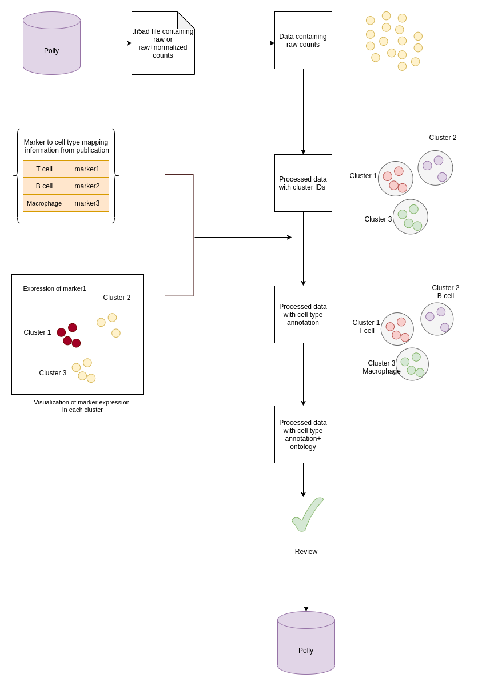
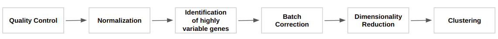

### Single Cell RNASeq Data

#### 1. Dataset Level Metadata

| **Field** | **Description** | **Ontology** | **GUI Display Name** | **Polly-Python Display Name** |
| --- | --- | --- | --- | --- |
| Organism | This field represents the organism from which the samples originated. Organism labels already present in the source metadata are normalized using a normalization model. In case the organism labels are missing, related texts and abstracts are processed and further normalized to get the organism metadata label. | [NCBI Taxonomy](https://www.ncbi.nlm.nih.gov/taxonomy) | Organism | curated\_organism |
| Tissue | This field represents the tissue(s) from which the samples in the dataset are derived. Tissue labels already present in the source metadata are normalized using a normalization model. In cases where tissue labels are missing, related texts and abstracts are processed and further normalized to get the tissue metadata label.   Tissue labels for datasets consists of all tissue names from which the samples are derived. Tissue labels are annotated for samples extracted from a healthy tissue or a diseased tissue.   Key specifications for tissue metadata annotations are as follows: <ul><li> All labels are harmonized with Brenda Tissue Ontology </li><li> Dual Channel datasets where the author has studied two different cases in a single sample are not curated with tissue metadata </li><li> Datasets with numerical metadata are not annotated | [Brenda Tissue Ontology](https://www.ebi.ac.uk/ols/ontologies/bto) | Tissue | curated\_tissue |
| Drug | This field represents the drug(s) that have been used in the treatment of the samples or relate to the experiment in some other way. Drug labels already present in the source metadata are normalized using a normalization model. In cases where drug labels are missing, related texts and abstracts are processed and further normalized to get the drug metadata label.   Drug labels are annotated for the following types of sample treatments: <ul><li> Chemical treatment - Treatment for activation/regulation/inhibition of a protein or nucleic acid. </li><li> Stimulation - Treatment to elicit an immune response. Eg. Cytokine stimulation (Interferon alpha, TNF-a), LPS </li><li> Drug treatment - Treatment with a substance used to treat an illness, relieve a symptom or modify a chemical process in the body for a specific purpose. Eg. 3,5-diethoxycarbonyl-1,4-dihydrocolidine (DDC) </li></ul>   Drug labels are not annotated for the following types of sample treatments: <ul><li> Control/ Vehicle - The control group receives either no treatment, a standard treatment whose effect is already known, or a placebo. Mostly the control sample contains organic solvents </li><li> Treatment for genetic perturbation - Treatments used for clonal selection, inducible genetic perturbation. Eg. Puromycin, Tamoxifen, Doxycycline </li><li> Transfection - RNA molecules (miRNA, shRNA, siRNA etc) for genetic manipulation </li><li> Other treatments - Treatments such as chemotherapy, radiation therapy or with antibodies </li><li> Other - Culture media, supplements and detergents. Eg. DMEM, LB Media, Agar Media, Glucose, amino acids, fats, lipids, SDS </li></ul>   **Note** : Any mention of the drug in the text is included as a drug label irrespective of whether it is being used in the experiment or not. | [PubChem](https://pubchem.ncbi.nlm.nih.gov/) | Drug | curated\_drug |
| Disease | This field represents the disease(s) being studied in the experiment. Disease labels already present in the source metadata are normalized using a normalization model. In case the disease labels are missing, related texts and abstracts are processed and further normalized to get the disease metadata label.   Disease labels are annotated when the samples have been collected from diseased tissue or organism. Examples of such cases are as follows: <ul><li> If the cell line has been extracted from a diseased organism/tissue and been immortalised for further study then it will be annotated for the disease. For example, if the samples are extracted from an osteosarcoma tumor then disease annotation for this dataset will be "osteosarcoma" </li><li> If a disease model has been created through genetic modification or has been artificially created in lab for further studies, then it will be annotated for that disease. For example, a genetically engineered mouse model where an immunodeficient or humanized mouse is implanted with a tissue from a patient's tumor. </li></ul>   **Note** : In studies, where the cell lines are extracted from a healthy tissue/organism and then conditioned to induce disease, the disease label for such a dataset will be "normal" since the sample is not extracted from any diseased tissue or organism.   Key specifications for disease metadata annotations are: <ul><li> All types of disease including viral, and bacterial infections, metabolic syndromes such as obesity, and diabetes, cancers such as lung neoplasm, breast neoplasm etc. are included as disease metadata labels. </li><li> Labels for disease mentioned for both full form and short form are annotated. For example, Acute Myeloid Leukaemia will be labelled for both AML, Myeloid Leukaemia, Leukaemia and Acute Myeloid Leukaemia </li><li> For a dataset, diseases for each sample in the dataset are annotated </li><li> Disease mentioned in the metadata of a dataset, irrespective of the study is labelled </li><li> Processes such as "carcinogenesis" or "tumorigenesis" are not annotated as diseases </li><li> Development abnormalities are not included </li><li> Dual Channel datasets where the author has studied two different cases in a single sample are not curated for disease metadata | [MeSH](https://www.ncbi.nlm.nih.gov/mesh/) | Disease | curated\_disease |
| Cell type | This field represents the cell type of the samples within the study.   Cell type labels are annotated in cases where the authors have cultured a particular cell type either extracted from tissues or developmental organs or generated in the lab and then used it in further experiment.   Key specifications for cell type metadata annotations are as follows: <ul><li> All labels are harmonized with Cell Ontology </li><li> Cell lines are not curated for cell types </li><li> For cell types with functional terms such as circulating, associated, derived, etc., only the cell type is annotated </li><li> For tissue-specific cell types, the tissue name along with the cell type is labelled. Eg - aortic endothelial cells, spinal motor neurons </li><li> Organism terms are not included in the cell type labels. Eg. mouse "HSPCs" </li><li> Abbreviated cell types with functional conditions are labelled as abbreviated terms. Eg. CTCs </li></ul> | [Cell Ontology](https://www.ebi.ac.uk/ols/ontologies/cl) | Cell Type | curated\_cell\_type |
| Cell line | This field represents the cell line from which the samples were extracted. List of the population of modified cells used for the study. Cell line labels already present in the source metadata are normalized using synonyms present in the cell line ontology we use.   Cell line labels are annotated in cases where the authors have cultured a particular cell line or bought it from organizations such as ATCC and then used in further experiments. Eg. MDAMB-231, HEK-293   Key specifications for cell line metadata annotations are as follows: <ul><li> All labels are harmonized with The Cellosaurus Ontology </li><li> Dual Channel datasets where the author has studied two different cases in a single sample are not curated for cell line metadata </li><li> Datasets with numerical metadata are not annotated </li><ul> | [The Cellosaurus](https://web.expasy.org/cellosaurus/) | Cell Line | curated\_cell\_line |
| **Other metadata fields** | | |
| **Field** | **Description** | **GUI Display Name** | **Polly-Python Display Name** |
| Cell Type Annotation Available | This field indicates whether cell type annotation is available or not.   1. "True" - Curated   2. "False" - Not curated   3. "Not Curatable" | Cell Type Annotation Available | celltype\_annotation\_available |
| Abstract | This field provides the abstract of the publication associated with the dataset. | NA | abstract |
| Author | This field provides the name of the author who published the dataset. | NA | author |
| Gene | This field provides the gene(s) studied in the dataset. | NA | curated\_gene |
| Strain | This field provides the names of the strain/genetic variants of the organism from which the samples are taken.The strain label is annotated for the strain of mice and rats used during the experimental process with reference to the strain attribute. Eg. for the strain attribute - wild-derived, curated label for strain name is CASA/RkJ | NA | curated\_strain |
| Year | This field provides the year in which the dataset or study is published. | NA | year |
| Data Type | This field provides the type of biomolecular data represented/studied in the dataset. | Data Type | data\_type |
| Dataset ID | This field provides the unique id for the dataset/study to represent a group of samples. | Dataset ID | dataset\_id |
| Source | This field provides the name of the source repository from where the dataset is fetched. | Source | dataset\_source |
| Description | This field provides a brief description of the experiment or the study. | Description | description |
| Summary | This field provides a detailed summary of the publication (can be the abstract) or a summary of the experiment. | Summary | summary |
| Overall design | This field provides information on the overall design of the experiment as given by the author. | Overall Design | overall\_design |
| Publication | This field provides the link to the publication associated with the dataset. If the associated publication information is not available, then this field provides the link to the data source providing more information on the dataset. | NA | publication |
| Platform | This field represents the platform that was used to assess the single cell data. | NA | platform |
| Number of Cells | This field represents the number of cells/observations in the dataset. | Number of Cells | total\_num\_cells |
| Samples | This field represents the total number of samples in a dataset. | Samples | total\_num\_samples |
| Manually curated fields | This field represents the manually curated fields for the dataset. Dictionary has info about which fields were curated manually. Keys in the dictionary are:   1. dataset\_level   2. sample\_level   3. cell\_type\_curatable | NA | manually\_curated\_fields |

#### 2. Sample Level Metadata

| **Field** | **Description** | **GUI Display Name** | **Polly-Python Display Name** |
| --- | --- | --- | --- |
| Tissue | This field represents the tissue(s) from which the samples originated. Tissue labels already present in the source metadata are normalized using a normalization model. In cases where tissue labels are missing, related texts and abstracts are processed and further normalized to get the tissue metadata label.   Tissue labels are annotated for samples extracted from healthy or diseased tissue. All labels are harmonized with Brenda Tissue Ontology. | Tissue | curated\_tissue |
| Disease | At the sample level, this field represents the disease associated with a particular sample. Disease labels already present in the source metadata are normalized using a normalization model. In case the disease labels are missing, related texts and abstracts are processed and further normalized to get the disease metadata label.   Disease labels are annotated for a sample when the samples have been collected from diseased tissue or organism. Examples of such cases are as follows: <ul><li> If the cell line has been extracted from a diseased organism/tissue and been immortalised for further study then it will be annotated for the disease. For example, if the samples under study are extracted from osteosarcoma tumor then disease annotation for this sample will be "osteosarcoma" </li><li> If a disease model has been created through genetic modification or has been artificially created in lab for further studies, then it will be annotated for that disease. For example, a genetically engineered mouse model where an immunodeficient or humanized mouse is implanted with a tissue from a patient's tumor.   At the sample level, disease labels are annotated for the following sample type: <ul><li> Clinical- Samples extracted from diseased patients, tissue, cell lines etc. </li><li> GEM (Genetically Engineered Models) - Samples extracted from genetically engineered mouse models </li><li> Diet Induced - Samples extracted from diet induced mouse models </li><li> Xenograft - Samples extracted from patient-derived xenograft or cell line derived xenograft mouse models </li><li> Infection - Samples extracted from infected organisms, tissues, cell lines or cultures. Example: Viral infection, Bacterial infection etc </li><li> Other - Any other type of sample in which disease has not been mentioned in metadata, but is not normal </li></ul> | Disease | curated\_disease |
| Drug | This field represents the drugs that have been used in the treatment of a sample. Drug labels already present in the source metadata are normalized using a normalization model. In cases where drug labels are missing, related texts and abstracts are processed and further normalized to get the drug metadata label.   Drug labels are annotated for the following types of sample treatments: <ul><li> Chemical treatment - Treatment for activation/regulation/inhibition of a protein or nucleic acid. </li><li> Stimulation - Treatment to elicit an immune response. Eg. Cytokine stimulation (Interferon alpha, TNF-a), LPS </li><li> Drug treatment - Treatment with a substance used to treat an illness, relieve a symptom or modify a chemical process in the body for a specific purpose. Eg. 3,5-diethoxycarbonyl-1,4-dihydrocolidine (DDC) </li></ul>   Drug labels are not annotated for the following types of sample treatments: <ul><li> Control/ Vehicle - The control group receives either no treatment, a standard treatment whose effect is already known, or a placebo. Mostly the control sample contains organic solvents </li><li> Treatment for genetic perturbation - Treatments used for clonal selection, inducible genetic perturbation. Eg. Puromycin, Tamoxifen, Doxycycline </li><li> Transfection - RNA molecules (miRNA, shRNA, siRNA etc) for genetic manipulation </li><li> Other treatments - Treatments such as chemotherapy, radiation therapy or with antibodies </li><li> Other - Culture media, supplements and detergents. Eg. DMEM, LB Media, Agar Media, Glucose, amino acids, fats, lipids, SDS </li></ul>   **Note:** Any mention of the drug in the text is included as a drug label irrespective of whether it is being used in the experiment or not. | Drug | curated\_drug |
| Cell line | This field represents the cell line from which the sample was derived. Cell line labels already present in the source metadata are normalized using synonyms present in the cell line ontology we use. The cell line field is curated for a sample if the authors have cultured a particular cell line or bought it from organisations such as ATCC and then used in further experiment. The names of the cell lines are harmonized by the cellosaurus ontology. | Cell Line | curated\_cell\_line |
| Strain | This field provides the strain/genetic variant of the organism from which the sample is taken.   The strain label is annotated for the strain of mice and rats used during the experimental process with reference to the strain attribute. Eg. for the strain attribute - wild-derived, curated label for strain name is CASA/RkJ. | Strain | curated\_strain |
| Cell Type | This field represents the cell type of the sample. Cell type labels are annotated where the authors have cultured a particular cell type either extracted from tissues or developmental organs or generated in the lab and then used it in the further experiment.   The cell type field provides the closest cell type name as per the Cell Ontology. This cell type label can be either source-derived or by manual cell type annotation. | Cell Type | curated\_cell\_type |
| Curated raw cell type | This field represents the cell type of the sample as mentioned in the publication associated with the dataset. | NA | curated\_raw\_cell\_type |
| Marker present | This field represents the gene name/names that are differentially expressed in a cluster based on which the cell type of the cluster is annotated. | NA | urated\_marker\_present |
| Marker absent | This field represents the gene name/names that are absent in a cluster based on which the cell type of the cluster is annotated. | NA | Curated\_marker\_absent |
| Cell ontology ID | This field represents the unique ID for the cell type according to the Cell Ontology. | NA | curated\_cell\_ontology\_id |
| Clusters | This field provides the cluster number to which each cell belongs after subjecting the dataset to the clustering process (Using Leiden or other algorithms). | Cell Type Cluster | clusters |
| Characteristics | This field provides a summary of sample characteristics in terms of ID/genotype/origin | NA | characteristics\_ch1 |
| UMI Counts | This field represents the Unique Molecular Identifier count per cell. It represents an absolute number of observed transcripts. The number should be higher than 500 in a cell. | UMI Counts | umi\_counts |
| Sample ID | This field represents the ID of the sample. | Sample ID | sample\_id |
| Gene Counts | This field represents the number of genes detected per cell (defined as genes with cpm \> 1); cpm=counts per million | Gene Counts | gene\_counts |
| Mitochondrial count | This field represents the percentage of mitochondrial counts in total counts for a cell. | NA | percent\_mito |
| Title | This field represents the type/genotype/origin/experimental condition of the sample | NA | title |

#### 3. Feature Level Metadata

| **Field** | **Description** | **Polly-Python Display Name** |
| --- | --- | --- |
| Data ID | This field represents the unique ID for this data entity on Polly. | Data ID |
| Gene IDs | This field represents the ID of the feature - gene ID, protein ID etc. | Gene IDs |
| Highly variable gene | This field indicates whether the gene is highly variable.For highly variable genes - True; otherwise -False. | highly\_variable |
| Number of cells | This field represents the number of cells which are containing the gene. | n\_cells |
| Name | This field represents the name of the gene/feature as per the source. | Name |

### Cell Type Annotation for single cell datasets: Manual Curation Process

Cell-type labels are assigned at the cell cluster level based on expression signatures using ontology or controlled vocabularies. For datasets, where cell-type annotations are not available from the source (mainly GEO datasets), we manually curate the cell-type information based on the differential marker expression for clusters. In cases where cell type annotations are already available in datasets at source, datasets are not manually re-curated.

 
**Figure 1.** Process Flow

#### **I) Manual identification of the cell types and markers from Publications** -

Internal curators determine if a particular dataset can be curated for cell type by going through the publications associated with the dataset. In publications, the information on cell type and the corresponding marker is present either in the figures (UMAP, T-SNE plots), text or supplementary files. If this information is not present, then such datasets are marked as 'Not Curatable'. The following types of studies fall under the category of 'Not curatable' datasets.

- Single Cell Type Study - The whole study was done on only one cell type.
- Lineages - The study included the lineage of one cell type. Example - T helper cells, T memory cells etc.
- Cell Cycle Studies - In this study the differential markers were studied for the G1, S, G2 and M phases of the cell cycle for a particular cell type.
- Methods - Different analysis methods were studied
- Publications having \< 2000 cells - These publications used methods which could not be reproduced. Therefore, these were not curated.
- Publication not available
- Marker information not available in the publication
  - Marker Cell Type Info Absent
  - Marker Info Absent
- Time Point
- Cell lines
- Transitional Cells
- Cell Type Info Absent
- Embryonic Development
- Organoids
- Others

#### II) Metadata addition- Annotation of clusters

The process of cell-type cluster annotation for curatable datasets is based on the general scRNASeq general[workflow](https://scanpy-tutorials.readthedocs.io/en/latest/pbmc3k.html) using the Scanpy library with steps as shown below in the figure:
                             
 
**Figure 2.** Workflow

UMAP/tSNE plots are generated as a result of single-cell raw count processing. By visualization of clusters with UMAP/t-SNE plots, cell type cluster annotation is done.

##### 1. Cluster annotation with raw cell type (cell type terminology used in publication):

Based on the marker expression value for each cluster, the cell type is annotated to the cluster. This annotation is added as a field named curated\_raw\_cell\_type. The raw cell type cluster annotation is compared with cell type annotation from the publication such as:

- All or most cell types are annotated
- UMAP is structurally similar to the one in the publication
- Relative proportions of cell types are matching
- Relative positions of cell types are matching
- Ontological terms and marker information are added for the cell type

##### 2. Ontological terms and marker information:

1. Cell type ontology + ontology ID: Cell-type annotation corresponding to Cell Ontology. This is given as the field named: curated\_cell\_type
2. Marker information: Gene name/names that are differentially expressed in the cluster
  - curated\_marker\_present: Gene name/names that are differentially expressed in the cluster
  - curated\_marker\_absent: Gene name/names that are absent in the cluster

**NOTE** : For manual cell type curation, datasets should be available on Polly.
                             
