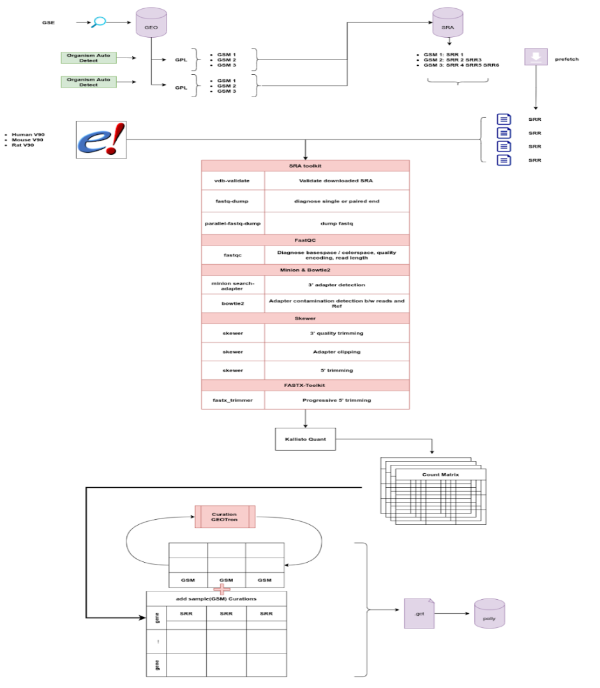

### **Bulk RNASeq Data**

All GEO RNA-Seq datasets on Polly are processed using the Kallisto Pipeline. The data is processed using the following reference genome, annotation, and complementary DNA sequence data from Ensembl release 107 for each organism. However, approximately 12% of the datasets have been processed with the Ensemble release V90. These will be reprocessed in future based on the Ensemble release V107.

1. **Homo Sapiens** Ensembl release 107, 90
<ul>
<li>Genome sequence (fasta)
<li>Gene annotation set (GTF)
<li>cDNA sequences (fasta)
</ul>
2. **Mus musculus** Ensembl release 107, 90
  <ul>
  <li>Genome sequence (fasta)
  <li>Gene annotation set (GTF)
  <li>DNA sequences (fasta)
  </ul>
3. **Rattus norvegicus** Ensembl release 107, 90
 <ul>
  <li>Genome sequence (fasta)
  <li>Gene annotation set (GTF)
  <li>cDNA sequences (fasta)
</ul>

#### Process flow

 
**Figure 1.** Process Flow

#### Details of the processing steps:

1. Detecting organisms and fetching relevant genome, annotation, and complementary DNA sequence data from Ensembl.
2. Downloading the transcriptome sequencing data (.sra files) from SRA using _sratoolkit prefetch / AWS S2 URI_ if publicly available.
3. Validating the downloaded .sra file using _vdb-validate._
4. Identifying if the SRA data is (single-end) or (paired-end)using _fastq-dump_. Both single-end (SE) and paired-end (PE) sequencing data are processed with the exclusion of color-space sequence data.
5. Extracting fastq files with _parallel-fastq-dump_.
6. Performing basic quality control checks on the .fastq reads using _FastQC_. (Diagnose basespace / colorspace, quality encoding, read length)
7. Trimming of Bases with phred quality \<10 on the 3′ ends and discarded reads shorter than 18 nucleotide using _Skewer_.
8. Adapter sequences at the 3′ end are detected using _Minion_.
9. If the predicted adapter sequence is not present in the genome and exceeds a frequency of 2.5% then the adapter sequences are clipped using _Skewer_.
10. Adapter contamination detection using _bowtie and clipping using a skewer._
11. Transcript-level expression counts are generated using _Kallisto_ by mapping all the reads that pass quality control to the genome. Command: _"kallisto quant" ._ All counts are reported on the gene level by taking a simple sum of Transcript-level counts. (NOTE: Kallisto pseudo counts are rounded to integer values)
12. For every SRR accession, the generated counts are collected into a single (.gct) file and multiple SRR counts per GSM ID (sample) are aggregated.
13. At the feature level, the Ensembl gene IDs are mapped to the respectiveHGNC symbol, MGI Symbol or RGI symbol. Counts for duplicate genes are dropped using Mean Average Deviation Score.
14. Each sample is then annotated with relevant metadata using our custom curation models for fields like disease, tissue, cell line, drug etc.
15. If requested, the counts matrix is normalised using _DESeq2 VST_ (Variance Stabilizing Transformation).
16. GCT having Raw Counts is pushed to the Omix Atlas - Bulk RNASeq OmixAtlas.

**Tools Used for the processing**

| **Tool** | **Task** | **Usage** |
| --- | --- | --- |
| GEOparse | Query GEO and fetch sample IDs (GSMs). | |
| pySRAdb | Query SRA and fetch run IDs corresponding to sample IDs (GSMs) and create GSM: SRR mappings. | |
| SRA toolkit | Download SRA files | prefetch SRRXXXXXX |
| SRA toolkit | Validate downloaded SRA files | vdb-validate |
| SRA toolkit | diagnose single or paired-end | fastq-dump |
| SRA toolkit | dump fastq | parallel-fastq-dump, |
| FastQC | Diagnose basespace / colorspace, quality encoding, read length | fastqc |
| parallel-fastq-dump | Rapid decompression of sequence data from .sra files | parallel-fastq-dump |
| Minion | 3' adapter detection | minion search-adapter |
| Bowtie2 | Adapter contamination detection | bowtie2 |
| Skewer |<ul><li> 3' quality trimming <li> Adapter clipping <li> 5' trimming </ul></li> | skewer |
| FASTX-Toolkit | Progressive 5' trimming | fastx\_trimmer |
| Kallisto | Transcript-level mapping | Kallisto quant |
| Custom script (make GCT) | Collect transcript counts, sample metadata and make a counts matrix then make a GCT file | |
| GEOtron | Curate sample and data-set level information and attach it to the GCT file | |
