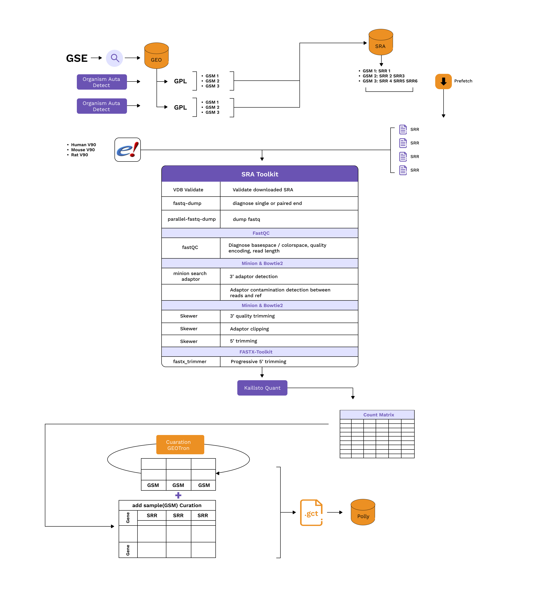

### **Bulk RNASeq Data**

All GEO RNA-Seq datasets on Polly are processed using the Kallisto Pipeline. The data is processed using the following reference genome, annotation, and complementary DNA sequence data from Ensembl release 107 for each organism. However, approximately 12% of the datasets have been processed with the Ensemble release V90. These will be reprocessed in future based on the Ensemble release V107.

1. **Homo Sapiens** Ensembl release 107, 90
<ul>
<li>Genome sequence (fasta)
</ul>
2. **Mus musculus** Ensembl release 107, 90
  <ul>
  <li>Genome sequence (fasta)
  </ul>
3. **Rattus norvegicus** Ensembl release 107, 90
 <ul>
  <li>Genome sequence (fasta)
</ul>

#### Process flow

 
**Figure 1.** Process Flow

#### Details of the processing steps:

1. Detect organisms and fetch relevant genome, annotation, and complementary DNA sequence data from Ensembl.
2. Download the transcriptome sequencing data (.sra files) from SRA using sratoolkit prefetch / AWS S2 URI if publicly available.
3. Validate the downloaded .sra file using vdb-validate.
4. Identify if the SRA data is (single-end) or (paired-end)using fastq-dump. Both single-end (SE) and paired-end (PE) sequencing data are processed with the exclusion of color-space sequence data.
5. Extract fastq files with parallel-fastq-dump.
6. Perform basic quality control checks on the .fastq reads using FastQC. (Diagnose basespace / colorspace, quality encoding, read length).
7. Trim Bases with phred quality \<10 on the 3′ ends and discarded reads shorter than 18 nucleotides using Skewer.
8. Transcript-level expression counts are generated using Kallisto by mapping all the reads that pass quality control to the genome. Command: "kallisto quant" . All counts are reported on the gene level by taking a simple sum of Transcript-level counts. (NOTE: Kallisto pseudo counts are rounded to integer values).
9. A Multiqc report is generated that compiles all fastqc, kallisto and skewer output into a single report.
10. For every SRR accession, the generated counts are collected into a single (.gct) file and multiple SRR counts per GSM ID (sample) are aggregated.
11. At the feature level, the Ensembl gene IDs are mapped to the respective HGNC symbol, MGI Symbol or RGI symbol. Counts for duplicate genes are dropped using Mean Average Deviation Score.
12. Each sample is then annotated with relevant metadata using Polly’s curation models for a standard fields **disease, tissue, cell line, drug, cell type, organism**.
13. If requested, the counts matrix is normalized using DESeq2 VST (Variance Stabilizing Transformation).
14. GCT having Raw Counts are pushed to the Omix Atlas - Bulk RNASeq OmixAtlas.

**Tools Used for the processing**

| **Tool** | **Task** | **Usage** |
| --- | --- | --- |
| GEOparse | Query GEO and fetch sample IDs (GSMs). | |
| pySRAdb | Query SRA and fetch run IDs corresponding to sample IDs (GSMs) and create GSM: SRR mappings. | |
| SRA toolkit | Download SRA files | prefetch SRRXXXXXX |
| SRA toolkit | Validate downloaded SRA files | vdb-validate |
| SRA toolkit | diagnose single or paired-end | fastq-dump |
| SRA toolkit | dump fastq | parallel-fastq-dump, |
| FastQC | Diagnose basespace / colorspace, quality encoding, read length | fastqc |
| Skewer | Trim Bases with phred quality <10 on the 3′ ends and discard reads shorter than 18 nucleotides | skewer |
| Kallisto | Transcript-level mapping | Kallisto quant |
| Multiqc | Compiles all fastqc, kallisto and skewer output into a single report | Multiqc |
| Internal script for sample aggregation | Collect transcript counts, and sample metadata, make counts matrix, and then make a GCT file | |
| GEO Curation pipeline | Curate sample and dataset level information and attach it to the GCT file | |
