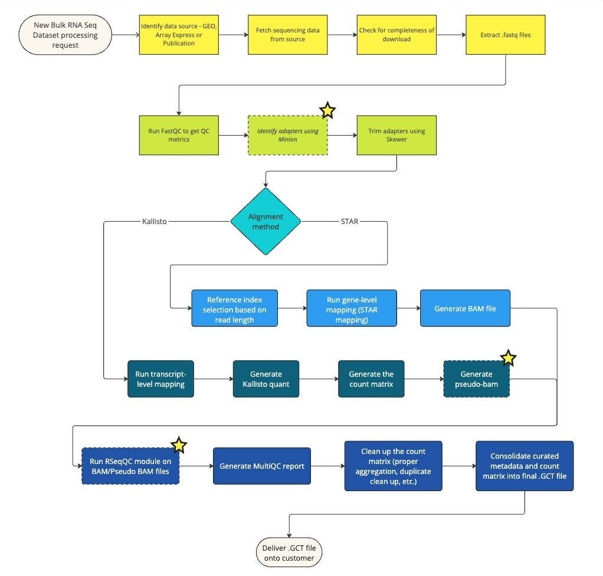

# Bulk RNA sequencing FAQs

RNA sequencing (RNA-seq) has become a powerful method in transcriptomics, allowing highly accurate gene expression quantification. It is providing researchers with visibility into previously undetected changes occurring in disease states, in response to therapeutics, under different environmental conditions, and across a broad range of other study designs.

### How is a Bulk RNA-seq dataset on Polly defined?

Bulk RNA-Seq Datasets on Polly represent a curated collection of biologically and statistically comparable samples. All the datasets are denoted using a unique ID, which follows the GEO record identifier format comprising a series ID and a platform ID.

- Platform record - A Platform record is composed of a summary description of the array or sequencer. Each Platform record is assigned a unique GEO Identifier ( **GPLxxx** )
- Series record - A Series record links together a group of related samples and provides a focal point and description of the whole study. Each Series record is assigned a unique GEO Identifier ( **GSExxx** ). A Series record can be of two types - SubSeries and SuperSeries. For bigger experiments, there are both SubSeries and SuperSeries. SuperSeries is all the experiments for a single paper/study. SuperSeries can be divided into SubSeries which are different technologies. In the GEO Transcriptomics OmixAtlas, we only have Subseries records.

For example, dataset ID 'GSE189190\_GPL25947\_raw' would translate to:

- sequenced using the **platform ID- GPL25947**
- from the **Series GSE189190**
- Here \_ **raw** signifies 'raw counts' for datasets

### How are Bulk RNA-seq datasets stored on Polly

All datasets are available with raw counts data matrix and associated metadata. The datasets are available in GCT (Gene Cluster Format) file format which allows for storing sample metadata as well as the expression data in a single file.

### Which pipeline is used for processing the Bulk RNASeq data?

Bulk RNASeq data from FastQ files can be processed using either of the following options:

- Kallisto pipeline
- STAR pipeline

The data is processed with the following reference genome, annotation, and complementary DNA sequence data from Ensembl release 107 for each organism.

1. **Homo Sapiens** Ensembl release 107, 90
- Genome sequence (fasta)
- Gene annotation set (GTF)
- cDNA sequences (fasta)
2. **Mus musculus** Ensembl release 107, 90
- Genome sequence (fasta)
- Gene annotation set (GTF)
- cDNA sequences (fasta)
3. **Rattus norvegicus** Ensembl release 107, 90
- Genome sequence (fasta)
- Gene annotation set (GTF)
- cDNA sequences (fasta)

**Process flow**

 
**Figure 1.** Process Flow

#### Details of the processing steps:

1. Detect organisms and fetch relevant genome, annotation, and complementary DNA sequence data from Ensembl.
2. Download the transcriptome sequencing data (.sra files) from SRA using sratoolkit prefetch / AWS S2 URI.
3. Validate the downloaded .sra file using vdb-validate.
4. Identify if the SRA data is (single-end) or (paired-end) using fastq-dump. Both single-end (SE) and paired-end (PE) sequencing data are processed with the exclusion of color-space sequence data.
5. Extract fastq files with fasterq-dump.
6. Perform basic quality control checks on the .fastq reads using FastQC. (Diagnose basespace / colorspace, quality encoding, read length)
7. Identify all adapters using Minion
8. Trim Bases with phred quality <10 on the 3′ ends, discard reads shorter than 18 nucleotides, as well as remove the adapters identified by Minion using Skewer.
9. For the following pipelines:
    - Kallisto:
      Transcript-level expression counts are generated using Kallisto by mapping all the reads that pass quality control to the genome
      All counts are reported at the gene level by taking a simple sum of Transcript-level counts. (NOTE: Kallisto pseudo counts are rounded to       integer values)
      Optionally, if RSeqQC module is included pseudo BAM files are generated
    -  STAR:
      Reference indexes for STAR mapping are selected based on the read_length as detected by FastQC.
      Gene-level expression counts are generated using STAR by mapping all the reads that pass quality control to the genome.
      Optionally, if RSeqQC module has been chosen, those checks are performed on the BAM/pseudo BAM file.
10. A Multiqc report is generated that compiles all FastQC, RSeqQC (only if requested), Kallisto/STAR, and Skewer output into a single report.
11. For every SRR accession, the generated counts are collected into a single (.gct) file and multiple SRR counts per GSM ID (sample) are aggregated.
12. At the feature level, the Ensembl gene IDs are mapped to the respective HGNC symbol, MGI Symbol, or RGI symbol. Counts for duplicate genes are dropped using Mean Average Deviation Score.
13. Each sample is then annotated with relevant metadata using Polly's curation models for fields like disease, tissue, cell line, drug, cell type, and organism.
14. If requested, the counts matrix is normalized using DESeq2 VST (Variance Stabilizing Transformation).
15. .GCT files with Raw Counts are pushed to the Bulk RNASeq OmixAtlas.

### Tools Used for the processing:

| | **Tool** | **Task** | **Usage** |
| --- | --- | --- | --- |
| 1 | GEOparse | Query GEO and fetch sample IDs (GSMs). | |
| 2 | pySRAdb | Query SRA and fetch run IDs corresponding to sample IDs (GSMs) and create GSM: SRR mappings. | |
| 3 | SRA toolkit | Download SRA files | prefetch SRRXXXXXX |
| 4 | SRA toolkit |Validate downloaded SRA files | vdb-validate |
| 5 | SRA toolkit |diagnose single or paired-end | fastq-dump |
| 6 | SRA toolkit |Rapid decompression of sequence data from .sra files | Fasterq-dump |
| 7 | FastQC | Diagnose basespace / colorspace, quality encoding, read length | fastqc |
| 8 | Minion | Identify adapters based on sequence patterns | Minion |
| 9 | Skewer | Trim Bases with phred quality <10 on the 3′ ends and discard reads shorter than 18 nucleotides | skewer |
| 10 | Kallisto | Transcript-level mapping | Kallisto quant |
| 11 | STAR | Gene-level mapping | STAR |
| 12 | Multiqc  | Compiles all fastqc, kallisto and skewer output into a single report | Multiqc |
| 13 | Internal script for sample aggregation | Collect transcript counts, and sample metadata,  make counts matrix, and then make a GCT file | 
| 14 | GEO Curation pipeline | Curate sample and dataset level information and attach it to the GCT file | |

### **Do you currently provide or plan to provide alternatives to bulk RNAseq processing?**

We process the bulk RNAseq datasets using the Kallisto pipelines as it is less computationally demanding and has been shown to perform as well as the STAR pipeline [Reference](https://www.nature.com/articles/s41467-018-03751-6#Sec9). If required, we can also process the datasets you purchase using STAR or any other custom pipeline of choice at additional cost. This will be considered a custom pipeline service.

### **Which fields are curated for bulk RNASeq data Data?**

Polly's NLP-based curation models are used to curate all datasets and their corresponding samples, which are then harmonised using specific biomedical ontologies. 
These fields include - Organism, Disease, Tissue, Cell Line, Cell Type and Drug. 
In addition to these fields, various other metadata fields are captured from the source publication and annotated at 3 levels:

- Dataset-level metadata - General information about the experiment, subject and transformations, for eg, organism, experiment type, and disease under study.
- Sample-level metadata - Captures information for each sample. Eg. Drug, tissue
- Feature-level metadata: Provides molecular/gene information that is consistent across samples.

Detailed list of curated fields could be accessed [here](https://docs.elucidata.io/OmixAtlas/Curating%20OA/Curating_OA_BulkRNAseq.html).

### Are all metadata fields from the source retained?

All metadata fields from the source publication are captured in the GCT file and can be visualized on the details page of a dataset ID or through applications. However, only the fields described in the OmixAtlas schema are available for querying via Polly Python.

### Can users request for datasets on Polly?

Bulk RNASeq datasets from GEO which are not available on Polly can be requested to be added to a user's OmixAtlas. Upon request, these datasets will be added directly to your atlas within 4 days. The following requests are in scope:

- Raw data files (fastq) are available on GEO
- The datasets are specific to the organisms - Human, mouse and rat
- The dataset belongs to the Bulk RNA-Seq data type
