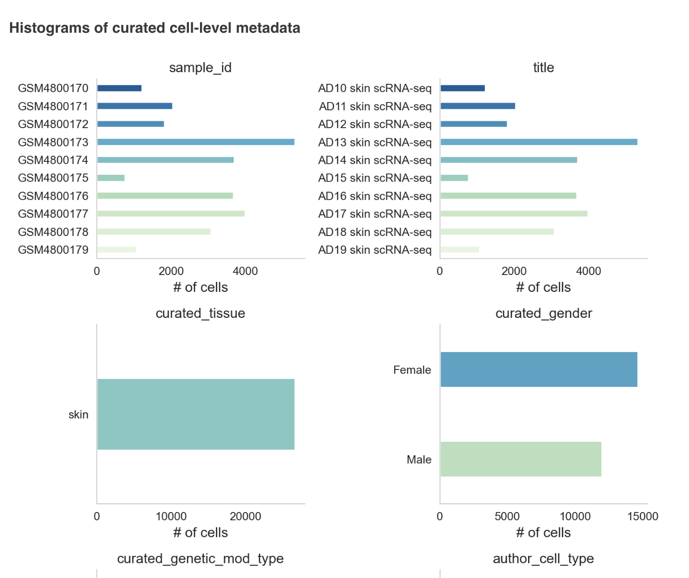
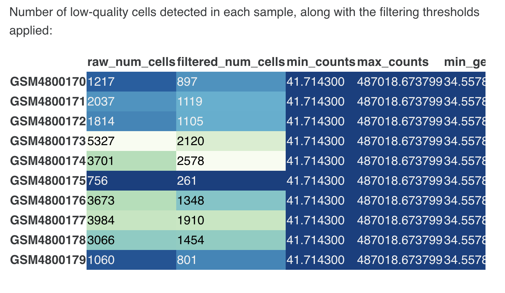
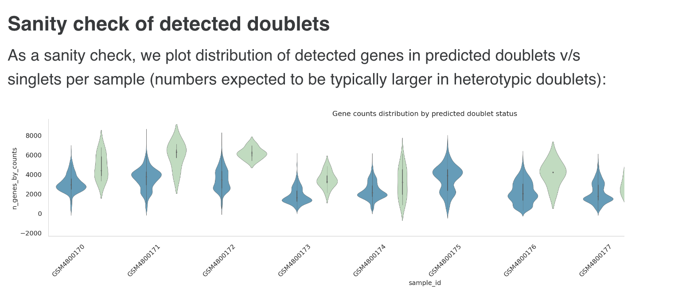

# Single Cell RNAseq Omixatlas- FAQs

## Introduction

Single-cell RNA sequencing has emerged as the technique of choice for researchers trying to understand the cellular heterogeneity of tissue systems under physiological and pathological conditions. Polly provides structured and curated Single-cell RNAseq data in various counts formats as per the need of the research. The data is machine-actionable and analysis-ready for any downstream needs.

Polly can bring in data from a variety of public sources as per the needs as long as the raw counts matrix and metadata are available. Some of the common public sources for Single-cell RNAseq data are:

1. [Gene Expression Omnibus](https://www.ncbi.nlm.nih.gov/geo/)
2. [Expression Atlas](https://www.ebi.ac.uk/gxa/home)
3. [Human cell atlas](https://www.humancellatlas.org/)
4. [Single Cell Portal](https://singlecell.broadinstitute.org/single_cell)
5. [Tabula sapiens](https://tabula-sapiens-portal.ds.czbiohub.org/)
6. [Covid-19 Cell Atlas](https://www.covid19cellatlas.org/)
7. [Array Express](https://www.ebi.ac.uk/biostudies/arrayexpress)
8. Publications

### How is a Single Cell RNA-Seq dataset defined on Polly?

A Single-cell RNAseq dataset on Polly represents a curated collection of biologically and statistically comparable samples. A dataset on Polly is a single entity based on its representation in publication or source.


**Dataset ID Nomenclature**
| Source | Source Format | Polly Format |
| ------ | ------ | ------ |
| GEO | For every study, there is a series ID and a platform ID given on GEO <br /> _Platform identifier_ : A Platform record is composed of a summary description of the array or sequencer. Each Platform record is assigned a unique GEO Identifier **(GPLxxx)**. <br />  _Series_ : A Series record links together a group of related samples and provides a focal point and description of the whole study. Each Series record is assigned a unique GEO Identifier **(GSExxx)**. <br /> &nbsp;&nbsp; - A Series record can be a SubSeries or  SuperSeries. <br /> &nbsp;&nbsp; - SuperSeries is all the experiments for a single paper/study and &nbsp;&nbsp; is divided into SubSeries which are different technologies. | Format: GSExxxxx_GPLXXXXX <br /> <br /> All dataset IDs on Polly are GEO subseries |
| Expression Atlas <br /><br /> Human cell atlas <br /><br /> Array Express <br /> | Studies submitted on these databases/portals have unique IDs associated with them <br /> <br /> Eg. E-MTAB-9841, E-HCAD-56, E-GEOD-175929, E-CURD-102 etc. | Datasets for which data is fetched from these sources follow the same nomenclature as that of the source. <br /> <br /> Eg. E-MTAB-9841, E-HCAD-56 etc |
| Single Cell Portal(SCP) | Studies on SCP have a unique ID associated with them <br /> Eg. SCP2331 | Studies fetched from the Single Cell Portal follow the same nomenclature as that of the source. The unique dataset ID format is SCPxxxxx <br /> <br /> Eg.SCP2331 |
| Tabula sapiens | Studies associated with Tabula Sapiens Consortium - Human cell atlas of nearly 500,000 cells from 24 organs are available as dataset ID - ‘_Tabula Sapiens- organ name_’ <br /> <br /> Eg. Tabula Sapiens - Spleen | All 24 datasets on Polly are available with a unique dataset ID format as:<br /><br /> '_TS_organ name_' where <br /><br /> TS stands for ‘Tabula Sapiens’ <br /> <br /> Eg. TS_Tongue |
| Covid-19 Cell Atlas | Studies related to Covid-19 disease: Healthy Donors or Patient Donors <br /> <br /> Dataset Identifiers are unique for each dataset/study. The dataset identifiers can be <br /> &nbsp; - Tissue and/or author name <br /> &nbsp;&nbsp; Eg. Lung parenchyma Vieira Braga et al. <br /> &nbsp; - Key tissue/cell type associated with the study <br /> &nbsp;&nbsp; Eg. Peripheral Blood Mononuclear Cells (PBMCs) <br /> &nbsp; - Other format<br /> &nbsp;&nbsp; Eg. COV028A2 | - For datasets where the associated publication is given: A unique dataset ID as the PMID of the paper <br/><br /> - In case, a publication reference is unavailable, the dataset ID is the same as that on the source |
| Publication |    &nbsp;&nbsp;&nbsp;&nbsp;&nbsp;&nbsp;   -    | Studies for which data is taken from publication directly (not from the above sources) are available with a unique dataset ID as the PMID of the paper <br /> <br /> Eg. PMID35664061 | 


**Split Datasets** 

Some studies are a collection of smaller studies about different experimental conditions. In such cases, studies, and datasets are split based on specific defined categories. A combined study dataset is available on request. Datasets are split based on the following categories:

1. Disease (Normal will not be separated as another dataset, only diseases will be split)
2. Organism
3. Tissue
4. Assay
   
For split datasets, the nomenclature of dataset ID is as follows:

Polly dataset ID_Split factor, wherein the Polly dataset ID is the format mentioned above for different sources and split factor is the name of the disease, organism, tissue, or Assay.

Eg. GSE156793_GPL24676_Kidney, GSE156793_GPL24676_Liver


## What are the different options within the Single-cell datasets on Polly
Based on the needs of the research, Polly can provide a Single-cell dataset as any of the following outputs

**1. Raw unfiltered counts** <br />
This format contains one H5AD file containing raw counts for unfiltered cells and genes as the data matrix, curated sample level metadata, and normalized feature names. More details are in the subsequent sections. This format is useful if the research needs raw counts to be processed in a custom manner. <br />

**2. Polly processed counts** <br />
This format contains 2 H5AD files.<br />
a. One H5AD file is the same as mentioned in the Raw unfiltered counts section. <br />
b. The second one stores the following <br />
&nbsp;&nbsp;i. processed counts using a consistent pipeline for filtering cells/genes, normalizing the counts, and annotating cell types using the markers from the associated publication. <br />
&nbsp;&nbsp;ii. Raw counts after filtering out the cells and genes as per consistent Polly’s SC pipeline. <br />
&nbsp;&nbsp;iii. Curated sample-level metadata and normalized feature names. <br />
This format ensures the data is post-processed in a consistent format which makes different datasets comparable. This is particularly useful when similar analyses need to be performed across datasets to get an insight. <br />
More details are in the subsequent sections. <br />

**3. Author processed counts** <br />
This format contains 2 H5AD files <br />
a. One H5AD file is the same as mentioned in the Raw unfiltered counts section (only if raw counts are available at source) <br />
b. The second one contains counts processed using the publication’s parameters for filtering cells/genes, normalizing the counts, and annotating cell types using the markers from the associated publication. This H5AD file also contains curated sample-level metadata and normalized feature names. <br />
This format helps replicate the analysis from the associated publication with minimal effort. <br />
More details are in the subsequent sections.<br />


### Details

**1. Raws unfiltered counts** <br /><br /> 
**1.1. Starting Point** 

Single-cell raw count data is typically available in several common file formats across most public resources. For raw counts, data from the source is fetched in the following formats<br />
- Matrix Market (MTX) Format
- Tabular Formats (e.g., CSV, TSV)
- Hierarchical Data Format (e.g. h5ad, suerat, h5)

**1.2 Processing details**
<p align="center"
   
 

</p>

<p align="center">Processing Flow</p>

The pipeline for raw counts includes the following steps: <br />

1. **Fetching Raw Counts**: The starting point for the pipeline is getting the raw counts from the source by <br />
 a. Either downloading data directly from the source  - A text file is created with links for downloading <br />
 b. Downloading manually 
Associated barcodes and gene probes are fetched with the raw counts

2. **Preparing Data files**: A JSON file is created for the pipeline to run.<br />
&nbsp;  - A JSON file with all the required input parameters is created. As per the parameters given in the JSON file, further steps in the pipeline are run <br />
&nbsp;  - In case raw counts are downloaded from the source directly, the file is &nbsp;unzipped and data is arranged in a structured way

3. **Creating h5ad**: With the input as the above JSON file, the pipeline starts to create the initial h5ad.<br />
- Programmatic checks are performed to ensure the data matrix contains raw counts only<br />
- If the matrix is not found to be in the correct format (as per the raw count acceptable values), the pipeline stops<br />
- Pipeline accepts the raw counts as per defined the acceptable values, i.e. integer values and >1000<br />
- The index for cell data is sample: barcode and information with respect to each sample: barcode (cell id = sample: barcode) is added<br />
- Feature IDs are converted to Hugo Symbols (or Ensembl IDs where conversion to Hugo symbols is not available or ambiguous)<br />
- Initial h5ad is created<br />
4. **Metadata Curation**:
- The curation pipeline adds curated metadata to the file - sample/cell level metadata is added to the h5ad file<br />
- The curation pipeline generates dataset metadata<br />

5. **QC metrics**: Scanpy QC metrics are calculated and added to the h5ad file<br />

6. **Final h5ad**: The final h5ad file is saved, consisting of QC metrics, curated metadata, raw counts matrix

**1.3 Curation and Metadata details**

On Polly, every dataset and its corresponding samples are tagged with some metadata labels that provide information on the experimental conditions, associated publication, study description and summary, and other basic metadata fields used for the identification of dataset/samples. <br />
There are three broad categories of metadata available on Polly such as:<br />
&nbsp; a) *Source Metadata*: Metadata fields that are directly available from the Source and provided in a Polly-compatible format.<br />
&nbsp; b) *Polly - Curated*: These are curated using Polly’s proprietary NLP-based Polly-BERT models and reviewed by expert bio-curators to ensure high-quality metadata. Some of the Polly curated metadata fields are harmonized using specific biomedical ontologies and the remaining follow a controlled vocabulary.<br />
&nbsp; c) *Standard identifiers* - Identifier metadata tag for datasets, giving information on the basic attributes of that dataset/study.<br />

Metadata for every dataset is available at 3 levels:<br />
&nbsp; I) Dataset-level metadata - General information about the overall experiment/study, for eg, organism, experiment type, and disease under study.<br />
&nbsp; II) Sample-level metadata - Information about each sample related to Eg. Drug, tissue.<br />
&nbsp; III) Feature-level metadata: Information on the genes/features that are consistent across samples.  <br /> 

Details on each metadata field present at the dataset, sample, and feature level are given below<br />

**I Dataset Level Metadata**

**1.4 Output H5AD format and details**
H5AD file for raw counts data offering will be available to the user with the following information: <br />

1. Raw counts `<adata.X>` slot: The raw expression matrix is available in this slot, providing information on the genes and cells as provided by the author.  The raw counts will available be as: <br />
a. Integer counts (with an exception of some datasets from Expression Atlas which may contain fractional values)<br />
b. Values >1000<br />
c. Values not less than 0<br />
d. Sparse matrix<br />

2. Complete Sample Metadata in `<adata.obs>` slot: All the cell/sample level metadata information is available in this slot as per the metadata table given above <br />
a. Polly-Curated Metadata <br />
b. Scanpy QC metrics - QC metrics include n_genes_by_counts, total_counts, total_counts_mt, and pct_counts_mt.<br />
c. Source Metadata<br />
d. Standard Identifier Metadata<br />

3. Processing Details `<adata.uns>` slot: Unstructured metadata on the processing-related details is available in this slot such as: <br />
a. Tools/packages along with their versions used to convert the matrix from source to H5AD file<br />
b. curation model version (for eg. PollyBert_v1)<br />
c. ontology version<br />
d. raw file formats<br />
e. scanpy, anndata version<br />

4. `<adata.uns>` slot: QC Metrics such as mt, n_cells_by_counts, mean_counts, pct_dropout_by_counts & total_counts

**1.5 Report**
A detailed data report is available for each dataset which can be viewed /downloaded using the given link. The following information corresponding to the dataset will be available in each report: <br />

A) General Information: Dataset Summary<br />
- Organism
- Number of cells
- Number of samples
- Disease
- Dataset Source
- Data split: Yes/No
  - In the case of ‘Yes’, the name of the factor used for splitting is given. Eg. Tissue, disease, etc.
- Size of the data matrix
- Annotated cell types from Source


<p align="center">Sample information for dataset summary</p>

B ) Experiment design
- SC chemistry
- Design

C) Pre-processing
- Reference genome to which the sequenced reads were mapped
- Reference genome annotation used for transcript quantification
- Software pipeline and version used for read mapping and expression quantification

D) Sample/cell Level Metadata Attributes





E) Basic Data QC


<bk />
F ) Data QA Analysis: This section provides a table showing the data-related checks performed internally along with the final output <br />
&nbsp;&nbsp;i) Metadata QA - Quality checks performed for metadata at the dataset and sample/ &nbsp;&nbsp;cell-level metadata<br />
&nbsp;&nbsp;ii) Data matrix QA


<br />
**2. Polly Processed Data** <br />
**2.1. Starting point**

For processing SC datasets using Polly’s standardized pipeline, the starting point is the h5ad file containing raw unfiltered counts created for the raw counts data. The inputs for the processing pipeline are:<br />

Raw h5ad file containing unfiltered counts in X slot, along with sample/cell and feature level metadata (HUGO gene symbols as feature IDs, obs columns specifying batch/sample, and other cell level metadata)<br />

**2.2. Processing details**

The pipeline includes the following steps:<br />

**1. Preparing files**

- Raw h5ad containing unfiltered counts loaded in X slot, along with sample and feature level metadata<br />
- A JSON file is created with all the required input parameters and method choices for the processing workflow<br />

**2.Processing Workflow:** Standard pipeline workflow consists of the following stepsguided by best practices recommendations: <br />

a. **Data Checks**

Data checks are done such as<br />

- X contains raw counts
- X is a sparse matrix in csc_format
- mt,ribo, and hemo tags  are added to genes
- Copy of unfiltered counts matrix from X to raw slot

 b. **Quality Control**

With the gene expression matrix ready (raw counts matrix), the next step is to filter out low-quality cells and genes before further processing. Filtering of cells is done on a per-sample basis, using adaptive cutoffs per dataset<br />

- **Cell filtering**

Following the best practices guide, we use ratios instead of hard thresholds. This adapts cutoffs according to the distribution in each dataset. Outlier cells crossing at least one of the following thresholds are removed (MAD is median absolute deviation)

- `log1p_total_counts > or < 5 MAD`,
- `log1p_n_genes_by_counts > or < 5 MAD`, 
- `pct_counts_in_top_20_genes > or < 5 MAD`, 
- `pct_counts_Mt > 3 MAD or > 8%`
- Gene filtering: genes expressed (counts > 0) in less than 3 cells are removed

c. **QC metrics calculation**

QC metrics are calculated for ribo & hemo genes as well, but genes are not removed based on these metrics.<br />

d. **Doublet detection**

Detection of probable doublets and filtering out predicted doublets from the counts matrix. This is done using the Scrublet tool, which has a Python implementation. [Scrublet is also being used in the EBI SC Expression Atlas pipeline and has been known to perform better against other methods, particularly in terms of speed and scalability (e.g. this review and study)]

Default parameters for Scrublet:
- Doublet rate: 0.06
- Min counts: 2 
- Min cells : 3 
- Min gene variability %: 85 
- Principal components: 30

e. **QC metric re-computation**

Following filtering and doublet removal, the QC metrics are re-computed (using `scanpy.pp.calculate_qc_metrics` function) on the updated filtered matrix and stored in obs/var:<br />

- obs: `'total_counts', 'n_genes_by_counts'`, `'pct_counts_in_top_20_genes'`, `'pct_counts_mt'`, `'pct_counts_ribo'`, `'pct_counts_hb'`

- var: `'n_cells_by_counts', 'mean_counts', 'pct_dropout_by_counts', 'total_counts`

f. **Normalization** 

Normalization is performed to reduce the technical component of variance in the data, arising from differences in sequencing depth across cells. It is performed based on the following choices:<br />

- **Method**: library size/total counts normalization (implemented by `scanpy.pp.normalize` function)
  - **target_sum**: `None` (this is the default option in scanpy and amounts to setting the library size to the median across all cells; best practices guide discusses the use of alternate fixed thresholds like 104 or 106 can introduce over-dispersion)
  - **log1p**: `True`
  - **Scaling**: `True, with zero_center=False` (this will be performed after the HVG step)<br />

Note: Before normalization, the filtered counts matrix is saved to a separate “counts” layer (`adata.layers["counts"])`, and X is updated with the normalized counts matrix. A copy of the normalized (and optionally log1p) counts matrix will also be saved in a separate “normalized_counts” layer, this will preserve the normalized data prior to scaling and batch correction steps<br />

g. **HVG identification**

Feature selection is needed to reduce the effective dimensionality of the dataset, and retain the most informative genes for downstream steps like PCA and neighbor graph<br />

- **Highly Variable Genes (HVG)** are identified using the `scanpy.pp.highly_variable_genes` function with the following settings:
  - HVG method: `"Seurat"` (default, uses the log-normalized counts matrix in X)
  - n_top_genes (# HVGs identified): `2000`
  - batch_key setting: `"sample"` (this corresponds to batch-aware feature selection providing a lightweight form of batch correction to reduce technical differences between samples, see e.g. best practices guide)
  - subset: `False` - the expression matrix is not subsetted to the HVGs. All genes are retained and a highly_variable column gets added to the .var slot

h. **Batch Effect Correction**

Batch effect is checked in the data using “sample” as the batch variable

- In a manual workflow, batch effects in the dataset will be checked visually on a UMAP or tSNE as well as the quantitative metrics of batch effects in the data. 
  - Following quant metrics to be adopted (these are provided through scib and scib-metrics libraries, which were released along with a recent benchmarking study of single-cell data integration methods):<br />
  i. Adjusted rand index comparing batch labels and leiden clusters (ARI)<br />
  ii. Normalized mutual information between batch labels and leiden clusters (NMI)<br />
  iii. Principal component regression variance using batch variable (pcr_batch)<br />
  iv. Scaled graph integration local inverse Simpson’s index (Graph iLISI)<br />
  v. Acceptance rate from batch k-BET test (kbet_accept_rate)<br />

  - For i-iii above, values closer to 0 indicate good batch mixing; for iv-v, values closer to 1 indicate the absence of significant batch effects in the data

  - Batch correction will be done using Scanorama or scVI, both of which return a corrected matrix as well as a batch-corrected low-d embedding. These methods are shown to perform favorably in a recent comprehensive benchmarking study of SC integration methods. [Based on the quality of batch correction and scalability to large numbers of cells, one of these methods would be adopted for further use in the standard pipeline]

- Scanorama: Batch-adjusted expression matrix is obtained by running `scanorama.correct_scanpy(adatas, return_dimred=True)` (adatas is a list of sample-wise anndata objects)

- scVI: By default, the scVI model works with an unnormalized counts matrix and expects counts in “counts” layer. scVI returns the batch-corrected and normalized expression matrix. This is obtained by running the following step after model fitting: `SCVI.get_normalized_expression(library_size = median_library_size, return_numpy=True)` (where median_library_size is the median of library sizes across all cells in the matrix)

- No. of training epochs for scVI VAE model is decided based on dataset size as suggested in best practices guide: `max_epochs_scvi = np.min([round((20000 / adata.n_obs) * 400), 400])`

  - The resulting matrix from each batch correction method is added as a new layer (`'<method>_corrected'` key) and does not overwrite the X matrix. If the average batch-mixing score is higher for the post-correction matrix compared with the uncorrected matrix, only then, X is updated with the batch-corrected matrix and used for further downstream analysis. The method used on each dataset is also captured in the uns slot (example: `adata.uns["batch_correction_applied"] = {'method': 'scanorama'})`<br />

 Note: Harmony-corrected embedding (output of scanpy wrapper `scanpy.external.pp.harmony_integrate)` would also provided as a separate matrix in the obsm slot ('X_pca_harmony'). However, by default, Harmony does not correct the full expression matrix and only adjusts the PCA representation to mitigate batch differences. 

**i. HVGs are re-computed using the processed, adjusted matrix**

**j. Dimensionality reduction**

This step is necessary to reduce the dimensionality of the data prior to clustering, and to enable visualization for exploratory analysis. Following data embeddings are provided by running the relevant scanpy functions:<br />
- PCA (n_pcs = 50 top PCs ranked by explained variance): `'X_pca'` in obsm, `'PCs'` in varm slot
- Nearest-neighbor graph in PC space: n_neighbors=50, dimensionality of PC space = 40 or number of top PCs explaining 90% variance, whichever is smaller; `'distances'` and `'connectivities'` in obsp slot
- Uniform Manifold Approximation and Projection (UMAP): `'X_umap'` in obsm slot
- t-Distributed Stochastic Neighbor Embedding (t-SNE): `'X_tsne'` in obsm slot

**k. Cell clustering**: Clustering is performed on the processed and dimensionally reduced data matrix to identify (probable) similar groups of cells, possibly representing distinct cell types/states. <br />

- Leiden graph-based clustering is performed with a fixed resolution (resolution = 0.8)
  - The nearest-neighbor graph is constructed in the previous dimensionality reduction step. 
  - Cluster labels are added to the obs slot in a ”clusters” column

**l. Cell type annotation of clusters**: This is done based on the marker genes and cell types from the associated publication, using an automated cell type assignment method -ScType. 

- ScType implementation - Input
  - A tab-separated file is created with
    - raw/author cell types and corresponding lists of marker genes (one cell type per line, no headers)
    - Specification on whether each marker gene is supposed to be present (over-expressed) or absent (under-expressed) in the corresponding cell type.
  - The processed expression matrix in X slot (only the slice of the data corresponding to the supplied marker genes is used for scoring cell types).

 - ScType implementation - Output
  - ScType returns an enrichment score matrix of size `num cell types x num clusters`, based on which each cluster gets assigned the raw cell type with the highest score. 

- Annotated Tags:
  - Following sample-level metadata columns get added to obs (these would be uniform across all cells in each cluster):<br />
i. polly_curated_cell_type: Raw cell type associated with the cell<br />
ii. polly_curated_cell_ontology:  Cell type associated with the cell, curated with standard ontology<br />
iii. marker_gene_present: Raw cell type and corresponding present (over-expressed) marker genes corresponding to the assigned cell type against each cell<br />
iv. marker_gene_absent: Raw cell type and corresponding absent (under-expressed) marker genes corresponding to the assigned cell type against each cell<br />

   - Following outputs of the cell annotation step are saved to the uns slot of the anndata object:<br />
i. A table of raw/author cell type predictions by cluster, providing the corresponding ScType scores and confidence values, along with the subset of marker genes for the assigned cell type which are differentially expressed in the annotated cluster.<br />
ii. Marker genes dictionary used for the cell type annotation step ({cell_type:[markers]})<br />

In addition to the above outputs, the differentially expressed genes from one-vs-all comparison per cluster, calculated at the above step, would also get automatically saved to the .uns slot (as `'rank_genes_groups'`)<br />

**m. Saving the data**

The parameter dictionary will be saved to the uns slot, after adding a time stamp as the “time_stamp” key to the params dict. The X matrix will be converted to csc_matrix format and the processed anndata object will be saved in H5AD format and pushed to Polly’s omixatlas. Further, details of the processing performed (parameters/method choices, QC metrics, and associated plots) are bundled as a separate comprehensive HTML report and provided with the data file.

 **2.3. Curation and Metadata details**

Metadata curation for Polly annotated data is the same as raw counts data (given above). However, there are some additional fields that are present for every polly-processed dataset in addition to the existing fields available for raw unfiltered data.<br />

Details on each metadata field present at the dataset, sample, and feature level are given below<br />

**I dataset Level Metadata**

**2.4. Cell Annotation Method**

We have implemented an author-assisted approach for cell type annotation of clusters using an automated cell type assignment method, ScType. The inputs for ScType are the marker genes and cell types curated from the associated publication<br />

**Input to ScType implementation:**
- The marker list is given as a tab-separated file with raw/author cell names and corresponding comma-separated stringified lists of marker genes (one cell type per line, no headers). 
- Specification on whether the marker gene is present (over-expressed) or absent (under-expressed) in the corresponding cell type is also given in the file.
  - To specify this information along with the marker lists, each cell name in the list is appended with a suffix tag ‘+’ or ‘-’ to indicate whether present or absent marker genes are indicated on that line. If a cell type is associated with both types of markers, these are to be grouped by type and provided in separate lines.

Example of a TSV file format:
```
1 C1\tg1,g2\t+\n 
2 C1\tg3,g4\t-\n 
3 C2\tg5\t+\n 
```
In the above example, raw cell type C1 has 2 present marker genes (g1, g2) and 2 absent marker genes (g3, g4) mentioned in the publication. Cell type C2 only has a single present marker gene (g5).<br />
Note: The suffix tag is optional. If it is not provided, by default the genes are assumed to represent over-expressed markers only.

- Processed expression matrix in X slot (only the slice of the data corresponding to the supplied marker genes is used for scoring cell types).

**Outputs of cell type annotation step:**
ScType returns an enrichment score matrix of size `num cell types x num clusters,` based on which each cluster gets assigned the raw cell type with the highest score. If the ScType score was <0 for any cluster, that cluster is left unlabeled ('Unidentified' tag).<br />

Annotated information: 

- Following sample-level metadata columns are added to the obs slot (these would be uniform across all cells in each cluster):
a. polly_raw_cell_type: Raw cell type associated with the cell <br />
b. polly_curated_cell_type:  Cell type associated with the cell, curated with standard ontology <br />
c. curated_cell_ontology_id: The normalized Cell Ontology ID corresponding to the assigned cell type<br />
d. marker_gene_present: Raw cell type and corresponding present (over-expressed) marker genes corresponding to the assigned cell type against each cell<br />
e. marker_gene_absent: Raw cell type and corresponding absent (under-expressed) marker genes corresponding to the assigned cell type against each cell<br />

b) and c) above are the results of running the raw cell types (curated_cell_type) through the Polly curation library normalizer.

- Following outputs of the cell annotation step are saved to the uns slot of the anndata object:
  - A table of raw/author cell type predictions by cluster, providing the corresponding ScType scores and confidence values, along with the subset of marker genes for the assigned cell type which are differentially expressed in the annotated cluster.
  - Marker genes dictionary used for the cell type annotation step

In addition to the above outputs, the differentially expressed genes from one-vs-all comparison per cluster, also get automatically saved to the .uns slot (as `'rank_genes_groups'`)

**2.5. Output H5AD format and details**

Two H5AD files will be made available to the user. <br />
1. Raw unfiltered counts data (Details given above) <br />
2. Polly annotated data:  <Dataset_id>_polly_annotated.h5ad <br />

 The following information will be available in the H5AD file (Dataset_id>_polly_annotated.h5ad)

1. Raw filtered counts in `<adata.raw>` slot: The expression matrix after filtering out the genes and cells as per Polly's standard processing pipeline is available in this slot<br />
   a. Integer counts
   b. Sparse matrix

2. Processed filtered counts in `<adata.x>` slot: The expression matrix after filtering out the genes and cells and normalising the counts as per Polly's standard processing is available in this slot as:<br />
a. Float values <br />
b. Values < 100<br />
c. Sparse matrices<br />

3. Complete Sample Metadata `<adata.obs>` slot: All the sample/cell level metadata as per the metadata table given above is available in this slot. This includes<br />
a. Polly-Curated Metadata <br />
b. QC metrics<br />
c. Source Metadata<br />
d. Standard Identifier metadata <br />

4. Embedding data in `<adata.obsm>` slot. This includes the following:
a. PCA: Principal components minimum<br />
b. tSNE: Coordinates of the tSNE plot<br />
c. NN: Nearest Neighbour graph<br />
d. UMAP: Coordinates of the UMAP plot<br />

5. Unstructured metadata in Uns <adata.uns> slot: This includes the following:<br />
a. Tools/packages along with their versions used to convert the matrix from source to raw counts H5AD file<br />
b. Tools/packages along with their versions used to convert the raw counts H5AD file to Polly processed counts H5AD file<br />
c. processing pipeline version (for eg. polly_scRNASeq_pipeline_v1)<br />
d. curation model version (for eg. PollyBert_v1)<br />
e. ontology version<br />
f. scanpy, anndata version<br />
g. Parameters used for processing the data (as a dictionary)<br />
h. Table of sample-wise QC stats (no. of cells pre/post filtering, along with filtering thresholds applied)<br />
i. Table of no. of predicted doublets against the total number of cells pre-filtering, per sample<br />
j. A dictionary of markers is available in the publication and employed for cell type curation<br />
k. Table of cluster-level cell type predictions from the automated method, along with scores and differentially expressed marker genes for each predicted cell type appearing in the corresponding cluster<br />
l. Batch-correction method that is applied, along with tables of batch mixing and bio conservation metrics computed on uncorrected/corrected expression matrices<br />

 

**2.6. Report**

A detailed data report is available for each dataset which can be viewed /downloaded using the given link. The following information corresponding to the dataset will be available in each report:<br />

**A) Processing Workflow Summary:** Brief information about the steps involved in the processing pipeline

1. Quality Control (QC) Checks: The initial step involves rigorous quality control checks to identify and filter out poor-quality cells and genes. This ensures that only reliable data is used for downstream analyses, leading to more accurate biological interpretations.<br />
2. Doublet Detection: Doublets, which can arise during sample preparation and confound analysis, were identified and removed using [Doublet Detection Method]. This step ensured the accuracy of subsequent analyses.<br />
3. Normalization: Normalization was applied to the processed data to eliminate technical variations and enable meaningful comparisons between cells. [Normalization Method] was used to achieve comparable expression levels across cells.<br />
4. Identification of Highly Variable Genes (HVG): Not all genes are equally informative in single-cell RNA-Seq data. We identify highly variable genes that drive biological variation and use them for downstream analyses, improving the robustness of our results.<br />
5. Batch Correction: Whenever necessary, batch correction was applied to address potential batch effects present in the dataset. [Batch Correction Method] was used to mitigate batch-related variability, ensuring the biological signal remains intact.<br />
6. Cell Type Annotation: Cell types were assigned to individual cells using [Cell Type Annotation Method]. By leveraging known marker genes and reference datasets, cells were labeled with their respective biological identities.<br />

**B) General Information:** Dataset Summary<br />
- Organism
- Number of cells
- Number of samples
- Disease
- Dataset Source
- Data split: Yes/No
  - In the case of ‘Yes’, the name of the factor used for splitting is given. Eg. Tissue, disease, etc.
- Original size of the raw data matrix
- Data matrix after processing

**C) Processing Details**

1. **Quality Control**

QC parameters:
1. Minimum total counts per cell: Automatically determined based on dataset
2. Maximum total counts per cell: Automatically determined based on the dataset
3. Minimum number of genes per cell: Automatically determined based on dataset
4. Maximum number of genes per cell: Automatically determined based on dataset





- Filtering low-expression genes :<br />
  Genes expressed in less than 3.0 cells were removed.
- Doublet detection and removal: 

&nbsp; Doublet detection performed with scrublet.<br />
&nbsp; Parameter settings:<br />
`expected_doublet_rate : 0.06` <br />
`min_cells : 3.0` <br />
`min_counts : 2 ` <br />
`min_gene_variability_pctl : 85.0 ` <br />
`n_prin_comps : 30` <br />





2. **Normalization Parameters**

3. **Highly variable genes parameters**
&nbsp; HVG flavor <br />
&nbsp; HVG selection method <br />
&nbsp; batch_key <br />
&nbsp; Number of top variable features selected <br />

4. **Batch Correction** <br />

Details on the quantitative metrics computed on the nearest neighbor graph in PC space. <br >
- Batch mixing
  - Normalized mutual information between batch and cluster labels (NMI)
  - Adjusted rand index comparing batch and cluster labels (ARI)
  - Principal component regression variance contribution of batch (PCR_var)
  - Graph integration local inverse Simpson’s index (Graph_iLISI)
  - Acceptance rate from batch k-BET test (kbet_accept_rate)
- Biological conservation
   - HVG overlap between pre and post correction matrices
   - Conservation of cell cycle scores between pre and post correction matrices
<br />
Batch Correction Parameters

`Batch variable: sample_id `

`Batch correction applied: True `

`Batch correction method used: scanorama`


5. **Low-dimensional embeddings of the data** <bk />
Parameters used for neighborhood graph construction following PCA:<bk />
- Number of PCs used for cell-cell distance computation
- Number of neighbors
- For rendering UMAP and tSNE, default scanpy parameter settings were used.

6. **Unsupervised cell clustering**<bk />
Clustering parameters:
- resolution
- number of clusters

7. **Cell type annotation of clusters**
- Method used
- List of markers was used for cell type annotation (note that the trailing + or - indicates whether the corresponding marker genes are over-expressed (present) or under-expressed (absent) in cells of that type)
<bk />
Eg.

```
1 Basal keratinocyte|+  :  KRT15, POSTN, COL17A1
2. CCL1+ T cell|+  :  CSF2
3. CD161+ T cell|+  :  IL17RB, HPGDS
4. Dendritic cell|+  :  CD1C, ITGAX
5. Langerhans cell|+  :  CD207, CD1A
6. Late differentiation keratinocyte|+  :  KRT2
7. MKI67+ proliferating T cell|+  :  MKI67
8. Macrophage|+  :  CD14, CD163
9. Mast cell|+  :  TPSAB1
10. Mature dendritic cell|+  :  LAMP3
11. Melanocyte|+  :  PMEL
```

- Cell type predictions made using the author-provided cell types are given. Next to the predictions, the marker genes of the assigned cell type which are differentially expressed in the corresponding cluster are also highlighted (where found). Differentially expressed genes were identified by running the Scanpy *rank_genes_groups* function with the following parameter settings:
<bk />
Statistical test: t-test
Log-fold change cutoff
Adjusted p-value (BH)

8.**Cell-level metadata visualized on 2D UMAP**
**Figure**


**D) AnnData Object Summary**
```
1. AnnData object with n_obs × n_vars = 13506 × 22199 
2. obs: 'sample_id', 'cell_id', 'gpl', 'cid', 'title', 'organism', 'source_name', 'tissue', 'treatment', 'easi score (reduction)', 'chemistry', 'description', 'taxid', 'molecule', 'extract_protocol', 'type', 'status', 'submission_date', 'last_update_date', 'platform_id', 'channel_count', 'data_row_count', 'library_source', 'library_strategy', 'library_selection', 'instrument_model', 'data_processing', 'supplemental_files', 'curated_cohort_id', 'curated_cohort_name', 'curated_is_control', 'curated_organism', 'curated_sample_grade', 'curated_sample_stage', 'curated_sample_tnm_stage', 'curated_cell_line', 'author_cell_type', 'curated_disease', 'curated_drug', 'curated_strain', 'curated_tissue', 'sample_characteristics', 'curated_gene', 'age', 'curated_modified_gene', 'curated_genetic_mod_type', 'curated_disease_stage_value', 'curated_disease_stage_type', 'curated_cancer_stage_type', 'curated_cancer_stage_value', 'curated_treatment_name', 'curated_treatment_response', 'curated_max_age', 'curated_developmental_stage_value', 'curated_treatment_type', 'curated_donor_type', 'curated_sampling_site', 'curated_donor_sample_type', 'curated_gender', 'curated_age_unit', 'curated_developmental_stage_unit', 'curated_min_age', 'n_genes_by_counts', 'log1p_n_genes_by_counts', 'total_counts', 'log1p_total_counts', 'pct_counts_in_top_20.0_genes', 'total_counts_mt', 'log1p_total_counts_mt', 'pct_counts_mt', 'total_counts_ribo', 'log1p_total_counts_ribo', 'pct_counts_ribo', 'total_counts_hb', 'log1p_total_counts_hb', 'pct_counts_hb', 'outlier', 'mt_outlier', 'doublet_score', 'predicted_doublet', 'clusters', 'polly_curated_cell_type', 'polly_curated_cell_ontology', 'curated_marker_present', 'curated_marker_absent', 'S_score', 'G2M_score', 'cell_cycle_phase'
3. var: 'mt', 'n_cells_by_counts', 'mean_counts', 'pct_dropout_by_counts', 'total_counts', 'ensembl_id', 'feature_id', 'gene_id', 'ribo', 'hb', 'log1p_mean_counts', 'log1p_total_counts', 'highly_variable', 'highly_variable_rank', 'means', 'variances', 'variances_norm', 'highly_variable_nbatches', 'dispersions', 'dispersions_norm', 'highly_variable_intersection', 'G2M', 'S'
4. uns: 'batch_correction_details', 'batch_correction_metrics', 'bio_conservation_metrics', 'cell_cycle_phase_colors', 'cell_type_predictions', 'clusters_colors', 'curated_disease_colors', 'curated_tissue_colors', 'dendrogram_clusters', 'hvg', 'leiden', 'marker_gene_dict', 'neighbors', 'num_pc_dims', 'overall_integration_score', 'pca', 'polly_curated_cell_ontology_colors', 'polly_curated_cell_type_colors', 'processing_params', 'rank_genes_groups', 'sample_cell_numbers', 'sample_id_colors', 'sample_predicted_doublets', 'umap', 'unfiltered_cell_count'
5. obsm: 'X_pca', 'X_umap'
6. varm: 'PCs'
7. layers: 'counts'
8. obsp: 'connectivities', 'distances'
```

**3. Author Processed Data** <br />

**3.1. Starting point**<br />
We take author-submitted raw counts from the sources, where available. The starting point is the h5ad file containing raw unfiltered counts created for the raw counts data.<br />
Raw h5ad file containing unfiltered counts in X slot, along with sample/cell and feature level metadata (HUGO gene symbols as feature IDs, obs columns specifying batch/sample, and other cell level metadata)<br />

**3.2. Processing details**<br />

For author-annotated data, datasets are processed through the pipeline provided in the paper, thereby, following the author’s analysis provided in the publication. Cell annotation is done using author-provided markers Cells as per the annotation given in the paper (similar number of cells and similar tSNE)<br />

The processing includes the following steps:<br />

**1. Preparing data**
- Raw h5ad containing unfiltered counts loaded in X slot, along with sample and feature level metadata<br />

Once data is prepared, processing starts based on a general scRNA-seq analysis workflow using the Scanpy library. The following steps are included in the workflow:
**FIGURE**

**2. Quality control:** The QC step involves filtering low-quality cells and genes from the dataset. Quality control metrics are calculated using the calculate_qc_metrics function. Different metrics are as follows.<br />

| Level | Metric/Parameter | Definition |
| ---- | ---- | ---- |
| **Cell-level** | total_genes_by_counts | Number of genes with positive counts in a cell | 
| | total_counts | Total number of counts for a cell | 
| | total_counts_mt | Total counts for a cell which are mitochondrial |
| | pct_counts_mt | The proportion of total counts for a cell which is mitochondrial |
| **Feature Level** | total_counts | Sum of counts for a gene |
| | n_genes_by_counts | The number of genes with at least 1 count in a cell. Calculated for all cells |
| | mean_counts | Mean expression over all cells |
| | n_cells_by_counts | Number of cells in the expression of a gene is measured in |
| | pct_dropout_by_counts | Percentage of cells the gene does not appear in |

<br />

Filtering of cells and genes is done based on Scanpy parameters (Basic QC) and author-based parameters
- Filtering based on Scanpy Parameters: The criteria for filtering cells/genes include the following:
  - Removing genes that are detected in very less cells (< 3 cells)
  - Removing cells with a very low number of genes (<200 genes)<br />
     Note: These filters apply only if the source has raw counts.
- Quality control based on author analysis: Filtering out high mito% content, and other parameter like UMI counts as mentioned by the author 
  - Removing cells with a high percentage of mitochondrial genes which indicate non-viable cells (> 25% pct_counts_mt).
  - Removing cells with very high total_counts - This can be done by visualizing the distribution of cells using violin plots.
 
3. **Normalization and log transformation of expression values:** <br />
    Normalization aims to remove systematic differences in sequencing coverage between libraries such that they do not interfere with comparisons of the expression profiles between cells.<br />
 - Total-count normalization (library-size correction) - Normalise total counts per cell to 10,000 (only applies when raw counts are available).
 - Log10 normalization of the matrix.

4. **Highly variable genes:** Identification of highly variable genes based on their expression across the population that represent the biological differences. <br />

5. **Batch correction:** Batch correction to remove unwanted variation due to experimental design.   Systematic differences in the observed expression in cells arising from different batches are referred to as “batch effects”.  If the batch effect is observed, we first use harmony algorithm to correct this. This method does not affect the count matrix. However, if harmony is not effective in providing a good batch correction, then the combat algorithm of Scanpy is used which generates corrected counts, and the count matrix (.X layer) is affected. <br />

6. **Dimensionality Reduction**
- This is done using PCA (Principal Component Analysis) on highly variable genes.
- Computing the neighbourhood graph of cells using the PCA representation of the data matrix.
- Embedding the neighbourhood graph in two dimensions using UMAP and tSNE.

7. **Clustering:** Clustering of the neighbourhood graph using the Leiden graph-clustering method.<br />

8. **Cell type annotation of clusters:** Cell annotation of clusters is done using author-provided markers. If the cell type annotations are given at the source, we use the same and normalize the labels using the Cell Ontology. For datasets, where the authors have not provided cell-type annotations mappings, but only the marker genes we manually curate the information based on the differential marker expression for clusters.<br />

&nbsp; **Annotation of clusters** - UMAP/tSNE plots are generated as a result of single cell raw count processing (as mentioned in the processing section). By visualization of clusters with UMAP/t-SNE plots, cell type cluster annotation is done.<br />
- curated_raw_cell_type: Cluster annotation with author-provided raw cell type (cell type terminology used in publication) is based on the marker expression value for each cluster. In publications, the information on cell type and the corresponding marker is present either in the figures (UMAP, T-SNE plots), text, or supplementary files. This annotation is added as a field named curated_raw_cell_type.
- curated_cell_type: The raw cell type name is normalized using the Cell Ontology and is curated as the fields named curated_cell_type.

Additionally, marker information is also added with gene names that are differentially expressed in the   cluster such as:
- curated_marker_present: Gene name/names that are differentially expressed (present) in the cluster
- curated_marker_absent: Gene name/names that are absent in the cluster
- curated_cell_ontology_id: The normalized Cell Ontology ID corresponding to the assigned cell type

9. **Saving the data**

The processed anndata object is saved in H5AD format and pushed to Polly’s Omixatlas. Further details of the processing performed (parameters/method choices, QC metrics, and associated plots) are bundled as a separate comprehensive HTML report and provided with the data file. <br />

3.3. **Curation and Metadata details**

Metadata curation for Polly annotated data is the same as raw counts data (given above). However, there are some additional fields that are present for every author-processed dataset in addition to the existing fields available for raw unfiltered data.<br />

**I Dataset Level Metadata**

**3.4. Cell Annotation method**

Cell annotation of clusters is done using author-provided markers. If the cell type annotations are given at the source, we use the same and normalize the labels using the Cell Ontology. For datasets, where the authors have not provided cell-type annotations mappings, but only the marker genes we manually curate the information based on the differential marker expression for clusters. <br />

Process flow for cell type manual curation: <br />

**Annotation of clusters** - UMAP/tSNE plots are generated as a result of single cell raw count processing (as mentioned in the processing section). By visualization of clusters with UMAP/t-SNE plots, cell type cluster annotation is done.<br />

1. curated_raw_cell_type: Cluster annotation with author-provided raw cell type (cell type terminology used in publication) is based on the marker expression value for each cluster. In publications, the information on cell type and the corresponding marker is present either in the figures (UMAP, T-SNE plots), text, or supplementary files. This annotation is added as a field named curated_raw_cell_type.
2. curated_cell_type: The raw cell type name is normalized using the Cell Ontology and is curated as the fields named curated_cell_type.<br />
Additionally, marker information is also added with gene names that are differentially expressed in the cluster<br />
3. curated_marker_present: Gene name/names that are differentially expressed (present) in the cluster
4. curated_marker_absent: Gene name/names that are absent in the cluster
5. curated_cell_ontology_id: The normalized Cell Ontology ID corresponding to the assigned cell type

**3.5. Output H5AD format and details** <br />

Two H5AD files are made available to the user.
1. Raw unfiltered counts data (Details given above)
2. Author annotated data: <Dataset_id>_author_annotated.h5ad

The following information will be available in the author_annotated H5AD file:
1. Raw filtered counts in `<adata.raw>` slot: The expression matrix after filtering out the genes and cells as per the author’s pipeline given in the paper is available in this slot
2. Processed filtered counts in `<adata.x>` slot: The expression matrix after filtering out the genes and cells and normalizing the counts as per the author’s pipeline given in the paper is available in this slot as: <br />
a. Float values <br />
b. Values < 100<br />
c. Sparse matrices<br />

3. Complete Sample Metadata `<adata.obs>` slot: All the sample/cell level metadata as per the metadata table given above is available in this slot. This includes<br />
a. Polly-Curated Metadata<br />
b. QC metrics<br />
c. Source Metadata<br />
d. Standard Identifier metadata<br />

4. Embedding data in `<adata.obsm>` slot. This includes the following:
a. PCA: Principal components minimum<br />
b. tSNE: Coordinates of the tSNE plot<br />
c. UMAP: Coordinates of the UMAP plot<br />

- **var** contains the gene metadata [`'highly_variable', 'gene_ids', 'n_cells'`]

- Unstructured metadata in Uns `<adata.uns>` slot: This includes the following:<br />

**FIGURE**

**3.6. Report**

Report templates for raw and Polly-processed datasets:

**Do all the single cell datasets on Polly have cell type annotation?**

Availability of cell type annotation for datasets on Polly is as follows:
1. Dataset with raw unfiltered counts  - Not Available
2. Dataset with Polly processed counts - Cell types curated using the author-assisted approach with marker genes and cell type information from the associated publication, with outputs ScType method
3. Dataset with Author processed counts - Cell types curated using author-provided markers, with manual annotation as provided in the publication (replicating the publication cell count and t-SNE plots)

**Which are the different types of cell annotations available?**

Currently, three types of cell-type annotations are available
1. Polly processed raw cell type: Author cell type annotation associated with the cell as mentioned in the publication related to the dataset.
2. Polly processed standardized Cell type: Cell type associated with the cell, corresponding to the Author’s cell type annotation as mentioned in the publication and mapped to cell type ontology.
3. Author cell type: Cell types curated directly from the publication/source


**Are source fields retained for a dataset?** <br />
All source fields are captured in the H5AD file which users can visualize through applications. However, fields available for searching through UI and Polly-python are restricted by schema due to performance constraints.<br />

**Are external data requests directly added to the Customer’s OmixAtlas?** <br />
Users can request for single-cell RNASeq datasets from the sources mentioned in the document above to be added to their atlas. Upon request, datasets will be made available in the customer’s Atlas directly.<br />

More details on the SLAs for dataset delivery are given here: SLAs for Single Cell RNASeq Datasets delivery <br />

**Will QC reports be available for data audits/selection?** <br />
QC reports for a dataset will be generated on demand. Based on the customer requirements, datasets that pass the required QC criteria will be delivered. <br />

The following QC metrics will be captured in the report:<br />

- Minimum total counts per cell: Automatically determined based on the dataset
- Maximum total counts per cell: Automatically determined based on the dataset
- Minimum number of genes per cell: Automatically determined based on dataset
- Maximum number of genes per cell: Automatically determined based on dataset
- Number of samples
- Number of cells

*Internal*: We will generate QC reports for the datasets identified in the audit running them through the raw counts pipeline <br />
- These datasets will be populated in an Atlas and provided to the customer (without the option to download the H5AD file)
- Customers can look at the details of the dataset (along with the QC report) and decide if they want to buy the dataset or not.
- In case they want to buy, they send us a request along with their preference (raw counts or Polly processed or author processed) either through Polly or via CSM
- We then process the dataset as required by the customer and make it available in the customer Atlas (different from the data audit Atlas)

**Is there flexibility to select parameters/tools for Polly processed counts?**

The tools and parameters for processing datasets as per Polly’s processing pipeline are standard. Any changes will be considered a custom request. There are some guardrails such as:
- Markers for the main cell types, mostly from the main figure, subcluster is a custom request
- If markers are not available in publications, then we use databases like CellMarkerDB or PanglaoDB ( 30% of datasets might not have markers clearly mentioned)

*Internal*: For internal purposes we do have flexibility in most steps.
- QC filter (choice between fixed cutoffs or best-practices adaptive cutoffs)
- Cell filtering level (per sample or whole dataset)Gene filter cutoff (# of cells expressed)
- Doublet detection (yes/no)
- Normalization: Size factor (value), log1p (true/false), scaling (true/false)
- HVG selection: No. of highly variable genes
- Batch correction method (scanorama, combat, harmony, scVI)
- Embeddings: # of PCs, # of neighbors for neighborhood graph and clustering
- Leiden clustering: Resolution parameter
- DEGs (by cluster): log fold-change and p-value cutoffs

**How will the availability of markers impact the delivery of datasets?** <br />
We will deliver datasets in such cases too. However, markers used for curation will be as follows:

- We will use CellMarkerDB and PanglaoDB to identify canonical markers
- If markers are not available in the databases above,  it'll be custom curation

  - Availability of markers will checked and communicated within a day of the dataset request. Whether the curation required will be standard or custom, this information will also be communicated within a day of request

**Is the subcluster information provided for a dataset?**
- If subclusters are available as metadata, the subcluster information will be added to `author_cell-type`
- Each dataset will be split by the following parameters whenever applicable. So subcluster may exist as a separate dataset for the following: <br />
a. Disease<br />
b. Tissue<br />
c. Organism<br />
d. Assay<br />

However the following will be the cases for custom subcluster annotation<br />
- If a dataset has splits as per patient or group of samples that don’t follow the above metadata split
- If tissue is annotated with subclusters for eg. Heart Endothelial Cells are subtyped as artery, vein, etc.
  - Markers will be captured only from the main figure. These may have multiple tissues clustered together for a particular cell type. In cases, where authors have provided sub-cell types in additional figures, those markers are not captured which are specific to the additional UMAP/TSNEs. In order to capture these, it will be considered as a custom annotation.
  - If the publication’s marker database already has cell subtypes, then those markers will be used.  If not, then it will be a custom annotation
