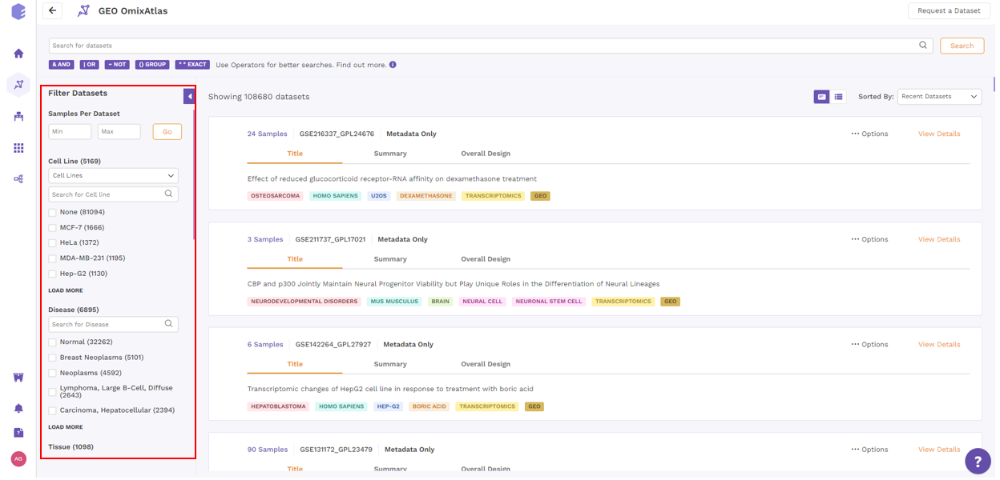
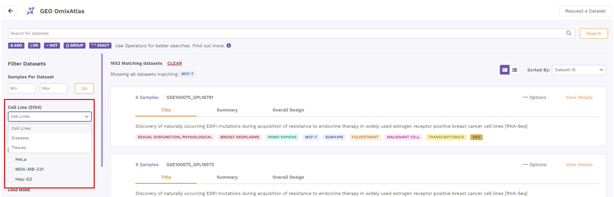
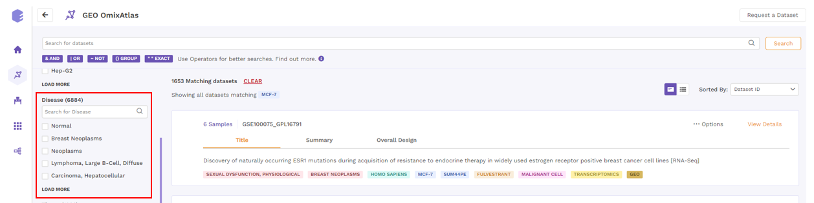
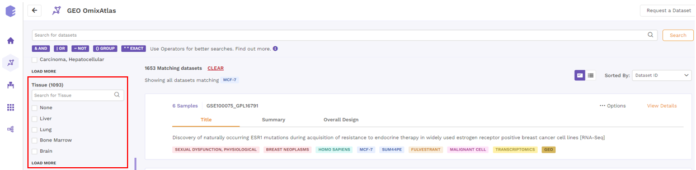
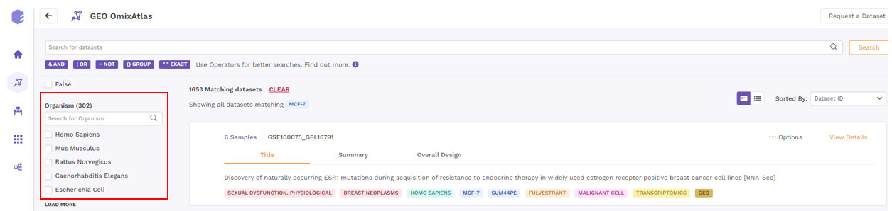
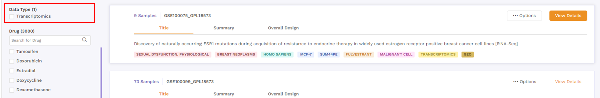
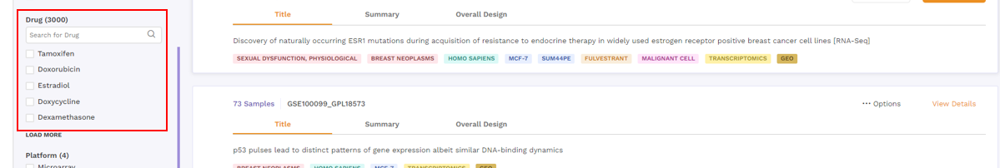
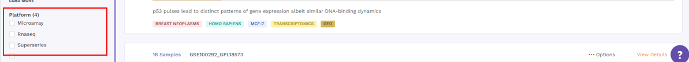

How to filter Datasets?
-----------------------

After shortlisting the datasets using a search bar, users can further find the desired datasets using the 'Filter Datasets' function on the left. The total number of datasets related to a filter can be seen in the brackets next to it. These filters are configurable and may be different for different OmixAtlasses.
 

For a standard OmixAtlas, following filters are available:

- Cell Line

Users can filter datasets by searching for desired cell lines using following three options from a drop down menu -

- Cell lines
- Disease cell line
- Tissue specific cell line

If users choose a disease, cell lines related to that disease are shown and not the disease itself.

- Disease

Users can filter the datasets by selecting the disease of interest.

- Tissue

Users can filter the datasets by selecting the tissue of interest.

- Organism

Users can filter the datasets by selecting the organism of interest.

- Data Type

Users can filter the datasets by selecting the data type.

- Drug

Users can filter the datasets by selecting the drug of interest.

- Platform

Users can filter the datasets by selecting the platform.

