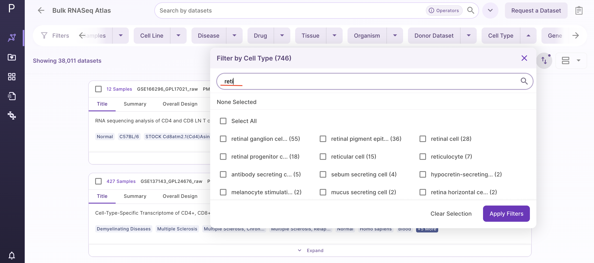

# Filter Desired Datasets

After shortlisting the datasets using a search bar, users can further find the desired datasets using the 'Filter Datasets' function present on the above. These filters are configurable and may be different for different Atlases.
 

For a standard Atlas, following filters are available:

- Cell Line

Users can filter datasets by searching for desired cell lines using following three options from a drop down menu -

- Cell lines
- Disease cell line
- Tissue specific cell line

If users choose a disease, cell lines related to that disease are shown and not the disease itself.

- Disease

Users can filter the datasets by selecting the disease of interest.

- Tissue

Users can filter the datasets by selecting the tissue of interest.

- Organism

Users can filter the datasets by selecting the organism of interest.

- Drug

Users can filter the datasets by selecting the drug of interest.

- Platform

Users can filter the datasets by selecting the platform.

# Ontology-Based Recommendations

Ontology-based filters improve search by using standardized terms. Users can specify their search criteria by selecting relevant ontology terms corresponding to their area of interest. Users will receive exact matches or related recommendations by searching for cell lines, diseases, and tissues. For instance, users can input the name of a specific cell type and retrieve corresponding datasets.

Currently, the platform supports ontology-based recommendations for four key fields: cell lines, diseases, tissues, and cell types (for single-cell data). 

It employs standardized terms sourced from established ontologies to ensure consistency and accuracy in search results. For diseases, the Medical Subject Headings (MeSH) ontology is utilized, while the Biological Resources for ANimal and Human Health (BRENDA) ontology is employed for tissues. 

Users can explore a curated list of recommendations tailored to their search parameters. These recommendations includes relevant datasets of diseases, cell lines, tissues, or cell types based on the ontology-based filtering criteria.

Users can perform ontology-based searches for cell lines and refine them using specific options related to cell lines, diseases, and tissues. Similarly, can perform for disease, tissue and cell type.

  
 Cell Lines

  
 Disease

  
 Tissue

  
 Cell Type

