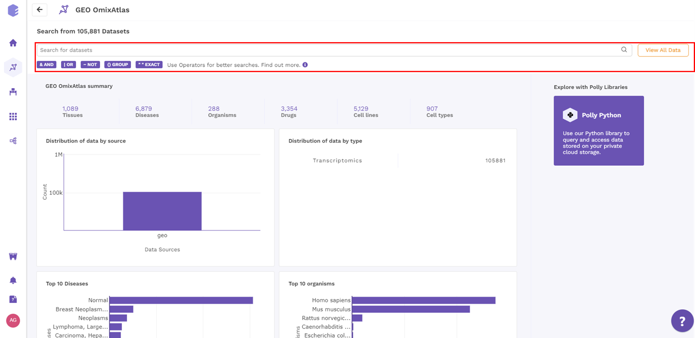
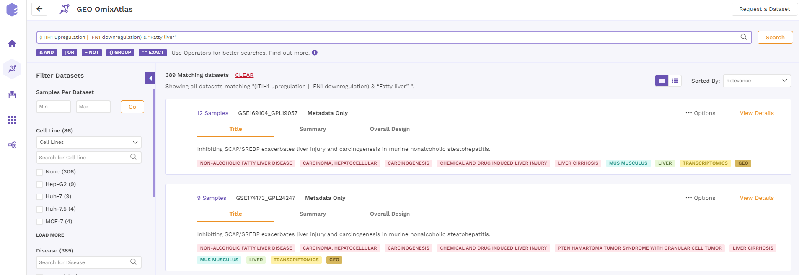
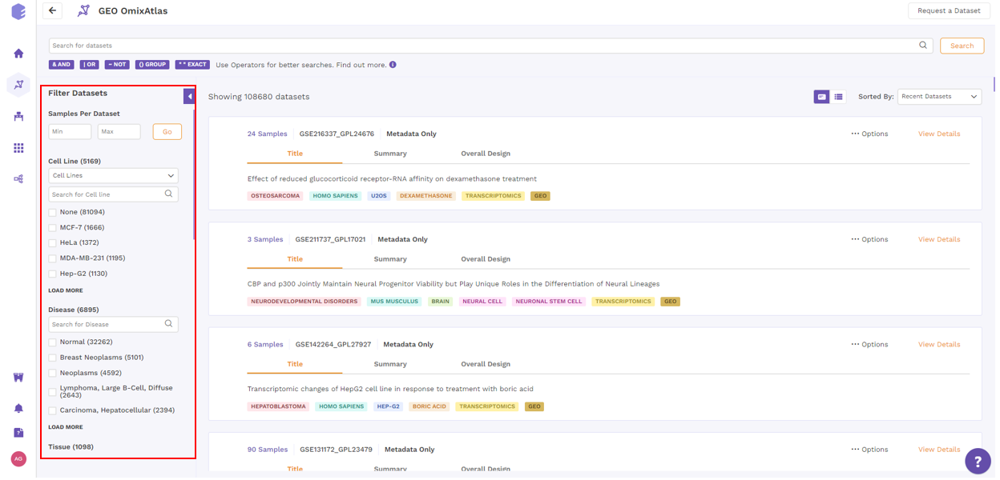
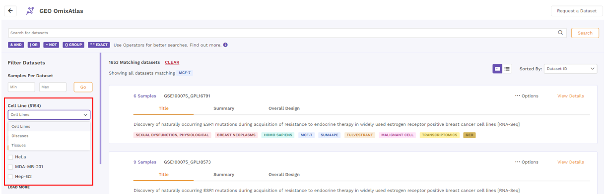
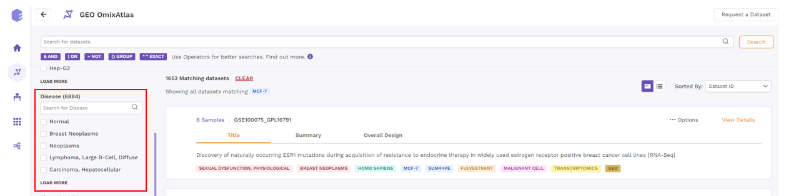
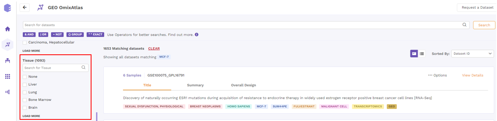
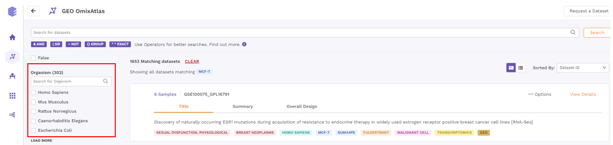
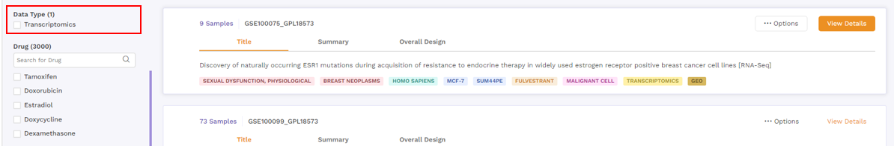
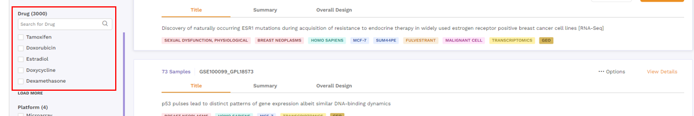

# 1. How to find datasets?

## 1.1 Search based on operator hints

 
**Figure 1.** Search Bar

This search bar is driven by Elasticsearch where users can search for keywords which are present across:

- Source metadata fields such as title, description and overall design and
- Curated metadata fields such as tissue, drug, cell line, cell type, disease, organism, gene, gene modification and dataset id.

It allows fuzzy search as well. For example, "transcriptomics" in the search keyword will show results for "transcriptome" or "transcript" as well.

This search bar supports the following operations to help users with some advanced operations such as AND (&), OR (|), NOT (~), EXACT ("text")

While parsing the search keyword, the algorithm assigns the following priority for different operators:- Brackets () \> AND (&) \> OR (|) \> NOT (~)

- Use brackets ( ) to ensure the operators in your query get executed in the exact order you want.
- term1 & term2 | term3 can be executed in two ways:

(term1 & term2) | term3 or term1 & (term2 | term3)

Using one of the above two will help remove ambiguity.

● Use exact matches " " to do stricter spelling matches with search keywords

○ Eg. transcriptome vs "transcriptome"

The former will match the word "transcriptome" & also words closer to

it such as "transcriptomics" or "transcript", whereas

The latter would only match the exactly spelled word "transcriptome"

○ Eg. renal cancer vs "renal cancer"

The former will behave same as (renal | cancer) with a slight difference:

● (renal | cancer) can match a dataset containing "renal" & "cancer" in any single field or even different fields

● renal cancer will return those datasets at top which contain both "renal" & "cancer" in the same field, followed by the ones which contain only one of these words in any single field.

The latter would only match a dataset with a field containing exact word

"renal" followed by the exact word "cancer", in the same order.

● Use operator NOT ~ to exclude unwanted results from your search

○ Eg. (HCC & Hepatocellular carcinoma) ~ "radiotherapy"

The above search would match datasets which contains both "hcc" and at least one of the words ("hepatocellular"or "carcinoma").

Out of those, ignore the datasets containing the word "radiotherapy".

Some of the Search examples are as follows:-

- (ITIH1 upregulation | FN1 downregulation) & "Fatty liver"

 
**Figure 2.** Example 1

- (Hepatocellular carcinoma | HCC) ~ Radiotherapy

 
**Figure 3.** Example 2

- CDK7 & "CBM signaling pathway" & inhibition

 
**Figure 4.** Example 3

- (somatic mutation) & (hepatocellular | renal) & (cancer | carcinoma)

 
**Figure 5.** Example 4

## 1.2 Search and Filter based on Ontology

After shortlisting the datasets using a search bar, users can further find the desired datasets using the Filter Datasets function on the left. The total number of datasets related to a filter can be seen in the brackets next to it. These filters are configurable and may be different for different OmixAtlasses.

 
**Figure 6.** Filtering Datasets

For a standard OmixAtlas, following filters are available

- Cell Line

Users can filter datasets by searching for desired cell lines using following three options from a drop down menu -

- Cell lines
- Disease cell line
- Tissue specific cell line

If users choose disease, cell lines related to those diseases are shown and not the disease itself.

 
**Figure 7.** Filter by Cell Line

- Disease

Users can filter the datasets by selecting the disease of interest.

 
**Figure 8.** Filter by Disease

- Tissue

Users can filter the datasets by selecting the tissue of interest.

 
**Figure 9.** Filter by Tissue

- Organism

Users can filter the datasets by selecting the organism of interest.

 
**Figure 10.** Filter by Organism

- Data Type

Users can filter the datasets by selecting the data type.

 
**Figure 11.** Filter by Data Type

- Drug

Users can filter the datasets by selecting the drug of interest.

 
**Figure 12.** Filter by Drug

- Platform

Users can filter the datasets by selecting the platform.

 
**Figure 13.** Filter by Platform

