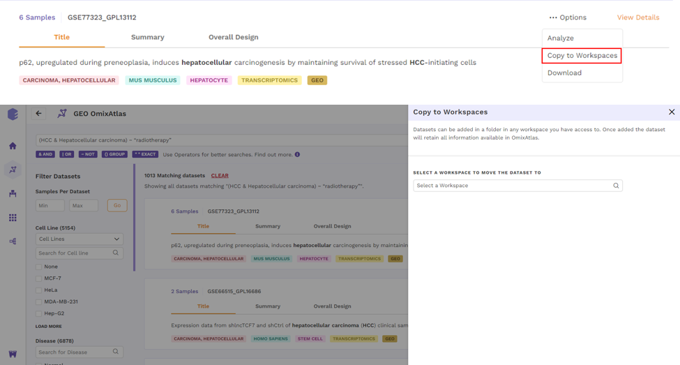
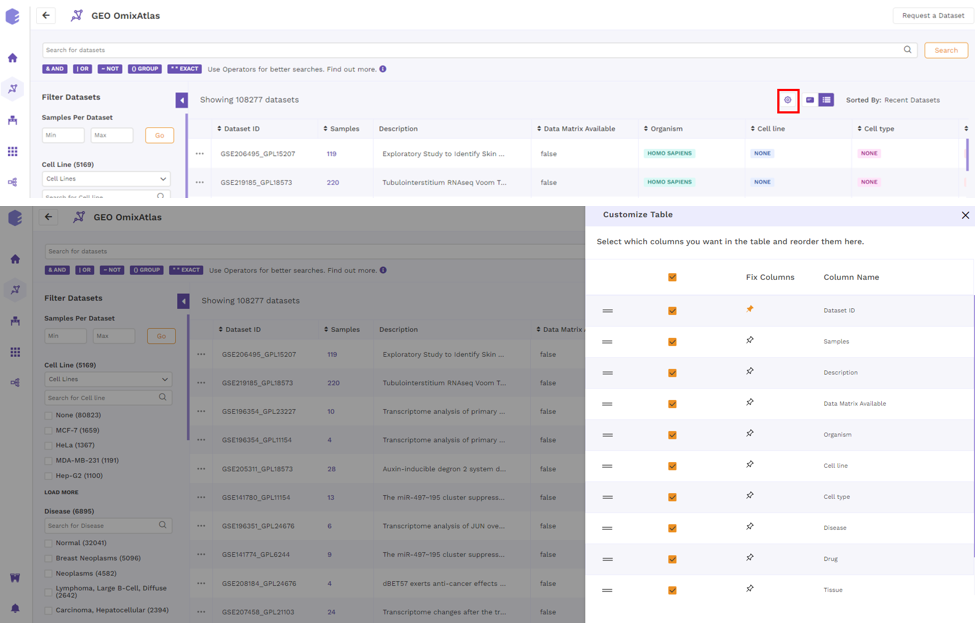
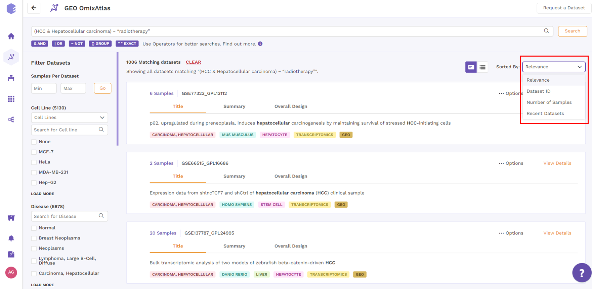

# OmixAtlas Dashboard

The OmixAtlas landing page offers OmixAtlases under two different sections - Public Data Atlases and User Data Atlases.

Under public data atlases, there are two source atlases: Bulk RNA-seq and single-cell RNA-seq OmixAtlas. User Data Atlases contain destination atlas and enterprise OmixAtlas.

 
 OmixAtlas Homepage

## View All Data

Users can view datasets in either the **Card view** or the **Table view** formats.

### Card View

Datasets are organized as a list of horizontal cards in this view. Each card includes a description of the dataset, followed by colored metadata tags that specify the dataset's properties. Annotations supported by ontologies such as organism, disease, tissue, drug, cell type, and cell line are included in the metadata information. All of the datasets that are queryable and searchable on an OmixAtlas can be seen in card view at one glance. The search bar can be used to search for keywords that are present across source metadata (title, description, etc.) and curated metadata (such as drug, tissue, cell type, etc.). The search results can be narrowed down using the dynamic filtering options on the left side.

 
Card View (A - Request a Dataset, B - Search Bar, C - Filter options, D - Collapsable filter, E - Switch between Card View and Table View, F - Sorting Function)

#### Datasets under card view

The individual dataset under card view consists of the following -

a. Title: This describes the title of the study the dataset is taken from.

 
 Dataset Title

b. Summary: This section provides a summary of the publication. Users can click on the 'more' function to check the full summary.

 
 Dataset Summary

c. Overall Design: This section describes the study design and methodology taken from the publication. Users can click on the 'more' function to check the full study design.

 
 Overall Design

d. Abstract: This section provides the abstract directly from the publication. Users can click on the 'more' function to check the full abstract.

 
 Abstract

#### Options under card view

There is an Options function on the top right under the individual card containing the dataset.

 
 Options under Card View

Upon clicking, users can choose from the following -

- Analyze - upon choosing 'analyze'; there will be options to open the dataset using different applications to analyze the dataset.

 
Analyze function under Card View

- Copy to Workspaces - Users can copy the dataset to the desired workspace.

 
Copy to Workspaces Function under Card View

- View Report - Users can view the reports attached to the dataset.

 
View Report

- Download - Users can download the dataset in case they want to analyze it using a different application.

 
Download Function under Card View

### Table View

On the OmixAtlas interface, the results are arranged in a table view with columns representing the metadata fields. Users can sort through the metadata fields, including the dataset id, sample count, description, drugs, cell type, cell line, disease, and more. The results show up in order of relevance to their search query. Alongside the column header is a sorting function that allows the user to see the results of sorting in either ascending or descending order.

By clicking the "Gear" icon and choosing the necessary columns, users can alter the columns in a table. Additionally, users can adjust columns by selecting the "Pin" icon. 

 
 Customizable Table

### Color Codes

Each curated dataset in OmixAtlas is curated into different fields that are color-coded for easy identification. Following are the color codes decoded -

- Pink - Disease
- Turquoise - Organism
- Purple - Cell Type
- Blue - Cell Line
- Orange - Drug
- Green - Tissue
- Yellow - Data Type
- Mustard - Source

## Sorting Data

### Card view

From the top right drop-down menu in the card view, datasets can be sorted by Relevance, Dataset ID, Number of Samples, and Recent Datasets.

 
**Figure 12.** Sorting Function under Card View

### Table View

Datasets in the table view can be sorted using the sorting function next to the column header to see the results in either ascending or descending order.

 
 Sorting using Column Header

## Request a dataset

If the dataset is not present, users can request a dataset to be added to OmixAtlas by going to the 'Request a Dataset' function on the top right of the OmixAtlas summary page. Users need to fill out a short form to request a dataset that needs to be added.

 
 Request a Dataset

## Downloading DE data from Phantasus

After analyzing the dataset using Phantasus, users can now download DE files in GCT format in the destination atlas. This feature is not provided in the source atlas.
