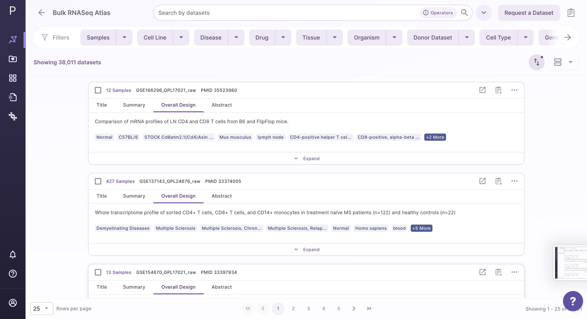
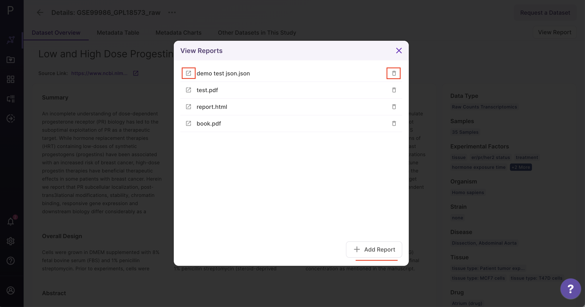
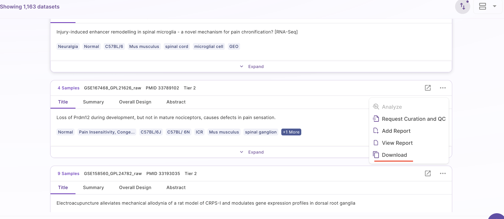

# Overview of the Atlas

The Atlas landing page offers Atlases under two different sections - Public Data Atlases and User Data Atlases.

Under public data atlases, there are two source atlases: Bulk RNA-seq and single-cell RNA-seq Atlas. User Data Atlases contain destination atlas and enterprise Atlas.

 
 Atlas Homepage

## View Data

Users can view datasets in either the **Card view** or the **Table view** formats. The **Summary view** is used to display overall statistics of the atlas.

### Card View

Datasets are organized as a list of horizontal cards in this view and each card includes a description of the dataset. Annotations supported by ontologies such as organism, disease, tissue, drug, cell type, and cell line are included in the metadata information. All of the datasets that are queryable and searchable on an Atlas can be seen in card view at one glance. The search bar can be used to search for keywords that are present across source metadata (title, description, etc.) and curated metadata (such as drug, tissue, cell type, etc.). The search results can be narrowed down using the dynamic filtering options on the left side.

 
Card View (A - Request a Dataset, B - Search Bar, C - Filter options, D - Collapsable filter, E - Switch between Card View and Table View, F - Sorting Function)

#### Datasets under card view

The individual dataset under card view consists of the following -

a. Title: This describes the title of the study the dataset is taken from.

  
 Dataset Title

b. Summary: This section provides a summary of the publication. Users can click on the 'more' function to check the full summary.

  
 Dataset Summary

c. Overall Design: This section describes the study design and methodology taken from the publication. Users can click on the 'more' function to check the full study design.

 
 Overall Design

d. Abstract: This section provides the abstract directly from the publication. Users can click on the 'more' function to check the full abstract.

 
 Abstract

e. Sorting:

From the top right drop-down menu in the card view, datasets can be sorted by Dataset ID, Number of Samples, and Recent Datasets.

 
 Sorting Function under Card View

#### Options under card view

There is an Options function on the top right under the individual card containing the dataset.

 
 Options under Card View

Upon clicking, users can choose from the following -

- Analyze - upon choosing 'analyze'; there will be options to open the dataset using different applications to analyze the dataset.

 
 
Analyze function under Card View

- View Report - Users can view the reports attached to the dataset.

 
View Report

- Add Report - Users can add files and folders into the workspace.

 
Add Report

- Download - Users can download the dataset in case they want to analyze it using a different application.

 
Download Function under Card View

### Table View

On the Atlas interface, the results are arranged in a table view with columns representing the metadata fields. Users can sort through the metadata fields, including the dataset id, sample count, description, drugs, cell type, cell line, disease, and more. The results show up in order of relevance to their search query. Alongside the column header is a sorting function that allows the user to see the results of sorting in either ascending or descending order.

#### Options under Table View

Manage Table

Users can customize the table by clicking the 'Manage table' option in the middle panel. This opens a table editor that allows users to select which columns they want to display in the table or hide based on their preference. Users can select or deselect desired columns within the table and save their changes. Only the selected columns will appear in the table after saving. Users can navigate to other curated information using the right arrow key on the keyboard.

Sorting

Datasets in the table view can be sorted using the sorting function next to the column header to see the results in either ascending or descending order.

 
 Sorting using Column Header

## Summary View

In the summary view, users cannot perform searches, but they can use three filters to explore the overall statistics of the atlas. This includes details such as the total number of datasets, diseases, tissues, organisms, cell types, and samples. Users can use the disease, organism, and tissue filters to compare different aspects. Additionally, the summary view presents the top 10 distributions of diseases, tissues, and cell types for easy reference.

 
 Overview of the Atlas 

 
 Using disease filter for summary view 

## Request a dataset

If the dataset is not present, users can request a dataset to be added to Atlas by going to the 'Request a Dataset' function on the top right of the Atlas summary page. Users need to fill out a short form to request a dataset that needs to be added.

 
 Request a Dataset

