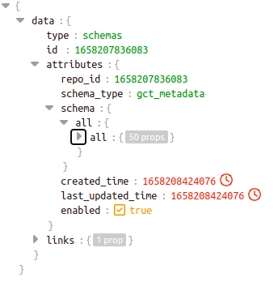
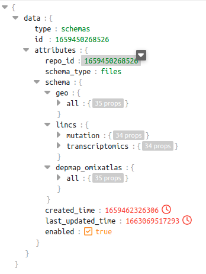

## About Polly Library
Polly Libraries give access to the various capabilities on Polly like ingesting, querying, filtering, downloading and creating cohorts for the data on OmixAtlas. It allows access to data in OmixAtlas over any computational platform (like DataBricks, SageMaker, Polly, etc.) of your choice. These functionalities can be accessed through functions in python and [bash](https://docs.elucidata.io/Scaling%20compute/Polly%20CLI%201.html) which can be used over a Terminal.

## About Polly Python
Polly Python library provides convenient access to the above-mentioned functionalities through function in Python language. A snapshot of it's capabilities as per release v0.1.6 is shown in the image below.


## 1 Installation
### 1.1 Install Polly Python using pip

<pre><code>pip install polly-python</code></pre>

## 2 Getting started
### 2.1 Import from libraries

The following libraries need to be imported over the development environment to access the data.

<pre><code>from polly.auth import Polly
from polly.omixatlas import OmixAtlas
from polly.workspaces import Workspaces
from polly.cohort import Cohort</code></pre>

## 3 Authentication
Authentication of the account is required to be able to access the capabilities of the Polly Python library.

### 3.1 Copying authentication token or key
To get this token, follow the steps below:

1. Go to [Polly](https://polly.elucidata.io)<br>

2. Click the **User Options** icon from the left-most panel<br>

3. Click on **Authentication** on the panel that appears<br>

4. Click on **Copy** to copy the authentication token or key<br>

### 3.2 Using the token
The following code is required to add the authentication function in the Polly Python library

<pre><code>AUTH_TOKEN = "[authentication_token_copied]"
Polly.auth(AUTH_TOKEN)</code></pre>

### 3.3 Using the key
Go to authentication keys and input the name, description to generate a key. This can be copied and used as shown below:-

<pre><code>AUTH_KEY = "[authentication_key_copied]"
Polly.auth(AUTH_KEY)</code></pre>

## 4 Accessing data in OmixAtlas
### 4.1 Calling a function
In order to call a functions from a particular class, corresponding object should be defined. 

E.g. for functions related to OmixAtlas, 
<pre><code>omixatlas = OmixAtlas()
output = omixatlas.[function()]</code></pre>
Similarly, for functions related to Workspaces, 
<pre><code>workspaces = Workspaces()
output = workspaces.[function()]</code></pre>
And, for functions related to Cohorts, 
<pre><code>cohort = Cohort()
output = cohort.[function()]</code></pre>

The output of the functions is in JSON and/or data frame formats. You can print/download this output.

### 4.2 Functions in Polly Python


#### 4.2.1 Summary of Omixatlases

##### 4.2.1.1 Get details of all OmixAtlases
The following function details all the OmixAtlases accessible by you.

<pre><code>omixatlas.get_all_omixatlas() </code></pre>

The output of this function would be JSON containing
<pre><code>{'data':
[
{
  "repo_name": "geo",
  "repo_id": "9",
  "indexes": {
    "gct_metadata": "geo_gct_metadata",
    "h5ad_metadata": "geo_h5ad_metadata",
    "csv": "geo_csv",
    "files": "geo_files",
    "ipynb": "geo_ipynb",
    "gct_data": "geo_gct_data",
    "h5ad_data": "geo_h5ad_data"
  },
  "v2_indexes": {
    "csv": "geo_csv",
    "files": "geo_files",
    "gct_col_metadata": "geo_gct_col_metadata",
    "gct_row_metadata": "geo_gct_row_metadata",
    "h5ad_col_metadata": "geo_h5ad_col_metadata",
    "h5ad_row_metadata": "geo_h5ad_row_metadata",
    "ipynb": "geo_ipynb",
    "json": "geo_json"
  },
  "sources": [
    {
      "geo": 98902
    }
  ],
  "datatypes": [
    {
      "transcriptomics": 98863
    },
    {
      "raw counts transcriptomics": 38
    }
  ],
  "dataset_count": 98902,
  "disease_count": 3760,
  "tissue_count": 1078,
  "organism_count": 317,
  "cell_line_count": 4492,
  "cell_type_count": 904,
  "drug_count": 1394,
  "data_type_count": 2,
  "data_source_count": 1,
  "sample_count": 2286352,
  "normal_sample_count": 1575120
}
    {...},
    {...}
]
}</code></pre>

##### 4.2.1.2 Get summary of an OmixAtlas
The following function details a particular OmixAtlas. The **repo_name/repo_id** of this OmixAtlas can be identified by calling the <code>get_all_omixatlas()</code> function.

<pre><code>omixatlas.omixatlas_summary("[repo_id OR repo_name]")</code></pre>
The output of this function would be JSON containing

<pre><code>
{
  "data": {
    "repo_name": "tcga",
    "repo_id": "15",
    "indexes": {
      "gct_metadata": "tcga_gct_metadata",
      "h5ad_metadata": "tcga_h5ad_metadata",
      "csv": "tcga_csv",
      "files": "tcga_files",
      "ipynb": "tcga_ipynb",
      "gct_data": "tcga_gct_data",
      "h5ad_data": "tcga_h5ad_data"
    },
    "v2_indexes": {
      "csv": "tcga_csv",
      "files": "tcga_files",
      "gct_col_metadata": "tcga_gct_col_metadata",
      "gct_row_metadata": "tcga_gct_row_metadata",
      "h5ad_col_metadata": "tcga_h5ad_col_metadata",
      "h5ad_row_metadata": "tcga_h5ad_row_metadata",
      "ipynb": "tcga_ipynb",
      "json": "tcga_json"
    },
    "sources": [
      {
        "tcga": 55062
      }
    ],
    "datatypes": [
      {
        "transcriptomics": 11093
      },
      {
        "mirna": 10468
      },
      {
        "copy number variation": 10411
      },
      {
        "mutation": 8810
      },
      {
        "methylation": 8027
      },
      {
        "proteomics": 6253
      }
    ],
    "dataset_count": 55062,
    "disease_count": 34,
    "tissue_count": 58,
    "organism_count": 1,
    "cell_line_count": 0,
    "cell_type_count": 0,
    "drug_count": 812,
    "data_type_count": 6,
    "data_source_count": 1,
    "sample_count": 47143,
    "normal_sample_count": 0
  }
}
</code></pre>

#### 4.2.2 Create and update an Omixatlas

##### 4.2.2.1 Create an Omixatlas
Data-admins can create an Omixatlas using polly-python. The function create takes in four parameters as described below.
<pre><code>from polly.omixatlas import OmixAtlas
omixatlas = OmixAtlas()
new_repo = omixatlas.create("[display_name]", "[description]", 
                          repo_name ="[repo_name]" (optional), 
                          image_url = "[image_url]" (optional))</code></pre>

Constraints on the parameters:-

`display_name` (str) Alphanumeric characters are allowed and the length constraint is between 1 to 30 characters.

`description` (str) All characters are allowed and the length constraint is between 1 to 100 characters.

`image_url` (str) Users can also enter the path of image_url that they want to showcase on the newly created Omixatlas tile. If the image_url is not provided then the system puts up a default image on the tile of the newly created Omixatlas. [example_image](https://elucidatainc.github.io/PublicAssets/discover-fe-assets/omixatlas_hex.svg)

`repo_name` (str) Lowercase alphanumeric characters (separated by _) is allowed and between 1 to 30 characters.

##### 4.2.2.2 Update an Omixatlas
Data-admin can update the following metadata of an Omixatlas:-

a. Metadata for an existing Omixatlas. The attributes that can be updated are display_name, description, and image_url.

b. Adding components(i.e. Apps, Python Notebooks) to an existing Omixatlas.

<pre><code>from polly.omixatlas import OmixAtlas
omixatlas = OmixAtlas()
omixatlas.update(repo_key, display_name = <Updated display_name string>, description = <Updated description string>,)
                image_url = <image_url string>, components = [component_1])
                
component_1 = {"data_type":["string"], "component_id":integer}
// example:- component_1 = {"data_type":["Transcriptomics"], "component_id":78}</code></pre>

`repo_key` (str or int) Repository ID or repository name of the OmixAtlas 

`display_name` (str) The name to be displayed on the front-end

`description` (str) Description for the OmixAtlas

`image_url` (str) The logo of the OmixAtlas as shown on the front-end. The link provided here should be hosted on a public domain.

`components` Application or notebooks which should be linked with given data types of an OmixAtlas

Constraints on components: Components will be a dictionary that will have two mandatory key-value pairs that are data_type and component_id.

#### 4.2.3 Querying the data and the metadata
To access, filter, and search through the metadata schema, the function mentioned below can be used:

<pre><code>omixatlas.query_metadata("[query_written_in_SQL]") </code></pre>
Refer to the Queries section to understand how you could write a query in SQL. The columns returned would depend on the query that was written. The output of the function is a dataframe or a JSON depending on the operations used in the query. Some query examples in GEO OmixAtlas is shown in this [github page](https://github.com/ElucidataInc/polly-python/blob/main/Discover/polly_python_query_examples.ipynb).

##### 4.2.3.1 Ontological recommendations integrated with querying
Ontology recommendation functionality for disease and tissue are added in Polly-Python. For disease the recommendations are derived from MeSH ontology and for tissue we're using Brenda Tissue Ontology (BTO).

In the existing SQL query itslef, the users would now be able to call a function - 'recommend' on disease and tissue column of metadata to get recommendations.

Usage of 'recommend' function -
```
recommend(field_name, search_term, key - ['match' | 'related'])
```
`field_name`: It can take value: curated_disease, curated_tissue for disease and tissue respectively.

`search_term`: Disease or tissue terms for which recommendations are required.

`key`: Can be "match" which fetches only the terms that have an exact match with the search_term OR "related" which fetches the list of expanded terms synonyms, hypernyms along with match results for the search_term. 

Example:-
```
sql_query = """SELECT dataset_id, curated_disease, curated_tissue FROM geo.datasets WHERE 
        CONTAINS(curated_disease, recommend('curated_disease', 'breast neoplasms', 'related')) AND 
        CONTAINS(curated_tissue, recommend('curated_tissue', 'breast', 'related'))""" 
result = omixatlas.query_metadata(sql_query)
```
For more details and examplpes, please check this [notebook](https://github.com/ElucidataInc/polly-python/blob/main/Discover/ontology_recommendation_disease_tissue.ipynb) 

#### 4.2.4 Downloading any dataset
To download any dataset, the following function can be used to get the signed URL of the dataset.

<pre><code>omixatlas.download_data("repo_key", "[dataset_id]")</code></pre>

`repo_key` (str) repo_id OR repo_name from where the data needs to be downloaded.

`dataset_id` (str) dataset_id which the user wants to download.

The <code>[repo_name OR repo_id]</code> of an OmixAtlas can be identified by calling the <code>get_all_omixatlas()</code> function. The <code>[dataset_id]</code> can be obtained by querying the metadata at the dataset level using <code>query_metadata("[query written in SQL]")</code>.

The output of this function is a *signed URL*. The data can be downloaded by clicking on this URL.

> **_NOTE:_** This signed URL expires after 60 minutes from when it is generated.

<br>The output data is in gct/h5ad/vcf/mmcif format. This data can be parsed into a data frame for better accessibility using the following code:

##### 4.2.4.1 Downloading .gct and opening it in a data frame
<pre><code>dataset_id = "GSE100003_GPL15207" #dataset which user wants to download.
repo_key = 9 OR "geo" #repo_id OR repo_name from which dataset should be downloaded from.
file_name = f"{dataset_id}.gct"
data = client.download_data(repo_key, dataset_id)
url = data.get('data').get('attributes').get('download_url')
status = os.system(f"wget -O '{file_name}' '{url}'")
if status == 0:
    print("Downloaded data successfully")
else:
    raise Exception("Download not successful")
</code></pre>

In order to parse the .gct data, a python package called cmapPy can be used in the following manner.

<pre><code>import pandas as pd
import cmapPy
from cmapPy.pandasGEXpress.parse_gct import parse

gct_obj = parse(file_name) # Parse the file to create a gct object
df_real = gct_obj.data_df # Extract the dataframe from the gct object
col_metadata = gct_obj.col_metadata_df # Extract the column metadata from the gct object
row_metadata = gct_obj.row_metadata_df # Extract the row metadata from the gct object
</code></pre>

##### 4.2.4.2 Downloading .h5ad file and opening it in a data frame
<pre><code>dataset_id = "GSE121001_GPL19057" #dataset which user wants to download.
repo_key = 17 OR "sc_data_lake" #repo_id OR repo_name from which dataset should be downloaded from.
file_name = f"{dataset_id}.h5ad"
data = client.download_data(repo_key, dataset_id)
url = data.get('data').get('attributes').get('download_url')
status = os.system(f"wget -O '{file_name}' '{url}'")
if status == 0:
    print("Downloaded data successfully")
else:
    raise Exception("Download not successful")
</code></pre>

In order to parse the .h5ad data, a python package called scanpy can be used in the following manner.

<pre><code>import pandas as pd
import scanpy
data = sc.read_h5ad(file_name)
obs = data.obs.head()
var = data.var.head()
</code></pre>

In order to get started with analysis of single cell data on Polly, users can refer to this [notebook](https://github.com/ElucidataInc/polly-python/blob/main/consumption_starter_notebooks/SingleCell-polly-python.ipynb) hosted on our github.

##### 4.2.4.3 Downloading vcf files
<pre><code>dataset_id = "gnomad_v2.1.1_genome_TP53" #dataset which user wants to download.
repo_key = 1628836648493 OR "gnomad" #repo_id OR repo_name from which dataset should be downloaded from.
file_name = f"{dataset_id}.vcf"
data = client.download_data(repo_key, dataset_id)
url = data.get('data').get('attributes').get('download_url')
status = os.system(f"wget -O '{file_name}' '{url}'")
if status == 0:
    print("Downloaded data successfully")
else:
    raise Exception("Download not successful")</code></pre>

The downloaded vcf file can be further analysed using the docker environment containing Hail package on Polly.

#### 4.2.5 Working with workspaces
Polly python enables the users to connect OmixAtlas with Workspaces. Currently, there are two functions to create a new workspaces and listing the existing workspaces. The following library needs to be imported for users to work with workspaces.

```
from polly.workspaces import Workspaces
```

##### 4.2.5.1 Creating a new workspace
Use `create_workspace` to create a new workspace with desired name
```
workspaces.create_workspace("name_of_workspace")
```
##### 4.2.5.2 Fetching existing workspaces
Use `fetch_my_workspaces()` to fetch existing workspaces
```
workspaces.fetch_my_workspaces()
```  
##### 4.2.5.3 Upload files and folders to workspaces
Use `upload_to_workspaces(workspace_id, workspace_path, local_path)` to upload files or folder to a workspace
```
workspaces.upload_to_workspaces(workspace_id = int, workspace_path = str, local_path = str)
```
##### 4.2.5.4 Download files and folders from workspaces
Use `download_from_workspaces(workspace_id, workspace_path)` to download files or folder from a workspace
```
workspaces.download_to_workspaces(workspace_id = int, workspace_path = str)
```
##### 4.2.5.5 Save dataset from OmixAtlas to workspace
Use `save_to_workspace(repo_id, dataset_id, workspace_id, workspace_path)` to save datasets from an OmixAtlas to a workspace

Example to save the dataset_id 'GSE101127_GPL1355' from repo_id 1615965444377 to a workspace_id 8025 in a folder named 'data'
```
omixatlas.save_to_workspace('1615965444377', 'GSE101127_GPL1355', 8025, 'data')
```
##### 4.2.5.6 Copy data from one workspace to another
This function enables user to create a copy of a file or folder contained in a workspace. The copy of the file/folder gets created in the specified destination workspace.

```
from polly.workspaces import Workspaces
workspaces = Workspaces(token)

workspaces.create_copy(source_id, source_path, destination_id, destination_path)
```
`source_id`(int) : workspace id of the source workspace where the file/folder exists.

`source_path` (str): file/folder path on the source workspace to be copied.

`destination_id`(int) : workspace id of the destination workspace where the file/folder is to be copied.

`destination_path` (str):optional parameter to specify the destination path.

#### 4.2.6 Working with data schema

##### 4.2.6.1 Introduction of Data Schema
The data available within OmixAtlas is curated within 5 indexes/tables on the basis of the information it contains. These five indexes are:

***Dataset level metadata for all datatypes (index: files)***: Contains curated fields like drug, disease, tissue organism, etc for each dataset.

***Sample level metadata for gct files (index: gct_metadata)***: As the name suggests, this contains sample level metadata information for all samples except single-cell samples. It contains curated fields like cell lines, experimental design, etc for each sample except single-cell samples.

***Sample level metadata for h5ad files (index: h5ad_metadata)***: This table only contains metadata information for single-cell samples. It contains curated fields like cell line, gene counts, UMI counts for each sample.

***Feature level metadata for gct files (index: gct_row_metadata)***: This table contains feature level metadata information for all data except single-cell.  It contains the gene/molecule symbol along with the feature intensity for each sample.

***Feature level metadata for h5ad files (index: h5ad_data)***: This table contains feature level metadata information for all single-cell data.  It contains the gene/molecule symbol studied in an experiment along with the cell type and expression value.

***Variant related metadata in vcf files (index: variant_data)***: This table contains the schema for variant related information present in vcf files.

To find relevant information that can be used for querying, refer the curated data schema [here](https://docs.elucidata.io/OmixAtlas/Data%20Schema.html).

##### 4.2.6.2 What is controlled by the schema of an OmixAtlas?

- Only the fields included in the schema will be available for querying using polly-python.
- Fields available in the filter panels and size of filters displayed in the front-end.
- Fields available in the table view of an OmixAtlas.
- Fields which are of array type. Based on this property, the type of SQL query for that field will vary.
- Fields which are curated by Elucidata.
- Display name and description for each field.
- Enabling ontology recommendations in the filter panel.

##### **4.2.6.3 Name of schema types to be used which defining the schema**

- Dataset-level:
  - for all file types, files
- Sample-level:
  - for gct files: gct\_metadata
  - for h5ad files:h5ad\_metadata
  - for biom files: biom\_col\_metadata
- Feature-level:
  - for gct files,gct\_row\_metadata
  - for h5ad files,h5ad\_data
  - for biom: biom\_row\_metadata
- Variant data
  - for vcf files: vcf\_variant\_data
  - for vcf.bgz files: vcf\_variant\_data

##### **4.2.6.4 Attributes of the schema**

| **Field Attribute** | **Description** | **Input** | **Conditions** |
| --- | --- | --- | --- |
| field\_name | This is the field name that'll be used for querying on polly-python | string |1. Lowercase only <br> 2. Start with alphabets<br>3. Cannot include special characters except `_`<br>4. Cannot be longer than 255 characters<br>5. Cannot be reserved SQL keywords<ul><li>[Reserved DDL keywords](https://docs.aws.amazon.com/athena/latest/ug/reserved-words.html#list-of-ddl-reserved-words)</li><li>[Reserved DML keywords](https://docs.aws.amazon.com/athena/latest/ug/reserved-words.html#list-of-reserved-words-sql-select)</li></ul> 6. Only Plain ASCII is recommended to avoid subtle irritations (accents vs unaccented characters, etc)|
| original\_name | This is the attribute that needs to be matched with the dataset metadata in JSON file or sample/feature metadata field name in gct/h5ad file | string | Should match with data present in json, gct or h5ad filesmin\_length=1, max\_length=50 |
| type | What kind of data do you want to store in this field, this will affect what kind of queries you'll be able to perform in this field. | text<br>integer<br>object<br>boolean<br>float | |
| is\_keyword | Whether to store this field as a keyword in Elasticsearch. It must be 1 if need to show it as a filter on GUI or use this field for any aggregations.<br><br>Keyword fields can be used for sorting, aggregations, and term-level (exact match) queries on the frontend.<br><br>If your field is not a keyword, it will not be possible to sort your data based on that value (if/when frontend supports it).<br><br>If your field is not a keyword, it will not be possible to get the number of unique values of that field, or get the most frequently occurring values of that field. | boolean | |
| is\_array | Whether this field would be a list of values | boolean | |
| is\_filter | Whether to show this field as filter on GUI. | boolean | For these fields, is\_keyword must be 1. |
| is\_column | Whether to show this field in GUI Table as a column. | boolean | |
| is\_curated | Whether this field has been curated by Elucidata. | boolean | |
| filter\_size | This specifies maximum values for a filter you want to show on GUI. is\_filter and is\_keyword should be set as 1 | integer | Lower limit: 1 and Upper limit: 3000 |
| display\_name | User-friendly name to be shown on front-end | string | min\_length=1, max\_length=50 |
| description | Any information about the field you want to show to the User. | string | min\_length=1, max\_length=300 |
| is\_ontology | If ontology recommendations to be added in filter panel for disease, tissue or cell-lines | boolean | If is\_ontology is 1, then is\_filter and is\_keyword must be 1 too. |
| is\_reserved | This field is used to demarcate the system generated fields from others which the user has input. | boolean | All the fields which the users have put should have 0 |

##### 4.2.6.5 Functions to interact with Schema
To enable users to interact with the schema of a particular OmixAtlas, functions for visualizing, updating and inserting schema is released. Updating and inseting schema is allowed for users who have data-admin credentials only.

###### 4.2.6.5.1 Get schema
Use `get_schema(repo_key, schema_level: list (optional), source: str (optional), data_type: str (optional), return_type: (str) (optional)` to extract the schema of an OmixAtlas.

`repo_key` repo_id OR repo_name. This is a mandatory field. 

`schema_level` (optional) Table names for the OmixAtlas as per response of `query_metadata` function for the following query: `SHOW TABLES IN <repo_name>` For example:

`datasets`, `samples` and `features` for gct files in geo OmixAtlas (`geo`)

`samples_singlecell` and `features_singlecell` for h5ad files in Single Cell OmixAtlas (`sc_data_lake`)

`variant_data` for vcf files in gnomad OmixAtlas (`gnomad`)

This is an optional parameter, and by default schema for all the tables will be fetched.

`source` (optional) if source specific schema is ingested in the OA, then this field can be used to extract that. 

`data_type` (optional) if data type specific schema is ingested in the OA, then this field can be used to extract that 

`return_type` (optional) takes two inputs dataframe and dict with the default value to be dataframe

Example to fetch dataset, sample and feature level schema for all datatypes from all sources in GEO Omixatlas in dictionary format

```
schema = omixatlas.get_schema("geo", ['datasets', 'samples', 'features'], "all", "all", "dict")

to fetch the dictionary with entire payload of dataset level metadata,

`schema.datasets`

to fetch the dictionary with entire payload of sample level metadata,

`schema.samples`

to fetch the dictionary with entire payload of feature level metadata,

`schema.features`
```

Similarly, get_schema will give dataframe output for the following:-

```
schema = omixatlas.get_schema("geo", ['datasets', 'samples', 'features'], "all", "all", "dataframe")

to fetch the dataframe with summary of dataset level metadata,

`schema.datasets`

to fetch the dataframe with summary of sample level metadata,

`schema.samples`

to fetch the dataframe with entire payload of feature level metadata,

`schema.features`
```

###### 4.2.6.5.2 Update schema
Use `update_schema(repo_key, payload)` to update the existing schema of an OmixAtlas.

```
omixatlas.update_schema(repo_key, payload)
```

`repo_key`: (str) repo_id OR repo_name. This is a mandatory field.

`payload`: (dict) The payload is a JSON file which should be as per the structure defined for schema. Only data-admin will have the authentication to update the schema.

`payload` can be loaded from the JSON file in which schema is defined in the following manner:

```
import json
 
# Opening JSON file
schema = open('schema_file.json')
 
# returns JSON object as a dictionary
payload = json.load(schema)
```

###### 4.2.6.5.3 Insert schema
Use `insert_schema(repo_key, payload)` to insert a new schema to an OmixAtlas.

```
omixatlas.insert_schema(repo_key, payload)
```

`repo_key`: (str) repo_id OR repo_name. This is a mandatory field.

`payload`: (dict) The payload is a JSON file which should be as per the structure defined for schema. Only data-admin will have the authentication to update the schema.

`payload` can be loaded from the JSON file in which schema is defined in the following manner:

```
import json
 
# Opening JSON file
schema = open('schema_file.json')
 
# returns JSON object as a dictionary
payload = json.load(schema)
```

###### 4.2.6.5.4 Replace Schema
Replace the existing schema with the new schema of a given OmixAtlas. The old Schema in this case will be completely overridden by the new schema.

```
import json 
from polly.omixatlas import OmixAtlas
omixatlas = OmixAtlas(token) 
repo_id = "<repo_id>"
with open("<path_of_the_file>/<filename>", "r") as file: 
  schema_data = json.load(file) 

res = omixatlas.replace_schema(repo_id, schema_data) 
```

###### 4.2.6.5.5. Schema Validation

This function is to be used for validating the schema before it’s uploaded to the table of an OmixAtlas

```
from polly.omixatlas import OmixAtlas
omixatlas = OmixAtlas (AUTH_TOKEN)
import json

schema = open('schema_file.json') # Opening JSON file

payload = json.load(schema) # returns JSON object as a dictionary

omixatlas.validate_schema(payload)
```

##### 4.2.6.6 Preparing the schema in csv file
A template example of a csv file used to prepare the schema can be found here:
[](https://github.com/ElucidataInc/polly-python/blob/main/Ingest/dataset_schema_case_id_1.csv)[polly-python/dataset_schema_case_id_1.csv at main · ElucidataInc/polly-python](https://github.com/ElucidataInc/polly-python/blob/main/Ingest/dataset_schema_case_id_1.csv)

##### 4.2.6.7 Preparing the schema payload to be inserted to an OmixAtlas

The code to be used to generate the schema payload using the csv file above can be found in this notebook (refer to generating schema payload section) :
[](https://github.com/ElucidataInc/polly-python/blob/main/Ingest/Data_Ingestion_CaseID_1.ipynb)[polly-python/Data_Ingestion_CaseID_1.ipynb at main · ElucidataInc/polly-python](https://github.com/ElucidataInc/polly-python/blob/main/Ingest/Data_Ingestion_CaseID_1.ipynb) 

##### 4.2.6.8 Fetching the schema of an existing OmixAtlas
In order to fetch the schema payload of any existing OmixAtlas, please use get\_schema function of polly-python. Know more in section 4.2.6.2.1 of[ ](https://docs.elucidata.io/OmixAtlas/Polly%20Python.html)[Polly Python - Polly Documentation](https://docs.elucidata.io/OmixAtlas/Polly%20Python.html)

```get_schema(repo_id, schema_level: list (optional), source: str (optional), data_type: str (optional), return_type: (str) (optional)```

```
from polly.omixatlas import OmixAtlas
omixatlas = OmixAtlas()
schema = omixatlas.get_schema (repo_id,["datasets", "samples", "features"],source="all", data_type="all",return_type="dict")
# to fetch dataset level schema 
schema.datasets
# to fetch sample level schema 
schema.samples
# to fetch feature level schema
schema.features
```
##### 4.2.6.9 How does the schema look like?

#### This is how the sample level schema of repo\_id 1658207836083 will look like. Here source is “all” and datatype is also “all”

#### For each of the 50 fields in the schema, the displayed attributes need to be filled.

#### 4.2.7 Data Ingestion using Polly Python
A high level schematic diagram to ingest data on OmixAtlas is shown in the diagram below:-


##### 4.2.7.1 Adding datasets to an OmixAtlas:-

Data-admin with appropriate repository level access can ingest data to an OmixAtlas using the following function:- 
```
add_datasets(repo_id (int/str), source_folder_path (dict), destination_folder (str) (optional), priority (str) (optiona))
```

input: 

`repo_id`: This is the repository ID to which ingestion should be done

`source_folder_path`: This is the dictionary with keys data and metadata. The corresponding value pairs should be the folder containing the file (gct, h5ad, vcf, mmcif etc) for data and folder containing json of dataset level metadata for metadata.

`destination_folder` (optional): This is the folder within S3 when data gets pushed

`priority` (optional): This is the priority flag as per ingestion is being done. Default is 'medium'

output: 

Status of file upload for each dataset in a dataframe

```
from polly.omixatlas import OmixAtlas
omixatlas = OmixAtlas()

repo_id = "1657110718820"
source_folder_path_data = "/import/data_final"
source_folder_path_metadata = "/import/metadata_final"
destination_folder = "220707-1426"
priority = "high"
source_folder_path = {"data":source_folder_path_data, "metadata":source_folder_path_metadata}
omixatlas.add_datasets(repo_id, source_folder_path, destination_folder, priority)
```


One of the ingestion case studies where the user wants to ingest data available in an existing OmixAtlas to a new OmixAtlas is described in this [notebook](https://github.com/ElucidataInc/polly-python/blob/main/Ingest/Data_Ingestion_CaseID_1.ipynb)

##### 4.2.7.2 Deleting a dataset from an OmixAtlas:-
Data-admin with appropriate repository level access can delete data from an OmixAtlas using the following function:- 

```
delete_datasets(repo_id: int/str, dataset_ids: list<string>):
```

input:

`repo_id`: (int/str) This is the repository ID from which dataset should be deleted

`dataset_ids`: (list<string>) dataset_ids that users want to delete

output:

Status of file deletion for each dataset in a dataframe

```
from polly.omixatlas import OmixAtlas
omixatlas = OmixAtlas()

repo_id = "1657110718820"
dataset_ids = ["GSE12345_GPL123", "GSE56789_GPL456"]

omixatlas.delete_datasets(repo_id, dataset_ids)
```

##### 4.2.7.3 Template for dataset level metadata:-
In order to ingest the dataset level metadata appropriately in the OmixAtlas, the user needs to ensure the json files contains the keys as per the dataset level schema of the OmixAtlas. A template of the keys can be fetched using the following function:-

```
from polly.omixatlas import OmixAtlas
omixatlas = OmixAtlas()

dataset_metadata_template(repo_id: int/str)
```
input:

repo_id: This is the repository ID for which user wants to generate template of dataset level metadata.

output: 

A dictionary with all the field names which should be present in the dataset level metadata

##### 4.2.7.4 Download dataset level metadata:-

This function is used to download the dataset level metadata into a json file. The keys of the json file is kept as original_name in the schema.
```
1 from polly.omixatlas import OmixAtlas
2 omixatlas = OmixAtlas (AUTH_TOKEN)
3 omixatlas.download_metadata(repo_key, dataset_id, file_path)
``` 
Argument description:-

repo_key (str): repo_name/repo_id of the repository where data exists.
dataset_id (str): dataset_id of the dataset for which the metadata to be downloaded
file_path (str): the system destination path where the dataset level metadata should be downloaded.


#### 4.2.8 Working with Cohorts
Cohort class of polly-python enables users to create cohorts, add/remove datasets or samples from them, merge the dataset, sample, feature and data-matrix level metadata across all samples of the cohort, delete a cohort etc.
This feature is enabled in both types of OmixAtlas:- 

where 1 dataset has 1 sample such as TCGA, Depmap, LINCS, cBioportal, CPTAC, Immport and GDC.

where 1 dataset has multiple samples such as GEO, Metabolomics OmixAtlas etc.

In order to enable cohorting on a given OmixAtlas, please contact polly.support@elucidata.io

##### 4.2.8.1 Create a cohort
Cohort creation is enabled in the local environment - be it in the polly notebook environment or user's local. The minimum requirement for a cohort is to have a cohort.meta file inside the cohort that defines the .pco format. The cohort.meta file is encrypted in base64 format for keeping the metadata consistent and protected.
```
cohort.create_cohort(local_path=”<path>”,cohort_name=”name”,description=”description”, 
                    repo_key=”repo_key” (optional), dataset_id=list (optional))
```
##### 4.2.8.2 Add datasets to a cohort
This function allows users to add datasets to the cohort.
```
cohort.add_to_cohort(repo_key=”<repo_id or repo_name>”,dataset_id=[“dataset_id1”,…])
```
##### 4.2.8.3 Remove samples from a cohort
This function removes the samples from a cohort. 
```
cohort.remove_from_cohort(dataset_id=[“dataset_id1”,…]))
```
##### 4.2.8.4 Return metadata and summary of a cohort
It returns a tuple with the first value as cohort metadata information (name, description and number of dataset(s) or sample(s) in the cohort) and the second value as dataframe containing the source, dataset_id or sample_id  and data type available in the cohort.
```
cohort.summarize_cohort(dataset_id=[“dataset_id1”,…]))
```
##### 4.2.8.5 Load a Cohort into an object
This function loads an already existing cohort into a newly instantiated object for working on the cohort.
```
cohort.load_cohort(local_path=”path to cohort”)
```
##### 4.2.8.6 Edit the name and description of a cohort
This feature is used for renaming cohort_name and/or cohort description from cohort level metadata.
```
cohort.edit_cohort(new_cohort_name=”new_name”,new_cohort_description=”new description”)
```
##### 4.2.8.7 Merge dataset level metadata of all the samples in the cohort
Function to merge the dataset level metadata from all the GCT files in a cohort. Returns a pandas Dataframe containing the merged data for analysis.
```
cohort.merge_data("dataset")
```
##### 4.2.8.8 Merge sample level metadata of all the samples in the cohort
Function to merge the sample level metadata from all the GCT files in a cohort. Returns a pandas Dataframe containing the merged data for analysis.
```
cohort.merge_data("sample")
```
##### 4.2.8.9 Merge feature level metadata of all the samples in the cohort
Function to merge the feature level metadata from all the GCT files in a cohort. Returns a pandas Dataframe containing the merged data for analysis.
```
cohort.merge_data("feature")
```
##### 4.2.8.10 Merge data matrix of all the samples in the cohort
Function to merge the data-matrix level metadata from all the GCT files in a cohort. Returns a pandas Dataframe containing the merged data for analysis.
```
cohort.merge_data("data_matrix")
```
##### 4.2.8.11 Delete the cohort object
This function deletes an existing cohort.
```
cohort.delete_cohort()
```
##### 4.2.8.12 Check validity of a cohort
This function is for validating a cohort. This functions returns a boolean result depending on the validity of the cohort. 
```
cohort.is_valid()
```

##### 4.2.8.13 Create a merged gct file from a Cohort

This function is used to create a merged gct file from a cohort

```
from polly.cohort import Cohort
cohort = Cohort()

cohort.load_cohort(“cohort_path”)

cohort.create_merged_gct(file_path,file_name: optional)
```

Argument description:-

file_path (str): path where the merged gct file should be saved

file_name (str): (optional) file name of the merged gct. By default, the cohort name will be used


#### 4.2.9 Reporting related functions
This will enable users to generate reports, link reports to a dataset in OmixAtlas and fetch reports linked with dataset in an OmixAtlas

##### 4.2.9.1 Link reports to a dataset in any OmixAtlas
Org admins can now link a report (html or pdf file format) present in a workspace with the specified datasets in an OmixAtlas. Once a report is linked to a dataset in OmixAtlas, it can be fetched both from front-end and polly-python.

```
from polly.omixatlas import OmixAtlas
omixatlas = OmixAtlas(token)

omixatlas.link_report(repo_key, dataset_id, workspace_id, workspace_path, access_key)
```
`repo_key`(str): repo_name or repo_id of the repository to be linked

`dataset_id`(str): to which the report should be linked

`workspace_id`(int): where the report is located

`workspace_path`(str): specific folder path and file name of the report which should be linked

`access_key`(str): “private" or "public" depending access type to be granted. If public, then anyone with a Polly account with the link will be able to see the report. If private, then only the individuals who have access to the workspace where reports is stored will be able to see them.

This function returns a success message along with the link which can be used to view the report.

##### 4.2.9.2 Fetch linked reports to a given dataset in OmixAtlas

This function will enable users to fetch the list of reports linked to a given dataset in an OmixAtlas.

```
from polly.omixatlas import OmixAtlas
omixatlas = OmixAtlas(token)

omixatlas.fetch_linked_reports(repo_key, dataset_id)
```
`repo_key`(str): repo_name or repo_id of the repository 

`dataset_id`(str): for which the reports should be fetched

This function returns a dataframe containing information on who added the report, when it was added and the link.

##### 4.2.9.3 Generate Report for a dataset in GEO

This is a MVP release to minimise time taken by users to determine relevance of a dataset in their research, we’re enabling auto-generation of reports. These reports will contain dataset and sample level metadata along with some graphs showing how the samples are distributed. It will help them figure out which cohorts could be of interest in a given dataset. This template can be modified and we’re open to user’s feedback.

In future, we’ll enable users to make custom template so that they can support needs of an Enterprise OmixAtlas as well.

This report is available on the user’s local path as well as an option to upload the report to workspaces is given.

```
from polly.omixatlas import OmixAtlas
omixatlas = OmixAtlas(token)

omixatlas.generate_report(repo_key, dataset_id, workspace_id, workspace_path)
```

`repo_key`(str): repo_name/repo_id for which the report is to be generated

`dataset_id`(str): dataset_id for which the report is to be generated.

`workspace_id`(int): workspace_id to where the report is to be uploaded.

`workspace_path`(str) (Optional Parameter): workspace_path to upload the report to.

##### 4.2.9.4 Delete Reports
This function can be used by Org Admin to delete the file in workspaces with the specified dataset in OmixAtlas.

```
from polly import Omixatlas 
omixatlas = Omixatlas()
omixatlas.delete_linked_report(repo_key: str, dataset_id: str, report_id: str)
```
Argument description:-

repo_key (str): repo_name/repo_id of the repository which is linked.

dataset_id (str): dataset_id of the dataset to be linked.

report_id (str): report id associated with the report in workspaces that is to be deleted. This id can be found when invoking the fetch_linked_report() function.


#### 4.2.10 File format converter functions
Several datatypes are ingested on Polly after conversion to gct file format. In order to enable consumption of different datatypes, bioinformaticians often use certain open-source packages. 

##### 4.2.10.1 Consumption of mutation data using maftools
With advances in Cancer Genomics, Mutation Annotation Format (MAF) is being widely accepted and used to store somatic variants detected. Mutation datatype on Polly from TCGA and cBioportal repository can now be consumed using an R package called maftools [Github](https://github.com/PoisonAlien/maftools),  [Bioconductor](https://bioconductor.org/packages/release/bioc/vignettes/maftools/inst/doc/maftools.html). This package attempts to summarize, analyze, annotate and visualize MAF files in an efficient manner from either TCGA sources or any in-house studies as long as the data is in MAF format.

Polly users can use the following functions to convert the .gct datatype to .maf datatype for downstream analysis using maftools.
```
omixatlas.format_converter(repo_key, dataset_id, to)
```
`repo_key`: (str) repo_id OR repo_name 

`dataset_id`: (str) dataset_id in the repository

`to`: (str) output file format

For example: 
```
omixatlas.format_converter("cbioportal", "ACC_2019_Mutation_ACYC-FMI-19", "maf")
```

#### 4.2.11 Curation functions
Curation functions are able to recognise different entities given a text, normalise them based on certain nomenclature such as Polly compatible ontologies. Entities that  are supported are:  "disease", "drug", "species", "tissue", "cell_type", "cell_line", "gene".

[Notebook link](https://github.com/ElucidataInc/PublicAssets/blob/master/internal-user/Polly_notebook_IPC_lib_polly_implementation_dev_test_cases.ipynb)

##### 4.2.11.1 Identify/tag the entities in a text with standardized nomenclature

Given a text, users can identify and tag entities in a text. Each entity/tag recognised in the text contains the name( word in the text identified), entity_type and the ontology_id.

```
from polly.auth import Polly 
from polly.curation import Curation 
Polly.auth(Token)
obj = Curation()
obj.annotate_with_ontology (text)
#For example
obj.annotate_with_ontology("mus musculus with BRCA gene knocked out") [Tag(name='BRCA1', ontology_id='HGNC: 1100', entity_type= 'gene')]
```

Argument description:-

- text(str): any text or description from which the user wants to identify and tag entities/keywords.

##### 4.2.11.2 Standardise entity
Given a text and the type of entity it is, users can get the Polly compatible ontology for the text such as the MESH ontology. The function also returns a dictionary containing keys and values of the entity type, ontology (such as NCBI, MeSH), ontology ID (such as the MeSH ID), the score (confidence score), and synonyms if any

```
from polly.auth import Polly 
from polly.curation import Curation 
Polly.auth(Token) 
obj = Curation()
obj.standardise_entity(text, entity_type)
#For example 
obj.standardise_entity("Mus musculus","species")

{'ontology': 'NCBI', 'ontology_id': 'txid10090', 'name': 'Mus musculus', 'entity_type': 'species', 'score': None, 'synonym': None}
```

Argument description:-

- text(str): text or word to be standardised.
entity_type(str): the type of entity the given text is such as “species“, “disease“. It can be any one of the supported entity types.
- threshold(int) (Optional Parameter): filter out entities with confidence score less than the threshold. It is recommended to use the default value.
- context(str) (Optional Parameter): text/description to indicate the context in which the text appears. It's used internally for expanding abbreviations.

##### 4.2.11.3. Recognise entities in a given text
Users can simply recognise entities (BIOBERT NER model) in a given text without any ontology standardisation (unlike the annotate_with_ontology function above which normalises as well) . A list of spans of identified entities are returned.

```
from polly.auth import Polly
from polly.curation import Curation 
Polly.auth(Token)
obj = Curation()
obj.recognise_entity(text)
#For example
obj.recognise_entity("Adeno carcinoma was observed")
[{"keyword": 'Adeno carcinoma, 'entity_type': 'disease',
'span_begin': 13,
'span_end': 27,
'score': 0.9999943971633911}]
```
#### 4.2.12 Jobs
Polly CLI jobs can now be initiated, managed and have a status-checked for from Polly Python. This lets users run jobs on the Polly cloud infrastructure by scaling computation resources as per need. Users can start and stop tasks and even monitor jobs.

##### 4.2.12.1. Submitting a job

With this, the job will be submitted to run and Job ID will be created. This Job ID will be needed to check the status and the logs of the submitted job.

```
from polly.auth import Polly;
from polly.jobs import jobs; 
job = jobs()

Polly.auth(AUTH_TOKEN)
job = jobs()

job_file = "<json_job_file>"
workspace_id = <worspace_id>

job.submit_job(workspace_id,job_file)
```

Argument description:-

- workspace_id (str/int): the id of the workspace where the job has to submitted.
- job_file (str) : a json file path which contains the description of a job

Example job file
```
{
  "cpu": "100m",
  "memory": "64Mi",
  "image": "docker/whalesay",
  "tag": "latest",
  "name": "exampleName",
  "command": [
      "cowsay",
      "hello world"
  ]
}
```

##### 4.2.12.2. Cancelling a job

This function is used to cancel an ongoing job.

```
from polly.auth import Polly;
from polly.jobs import jobs; 
Polly.auth(AUTH_TOKEN)
job = jobs()
job.job_cancel(workspace_id, job_id)
```

Argument description:-

- workspace_id (str/int): the id of the workspace where the job has to submitted.
- job_id (str) : job id to be cancelled


##### 4.2.12.3. Job Status check

###### 4.2.12.3.1. This function is to be used for checking status of a job.

```
from polly.auth import Polly;
from polly.jobs import jobs; 
job = jobs()

Polly.auth(token_s)

job = jobs()
job.job_status(workspace_id, job_id)
```

Argument description:-

- workspace_id (str/int): the id of the workspace where the job has to submitted.
- job_id (str) : job id
 

###### 4.2.12.3.2. Checking status of all jobs in the workspace

```
from polly.auth import Polly;
from polly.jobs import jobs; job = jobs()
Polly.auth(AUTH_TOKEN)

job = jobs()
job.job_status(workspace_id)
```

Argument description:-

- workspace_id (str/int): the id of the workspace.

### 4.3 Writing a query

The complete syntax for searching and aggregating data is as follows:

<pre><code>[ WITH with_query [, ...] ]
SELECT [ ALL | DISTINCT ] select_expression [, ...]
[ FROM from_item [, ...] ]
[ WHERE condition ]
[ GROUP BY [ ALL | DISTINCT ] grouping_element [, ...] ]
[ HAVING condition ]
[ { UNION | INTERSECT | EXCEPT } [ ALL | DISTINCT ] select ]
[ ORDER BY expression [ ASC | DESC ] [ NULLS FIRST | NULLS LAST] [, ...] ]
[ OFFSET count [ ROW | ROWS ] ]
[ LIMIT [ count | ALL ] ]
</code></pre>

Some example queries have been given in a [notebook](https://github.com/ElucidataInc/polly-python/blob/main/polly-python-query-examples.ipynb) on our [github page](https://github.com/ElucidataInc/polly-python)

#### 4.3.1.1 Querying the dataset level metadata:
<pre><code> query = "SELECT [column_name] FROM [files] WHERE [column_name]='[value]'"
 query = "SELECT [column_name] FROM [repo_name].datasets WHERE [column_name]='[value]'"
 query = "SELECT [column_name] FROM [repo_id].datasets WHERE [column_name]='[value]'"
</code></pre>

#### 4.3.1.2 Querying the sample level metadata:
##### For all samples except Single Cell
<pre><code>query = "SELECT [column_name] FROM [gct_metadata] WHERE [column_name]='[value]'"
query = "SELECT [column_name] FROM [repo_name].samples WHERE [column_name]='[value]'"
query = "SELECT [column_name] FROM [repo_id].samples WHERE [column_name]='[value]'"
</code></pre>

##### For samples in Single Cell
<pre><code>query = "SELECT [column_name] FROM [h5ad_metadata] WHERE [column_name]='[value]'"</code></pre>

#### 4.3.1.3 Querying the feature level metadata:
##### For all features except Single Cell
<pre><code>query = "SELECT [column_name] FROM [gct_data] WHERE [column_name]='[value]'"
query = "SELECT [column_name] FROM [repo_name].features WHERE [column_name]='[value]'"
query = "SELECT [column_name] FROM [repo_id].features WHERE [column_name]='[value]'"
</code></pre>

##### For features in Single Cell
<pre><code>query = "SELECT [column_name] FROM [h5ad_data] WHERE [column_name]='[value]'"</code></pre>

#### 4.3.1.4 Query specific to source and datatype in an OmixAtlas

If the schema of the repository has multiple source and data types then querying for the specific source and/or datatype is enabled in this release.

```
from polly import Omixatlas
omixatlas = Omixatlas()
query = """SELECT * FROM repo_name.source_name_in_schema.datatype_name_in_schema.datasets WHERE CONTAINS(curated_disease, 'Multiple Myeloma')
results-omixatlas.query_metadata(query)

results
```

For clearer understanding of this feature, let’s look at a case:-

In the schema shown below for repo_id: 1659450268526, we can see there are 3 different sources. Out of these sources, the source lincs has 2 datatypes - mutation and transcriptomics



<p align=center>dataset level schema of repo_id 1659450268526
</p>

Query examples which will be supported in the above context:-

1 query = """SELECT * FROM 1659450268526.geo.datasets WHERE CONTAINS(curated_disease, 'Multiple Myeloma') """

2 query = """SELECT * FROM 1659450268526.lincs.datasets WHERE CONTAINS(curated_disease, 'Multiple Myeloma') """

3 query = """SELECT * FROM 1659450268526.lincs.transcriptomics.datasets WHERE CONTAINS(curated_disease, 'Multiple Myeloma') """


The response to these queries will have a dataframe with columns which are specific to the source and datatype as per the schema shown above.  

A detailed notebook and technical note describing these queries will be updated in the documentation.

#### 4.3.1.6 Example queries

##### 4.3.1.6.1 Querying datasets in GEO OmixAtlas
1. To identify datasets belonging to the tissue Breast, disease Breast Neoplasms and organism Homo sapiens

    ```
        query = """SELECT * FROM geo.datasets
                            WHERE CONTAINS(curated_disease, 'Breast Neoplasms')
                            AND CONTAINS(curated_tissue, 'Breast')
                            AND CONTAINS(curated_organism, 'Homo sapiens')
                            """
    ```

2. Fetch datasets from Depmap which has gene dependency information according to CRISPR screening experiments

    ```
        query = """ SELECT dataset_id FROM depmap.datasets
        WHERE
            data_type = 'Gene dependency' AND
            data_repository_version = '2021_Q4' AND
            platform = 'CRISPR Screening'"""
    ```


3. Identify all transcriptome datasets in Hepatocellular Carcinoma disease in Human and Mouse

    ```
        query = """SELECT * FROM geo.datasets
                            WHERE CONTAINS(curated_disease, 'Carcinoma, Hepatocellular')
                            AND (CONTAINS(curated_organism, 'Homo sapiens' OR CONTAINS(curated_organism, 'Mus musculus')
                            AND data_type LIKE '%Transcriptomics%')
                      """
    ```

##### 4.3.1.6.2 Querying samples in GEO OmixAtlas
1. Get the name of samples, dataset ID and extract_protocol_ch1 where spectroscopy is mentioned in the extract_protocol_ch1

    ```
        query = """SELECT name, src_dataset_id, extract_protocol_ch1 FROM geo.samples
         WHERE LOWER(extract_protocol_ch1) LIKE '%spectroscopy%'"""
    ```

2. IGet the name of disease and number of samples where information about particular disease is curated

    ```
        query = """SELECT curated_disease, COUNT(*) AS count FROM geo.samples 
        GROUP BY curated_disease ORDER BY count DESC """
    ```

##### 4.3.1.6.3 Querying data matrix in GEO OmixAtlas
1. Fetch data matrix for selected genes for a dataset ID of interest

    ```
        gene = ('hbb-y', 'fth1', 'bbip1', 'actb')
        query = f"SELECT * FROM data_matrices.geo__GSE4230_GPL1261 WHERE 
        LOWER(rid) IN {gene}"
    ```

##### 4.3.1.6.4 Other Query Examples
1. Select a few feature level metadata for selected genes from Mutation datasets of TCGA where dataset_id contains BRCA

    ```
    query = """SELECT src_dataset_id, disease, protein_position, amino_acids, sequencer, impact, variant_class, consequence, name
        FROM tcga.features AS features
        JOIN (
        SELECT dataset_id AS dataset_id, curated_disease AS disease FROM tcga.datasets WHERE data_type LIKE 'Mutation') AS datasets
        ON features.src_dataset_id = datasets.dataset_id
        WHERE hugo_symbol IN ('TP53','PIK3CA','CDH1','GATA3') AND features.src_dataset_id LIKE '%BRCA%'
        ORDER BY features.src_dataset_id"""
    ```
2. Some cross OmixAtlas querying for Mutation datasets can be found in this [notebook](https://github.com/ElucidataInc/polly-python/blob/main/Discover/Mutation_data_querying%20.ipynb). Here, we have shown query across TCGA, cBioportal and CPTAC OmixAtlas on Polly.

#### 4.3.2 Writing conditions with operators
The following operators can be used to define the conditions in the above mentioned queries:

Operators  | Functions performed
------------- | -------------
<code>=</code> |  **Equal to** operator which can be used to find matching strings with values in the columns
<code><></code> | **Not equal to** operator which can be used to find non-matching strings with values in the columns
<code>></code> | **Greater than** operator which can be used **ONLY** for integer based columns
<code><</code> | **Less than** operator which can be used **ONLY** for integer based columns
<code>>=</code> | **Greater than or equal to** operator which can be used **ONLY** for integer based columns
<code><=</code> | **Less than or equal to** operator which can be used **ONLY** for integer based columns
<code>IS NULL</code> | Check if the field value is <code>NULL</code>.
<code>IS NOT NULL</code> | Check if the field value is <code>NOT NULL</code>.
<code>AND</code> | All values across the parameters searched for have to be present in a dataset for it to be returned as a match when the AND operator is used. <br><br>e.g. “organism = ‘Homo sapiens' AND disease = 'Carcinoma, Hepatocellular’” would only return datasets that belong to homo sapiens and have the disease as hepatocellular carcinoma.
<code>OR</code> | Atleast any one value across the parameters searched for have to be present in a dataset for it to be returned as a match when the OR operator is used. <br><br>e.g. <code>organism = 'Homo sapiens' OR disease = 'Carcinoma, Hepatocellular'</code> would return datasets that belong to homo sapiens or have the disease as hepatocellular carcinoma or match both criteria.
<code>MATCH QUERY(<column_name>,'value')</code> | It works like a fuzzy search. If you add a string for a parameter with this operator, it would return all possible results matching each word in the string. The search output is returned with a “Score” using which the output is sorted. <br><br>e.g. <code>MATCH_QUERY(description,'Transcriptomics profiling')</code> would return all datasets having <code>transcriptomics profiling</code> , <code>Transcriptomics</code> and <code>profiling</code> as possible terms within their description. Each dataset would be scored on the basis of matching of the searched string with the information present within the dataset.
<code>MATCH PHRASE(<column_name>,'value')</code> | This can be used for exact phrase match with the information being searched for. <br><br>e.g. <code>MATCH_PHRASE(description,'Transcriptomics profiling')</code> would only return the datasets that have <code>Transcriptomics profiling</code> within their description.
<code>MULTI MATCH('query'='value', 'column_name'='value)</code> | This can be used to search for text in multiple fields, use <code>MULTI MATCH('query'='value', 'column_name'='value)</code>. <br><br>e.g. <code>MULTI MATCH('query'='Stem Cells', 'fields'='tissue','description')</code> would return datasets that have <code>"Stem Cell"</code> in either <code>tissue</code> OR <code>description</code> fields.
<code>GROUP BY</code> | The <code>GROUP BY</code> operator groups rows that have the same values into summary rows. The GROUP BY statement is often used with aggregate functions (COUNT, MAX, MIN, SUM, AVG) to group the result-set by one or more columns.
<code>HAVING</code> | Use the HAVING clause to aggregate inside each bucket based on aggregation functions (COUNT, AVG, SUM, MIN, and MAX). The HAVING clause filters results from the GROUP BY clause
<code>COUNT(*)</code> | This counts each row present in a table/index being queried.<br><br> **NOTE: The output of this query would return a JSON stating the total number of rows in the table**
<code>LIMIT</code> | **NOTE: The response of any query returns 200 entries by default**. <br>You can extend this by defining the LIMIT of the results you want to query to be able to return.
<code>ORDER BY</code> | Can only be used to sort the search results using integer based parameters in the schema. Sorting on the basis of dataset_id, number of samples, <code>_score</code> of the data is available at the dataset-level metadata. <code>ASC</code> or <code>DESC</code> can be used to define whether you want to order the rows in ascending or descending order respectively


