## Overview of the Atlas

The Atlas landing page offers lists of all the Atlases under the one section **“All Atlases“**. All the atlases are labelled as Public Data or User Data. Users can explore the Atlases by selecting any desired atlas of choice from the available atlas list.

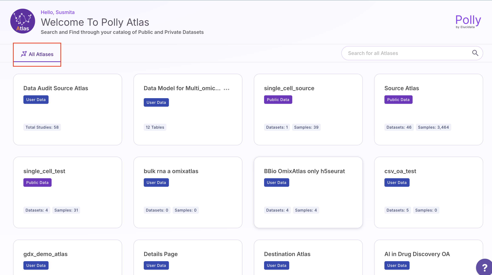 
 Atlas Homepage

## Create an Atlas

Users can create an Atlas from scratch by clicking on "Create Atlas" on the right side of the interface. In the pop-up window, they can enter the Atlas name, Atlas ID, and description.

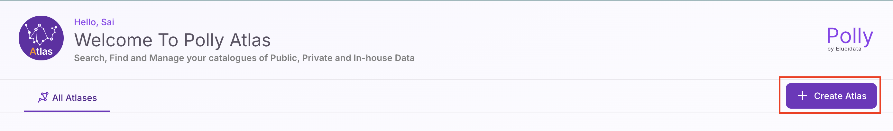 
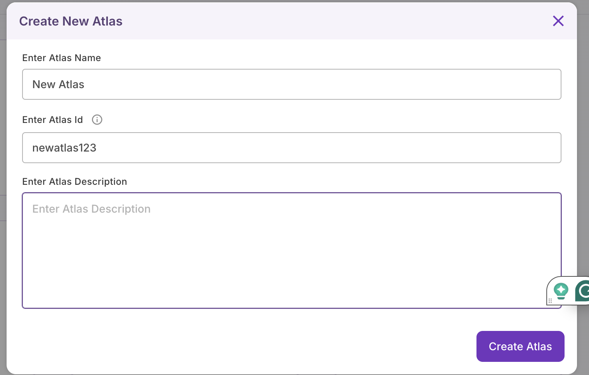

 Once they click on "Create Atlas," a blank Atlas will be created, allowing users to add a collection of tables with a defined schema.
 
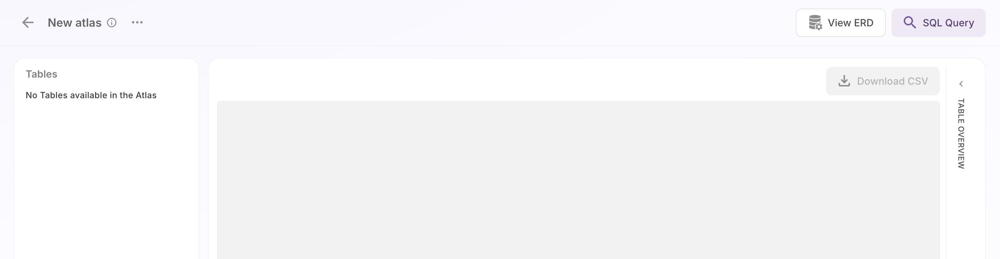 
 Create Atlas

## Schema management

Schema management in a relational database involves defining, maintaining, and modifying the structure of tables, columns, relationships, indexes, and constraints to ensure data integrity, optimize performance, and support scalability.

For a given Atlas, users can view its information, which includes the title, number of tables, size, creator, and creation date. Users can also view the list of tables, get an overview of each table, view the Entity-Relationship Diagram (ERD), and download data in CSV format as needed.

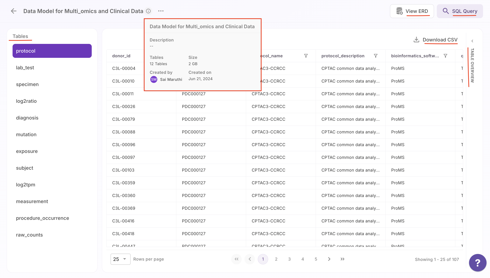 

### Kebab menu

### Table Overview

Users can interact with any of the tables in the database. For example, in the protocol table, you can identify the primary key and examine the other attributes along with their corresponding datatypes. While all attributes in this one table may have a datatype of string, other tables might contain a mix of datatypes such as string, float, and integer. Users can also horizontally scroll across the fields to view all available fields in the table.

 
 Table Overview

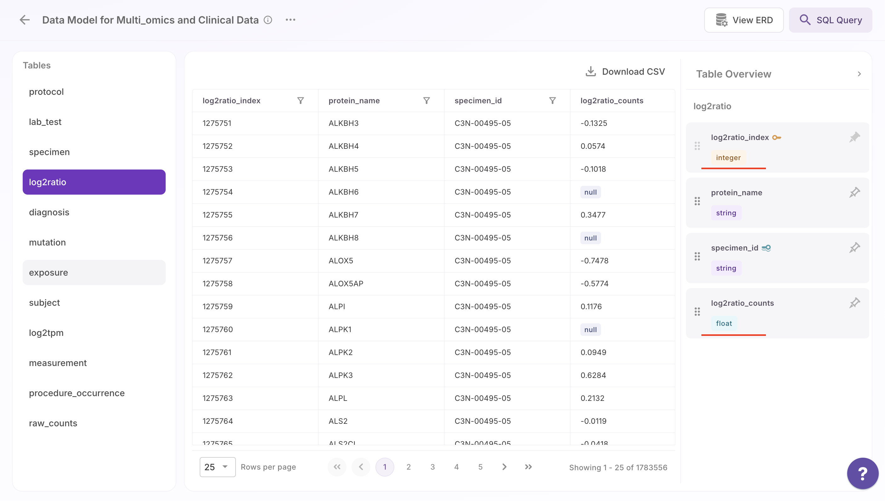 
 Table Overview with datatypes

Users can pin attributes by clicking the pin symbol on the right side of each field. Pinned attributes will appear at the beginning of the middle section, as shown with donor_id and project_id in the example. This allows users to keep important attributes visible while scrolling through other fields. Users can also drag and scroll fields to rearrange their positions in the table according to their preferences.

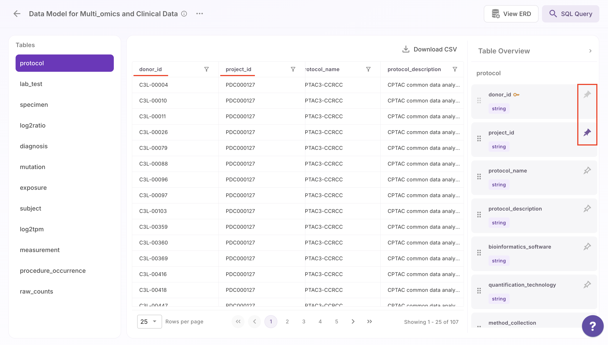  
 Pin attributes

Users can sort most of the fields in the tables either from A to Z or Z to A. Additionally, you can filter the data by values, allowing for both partial and complete searches to find specific entries within the table.

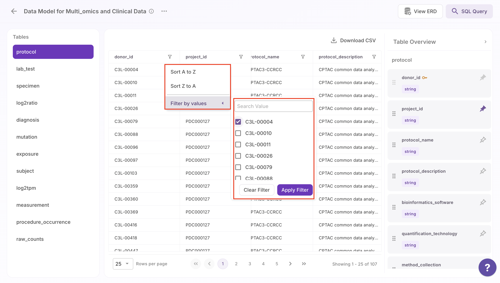 
 Filter by value

For numeric fields like integers and floats, users can perform conditional searches. Users can search by specific values or apply filters based on conditions, such as filtering for entries greater than a certain value. For example, entering "greater than 10" will display only the records that meet this condition. 

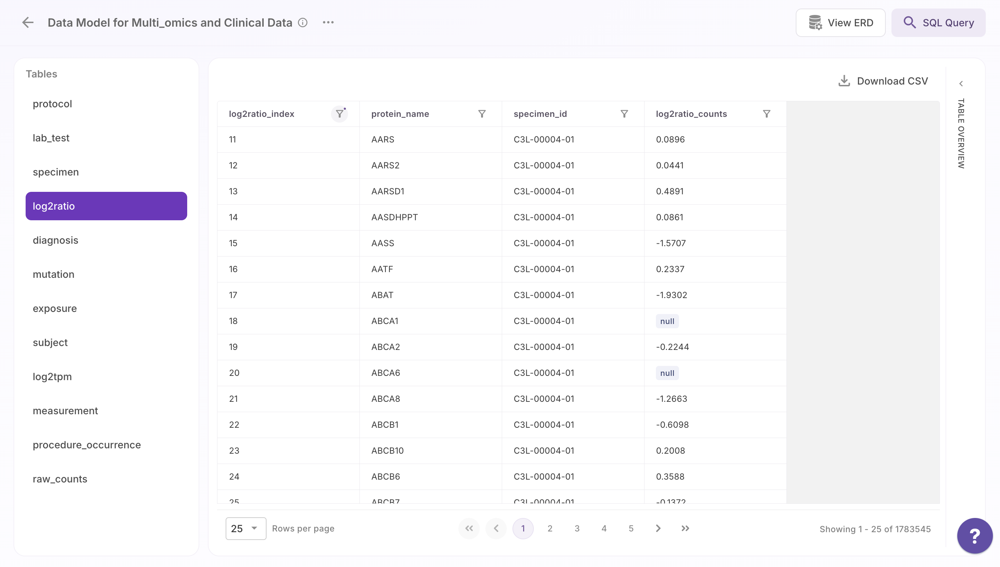 
 Filter by greater than 10

### Download data

Users can download data from any of the tables by clicking on "Download CSV." The downloaded file will include the name of the Atlas, followed by the table name and a timestamp in epoch format.

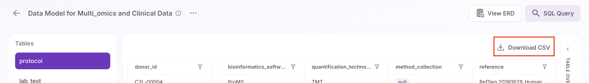 
 Download data

## Data exploration and querying

The second part is the SQL query feature. Users can first review the available tables and their attributes, similar to the earlier view. They can then run SQL queries directly here, allowing them to interact with and explore the data using commands.  The output will be shown as a table, with an option to download the results in CSV format.

Additionally, users can run various types of SQL queries for initial exploration, from simple queries to complex joins. This flexibility allows users to perform comprehensive data analysis and experimentation based on their needs.

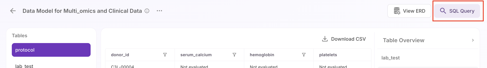 

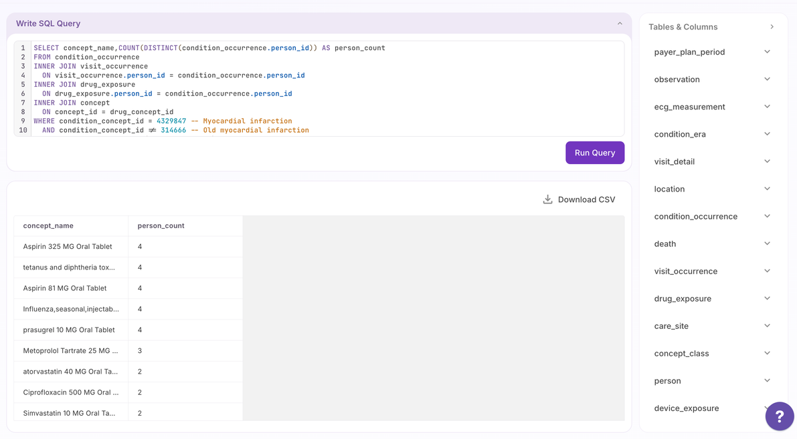 
SQL Query

## Entity-Relationship Diagram (ERD)

Entity-Relationship Diagram (ERD) to help users visualize the structure of the database and the relationships between different entity classes.

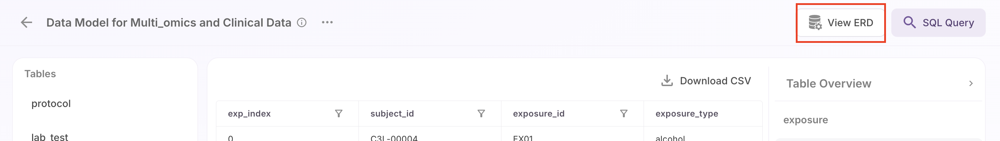 
