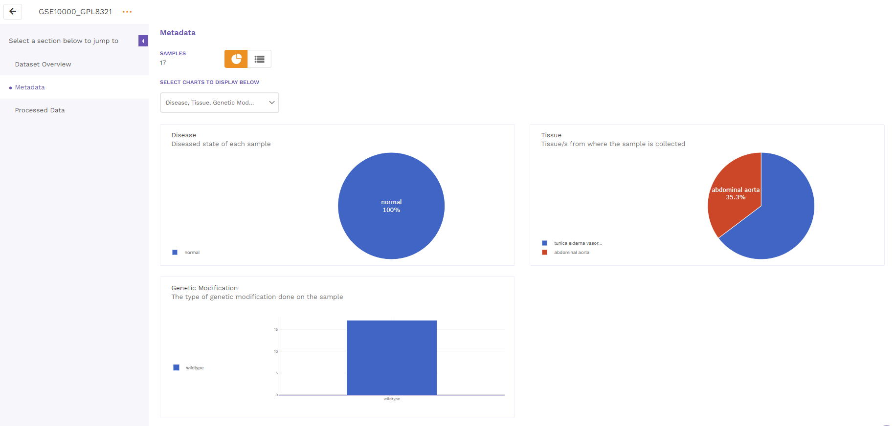

## 5. View details

On clicking the view details option from the dropdown menu of the respective dataset from the results page, users are directed to the view details page. There are three main sections that can be seen on the left side of the page and described below.

 
**Figure 19.** Dataset Details

### 5.1 Dataset overview

Dataset overview includes the description of the dataset, number of samples, link to the source and the metadata tags associated with the dataset.

 
**Figure 20.** Dataset Overview

### 5.2 Metadata

The metadata section consists of a dashboard showcasing charts displayed for different metadata attributes such as disease, cell type and tissue type. There is an option to view the metadata either in graphical format or a tabular format.

The graphical format displays pie-charts/histograms for different attributes. Users can click on legends to select and filter the graphs.

 
**Figure 21.** Metadata in Graphical Format

The tabular format consists of a comprehensive snapshot of the biological characteristics of samples used in the dataset. We plan to make this format more schema driven in the future.

 
**Figure 22.** Metadata in Tabular Format

### 5.3 Processed data

The processed data with normalized values is presented as a table that is available for downloading.

 
**Figure 23.** Processed Data

