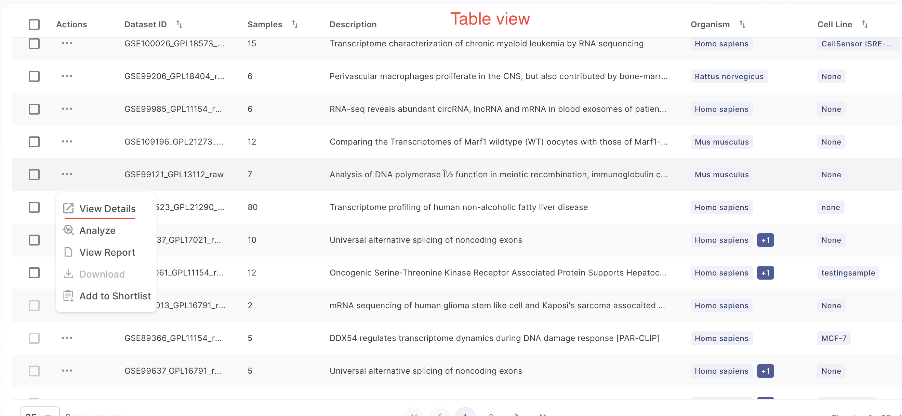

How to View Dataset Details?
============================

### View Details

Users can 'view details' of a specific dataset using two methods. 

 

First, users can click on the card view and select the 'view details' button on the dataset in the results page to see its details. 

 

Alternatively, users can click on the table view and choose the 'view details' option from the action button located on the left side of the panel.

 

After clicking on 'view details', it will take you to another page featuring three main sections, which are described below.

### Dataset Overview

The dataset overview includes a summary of the dataset, its overall design, and an abstract. This section also provides details about the data type, samples, organism, disease, drug, a link to the source, PMID, and metadata tags associated with the dataset.

 

### Metadata Table

The metadata table includes sample details, protocol information, source metadata fields, and curated metadata fields. Users can customize the table by clicking the 'Manage table' option in the middle panel. This opens a table editor that allows users to select which columns they want to display in the table or hide based on their preference. Users can select or deselect desired columns within the table and save their changes. Only the selected columns will appear in the table after saving. Users can scroll through the table to access the desired data and also have the option to download the metadata as a CSV file.

 

### Metadata Charts

Metadata charts consist of the experimental factors along with a sunburst plot. The Sunburst Plot is used to display a hierarchical structure. Each level of the hierarchy is represented by one ring or circle and all rings show how the outer rings relate to the inner rings. To create a sunburst plot, the user can select the metadata in the rings based on their own criteria.

 

### Cell Type Visualization

Users can see the relative distribution of cell numbers across different cell types when viewing the details of a single-cell RNA-seq dataset before selecting a dataset for analysis. Users can now access enhanced cell type visualization details in the single-cell datasets, where they can overlay one metadata attribute on another. We have included curated fields alongside curated cell type and the number of cells. Within each of these curated disease fields, users can view the corresponding cell numbers and overlay additional metadata attributes.

 

### View Report

Users can select file formats for viewing and downloading datasets based on their requirements. This allows users to choose the format that best aligns with their downstream analysis. By clicking the 'View' button on the right, users will be redirected to download the file in PDF, HTML, or JSON format. Users have the option to add files and notebooks, as well as delete reports that are no longer needed. 

 

 

Users can also view the report under the table view. In the table view, users click on the action button in the right panel and select 'view report', which will display all the reports related to the specific dataset.

