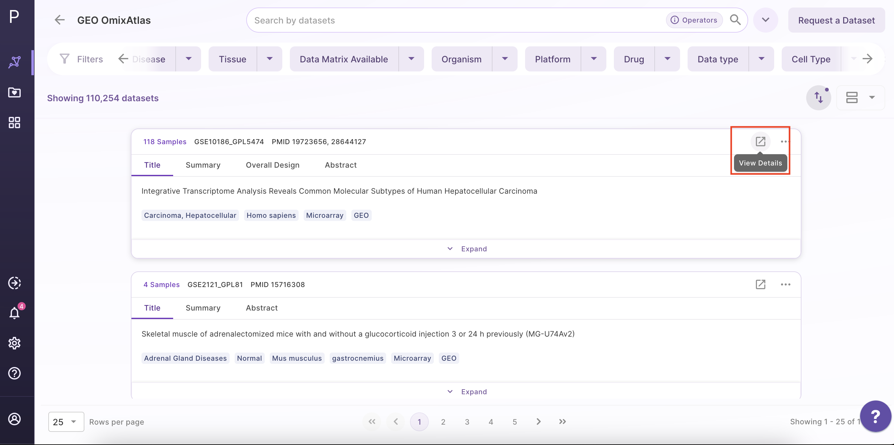
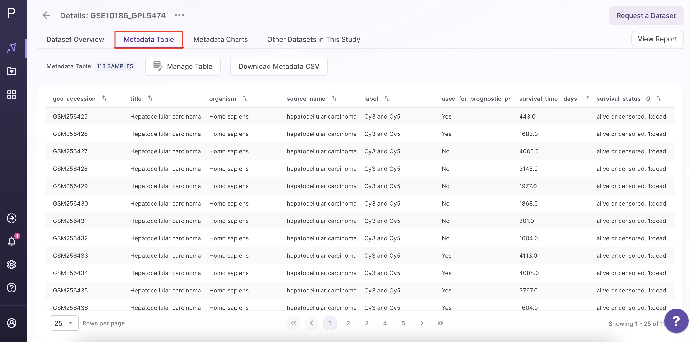

How to View Dataset Details?
============================

Users can click the "view details" button on the dataset in the results page to view the details of a specific dataset.

 

The top of the page features three main sections, which are described below.

### Dataset Overview

The dataset overview includes the description of the dataset, the number of samples, the link to the source, and the metadata tags associated with the dataset.

 

### Metadata Table

The metadata table consists of sample details, protocol, source metadata fields, and curated metadata fields.

 

### Metadata Charts

Metadata charts consist of the experimental factors along with a sunburst plot. The Sunburst Plot is used to display a hierarchical structure. Each level of the hierarchy is represented by one ring or circle and all rings show how the outer rings relate to the inner rings. To create a sunburst plot, the user can select the metadata in the rings based on their own criteria.

 

### Cell Type Visualization

Users can see the relative distribution of cell numbers across different cell types when viewing the details of a single-cell RNA-seq dataset before selecting a dataset for analysis.

 

