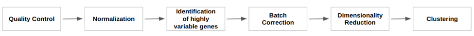
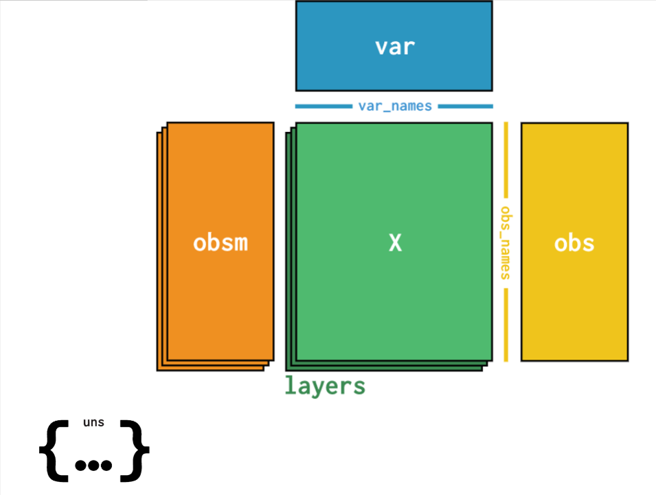
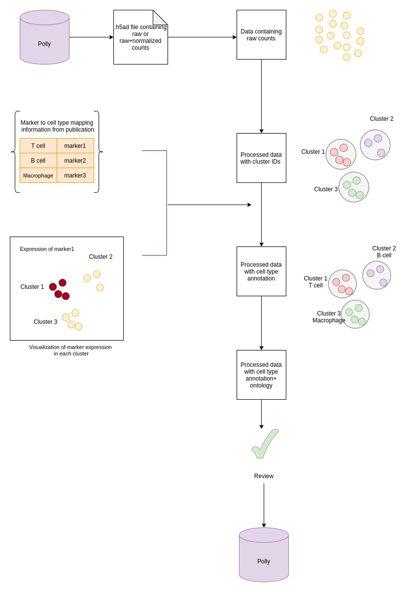

# Single Cell RNAseq Omixatlas- FAQs

Single-cell RNA sequencing has emerged as the technique of choice for researchers trying to understand the cellular heterogeneity of tissue systems under physiological and pathological conditions. On Polly, users get access to comprehensive Single-Cell RNA-Seq data which is structured and readily usable, compared to raw data available at single-cell data source repositories. Data curation and management are guided by the FAIR principles (Findable, Accessible, Interoperable and Reusable) and the available data is machine-actionable and analysis-ready.

### Which sources for Single Cell data are available on Polly?

Polly's Single Cell OmixAtlas consists of single-cell RNA Sequencing datasets from the following sources:

- [Gene Expression Omnibus](https://www.ncbi.nlm.nih.gov/geo/)
- [Expression Atlas](https://www.ebi.ac.uk/gxa/home)
- [Human cell atlas](https://www.humancellatlas.org/)
- [Single Cell Portal](https://singlecell.broadinstitute.org/single_cell)
- [Tabula sapiens](https://tabula-sapiens-portal.ds.czbiohub.org/)
- [HTAN](https://humantumoratlas.org/)
- [Covid-19 Cell Atlas](https://www.covid19cellatlas.org/)
- [Zenodo](https://zenodo.org/)

In addition to the sources mentioned above, Polly's single cell OmixAtlas contains 600 high-value landmark datasets. These data come primarily from two sources: the Human Cell Atlas and the Chan Zuckerberg Initiative. In this context, landmark datasets are those that have a large number of cells, are from pivotal publications (high-impact journals like Cell, Nature, Science), and are clinical.

### How is a Single Cell RNA-Seq dataset defined on Polly?

Polly's single cell dataset represent a curated collection of biologically and statistically comparable samples. Each dataset is denoted using a unique ID. For some sources like GEO, SCP, Expression Atlas, Array Express, Polly provides single cell dataset IDs in the same format as the source.

**Basic ID format**
- GEO (Gene Expression Omnibus) - GSE171203\_GPL24247. On Polly, the dataset ID for a GEO dataset follows the same naming convention as GEO, consisting of a series ID as well as a platform ID. Here, GSE171203 is the subseries ID while GPL2424 is the platform ID.
  - Platform record - A Platform record is composed of a summary description of the array or sequencer. Each Platform record is assigned a unique GEO Identifier ( **GPLxxx** )
  - Series - A Series record links together a group of related samples and provides a focal point and description of the whole study. Each Series record is assigned a unique GEO Identifier ( **GSExxx** ). A Series record can be of two types - SubSeries and SuperSeries. For bigger experiments, there are both SubSeries and SuperSeries. SuperSeries is all the experiments for a single paper/study. SuperSeries can be divided into SubSeries which are different technologies. For single-cell data, we have all datasets as subseries on Polly.
- Expression Atlas - E-MTAB-10050
- Single Cell Portal - SCP660

**Split Factor:** The dataset from the experiment and at source is a single file, but needs to be split as per the UMAP/t-SNE clustering. In such cases, the split factor entity is appended at the end of the dataset ID indicating that the dataset has been split. Following is the summary of the logic used for splitting datasets which we use:
- The publication has multiple umap/clustering patterns. We take the most important or primary Umap, which mostly is the first one, but not necessarily always the first one.
- When the publication uses a subset of data available, then we add data in sync with the subset of cells used in a publication and try to overlap the same markers clusters using the whole data. If we get some clusters, we add this dataset with “_all” to Polly, but this happens seldomly.

Below are examples given for split datasets for each source.

1. GEO: Data from GEO generally gets added as GSE_GPL, but there are cases where the publication is not having the analysis done at the whole GSE_GPL level. In these cases, while doing the cell type curation and cluster marking, we split the datasets as per the authors' analysis. Example: ‘GSE106264’ is available as ‘GSE106264_GPL17021_KO’ (knockout) and 'GSE106264_GPL17021_WT' (control).
2. Single Cell Portal (SCP) - Each SCP dataset can have 1 or more clusterings available for exploration. In case of multiple clusterings, a suffix is added to the dataset ID. Example:  Split based on the samples taken from primary tissue (SCP817_2) and organoids(SCP817_1).
3. Array Express: The authors submit different count and metadata files for different experiments separately, which enables us to process the data as done by them in the publication. In the example given below, two separate count & metadata file combinations were present and therefore, two H5Ad files were ingested. Example: ‘E-MTAB-10974' is split as ‘E-MTAB-10974_whole_organoids15’ and  'E-MTAB-10974_whole_organoids1-12’.
4. Tabula Sapiens: Tissue-wise split was available on the source and therefore, datasets have been ingested in the same manner. Example: 'Tabula_Sapiens' is split into 24 datasets (TS_Bladder, TS_Small_Intestine, TS_Heart, TS_Eye, TS_Kidney, TS_Muscle, TS_Tongue, TS_Mammary, TS_Liver, TS_Blood, TS_Bone_Marrow, TS_Salivary_Gland, TS_Trachea, TS_Vasculature, TS_Large_Intestine, TS_Lymph_Node, TS_Thymus, TS_Lung,TS_Pancreas, TS_Prostate, TS_Uterus, TS_Fat)

### How is the single cell data processed?

**Data:** We take author-submitted raw and normalised counts from all sources, where available. For GEO, in case the author-submitted counts are not available, we process fastqfiles (for data generated by 10x method) with an automated raw data pipeline to get the raw and normalised counts.

We process the author-provided counts since there are a wide variety of pipelines used in single cell space and author-provided counts are more accurate.

Raw counts data is stored in the .raw slot of the AnnData object and processed counts in .X slot.

**Processing**

 
**Figure 1.** Processing Steps

Data processing is based on a general scRNA-seq analysis[workflow](https://scanpy-tutorials.readthedocs.io/en/latest/pbmc3k.html) using the Scanpy library and includes the following steps:

1. **Quality control:** The QC step involves filtering low quality cells and genes from the dataset. Quality control metrics are calculated using the calculate\_qc\_metrics function. Different metrics are as follows.

| **Level** | **Metric/ Parameter** | **Definition** |
| --- | --- | --- |
| Cell-level | total\_genes\_by\_counts | Number of genes with positive counts in a cell |
| Cell-level | total\_counts | Total number of counts for a cell |
| Cell-level | total\_counts\_mt | Total counts for a cell which are mitochondrial |
| Cell-level | pct\_counts\_mt | The proportion of total counts for a cell which is mitochondrial |
| Feature level | total\_counts | Sum of counts for a gene |
| Feature level | n\_genes\_by\_counts | The number of genes with at least 1 count in a cell. Calculated for all cells |
| Feature level | mean\_counts | Mean expression over all cells |
| Feature level | n\_cells\_by\_counts | Number of cells in the expression of a gene is measured in |
| Feature level | pct\_dropout\_by\_counts | Percentage of cells the gene does not appear in |

Filtering of cells/genes includes the following:

- Removing genes which are detected in very less cells (\< 3 cells).
- Removing cells with a very low number of genes (\<200 genes).
- Removing cells with a high percentage of mitochondrial genes which indicate non-viable cells (\> 20% pct\_counts\_mt).
- Removing cells with very high total\_counts - This is done by visualising the distribution of cells using violin plots.

_These filters apply only if the source has raw counts._

2. **Normalization and log transformation of expression values:** Normalization aims to remove systematic differences in sequencing coverage between libraries such that they do not interfere with comparisons of the expression profiles between cells.

- Total-count normalization (library-size correction) - Normalise total counts per cell to 10,000 (only applies when raw counts are available).
- Log10 normalization of the matrix.

3. **Highly variable genes:** Identification of highly variable genes based on their expression across the population that represent the biological differences.

4. **Batch correction:** Batch correction to remove unwanted variation due to experimental design. Systematic differences in the observed expression in cells arising from different batches are referred to as "batch effects". Batch effect removal is done across samples using the combat function of Scanpy.

5. **Dimensionality Reduction :**

- This is done using PCA (Principal Component Analysis) on highly variable genes.
- Computing the neighbourhood graph of cells using the PCA representation of the data matrix.
- Embedding the neighbourhood graph in two dimensions using UMAP and tSNE.

6. **Clustering:** Clustering of the neighbourhood graph using the Leiden graph-clustering method.

### In which format are the single cell RNASeq datasets available on Polly?

All datasets are available on Polly in the[H5AD](https://broadinstitute.github.io/wot/file_formats/) format. This is a file format in which data can be stored with sample metadata, expression matrix as well as clustering data i.e. t-sne, UMAP etc.. The structure of an H5AD file is given in the image below wherein different slots consist of data as follows:

- **X** contains the processed expression matrix
- **obsm** contains the embeddings data - U-MAP , t-sne coordinates [X\_pca', 'X\_tsne', 'X\_umap']
- **obs** contains the sample metadata ['title', kw\_curated\_cell\_line', 'kw\_curated\_disease', 'kw\_curated\_drug']
- **var** contains the gene metadata ['highly\_variable', 'gene\_ids', 'n\_cells']
- **uns** contains unstructured metadata

### Which fields are curated for Single-cell Data?

On Polly, all datasets and the corresponding samples are available with six standard metadata fields which are curated using Polly's proprietary NLP-based Polly-BERT models and harmonized with specific biomedical ontologies. Such fields are Organism, Disease, Tissue, Cell Line, Cell Type and Drug. In addition to these fields, other metadata fields are also available which are extracted from the source metadata. Metadata is available at 3 levels:

- **Dataset-level metadata** - General information about the experiment, subject and transformations, for eg, organism, experiment type, and disease under study.
- **Sample-level metadata** - Captures information for each sample. Eg. Drug, tissue
- **Feature-level metadata -** Provides molecular/gene information that is consistent across samples.

**Cell Type Annotation for single cell datasets: Manual Curation Process**

Cell-type labels are assigned at the cell cluster level based on expression signatures using ontology or controlled vocabularies. For datasets, where cell-type annotations are not available from the source (mainly GEO datasets), we manually curate the cell-type information based on the differential marker expression for clusters. In cases where cell type annotations are already available in datasets at source, datasets are not manually re-curated.

**Process for cell type manual curation**

**I) Identifying cell types and markers information from Publications -** Internal curators at Elucidata determine if a particular dataset can be curated for cell type by going through the publications associated with the dataset.

**II) Metadata addition -** Annotation of clusters - UMAP/tSNE plots are generated as a result of single cell raw count processing (as mentioned in the pipeline section). By visualization of clusters with UMAP/t-SNE plots, cell type cluster annotation is done.

1. Cluster annotation with author-provided raw cell type (cell type terminology used in publication) is based on the marker expression value for each cluster. In publications, the information on cell type and the corresponding marker is present either in the figures (UMAP, T-SNE plots), text or supplementary files. This annotation is added as a field named **curated\_raw\_cell\_type.**

Additionally Marker information is also added with gene names that are differentially expressed in the cluster such as:

- **curated\_marker\_present:** Gene name/names that are differentially expressed in the cluster
- **curated\_marker\_absent:** Gene name/names that are absent in the cluster

2. Cluster annotation with ontology is represented as a term for the cell type in Cell Ontology along with the ontology ID. This is given as the field named **curated\_cell\_type.**

For single-cell datasets on Polly, a list of all the curated metadata fields at the dataset level, sample level, as well as feature level, is given below:

### List of Curated Fields

Please find the link to the curated fields [here](https://docs.elucidata.io/OmixAtlas/Curating%20OA/Curating_OA_scRNA.html).

### Do all the single cell datasets on Polly have cell type annotation?

All the datasets in the single cell RNASeq Omixatlas on Polly (~1700 datasets) are available with manually curated cell type annotations from publications. We will continue to add more datasets to the Omixatlas with an increased frequency of manual cell-type annotations.

### Which are the different types of cell annotations available?

Currently, two types of cell-type annotations are available

1. Curated Raw Cell Type: Author cell type annotation as mentioned in the publication associated with the dataset.
2. Curated Cell Type: Cell type corresponding to the Author's cell type annotation as mentioned in the publication and mapped to cell type ontology.

### Are source fields retained for a dataset?

All source fields are captured in the H5AD file which users can visualize through applications. However, fields available for searching through UI and Polly-python are restricted by schema due to performance constraints.

### Are external data requests directly added to Single Cell OmixAtlas?

Users can request for single-cell RNASeq datasets from GEO or non GEO sources which are not available in the source Single Cell RNASeq OmixAtlas to be added to the destination atlas. Upon request, these datasets will be added directly to the user’s destination Atlas as early as possible.

- Single cell RNAseq dataset from GEO which is not available on Source Atlas - TAT is upto 10 datasets in 10 working days
- Single cell RNAseq dataset from non-GEO public source (with raw counts available) - TAT is upto 10 datasets in 10 working days
- Single cell RNAseq dataset from non-GEO public source (with raw counts unavailable, fastq files available) - TAT is upto 10 datasets in 20 working days
