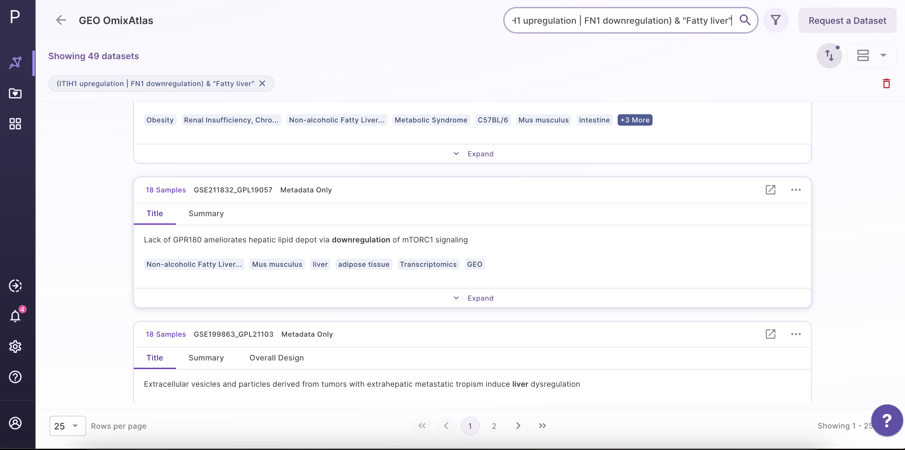

# How to find datasets?

## Search based on operator hints

 

Elasticsearch powers this search engine, allowing users to look for keywords across:

-   Source metadata fields such as **title, description,** and **overall design**

-   Curated metadata fields such as **tissue, drug, cell line, cell type, disease, organism, gene, gene modification,** and **dataset id**

Some of the features of the search are - 

-   It allows fuzzy search as well. For example, "transcriptomics" in the search keyword will show results for "transcriptome" or "transcript" as well.

-   This search bar supports the following operations to help users with some advanced operations such as AND (&), OR (|), NOT (~), EXACT ("text")

### Use of operators

-   While parsing the search keyword, the algorithm assigns the following priority to different operators:- Brackets () > AND (&) > OR (|) > NOT (~)

   -  Use brackets ( ) to ensure the operators in your query get executed in the exact order you want.

   -  term1 & term2 | term3 can be executed in two ways: (term1 & term2) | term3 or term1 & (term2 | term3). Using one of the two above will help remove ambiguity.

-   Use exact matches " " to do stricter spelling matches with search keywords

   - Eg. transcriptome vs "transcriptome"

The former will match the word "transcriptome" & also words closer to it, such as "transcriptomics" or "transcript", whereas the latter will only match the exactly spelled word "transcriptome".

   - Eg. renal cancer vs "renal cancer"

The former will behave the same as (renal | cancer) with a slight difference:

- (renal | cancer) can match a dataset containing "renal" & "cancer" in any single field or even different fields

- renal cancer will return those datasets at the top which contain both "renal" & "cancer" in the same field, followed by those that contain only one of these words in any single field.

The latter would only match a dataset with a field containing the exact word

"renal" followed by the exact word "cancer", in the same order.

- Use operator NOT ~ to exclude unwanted results from your search

- Eg. (HCC & Hepatocellular carcinoma) ~ "radiotherapy"

The above search would match datasets that contain both "hcc" and at least one of the words ("hepatocellular" or "carcinoma").

Out of those, ignore the datasets containing the word "radiotherapy".

### Search Examples
Some of the Search examples are as follows:-

- (ITIH1 upregulation | FN1 downregulation) & "Fatty liver"

 

- (Hepatocellular carcinoma | HCC) ~ Radiotherapy

  

- (somatic mutation) & (hepatocellular | renal) & (cancer | carcinoma)

 

### Search based on Pubmed ID

All datasets include the PubMed ID for easy access to the publication. Additionally, the search bar allows users to look for datasets based on the PubMed ID.

### Dataset Ranking Upon Search

Users can search the dataset by either the Geo dataset ID or the PubMed ID. The search results will highlight the dataset with the exact id while also showing relevant datasets along with it.

## OmixAtlas Searching and Filtering 

