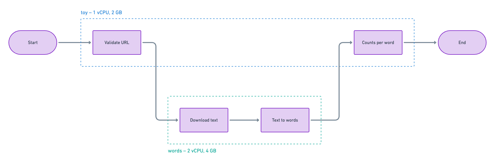

Pipelines can import and call other Pipelines. We call the child Pipeline a “subflow”. This is simply a terminology to name this pattern and no special work is required on the developer’s part.

At the code level, pipelines are just functions and they can call other pipeline functions. However, behind the scenes, subflows will get executed as child processes in their own containers. This is why the subflow function must be an already registered pipeline.


## Example

Consider the following two pipelines and their configuration:

<div class="grid" markdown>

``` py title="pipelines/pwl/toy/src/main.py"
from orchestration import task, workflow
from pipelines.pwl.words.src.main import words


@task
def validate_url(url: str):
    pass


@task
def counts_per_word(words: list):
    pass


@workflow
def toy(url: str):
    validate_url(url)
    words_ = words(url)
    return couns_per_word(words_)
```

``` py title="pipelines/pwl/words/src/main.py"
from orchestration import task, workflow


@task
def download_text(url: str) -> str:
    pass


@task
def text_to_words(text: str) -> list:
    pass


@workflow
def words(url) -> list:
    text = download_text(url)
    words = text_to_words(text)
    return words
```

</div>

<br>


<div class="grid" markdown>

``` json title="pipelines/pwl/toy/config.json"
{
  "infra": {
    "memory": 2048,
    "cpu": 1024
  }
}
```

``` json title="pipelines/pwl/words/config.json"
{
  "infra": {
    "memory": 4096,
    "cpu": 2048
  }
}
```

</div>

<br>

In this example, the pipeline `words` is being called from the pipeline `toy`. This makes `words` a subflow of `toy` in this context. Whenever `toy` is run, `words` will be run as a subflow. But `words` will not run in the same container as its parent `toy`. A separate container will be created for `words` based on its `config.json` file and its result will be seamlessly send back to `toy` for further use. The following diagram depicts this visually:



When observed on the monitoring dashboard, the pipeline and its subflows together will behave as if it were all just one sequence of tasks. There may be logs saying that a pipeline is being called as a subflow, but that’s about it. If needed, we can make this more obvious on the dashboard in some future iteration.


!!! Note
    While theoretically possible, please try to avoid multiple levels of subflow nesting. But if its necessary, go ahead and do it anyway. We will do our best to support it.

    The subflow is just another pipeline and as such needs to be deployed separately to make it work as described in this document. Simply decorating a standalone function with `@workflow` may not achieve the outcome you intended.

    The logs from the parent pipeline and its subflows will come interleaved on the monitoring dashboard.


<br>
<br>
<br>
<br>
<br>
<br>
