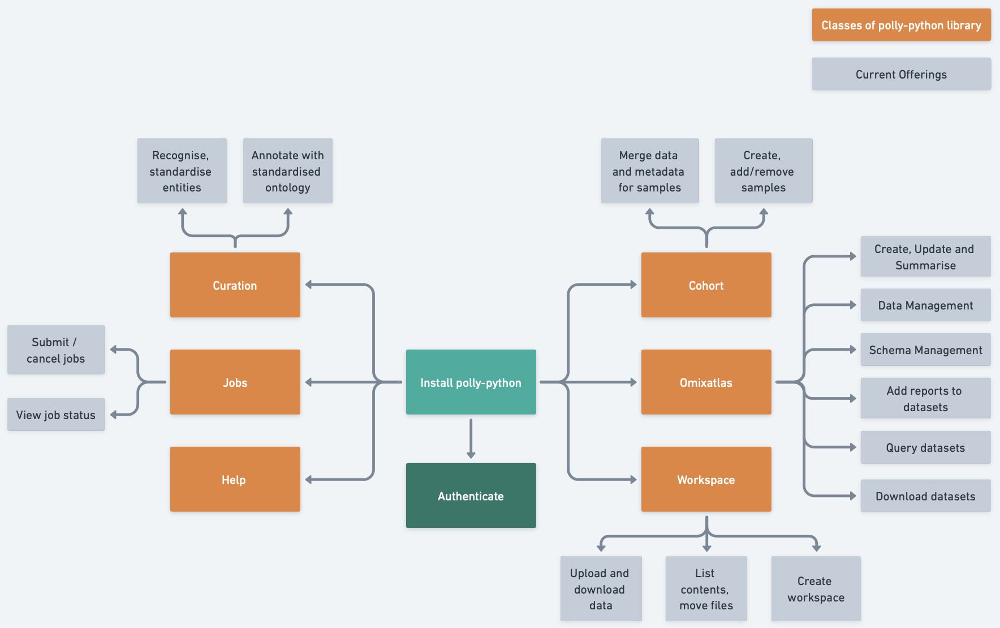

Polly Libraries give access to the various capabilities on Polly like ingesting, querying, filtering, downloading and creating cohorts for the data on OmixAtlas. It allows access to data in OmixAtlas over any computational platform (like DataBricks, SageMaker, Polly, etc.) of your choice. These functionalities can be accessed through functions in python and [bash](https://docs.elucidata.io/Scaling%20compute/Polly%20CLI%201.html) which can be used over a Terminal. All the Polly Python APIs are defined in Python.

A snapshot of it's capabilities is shown in the image below.

