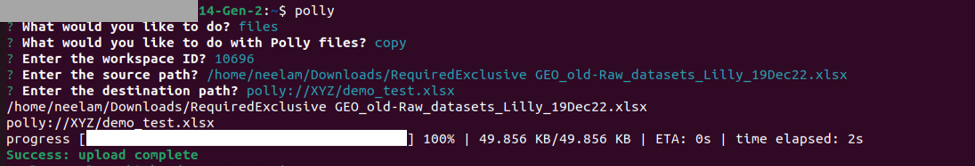

# What is Polly CLI?

Polly CLI (Command Line Interface) is a tool that enables you to interact with Polly services using commands in your command-line shell. Polly CLI lets you upload data and run jobs on the Polly cloud infrastructure by scaling computation resources as needed. You can start and stop jobs, monitor them and view logs. 

## Required System Configurations

Polly CLI can work on any Unix based system (Linux and Mac distributions). It does not work on Windows. We will be releasing a Windows version soon. It can be used on local computers as well as cloud instances and servers. 

There are no specific machine configurations required for Polly CLI. It can work on a system with as low as 512 MB RAM and 1 CPU.

## Installation 

**Dependencies Required for Polly CLI**

The following dependencies are required to be installed before installing Polly CLI:

*   [Node and npm](https://www.npmjs.com/get-npm):  

    *   Linux: For installation on Linux, follow the steps mentioned [here](https://www.digitalocean.com/community/tutorials/how-to-install-node-js-on-ubuntu-18-04).

    *   Mac: For installation on Mac, follow the steps mentioned [here](https://www.digitalocean.com/community/tutorials/how-to-install-node-js-and-create-a-local-development-environment-on-macos).

    *   Windows: For installation on Windows, follow the steps mentioned below -
1. Install nodejs from https://nodejs.org/en/download/
2. In the Command Prompt, install Polly CLI with: <pre><code>npm install -g @elucidatainc/pollycli</code></pre>

**Note:** Before proceeding with the installation of Polly CLI as outlined above, ensure that the Node version is 20 or lower. If not, kindly install Node version 20 using the following commands: 

<pre><code>
   brew install node@20
   brew unlink node
   brew link node@20
</code></pre>

**Commands to install**

To install Polly CLI, run the following commands on Terminal / Command prompt:

*   Linux:

    <pre><code>sudo npm install -g @elucidatainc/pollycli</code></pre>

*   Mac: 

    <pre><code>npm install -g @elucidatainc/pollycli</code></pre>
    
*   Windows: 

    <pre><code>npm install -g @elucidatainc/pollycli</code></pre>

**Commands to uninstall**

To uninstall Polly CLI, run the following commands on Terminal / Command prompt:

*   Linux: 

    <pre><code>sudo npm uninstall -g @elucidatainc/pollycli</code></pre>

*   Mac: 

    <pre><code>npm uninstall -g @elucidatainc/pollycli</code></pre>
   
*   Windows: 

    <pre><code>npm uninstall -g @elucidatainc/pollycli</code></pre>

**Note:**

*   `sudo` might have to be used before every command while accessing Polly CLI on cloud instance or server.

##Logging in and out of Polly CLI

**Log in**

Open the terminal on the system and execute the following command to log in.

<pre><code>polly login</code></pre>

Enter the Polly Username and Password when prompted.

 
 
**Figure 1.** Polly Login

Alternatively, user can login using the interactive command prompt.

The password is hidden when user types for security purposes.

 
**Figure 2.** Polly Login

Once logged in, you will stay logged in the system and won’t need to log in again even if a new terminal is opened or the system is restarted. You will only need to log in again if you manually log out from the system.

When you are in the Polly environment, you can log in to Polly CLI without the need to input credentials. We auto detect the Polly permissions or the user. The following are the ways to auto log in to Polly in different Polly environments:

*   **Notebook:** You are automatically logged in to Polly CLI as the same user as your Polly log in. You can directly start using all the Polly CLI commands as you wish.

*   **Polly CLI jobs:** If you want to access Polly CLI inside a job, you will have to install Polly CLI in the docker of the job and execute the following command to log in.

<pre><code>polly login --auto</code></pre>

**Log out**

Execute the following command to log out

<pre><code>polly logout</code></pre>

Alternatively, user can also logout using interactive command prompt.

 
**Figure 3.** Polly Logout

**Note:**

*   Logging out will not stop a running job.

##Create and View Polly Workspaces

**What are Polly Workspaces?**

Polly Workspaces are online workspaces that contain data, analyses, code, logs etc for a specific workspace or experiment. Data is stored and Analysis is performed within a user chosen workspace. More details about workspaces is mentioned [here](https://docs.elucidata.io/Getting%20Started/Workspaces.html).

**Creating a new Workspace**

To create a new workspace, use the following command.

<pre><code>polly workspaces create</code></pre>

You will be asked to name the Workspace and provide a description. Once the workspace is created, the workspace name and ID will be shown on the screen. This workspace ID will be needed while creating a JSON file for running jobs.

 
**Figure 4.** Create Workspace

Alternatively, workspaces can also be created using interactive command prompt.

 
**Figure 5.** Create Workspace

**View Workspaces**

To view all the existing Workspaces with access, use the following command.

<pre><code>polly workspaces list</code></pre>

You will be asked to select which Workspaces to list:

*   *all:* On selecting this, all the Workspaces will be listed.
*   *latest or oldest:* On selecting this you will be asked to enter the number of workspaces as shown in the image below.

 
**Figure 6.** List Workspaces

Alternatively, workspaces can be listed using the interactive command prompt. Workspaces can be listed according to users preference - All, latest or oldest.  

 
**Figure 7.** List Workspaces

Workspace ID will be required for transferring data and running jobs.   

##Data Transfer

Polly CLI can be used to transfer large data to and from Polly Workspaces. Upto **5 TBs** of data can be transferred in one go. 

**Listing the files and folders in a Polly Workspace Directory**

Files and folders within any Polly Workspace can be listed using the following command.

<pre><code>polly files list --workspace-id <workspaceid> --workspace-path <path/to/workspace/directory></code></pre>

Workspace ID can be obtained by using the command `polly workspaces list` as explained in the previous section. The path to the workspace directory has to start with `polly://`. Eg - The following command will list all the files and folders within the folder ABC in the workspace 1234.

<pre><code>polly files list --workspace-id 1234 --workspace-path polly://ABC/</code></pre>

**Note:**

*   This command only shows files and folders just one layer within the directory mentioned (just like the `ls` command on terminal).

*   If the path contains space in the folder names or file names, provide the entire path within double quotes (““). 

*   If you are within a Polly environment while accessing Polly CLI (like notebook or CLI job), workspace id can be auto-detected by passing `--yes` or `-y` in the command instead of `--workspace-id` parameter.

**Manually sync data to and from Polly**

Polly CLI can be used to sync the data between a Polly Workspace and a local directory. Data can be synced manually both ways using the following command.

<pre><code>polly files sync --workspace-id <workspaceid> --source <path/source/directory> --destination <path/to/destination/directory></code></pre>

Workspace ID of the workspace where the data is being synced has to be mentioned in the `--workspace-id` option. Source and destination can be Polly workspace path as well as local path. Workspace path should start with `polly://` followed by the directory path in the workspace where the data is to be synced. Here `polly://` is the root directory for the mentioned workspace.

The following command will sync data from Polly workspace to current local directory.

<pre><code>polly files sync --workspace-id 1234 --source polly://directory1/ --destination ./</code></pre>

The following command will sync data from current local directory to Polly Workspace directory.

<pre><code>polly files sync --workspace-id 1234 --source ./ --destination polly://directory1/</code></pre>

**Note:**

*   Only files that have been changed or added new will get transferred using the sync command. The files that remained unchanged after the last sync will not get transferred. This command can only be used for folders or directories (not for individual files). To transfer just a single file to or from Polly, use the `copy` command mentioned in the next section.

*   If the path contains space in the folder names or file names, provide the entire path within double quotes (““). 

*   If you are within a Polly environment while accessing Polly CLI (like notebook or CLI job), workspace id can be auto-detected by passing `--yes` or `-y` in the command instead of `--workspace-id` parameter. 

**Copy files to and from Polly**

Files can be copied to and from a Polly Workspace using the following command.

<pre><code>polly files copy --workspace-id <workspaceid> --source <path/to/source/file> --destination <path/to/destination/file></code></pre>

This command will copy an individual file from source to destination. The transfer can be from or to Polly Workspace depending on the source and destination defined. Workspace path should start with `polly://` followed by the directory structure within the Workspace.

**Note:**

*   If the path contains space in the folder names or file names, provide the entire path within double quotes (““).

*   If you are within a Polly environment while accessing Polly CLI (like notebook or CLI job), workspace id can be auto-detected by passing `--yes` or `-y` in the command instead of `--workspace-id` parameter.

**Sync files**

Interactive command prompt can be used to sync files from user's local directory to Polly workspace.

 
**Figure 8.** Sync files from local directory to Polly workspace

**List Workspace files**

Users can use interactive command prompt to list down a files from a particular workspace as shown below-

 
**Figure 9.** List files from a workspace

**Copy files**

Users can copy files from Polly workspace to local directory using the interactive command prompt.

 
**Figure 9.** Copy files

##Polly CLI help

If help is needed for any command, just type `--help` at the end of the command and execute.

 
**Figure 13.** Polly CLI Help

## Some useful gists

*   [Accessing Polly files in and out of a job](https://gist.github.com/GeorgeSabu/8a3251e263d93b08413ce2c56d8af45d)

*   [Running a cluster of jobs with different parameters](https://gist.github.com/GeorgeSabu/e89891da1d86fbaa3afa0655a4ede899)

*   [Bash script to identify when a job finishes](https://gist.github.com/GeorgeSabu/4fbc359fa9ee2bf4d3cb05df3b60db81)
