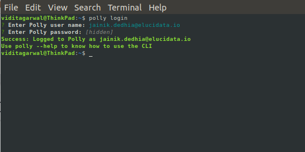

#What is Polly CLI?

Polly CLI (Command Line Interface) is an open source tool that enables you to interact with Polly services using commands in your command-line shell. Polly CLI lets you upload data and run jobs on the Polly cloud infrastructure by scaling computation resources as per need. You can start and stop jobs, monitor them and view logs. 

##Required System Configurations

Polly CLI can work on any Unix based system (Linux and Mac distributions). It does not work on Windows. We will be releasing a Windows version soon. It can be used on local computers as well as cloud instances and servers. 

There are no specific machine configurations required for Polly CLI. It can work on a system with as low as 512 MB RAM and 1 CPU.

##Installation 

**Dependencies Required for Polly CLI**

The following dependencies are required to be installed before installing Polly CLI:

*   [Node and npm](https://www.npmjs.com/get-npm):  

    *   Linux: For installation on Linux, follow the steps mentioned [here](https://www.digitalocean.com/community/tutorials/how-to-install-node-js-on-ubuntu-18-04).

    *   Mac: For installation on Mac, follow the steps mentioned [here](https://www.digitalocean.com/community/tutorials/how-to-install-node-js-and-create-a-local-development-environment-on-macos).

**Commands to install**

To install Polly CLI, run the following commands on Terminal / Command prompt:

*   Linux:

    <pre><code>sudo npm install -g @elucidatainc/pollycli</code></pre>

*   Mac: 

    <pre><code>npm install -g @elucidatainc/pollycli</code></pre>

**Commands to uninstall**

To uninstall Polly CLI, run the following commands on Terminal / Command prompt:

*   Linux: 

    <pre><code>sudo npm uninstall -g @elucidatainc/pollycli</code></pre>

*   Mac: 

    <pre><code>npm uninstall -g @elucidatainc/pollycli</code></pre>

**Note:**

*   `sudo` might have to be used before every command while accessing Polly CLI on cloud instance or server.

##Logging in and out of Polly CLI

**Log in**

Open the terminal on the system and execute the following command to log in.

<pre><code>polly login</code></pre>

Enter the Polly Username and Password when prompted.

 
**Figure 1.** Polly Login

Once logged in, you will stay logged in the system and won’t need to log in again even if a new terminal is opened or the system is restarted. You will only need to log in again if you manually log out from the system.

When you are in the Polly environment, you can log in to Polly CLI without the need to input credentials. We auto detect the Polly permissions or the user. The following are the ways to auto log in to Polly in different Polly environments:

*   **Notebook:** You are automatically logged in to Polly CLI as the same user as your Polly log in. You can directly start using all the Polly CLI commands as you wish.

*   **Polly CLI jobs:** If you want to access Polly CLI inside a job, you will have to install Polly CLI in the docker of the job and execute the following command to log in.

<pre><code>polly login --auto</code></pre>

**Log out**

Execute the following command to log out

<pre><code>polly logout</code></pre>

**Note:**

*   Logging out will not stop a running job.

##Create and View Polly Workspaces

**What are Polly Workspaces?**

Polly Workspaces are online workspaces that contain data, analyses, code, logs etc for a specific workspace or experiment. Data is stored and Analysis is performed within a user chosen workspace. More details about workspaces is mentioned [here](https://docs.elucidata.io/Getting%20Started/Project%20Management%20Dashboard.html).

**Creating a new Workspace**

To create a new workspace, use the following command.

<pre><code>polly workspaces create</code></pre>

You will be asked to name the Workspace and provide a description. Once the workspace is created, the workspace name and ID will be shown on the screen. This workspace ID will be needed while creating a JSON file for running jobs.

 
**Figure 2.** Create Workspace

**View Workspaces**

To view all the existing Workspaces with access, use the following command.

<pre><code>polly workspaces list</code></pre>

You will be asked to select which Workspaces to list:

*   *all:* On selecting this, all the Workspaces will be listed.
*   *latest or oldest:* On selecting this you will be asked to enter the number of workspaces as shown in the image below.

 
**Figure 3.** List Workspaces

Workspace ID will be required for transferring data and running jobs.   

##Data Transfer

Polly CLI can be used to transfer large data to and from Polly Workspaces. Upto **5 TBs** of data can be transferred in one go. 

**Listing the files and folders in a Polly Workspace Directory**

Files and folders within any Polly Workspace can be listed using the following command.

<pre><code>polly files list --workspace-id <workspaceid> --workspace-path <path/to/workspace/directory></code></pre>

Workspace ID can be obtained by using the command `polly workspaces list` as explained in the previous section. The path to the workspace directory has to start with `polly://`. Eg - The following command will list all the files and folders within the folder ABC in the workspace 1234.

<pre><code>polly files list --workspace-id 1234 --workspace-path polly://ABC/</code></pre>

**Note:**

*   This command only shows files and folders just one layer within the directory mentioned (just like the `ls` command on terminal).

*   If the path contains space in the folder names or file names, provide the entire path within double quotes (““). 

*   If you are within a Polly environment while accessing Polly CLI (like notebook or CLI job), workspace id can be auto-detected by passing `--yes` or `-y` in the command instead of `--workspace-id` parameter.

**Manually sync data to and from Polly**

Polly CLI can be used to sync the data between a Polly Workspace and a local directory. Data can be synced manually both ways using the following command.

<pre><code>polly files sync --workspace-id <workspaceid> --source <path/source/directory> --destination <path/to/destination/directory></code></pre>

Workspace ID of the workspace where the data is being synced has to be mentioned in the `--workspace-id` option. Source and destination can be Polly workspace path as well as local path. Workspace path should start with `polly://` followed by the directory path in the workspace where the data is to be synced. Here `polly://` is the root directory for the mentioned workspace.

The following command will sync data from Polly workspace to current local directory.

<pre><code>polly files sync --workspace-id 1234 --source polly://directory1/ --destination ./</code></pre>

The following command will sync data from current local directory to Polly Workspace directory.

<pre><code>polly files sync --workspace-id 1234 --source ./ --destination polly://directory1/</code></pre>

**Note:**

*   Only files that have been changed or added new will get transferred using the sync command. The files that remained unchanged after the last sync will not get transferred. This command can only be used for folders or directories (not for individual files). To transfer just a single file to or from Polly, use the `copy` command mentioned in the next section.

*   If the path contains space in the folder names or file names, provide the entire path within double quotes (““). 

*   If you are within a Polly environment while accessing Polly CLI (like notebook or CLI job), workspace id can be auto-detected by passing `--yes` or `-y` in the command instead of `--workspace-id` parameter. 

**Copy files to and from Polly**

Files can be copied to and from a Polly Workspace using the following command.

<pre><code>polly files copy --workspace-id <workspaceid> --source <path/to/source/file> --destination <path/to/destination/file></code></pre>

This command will copy an individual file from source to destination. The transfer can be from or to Polly Workspace depending on the source and destination defined. Workspace path should start with `polly://` followed by the directory structure within the Workspace.

**Note:**

*   If the path contains space in the folder names or file names, provide the entire path within double quotes (““).

*   If you are within a Polly environment while accessing Polly CLI (like notebook or CLI job), workspace id can be auto-detected by passing `--yes` or `-y` in the command instead of `--workspace-id` parameter.

##Docker Management

Polly has its own docker repository where dockers can be managed. The advantage of the Polly Docker Repository is that these dockers can also be stored within the same platform as data, code, and analyses and to access the stored dockers all you need is the Polly login credential.

**Docker login and logout**

In order to login/logout of the docker repository you can run the following command:

<pre><code>polly dockers login</code></pre>
<pre><code>polly dockers logout</code></pre>

The output generated from the above command should then be run on the terminal.

**Note:**

*   Add `sudo` before the command if required according to system settings.

 
**Figure 4.** Example output generated from above commands

**Create a Docker Repository**

Docker repository is a collection of dockers where you can publish and access your docker images. Here you can store one or more versions of your docker image. Every docker can have a tag and if a docker with the same tag is pushed again, it will overwrite the older docker after saving its older version that can still be accessed and used.

There can be multiple such repositories for an organization and only the members of your organization with Polly login credentials can assess them.

Use the following command to create a docker repository:

<pre><code>polly dockers create --name ,< docker_repository_name > --description < description of the repository ></code></pre>

 
**Figure 5.** Docker Repository Generation

**List docker repositories**

You can list all the stored docker repositories in your organization by using this command. 

<pre><code>polly dockers list --all</code></pre>

 
**Figure 6.** Polly Docker List

**List docker repositories commits**

You can list specific repository to view the various commits or tags stored within it through the Polly docker commit list. 

<pre><code>polly dockers commit-list --name < docker_repository_name > --all</code></pre>

 
**Figure 7.** Docker Commit List

In order to reduce the indecision when there are multiple dockers with the same name and same tag, you can distinguish them by their unique identifier which is assigned to every docker commit. In case the unique identifier is not passed in the command, the latest version of the docker with that tag will be used.

You can go back to older commit as well if required by using its tag and unique identity listed in the Polly docker commit list.

**Polly Dockers Path**

Typical path of a docker on Polly is 

<pre><code>docker.polly.elucidata.io/< organization >/< dockername >:< tag ></code></pre>

**Note:**

*    You can have two dockers with the same tag as well, in which case, the latest commit for that tag will be called by default if you call that docker. To call the docker with an older commit, commit hash will be required to specify in the path. 

<pre><code>docker.polly.elucidata.io/< organization >/< dockername >@< commit_hash ></code></pre>

The following example contains 2 docker images with the same tag. The latest image has the tag “active“. The active image can just be called by using the usual path. 

<pre><code>docker.polly.elucidata.io/elucidata/16June:latest</code></pre>

The image with the inactive tag can be called by specifying the commit hash.

<pre><code>docker.polly.elucidata.io/elucidata/16June@sha256:5747316366b8cc9e3021cd7286f42b2d6d81e3d743e2ab571f55bcd5df788cc8</code></pre>

 
**Figure 8.** Example of Docker with different tag status

**Pull/push of dockers**

The commands for docker’s pull/push are the same commands that you use for pulling and pushing from any other docker registry. The only difference is the path of the docker.

Example commands to pull a docker would be:

<pre><code>docker.polly.elucidata.io/elucidata/16June:latest</code></pre>

<pre><code>docker pull docker.polly.elucidata.io/elucidata/16june@sha256:5747316366b8cc9e3021cd7286f42b2d6d81e3d743e2ab571f55bcd5df788cc8</code></pre>

##Running Dockerized Jobs

Polly CLI can run dockerized jobs on managed Polly infrastructure. Polly infrastructure will scale computational resources with increased usage. All you need to do is submit a job and rest is taken care of by Polly. 

##Create job description JSON file

JSON file is needed to describe the job to be run on Polly. This file should contain the information about the computational resources (machine), docker image, the name of the job and specific commands (if required) to be run after the docker has been run, as keys. Text can be copy pasted from the example below to create the JSON file.

<pre><code>{
 "machineType" : "gp",
 "cpu": 1,
 "memory": "1Gi",
 "image": "docker/whalesay",
 "tag": "latest",
 "name": "Single Cell RNA",
 "command": [
     "cowsay","hello world"
 ]
}</code></pre>

**machineType**

Name of the machine required to run the job needs to be mentioned as per the following table.

| machineType | No. of vCPUs | Memory (RAM) | No. of GPUs |
|-------------|--------------|--------------|-------------|
| gp | 4 | 16 GB | - |
| ci2xlarge | 16 | 32 GB | - |
| ci3xlarge | 36 | 72 GB | - |
| mi2xlarge | 4 | 32 GB | - |
| mi3xlarge | 8 | 64 GB | - |
| mi4xlarge | 16 | 122 GB | - |
| gpusmall | 16 | 61 GB | 1 |

More machines (including some with GPUs) will be added soon. If you need a specific machine to be added to the list, please contact us at [polly@elucidata.io](mailto:polly@elucidata.io).

If computational power required is less than 2 vCPUs and 8 GB RAM, use the keys **“cpu”** and **“memory”** in the JSON file instead of the key **“machineType”**. If all 3 keys are present, **“machineType”** takes priority and the machine will be assigned accordingly. In the example JSON (image) mentioned above, machine selected will be **“gp”** with 4 vCPUs and 16 GB RAM and **NOT** 1vCPU and 1 GB RAM.

*   **cpu:** Mention the number of CPUs needed here. For smaller jobs, just a part of the CPU can also be chosen. For example, if 0.1 vCPUs are required for the job, the number of CPUs can be mentioned as **“100m”**. If more than 2 CPUs are required for the job, use the key **“machineType”** to choose the relevant machine instead of **“cpu”** and **“memory”**.

*   **memory:** RAM required needs to be mentioned in text (eg - “1Gi” or “500 Mi”) in this key. If memory needed is more than 8 GB, use the key **“machineType”** to choose the relevant machine instead of **“cpu”** and **“memory”**.

*   **image**: The path to the docker image present in DockerHub or ECR needs to be mentioned in this key.

*   **tag:** Tag of the docker image needs to be mentioned in this key.

*   **name:** Name you want to provide to the job has to be mentioned in this key.

*   **command:** Any commands to be executed after the docker has been run can be mentioned in this key.

##Docker Building Guidelines

While creating a docker to be run on Polly, the following must be taken care of.

*   Dockers must be present in either Docker Hub or Amazon ECR. 

*   Soon you will be able to have Dockers directly on Polly.

*   Only self contained dockers can be run on Polly. A self contained docker is one which has the code to get input files as well as upload output files back contained in the docker.

*   Public as well as private dockers are supported. In order to run private dockers, “secret” should be passed as a key in the JSON file. If your private dockers are on Polly itself, you don't require to generate this secret.

*   To get the secret key for the private docker, the following steps need to be followed.

    *   For MacOS, you need to remove the key value pair "credsStore": "osxkeychain" from the config.json file present in the directory `/Users/< username >/.docker`.

    *   You need to be logged in to DockerHub or ECR through the terminal. If not, you will need to log in.

    *   Run the command `sudo polly` on the terminal. 

    *   Select the option miscellaneous followed by create secret for docker. 

    *   Provide the path to the docker config file (the usual path for docker config is `/Users/< username >/.docker/config.json` in Mac and `/home/< username >/.docker/config.json` in Linux). Relative paths are not supported. 

    *   Select the account in which the docker to be run is present. 

    *   Copy the long text string (secret key) output to the JSON file in the key “secret”.

<pre><code>{
  "cpu": 1,
  "memory": "1Gi",
  "image": "docker/whalesay",
  "tag": "latest",
  "Secret": "ewoAImF1dVnphR0ZzWjNWd2RHRTZSVkJKUXlOcFlXMGsiCgkw==",
  "name": "exampleName",
  "command": [
      "cowsay","hello world"
  ]</code></pre>

*   **Passing Environment variables:** Two types of Environment variables can be passed in the json file.

    *   **Normal environment variables** are saved in a database for future references. These can be passed in the parameter **"env”** in the json file.

    *   **Private environment variables** are not saved in any database. These can be used for passing credentials in the json file. These can be passed in the parameter **“secret_env”** in the json file.

**Note:**

*   The value of Environment variables should always be string. For example, the correct way to assign Environment variable is `{“parallel_threads” : “2”}` and **NOT** `{“parallel_threads” : 2}`.

<pre><code>{
 "cpu": "100m",
 "memory": "64Mi",
 "image": "your_docker",
 "tag": "latest",
 "env": {
   "ENV1": "ENV_VALUE1",
   "ENV2": "ENV_VALUE2"
 },
 "secret_env": {
   "SECRET_ENV1": "SECRET_ENV_VALUE1",
   "SECRET_ENV2": "SECRET_ENV_VALUE2"
 },
 "name": "docker running"
}</code></pre>

*   [Here](https://gist.github.com/GeorgeSabu/8a3251e263d93b08413ce2c56d8af45d "https://gist.github.com/GeorgeSabu/8a3251e263d93b08413ce2c56d8af45d") is an example gist showing how input data for a job can be taken from and output stored back to Polly Workspaces.

##Execute Job

To execute the job, execute the following command

<pre><code>polly jobs submit</code></pre>

On executing this command, you will be asked to enter the id of the workspace where the job should be run and the path to the job description JSON file. With this, the job will be submitted to run and Job ID will be created. This Job ID will be needed to check the status and the logs of the submitted job.

**Note:**   

*   You do not need to create a new Workspace for running a job. You can simply list the older Workspaces and run a job in an already created Workspace.

 
**Figure 9.** Submit Jobs

##Monitor Job status

**Get job status **

*   The following command can be used to view the status of a particular job.

<pre><code>polly jobs status --workspace-id <workspace id> --job-id <job id></code></pre>

 
**Figure 10.** Single Job Status

*   The following command can be used to view the statuses of all the jobs in a workspace.

<pre><code>polly jobs status --workspace-id <workspace id></code></pre>

A prompt to enter job id will appear which when kept blank gets all the job statuses in a workspaces.

 
**Figure 11.** All Job Statuses in a Workspace

*   If you are within a Polly environment while accessing Polly CLI (like notebook or CLI job), workspace id can be auto-detected by passing `--yes` or `-y` in the command instead of `--workspace-id` parameter.

**Get job logs**

To view the logs of any job, use the following command:

<pre><code>polly jobs logs --workspace-id <workspace id> --job-id <job id></code></pre>

This will give the logs for the job. In case the job is still running, it will give the logs generated till that instant.

 
**Figure 12.** Job Logs

**Note:**  

*   If you are within a Polly environment while accessing Polly CLI (like notebook or CLI job), workspace id can be auto-detected by passing `--yes` or `-y` in the command instead of `--workspace-id` parameter.

##Polly CLI help

If help is needed for any command, just type `--help` at the end of the command and execute.

 
**Figure 13.** Polly CLI Help

## Some useful gists

*   [Accessing Polly files in and out of a job](https://gist.github.com/GeorgeSabu/8a3251e263d93b08413ce2c56d8af45d)

*   [Running a cluster of jobs with different parameters](https://gist.github.com/GeorgeSabu/e89891da1d86fbaa3afa0655a4ede899)

*   [Bash script to identify when a job finishes](https://gist.github.com/GeorgeSabu/4fbc359fa9ee2bf4d3cb05df3b60db81)
