#Introduction

Polly Notebook is a scalable analytics platform which allows you to perform data analysis remotely in a Jupyter-like notebook. It provides the flexibility to select the compute capacity, the environment according to your need along with the ability to share the analyses with your peers for seamless team collaboration.

Polly Notebook provides a Jupyter-like interface on the cloud. Some of the features of Polly Notebooks over other local hosting options are:

*   **Ready-to-code platform:** Installing and maintaining environments for every notebook can be a frustrating overhead. We provide custom docker environments that come pre-installed with modules commonly used in bioinformatics. You can also add your own custom docker environments.

*   **Cloud storage:** With Polly Notebooks, you can store your data files and notebooks in a single place. No need to fetch your code from Bitbucket anymore!

*   **Share and collaborate on your Workspaces:** Polly allows sharing of workspaces so you can review and refer notebooks within your team. 

*   **Resource management:** Most biological analyses (like RNAseq) are commonly resource-intensive, whether in terms of RAM or processing power. In such cases, you either have to scramble for bigger resources or compromise on the speed by using less processing power. Polly makes it possible to scale up your resources at any time.

**Accessing Polly Notebooks**

Navigate to the [Polly Workspaces](https://docs.elucidata.io/Getting%20Started/Workspaces.html) in which the analysis needs to be performed. The notebooks of this workspace can accessed from the middle panel.

 
**Figure 1.** Polly Workspaces

You can access Polly Notebooks in three ways:

*   **Create a new notebook:** Go to the *Applications* interface and click on the *Polly Notebooks* button located on the bottom left side of the navigation bar to create a new notebook. You are required to provide a name to the Notebook and select the workspace along with an environment and a machine to run the given notebook.

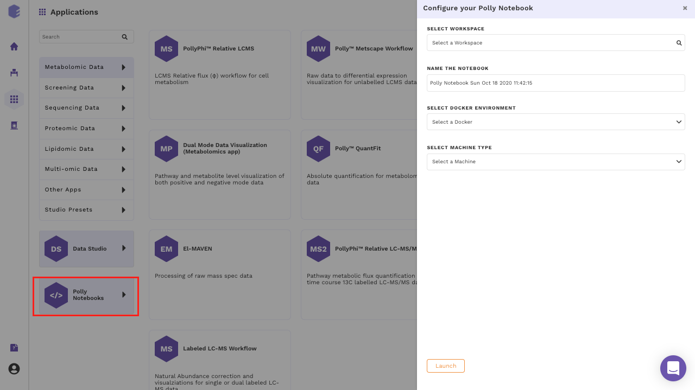 
**Figure 2.** *New Notebook* button to create a new notebook

*   **Upload a notebook:** Click on the *Upload icon* at the top of the panel and select the *Upload a Notebook* option.

 
**Figure 3.** *Upload Notebook* button to upload a notebook

The notebook can be uploaded via browse files option or from the local system. To upload from the local system, files can be dragged and dropped. 

 
**Figure 4.** Window to import notebook 

*   **Open an existing notebook:** Click on the name of any existing notebook to *Edit and Launch* it.
If you are running the notebook for the first time, the option *Edit and Launch* would appear as a default selection to launch the selected notebook. You are required to select an environment and a machine to run the given notebook, oly after these selections are done you can launch the notebook.

**Figure 5.** Opening a notebook for the first time

*   **For an older notebook:** You have two options, you can either launch the notebook directly by the Launch button or you can choose to edit it first before launching through the Edit and Launch button. 

**Note:**

*    Under the edit option, you can only change the machine type. The docker environment would remain the same as the one selected when you run the notebook for the first time.

 
**Figure 6.** Opening an old notebook

##Pre-Configured Environments

Polly supports various notebook environments in the form of dockers to cater to the needs of different users. Each of the dockers is built according to various data analytic needs ranging from basic scripting, processing large data or training and testing of ML models. The menu to select the notebook environments will pop-up whenever you create or upload the notebook and opens it for the first time.

 
**Figure 7.** Menu to select various available environments

The various notebook environments supported are as follows:

| Environment | Usage | R libraries | Python Modules | System |
|----------------------------|--------------------------------------------------------------------|--------------------------------------------------------------------------------------------------------------------------------------------------------------------------------------------------------------------------------------------------------------------------------------------------------------------------------------------------------------------------------------------------------------------------------------------------------------------------------------------------------------------------------------------------------------------------------------------------------------------------------------------------------------------------------------------------------------------------------------------------------------------------------------------------------------------------------------------------------------------------------------------------------------------------------------------------------------------------------------------------------------------------------------------------------------------------------------------------------------------------------------------------------------------------------------------------------------------------------------------------------------------------------------------------------------------------------------------------------------------------------------------------------------------------------------------------------------------------------------------------------------------------------------------------------------------------------------------------------------------------------------------------------------------------------------------------------------------------------------------------------------------------------------------------------------------------------------------------------------------------------------------|--------------------------------------------------------------------------------------------------------------------------------------------------------------------------------------------------------------------------------------------------------------------------------------------------------------------------------------------------------------------------------------------------------------------------------------------------------------------------------------------------------------------------------------------------------------------------------------------------------------------------------------------------------------------------------------------------------------------------------------------------------------------------------------------------------------------------------------------------------------------------------------------------------------------------------------------------------------------------------------------------------------------------------------------------------------------------------------------------------------------------------------------------------------------------------------------------------------------------------------|-----------------------------------------------------|
| R | General R scripting | <ul><li>askpass 1.1</li><li>assertthat 0.2.1</li><li>backports 1.1.5</li><li>base64enc 0.1-3</li><li>BH 1.72.0-3</li><li>BiocManager 1.30.10</li><li>bitops 1.0-6</li><li>brew 1.0-6</li><li>callr 3.4.2</li><li>cli 2.0.2</li><li>clipr 0.7.0</li><li>clisymbols 1.2.0</li><li>colorspace 1.4-1</li><li>commonmark 1.7</li><li>covr 3.4.0</li><li>crayon 1.3.4</li><li>crosstalk 1.0.0</li><li>curl 4.3</li><li>cyclocomp 1.1.0</li><li>desc 1.2.0</li><li>devtools 2.2.2</li><li>diffobj 0.2.3</li><li>digest 0.6.25</li><li>DT 0.12</li><li>ellipsis 0.3.0</li><li>evaluate 0.14</li><li>fansi 0.4.1</li><li>farver 2.0.3</li><li>fastmap 1.0.1</li><li>foghorn 1.1.4</li><li>fs 1.3.1</li><li>gargle 0.4.0</li><li>ggplot2 3.2.1</li><li>gh 1.1.0</li><li>git2r 0.26.1</li><li>glue 1.3.1</li><li>gmailr 1.0.0</li><li>gridExtra 2.3</li><li>gtable 0.3.0</li><li>highlight 0.5.0</li><li>highr 0.8</li><li>htmltools 0.4.0</li><li>htmlwidgets 1.5.1</li><li>httpuv 1.5.2</li><li>httr 1.4.1</li><li>hunspell 3.0</li><li>ini 0.3.1</li><li>IRdisplay 0.7.0</li><li>IRkernel 1.1</li><li>jsonlite 1.6.1</li><li>knitr 1.28</li><li>labeling 0.3</li><li>later 1.0.0</li><li>lazyeval 0.2.2</li><li>leaflet 2.0.3</li><li>leaflet.providers 1.9.0</li><li>lifecycle 0.1.0</li><li>lintr 2.0.1</li><li>magrittr 1.5</li><li>markdown 1.1</li><li>memoise 1.1.0</li><li>mime 0.9</li><li>mockery 0.4.2</li><li>munsell 0.5.0</li><li>openssl 1.4.1</li><li>parsedate 1.2.0</li><li>pbdZMQ 0.3-3</li><li>pillar 1.4.3</li><li>pingr 2.0.0</li><li>pkgbuild 1.0.6</li><li>pkgconfig 2.0.3</li><li>pkgdown 1.4.1</li><li>pkgload 1.0.2</li><li>plyr 1.8.6</li><li>png 0.1-7</li><li>PollyConnector 0.0.0</li><li>praise 1.0.0</li><li>prettyunits 1.1.1</li><li>processx 3.4.2</li><li>promises 1.1.0</li><li>ps 1.3.2</li><li>purrr 0.3.3</li><li>R6 2.4.1</li><li>rappdirs 0.3.1</li><li>raster 3.0-12</li><li>rcmdcheck 1.3.3</li><li>RColorBrewer 1.1-2</li><li>Rcpp 1.0.3</li><li>rematch 1.0.1</li><li>rematch2 2.1.0</li><li>remotes 2.1.1</li><li>repr 1.1.0</li><li>reshape2 1.4.3</li><li>reticulate 1.14</li><li>rex 1.1.2</li><li>rhub 1.1.1</li><li>RJSONIO 1.3-1.4</li><li>rlang 0.4.5</li><li>rmarkdown 2.1</li><li>roxygen2 7.0.2</li><li>rprojroot 1.3-2</li><li>rstudioapi 0.11</li><li>rversions 2.0.1</li><li>rvest 0.3.5</li><li>scales 1.1.0</li><li>selectr 0.4-2</li><li>sessioninfo 1.1.1</li><li>shiny 1.4.0</li><li>sourcetools 0.1.7</li><li>sp 1.4-1</li><li>spelling 2.1</li><li>stringi 1.4.6</li><li>stringr 1.4.0</li><li>sys 3.3</li><li>testthat 2.3.2</li><li>tibble 2.1.3</li><li>tinytex 0.20</li><li>triebeard 0.3.0</li><li>urltools 1.7.3</li><li>usethis 1.5.1</li><li>utf8 1.1.4</li><li>uuid 0.1-4</li><li>vctrs 0.2.3</li><li>viridis 0.5.1</li><li>viridisLite 0.3.0</li><li>whisker 0.4</li><li>whoami 1.3.0</li><li>withr 2.1.2</li><li>xfun 0.12</li><li>xml2 1.2.2</li><li>xmlparsedata 1.0.3</li><li>xopen 1.0.0</li><li>xtable 1.8-4</li><li>yaml 2.2.1</li><ul> | None |   |
| Python 2 | General Python 2 scripting | None | <ul><li>attrs 19.3.0</li><li>backports-abc 0.5</li><li>backports.functools-lru-cache 1.6.1</li><li>backports.shutil-get-terminal-size 1.0.0</li><li>bleach 3.1.0</li><li>certifi 2019.11.28</li><li>chardet 3.0.4</li><li>cmapPy 1.0.5</li><li>configparser 4.0.2</li><li>contextlib2 0.6.0.post1</li><li>cycler 0.10.0</li><li>decorator 4.4.1</li><li>defusedxml 0.6.0</li><li>entrypoints 0.3</li><li>enum34 1.1.6</li><li>funcsigs 1.0.2</li><li>functools32 3.2.3.post2</li><li>futures 3.3.0</li><li>h5py 2.10.0</li><li>idna 2.8</li><li>importlib-metadata 1.5.0</li><li>ipaddress 1.0.23</li><li>ipykernel 4.10.1</li><li>ipython 5.9.0</li><li>ipython-genutils 0.2.0</li><li>ipywidgets 7.4.2</li><li>Jinja2 2.11.1</li><li>jsonschema 3.2.0</li><li>jupyter-client 5.3.4</li><li>jupyter-core 4.6.2</li><li>kiwisolver 1.1.0</li><li>MarkupSafe 1.1.1</li><li>matplotlib 2.2.4</li><li>mistune 0.8.4</li><li>nbconvert 5.6.1</li><li>nbformat 4.4.0</li><li>notebook 5.7.8</li><li>numpy 1.16.6</li><li>pandas 0.24.1</li><li>pandocfilters 1.4.2</li><li>pathlib2 2.3.5</li><li>pexpect 4.8.0</li><li>pickleshare 0.7.5</li><li>plotly 3.7.0</li><li>prometheus-client 0.7.1</li><li>prompt-toolkit 1.0.18</li><li>ptyprocess 0.6.0</li><li>PubChemPy 1.0.4</li><li>Pygments 2.5.2</li><li>pyparsing 2.4.6</li><li>pyrsistent 0.15.7</li><li>python-dateutil 2.8.1</li><li>pytz 2019.3</li><li>pyzmq 18.1.1</li><li>qgrid 1.1.1</li><li>requests 2.21.0</li><li>retrying 1.3.3</li><li>scandir 1.10.0</li><li>scikit-learn 0.20.3</li><li>scipy 1.2.3</li><li>Send2Trash 1.5.0</li><li>simplegeneric 0.8.1</li><li>singledispatch 3.4.0.3</li><li>six 1.14.0</li><li>subprocess32 3.5.4</li><li>terminado 0.8.3</li><li>testpath 0.4.4</li><li>tornado 5.1.1</li><li>traitlets 4.3.3</li><li>urllib3 1.24.3</li><li>wcwidth 0.1.8</li><li>webencodings 0.5.1</li><li>widgetsnbextension 3.4.2</li><li>zipp 1.1.0</li><ul> |   |
| Python 3 | General Python 3 scripting | None | <ul><li>alembic 1.4.1</li><li>async-generator 1.10</li><li>attrs 19.3.0</li><li>awscli 1.17.12</li><li>backcall 0.1.0</li><li>bleach 3.1.1</li><li>botocore 1.14.12</li><li>certifi 2019.11.28</li><li>chardet 3.0.4</li><li>colorama 0.4.3</li><li>cycler 0.10.0</li><li>decorator 4.4.2</li><li>defusedxml 0.6.0</li><li>docutils 0.15.2</li><li>entrypoints 0.3</li><li>idna 2.8</li><li>importlib-metadata 1.5.0</li><li>ipykernel 5.1.4</li><li>ipython 7.13.0</li><li>ipython-genutils 0.2.0</li><li>ipywidgets 7.5.1</li><li>jedi 0.16.0</li><li>Jinja2 2.11.1</li><li>jmespath 0.9.5</li><li>jsonschema 3.2.0</li><li>jupyter-client 6.0.0</li><li>jupyter-core 4.6.3</li><li>jupyter-dashboards 0.7.0</li><li>jupyterhub 0.9.4</li><li>kiwisolver 1.1.0</li><li>Mako 1.1.2</li><li>MarkupSafe 1.1.1</li><li>matplotlib 2.2.3</li><li>mistune 0.8.4</li><li>nbconvert 5.6.1</li><li>nbformat 5.0.4</li><li>notebook 5.7.2</li><li>numpy 1.18.1</li><li>pamela 1.0.0</li><li>pandas 1.0.1</li><li>pandocfilters 1.4.2</li><li>parso 0.6.2</li><li>pexpect 4.8.0</li><li>pickleshare 0.7.5</li><li>prometheus-client 0.7.1</li><li>prompt-toolkit 3.0.3</li><li>ptyprocess 0.6.0</li><li>pyasn1 0.4.8</li><li>Pygments 2.5.2</li><li>pyparsing 2.4.6</li><li>pyrsistent 0.15.7</li><li>python-dateutil 2.8.1</li><li>python-editor 1.0.4</li><li>python-oauth2 1.1.1</li><li>pytz 2019.3</li><li>PyYAML 5.3</li><li>pyzmq 19.0.0</li><li>qgrid 1.3.0</li><li>requests 2.21.0</li><li>rsa 3.4.2</li><li>s3transfer 0.3.3</li><li>Send2Trash 1.5.0</li><li>six 1.14.0</li><li>SQLAlchemy 1.3.13</li><li>terminado 0.8.3</li><li>testpath 0.4.4</li><li>tornado 5.1.1</li><li>traitlets 4.3.3</li><li>urllib3 1.24.3</li><li>wcwidth 0.1.8</li><li>webencodings 0.5.1</li><li>widgetsnbextension 3.5.1</li><li>zipp 3.1.0</li><ul> |   |
| Pollyglot | Multiple kernels (R, python and bash) in same notebook/environment | <ul><li>All libraries from base R docker</li><li>Seurat</li><li>pagoda2</li><li>CellRanger</li><li>SingleR</li><ul> | <ul><li>All libraries from base python docker</li><li>scanPy</li><li>velocyto</li><li>[scVI](https://github.com/YosefLab/scVI)(scVI supports pytorch)</li><li>louvain</li><ul> |   |
| Barcoded Bulk RNA-seq | Alignment and processing of RNA-seq fastq files with barcodes | <ul><li>All libraries from R docker</li><li>limma</li><li>affy</li><li>DESeq2</li><li>edgeR</li><li>cqn</li><li>sva</li><li>BioMart</li><li>mygene</li><li>amritr</li><li>Boruta</li><li>fgsea</li><li>gsva</li><li>ReactomePA</li><li>xCell</li><li>singleR</li><li>enrichR</li><li>org.Hs.eg.db</li><li>org.Mm.eg.db</li><li>Annotation dbi</li><li>clusterProfiler</li><ul>  |&#xfeff;| <ul><li>STARsubread-1.6.4-source</li><li>gosaamer</li><li>Fastqc</li><li>Multiqc</li><li>Picard</li><ul> |
| Machine Learning in python | Training, testing and validation of ML models | None | <ul><li>All libraries from base python docker</li><li>h5py</li><li>keras</li><li>lightgbm</li><li>tensorflow</li><li>xgboost</li><ul> |   |
| Single Cell Downstream | Single Cell Analysis | <ul><li>All libraries from base R docker</li><li>Seurat</li><li>pagoda2</li><li>CellRanger</li><li>SingleR</li><li>ExperimentHub</li><ul> | <ul><li>All libraries from base python docker</li><li>scanPy</li><li>velocyto</li><li>[scVI](https://github.com/YosefLab/scVI)(scVI supports pytorch)</li><li>louvain</li><li>rpy2</li><li>anndata2ri</li><ul> |   |
| Data Exploration | R and python for general data analysis | All libraries from base R docker | All libraries from base python docker |   |
| RNA-seq Downstream | Transcriptomics Analysis | <ul><li>All libraries from R docker</li><li>limma</li><li>affy</li><li>DESeq2</li><li>edgeR</li><li>cqn</li><li>sva</li><li>BioMart</li><li>mygene</li><li>amritr</li><li>Boruta</li><li>fgsea</li><li>gsva</li><li>ReactomePA</li><li>xCell</li><li>singleR</li><li>enrichR</li><li>org.Hs.eg.db</li><li>org.Mm.eg.db</li><li>Annotation dbi</li><li>clusterProfiler</li><ul> | All libraries from base python docker |   |
| Metabolomics | Metabolomics Analysis | <ul><li>[CAMERA](https://github.com/sneumann/CAMERA, https://www.bioconductor.org/packages/release/bioc/html/CAMERA.html)</li><li>[XCMS](https://www.bioconductor.org/packages/release/bioc/html/xcms.html)</li><li>limma</li><li>matrixStats</li><li>stats</li><li>stringr</li><li>ggplot2</li><li>plotly</li><li>ggsci</li><li>latex2exp</li><li>dplyr</li><li>ggrepel</li><li>SuperExactTest</li><li>UpSetR</li><li>[PollyCommonR](https://bitbucket.org/elucidatainc/pollycommonr/src/master/PollyCommonR/)</li><li>mapGCT</li><li>MetaboAnalystR</li><li>KEGGREST</li><li>[Pathview](https://www.bioconductor.org/packages/release/bioc/html/pathview.html)</li><li>KEGGgraph</li><li>[Morpheus](https://github.com/cmap/morpheus.R)</li><li>Pca3d</li><li>X13CMS</li><li>Phantasus</li><li>MSnbase</li><li>MAIT</li><li>cmapR</li><li>xMSannotator</li><ul> | All libraries from base python docker |   |

##Computational Machines Available

The size of the data varies from few MBs to hundreds of GBs, and in order to process and analyze this huge data, one would need the computation power from a small machine to a large workstation. Polly Notebook supports configurations having 2 to 72 GB Ram and 1 to 36 CPU cores. The menu to select a machine configuration will pop-up when you creates a new notebook or uploads a notebook and tries to open it for the first time.

 
**Figure 8.** Menu to select various machine configurations

Most of the machine configuration are already specified to cover the wide variety of use cases. More machine configuration can also be made available on request (contact us at [polly@elucidata.io](polly@elucidata.io)). The general machine configurations are divided into three broad categories:

*   **General purpose:** Configurations from 1 to 4 CPU cores and 2 to 16 GB RAM fall under this category. The various configurations are:

| Name          | CPU/Cores | RAM   |
|---------------|-----------|-------|
| Polly small   | 1         | 2 GB  |
| PollyN medium | 2         | 4 GB  |
| Polly large   | 2         | 8 GB  |
| PollyN xlarge | 4         | 16 GB |

*N stands for Notebook

*   **Compute Intensive(CI):** Configurations from 16 to 36 CPU cores and 32 to 72 GB RAM fall under this category. The various configurations are:

| Name           | CPU/Cores | RAM   |
|----------------|-----------|-------|
| PollyN CI 4x-large | 16        | 32 GB |
| PollyN CI 9x-large | 36        | 72 GB |

*   **Memory-Optimized(MO):** Configurations from 4 to 8 CPU cores and 32 to 64 GB RAM fall under this category. The various configurations are:

| Name           | CPU/Cores | RAM   |
|----------------|-----------|-------|
| PollyN MO x-large | 4         | 32 GB |
| PollyN MO 2x-large | 8         | 64 GB |
| PollyN MO 4x-large | 16        | 120GB |

##Other Useful Features

There are few other useful features as well that might come handy when using a Polly Notebook. 
    
*   Click on the kebab menu at the end of the selected notebook. A menu with various options will open.
    
     
**Figure 9.** *Edit* button to change machine configuration

*   Scroll down in the menu and navigate to the desired option.

    *   *Rename*: You can rename the file using this option. Provide the new name to the file and click on *Rename* to confirm your changes.   

    *   *Edit*: Polly gives the flexibility to change the machine configuration to allow the usage of the notebook according to the computing power required at each step. You can change the configuration according to the need at each step.
    A menu with the different machine configuration will open, with the various options available will be displayed under the *Select Machine Type* segment. Select the appropriate option to change the configuration.
    
    *   *Download*: You can select this option to download the selected notebook on your system.

    *   *Delete*: You can use this option to delete the selected notebook. 

##Getting started with Polly Notebook

Upon selecting a pre-configured docker environment and a computational machine, a Polly Notebook starts launching on a new tab of the browser. Based upon the type of computational machine chosen while launching a Polly Notebook you will see a progress bar which will tell you that your new notebook is opening.

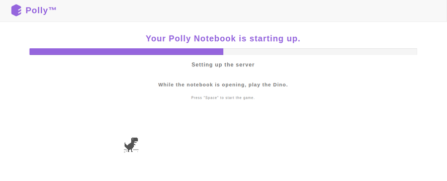 
**Figure 10.** Progress bar upon launching a Polly Notebook

Once the server is ready, you will see the new notebook gets opened on the browser. The interface is very similar to that of a Jupyter notebook.

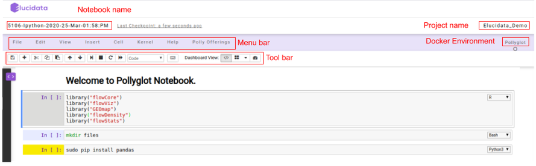 
**Figure 11.** Polly Notebook interface

On the top left, you can see a pre-defined name given to the notebook if in case a new notebook was created. Towards the top right, you can see the Polly Workspace name and below it, you can see the kernel/docker environment selected for opening the notebook.

*   **Menu bar:** There are multiple tabs present in the menu bar section which can be used to operate various functions in the notebook. For example, under the *File* tab, you can select the Rename option to change the name of the current active notebook.

*   **Toolbar:**  It contains multiple icons that allow you to perform various operations that are frequently used.

##Structure of Polly Notebook

The Polly notebook comprises of a sequence of cells. There are three types of cells: **markdown cells**, **raw cells**, and **code cells**. In each of these types, you can input multi-line content and each cell can be executed by pressing *Shift+Enter*, or by clicking either the *Run cells* option on *Cell* tab in the menu bar or the “Play” button in the toolbar.

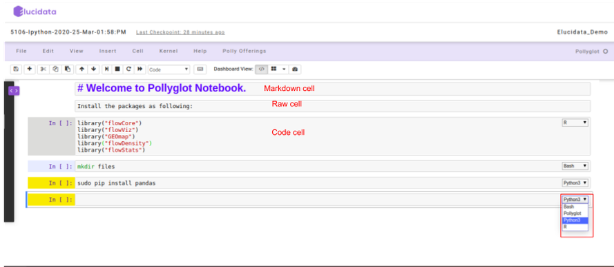 
**Figure 12.** Structure of a Polly Notebook

**Markdown cells**

You can record the computational process in a proficient manner using *rich text*. The Markdown language allows you to define a structure to the notebook by using markdown headings. It gives a basic method to play out text markup, that is, to determine which parts of the text should be stressed (italics), bold, form lists, etc.

**Raw cells**

You can write output directly in the *raw cells*. A raw cell is not evaluated by a notebook meaning anything written in the raw cell goes to the output when that cell is executed.

**Code cells**

A *code cell* allows you to edit and write a new code. The *code cell* executes the code written by you based on the kernel selected while launching the notebook. The *code cell* can include multiple programming languages as well as seen on the bottom right side of the image above. The above example is of a Pollyglot Docker environment which allows you to select multiple programming languages in the same notebook thus, you can select the type of kernel you prefer to code on.

Once the *code cell* is executed, the results which are computed by sending the code to the kernel are displayed as an output below the cell. Again to execute a *code cell*, you can click on the “Run” button and if you want to stop the computation process of a particular *code cell*, then the “Interrupt” button needs to be selected in the toolbar.

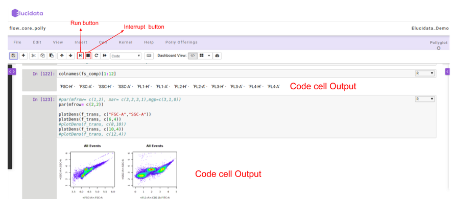 
**Figure 13.** Running a code cell

##Polly Offerings

Polly Offerings tab in the Menu bar contains the following two options, namely *Terminal* and *File Explorer* which are described below.

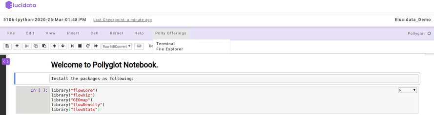 
**Figure 14.** Polly Offerings tab

**Terminal**

Once the *Terminal* option is selected, it launches a new tab on the browser and provides access to the command-line interface to execute any sets of commands. You have access to all the file types which are available in the docker environment and those can be managed through the terminal as well. The terminal option also allows you to install Python or R packages (as described later), managing system binaries and system configurations, and helps you working with code repositories hosted on GitHub, Bitbucket, etc.

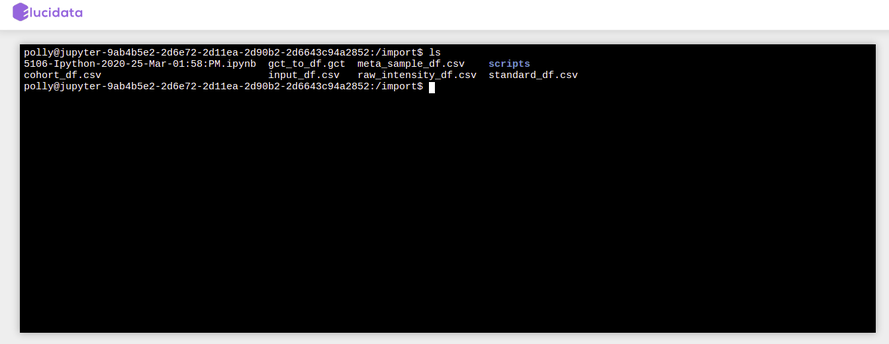 
**Figure 15.** Terminal screen window

**File Explorer**

Similar to the above option, if you select the *File Explorer* option, a new tab opens up in the browser and you can view different file types and directories present in the docker environment. Under the *Files* tab, the list of all the files and directories is available to you and any modification such as delete, upload or modifying by opening a file type can be done.

 
**Figure 16.** File Explorer window

Additionally, you can also launch a new notebook by selecting the *New* button present on the top right corner of the page in *File Explorer*. The new notebook will open in a new tab and would automatically be made available in the Notebook section of the same Polly Workspace of the original notebook.

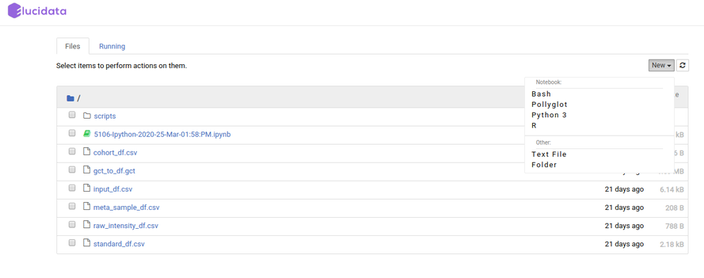 
**Figure 17.** Launching a new notebook using *File Explorer*

*File Explorer* window also allows you to view, edit or create various file types in an interactive manner. The *Text File* option in the New button can be used to create a new text file. For viewing or editing a file, you can click on the file and a text editor will open in a new tab of the browser. You can view or edit the file and save the changes made in the file. The text editor also allows you to select a programming language from the Language tab to edit and convert the file format.

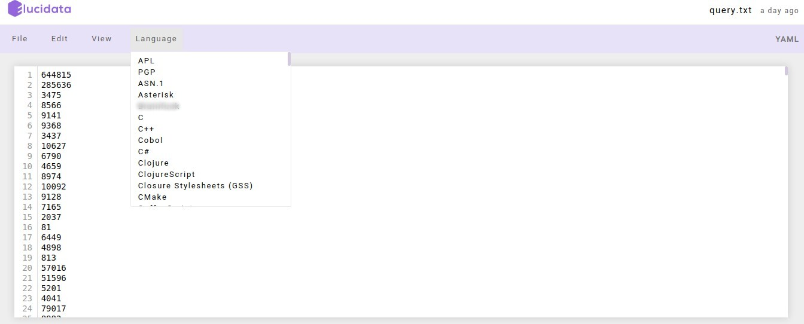 
**Figure 18.** Opening a file using a Text editor

##Installing Packages

Although most of the required packages and tools can be made available to you via the customized docker environment, sometimes you might require to install new packages to carry on the analysis. For installing the packages, you can choose two options based on their convenience, you can do it on the Notebook itself or via the terminal.

**Installing packages and system binaries using the Notebook cell**

You can install the required packages and system binaries by running the usual installation codes on the code cell of a notebook.

*   **For Python packages:** You can run the following command in the code cell with Python kernel selected to install the required packages.

<pre><code># for installing packages DON'T forget to use sudo. It will not ask for password.
!sudo pip install <package-name>
</code></pre>
 
*   **For R packages:** You can run the following command in the code cell with R kernel selected to install the required packages.

<pre><code># for installing packages DON'T forget to use sudo. It will not ask for password.
## Installing CRAN packages
!sudo  R -e 'install.packages(c("package-name"), repos="https://cloud.r-project.org/")'

## Installing Bioconductor packages
!sudo R -e 'BiocManager::install(c("package-name"), update = TRUE, ask = FALSE)'
# If error finding BiocManager then install it first using the following command and re-run the above command.
!sudo  R -e 'install.packages(c("BiocManager"), repos="https://cloud.r-project.org/")'
</code></pre>

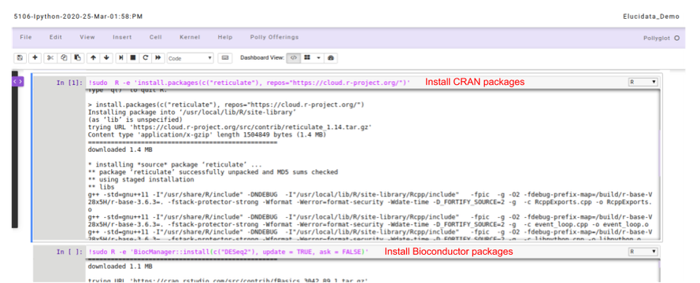 
**Figure 20.** Installing R and Python packages

*   **For System binaries:** You can also install the system binaries by running the following command in the *code cell* selecting the *bash* kernel.

<pre><code># System binaries
sudo apt install <package-name>
 
# If the above command outputs package not found, You can run this command to update the system package indices
sudo apt-get update
</code></pre>

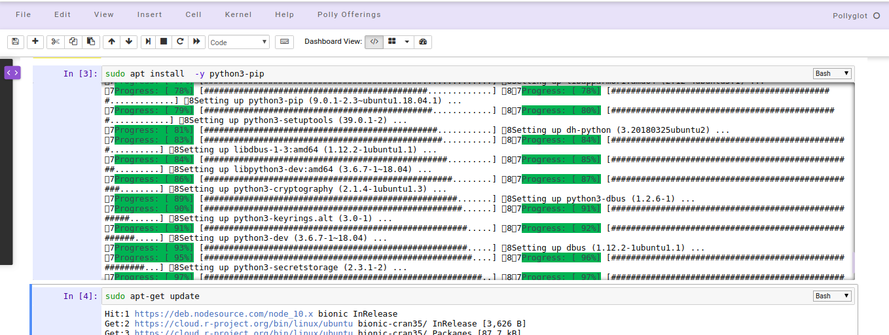 
**Figure 21.** Installing System binaries using the Notebook *code cell*

**Installing packages and system binaries via Terminal**

Another option is also available to install various packages and system binaries using the terminal. You can access the terminal as described in the document above. The commands for installation are almost similar to commands used while installing using a notebook *code cell*.

*   **For Python packages:** You can run the following command directly on the terminal to install the required packages. Once the package installation is successful, you can import the package in your notebook.

<pre><code># for installing packages DON'T forget to use sudo. It will not ask for password.
> sudo pip install <package-name>
</code></pre>

 
**Figure 22.** Installing Python packages using the Terminal

*   **For R packages:** You are required to go to the terminal and open the R Kernel using “sudo R” and then install the required R packages. Once the package installation is successful, you can import the library in your notebook  R kernel as usual.

<pre><code>## You can install R package by opening R terminal
> sudo R
 
## Install CRAN packages using the following command
> install.packages(c('pkg-name'), dependencies=TRUE, repos=<Enter your choice cran mirror link>)
# For cran mirror link: You can use either of your choice or this one : "https://cran.cnr.berkeley.edu/"

## Install Bioconductor packages using the following command
> BiocManager::install(c("pkg-name"), update = TRUE, ask = FALSE)
# If error finding BiocManager then install it first using the following command and re-run the above command.
> install.packages("BiocManager")
</code></pre>

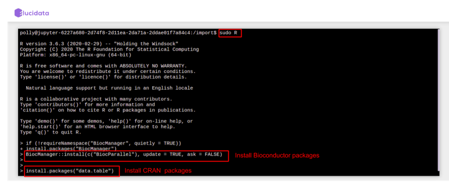 
**Figure 23.** Installing R packages using the Terminal

*   **For System binaries:** You can also install the system binaries by running the following command directly on the terminal itself.

<pre><code># System binaries
> sudo apt install <package-name>
 
# If the above command outputs package not found, You can run this command to update the system package indices
> sudo apt-get update
</code></pre>

 
**Figure 24.** Installing System libraries using the Terminal

##Reusable Scripts

Polly Notebook also allows you to make use of the reusable scripts which are already made available to you in every notebook. The reusable scripts consist of the snippet codes which are required frequently to perform any analysis. The scripts can include data reading, normalization, visualization generic functions/codes and can be added to the notebook *code cell* with just a single click and executed as usual.  The reusable scripts can be found on the left side as a collapsible dialogue box and you can choose the scripts at any time while performing the analysis.

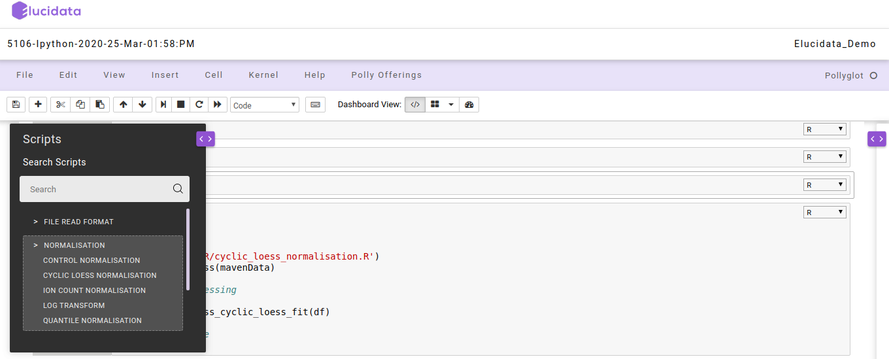 
**Figure 25.** Reusable scripts on Polly Notebook

On the right side, another collapsible dialogue box gets opened when you select any reusable script which provides information about the options and usage of that particular reusable script. You can also add your own reusable scripts on the Polly Notebook so as to make use of them in your repeated analysis and save time.

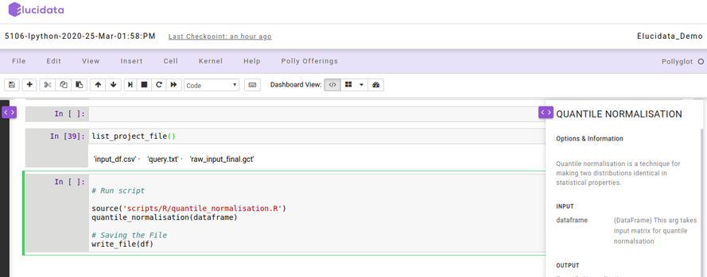 
**Figure 26.** Options and Information of Reusable scripts

#Videos

    <iframe src="https://www.youtube.com/embed/jdNeaXtzctE" frameborder="0" allowfullscreen style="position: absolute; top: 0; left: 0; width: 100%; height: 100%;"></iframe>

 
