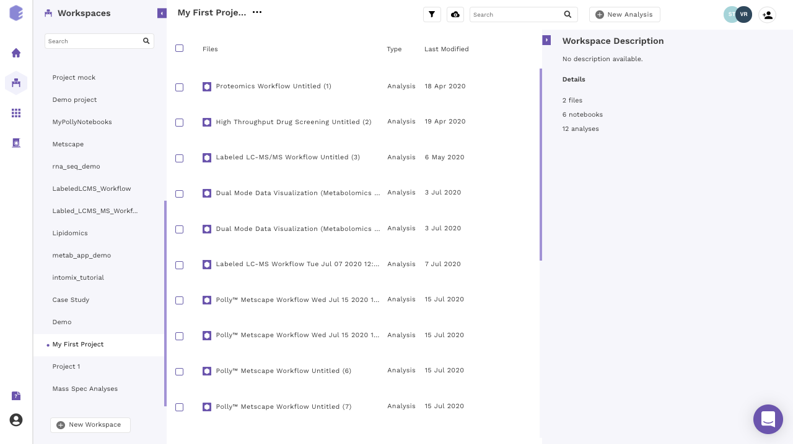
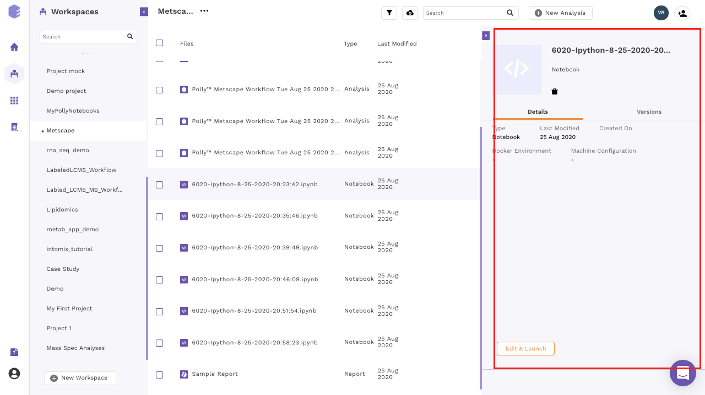
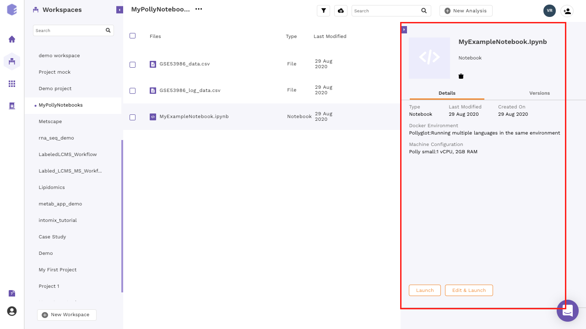

Navigate to the [Polly Workspaces](https://docs.elucidata.io/Getting%20Started/Workspaces.html) in which the analysis needs to be performed. The notebooks of this workspace can accessed from the middle panel.

 
**Figure 1.** Polly Workspaces

You can access Polly Notebooks in three ways:

*   **Create a new notebook:** Go to the *Applications* interface and click on the *Polly Notebooks* button located on the bottom left side of the navigation bar to create a new notebook. You are required to provide a name to the Notebook and select the workspace along with an environment and a machine to run the given notebook.

 
**Figure 2.** *New Notebook* button to create a new notebook

*   **Upload a notebook:** Click on the *Upload icon* at the top of the panel and select the *Upload a Notebook* option.

 
**Figure 3.** *Upload Notebook* 

The notebook can be uploaded via browse files option or from the local system. To upload from the local system, files can be dragged and dropped. 

 
**Figure 4.** Window to drop and browse files 

*   **Open an existing notebook:** Click on the name of any existing notebook to *Edit and Launch* it.
If you are running the notebook for the first time, the option *Edit and Launch* would appear as a default selection to launch the selected notebook. You are required to select an environment and a machine to run the given notebook, oly after these selections are done you can launch the notebook.

**Figure 5.** Opening a notebook for the first time

*   **For an older notebook:** You have two options, you can either launch the notebook directly by the Launch button or you can choose to edit it first before launching through the Edit and Launch button. 

**Note:**

*    Under the edit option, you can only change the machine type. The docker environment would remain the same as the one selected when you run the notebook for the first time.

 
**Figure 6.** Opening an old notebook

##Other Useful Features

There are few other useful features as well that might come handy when using a Polly Notebook. 
    
*   Click on the kebab menu at the end of the selected notebook. A menu with various options will open.
    
     
**Figure 9.** *Edit* button to change machine configuration

*   Scroll down in the menu and navigate to the desired option.

    *   *Rename*: You can rename the file using this option. Provide the new name to the file and click on *Rename* to confirm your changes.   

    *   *Edit*: Polly gives the flexibility to change the machine configuration to allow the usage of the notebook according to the computing power required at each step. You can change the configuration according to the need at each step.
    A menu with the different machine configuration will open, with the various options available will be displayed under the *Select Machine Type* segment. Select the appropriate option to change the configuration.
    
    *   *Download*: You can select this option to download the selected notebook on your system.

    *   *Delete*: You can use this option to delete the selected notebook. 

