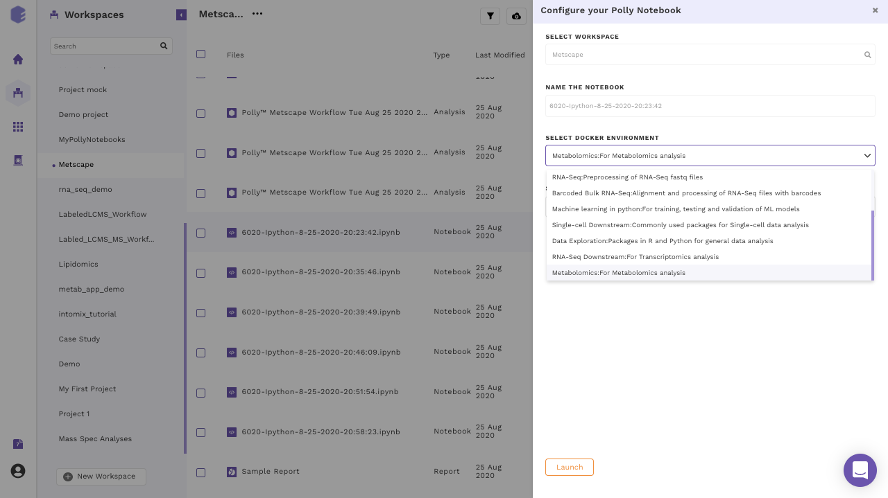

Polly supports various notebook environments in the form of dockers to cater to the needs of different users. Each of the dockers is built according to various data analytic needs ranging from basic scripting, processing large data or training and testing of ML models. The menu to select the notebook environments will pop-up whenever you create or upload the notebook and opens it for the first time.

 
**Figure 7.** Menu to select various available environments

The various notebook environments supported are as follows:

| Environment | Usage | R libraries | Python Modules | System |
|----------------------------|--------------------------------------------------------------------|--------------------------------------------------------------------------------------------------------------------------------------------------------------------------------------------------------------------------------------------------------------------------------------------------------------------------------------------------------------------------------------------------------------------------------------------------------------------------------------------------------------------------------------------------------------------------------------------------------------------------------------------------------------------------------------------------------------------------------------------------------------------------------------------------------------------------------------------------------------------------------------------------------------------------------------------------------------------------------------------------------------------------------------------------------------------------------------------------------------------------------------------------------------------------------------------------------------------------------------------------------------------------------------------------------------------------------------------------------------------------------------------------------------------------------------------------------------------------------------------------------------------------------------------------------------------------------------------------------------------------------------------------------------------------------------------------------------------------------------------------------------------------------------------------------------------------------------------------------------------------------------------|--------------------------------------------------------------------------------------------------------------------------------------------------------------------------------------------------------------------------------------------------------------------------------------------------------------------------------------------------------------------------------------------------------------------------------------------------------------------------------------------------------------------------------------------------------------------------------------------------------------------------------------------------------------------------------------------------------------------------------------------------------------------------------------------------------------------------------------------------------------------------------------------------------------------------------------------------------------------------------------------------------------------------------------------------------------------------------------------------------------------------------------------------------------------------------------------------------------------------------------|-----------------------------------------------------|
| R | General R scripting | <ul><li>askpass 1.1</li><li>assertthat 0.2.1</li><li>backports 1.1.5</li><li>base64enc 0.1-3</li><li>BH 1.72.0-3</li><li>BiocManager 1.30.10</li><li>bitops 1.0-6</li><li>brew 1.0-6</li><li>callr 3.4.2</li><li>cli 2.0.2</li><li>clipr 0.7.0</li><li>clisymbols 1.2.0</li><li>colorspace 1.4-1</li><li>commonmark 1.7</li><li>covr 3.4.0</li><li>crayon 1.3.4</li><li>crosstalk 1.0.0</li><li>curl 4.3</li><li>cyclocomp 1.1.0</li><li>desc 1.2.0</li><li>devtools 2.2.2</li><li>diffobj 0.2.3</li><li>digest 0.6.25</li><li>DT 0.12</li><li>ellipsis 0.3.0</li><li>evaluate 0.14</li><li>fansi 0.4.1</li><li>farver 2.0.3</li><li>fastmap 1.0.1</li><li>foghorn 1.1.4</li><li>fs 1.3.1</li><li>gargle 0.4.0</li><li>ggplot2 3.2.1</li><li>gh 1.1.0</li><li>git2r 0.26.1</li><li>glue 1.3.1</li><li>gmailr 1.0.0</li><li>gridExtra 2.3</li><li>gtable 0.3.0</li><li>highlight 0.5.0</li><li>highr 0.8</li><li>htmltools 0.4.0</li><li>htmlwidgets 1.5.1</li><li>httpuv 1.5.2</li><li>httr 1.4.1</li><li>hunspell 3.0</li><li>ini 0.3.1</li><li>IRdisplay 0.7.0</li><li>IRkernel 1.1</li><li>jsonlite 1.6.1</li><li>knitr 1.28</li><li>labeling 0.3</li><li>later 1.0.0</li><li>lazyeval 0.2.2</li><li>leaflet 2.0.3</li><li>leaflet.providers 1.9.0</li><li>lifecycle 0.1.0</li><li>lintr 2.0.1</li><li>magrittr 1.5</li><li>markdown 1.1</li><li>memoise 1.1.0</li><li>mime 0.9</li><li>mockery 0.4.2</li><li>munsell 0.5.0</li><li>openssl 1.4.1</li><li>parsedate 1.2.0</li><li>pbdZMQ 0.3-3</li><li>pillar 1.4.3</li><li>pingr 2.0.0</li><li>pkgbuild 1.0.6</li><li>pkgconfig 2.0.3</li><li>pkgdown 1.4.1</li><li>pkgload 1.0.2</li><li>plyr 1.8.6</li><li>png 0.1-7</li><li>PollyConnector 0.0.0</li><li>praise 1.0.0</li><li>prettyunits 1.1.1</li><li>processx 3.4.2</li><li>promises 1.1.0</li><li>ps 1.3.2</li><li>purrr 0.3.3</li><li>R6 2.4.1</li><li>rappdirs 0.3.1</li><li>raster 3.0-12</li><li>rcmdcheck 1.3.3</li><li>RColorBrewer 1.1-2</li><li>Rcpp 1.0.3</li><li>rematch 1.0.1</li><li>rematch2 2.1.0</li><li>remotes 2.1.1</li><li>repr 1.1.0</li><li>reshape2 1.4.3</li><li>reticulate 1.14</li><li>rex 1.1.2</li><li>rhub 1.1.1</li><li>RJSONIO 1.3-1.4</li><li>rlang 0.4.5</li><li>rmarkdown 2.1</li><li>roxygen2 7.0.2</li><li>rprojroot 1.3-2</li><li>rstudioapi 0.11</li><li>rversions 2.0.1</li><li>rvest 0.3.5</li><li>scales 1.1.0</li><li>selectr 0.4-2</li><li>sessioninfo 1.1.1</li><li>shiny 1.4.0</li><li>sourcetools 0.1.7</li><li>sp 1.4-1</li><li>spelling 2.1</li><li>stringi 1.4.6</li><li>stringr 1.4.0</li><li>sys 3.3</li><li>testthat 2.3.2</li><li>tibble 2.1.3</li><li>tinytex 0.20</li><li>triebeard 0.3.0</li><li>urltools 1.7.3</li><li>usethis 1.5.1</li><li>utf8 1.1.4</li><li>uuid 0.1-4</li><li>vctrs 0.2.3</li><li>viridis 0.5.1</li><li>viridisLite 0.3.0</li><li>whisker 0.4</li><li>whoami 1.3.0</li><li>withr 2.1.2</li><li>xfun 0.12</li><li>xml2 1.2.2</li><li>xmlparsedata 1.0.3</li><li>xopen 1.0.0</li><li>xtable 1.8-4</li><li>yaml 2.2.1</li><ul> | None |   |
| Python 2 | General Python 2 scripting | None | <ul><li>attrs 19.3.0</li><li>backports-abc 0.5</li><li>backports.functools-lru-cache 1.6.1</li><li>backports.shutil-get-terminal-size 1.0.0</li><li>bleach 3.1.0</li><li>certifi 2019.11.28</li><li>chardet 3.0.4</li><li>cmapPy 1.0.5</li><li>configparser 4.0.2</li><li>contextlib2 0.6.0.post1</li><li>cycler 0.10.0</li><li>decorator 4.4.1</li><li>defusedxml 0.6.0</li><li>entrypoints 0.3</li><li>enum34 1.1.6</li><li>funcsigs 1.0.2</li><li>functools32 3.2.3.post2</li><li>futures 3.3.0</li><li>h5py 2.10.0</li><li>idna 2.8</li><li>importlib-metadata 1.5.0</li><li>ipaddress 1.0.23</li><li>ipykernel 4.10.1</li><li>ipython 5.9.0</li><li>ipython-genutils 0.2.0</li><li>ipywidgets 7.4.2</li><li>Jinja2 2.11.1</li><li>jsonschema 3.2.0</li><li>jupyter-client 5.3.4</li><li>jupyter-core 4.6.2</li><li>kiwisolver 1.1.0</li><li>MarkupSafe 1.1.1</li><li>matplotlib 2.2.4</li><li>mistune 0.8.4</li><li>nbconvert 5.6.1</li><li>nbformat 4.4.0</li><li>notebook 5.7.8</li><li>numpy 1.16.6</li><li>pandas 0.24.1</li><li>pandocfilters 1.4.2</li><li>pathlib2 2.3.5</li><li>pexpect 4.8.0</li><li>pickleshare 0.7.5</li><li>plotly 3.7.0</li><li>prometheus-client 0.7.1</li><li>prompt-toolkit 1.0.18</li><li>ptyprocess 0.6.0</li><li>PubChemPy 1.0.4</li><li>Pygments 2.5.2</li><li>pyparsing 2.4.6</li><li>pyrsistent 0.15.7</li><li>python-dateutil 2.8.1</li><li>pytz 2019.3</li><li>pyzmq 18.1.1</li><li>qgrid 1.1.1</li><li>requests 2.21.0</li><li>retrying 1.3.3</li><li>scandir 1.10.0</li><li>scikit-learn 0.20.3</li><li>scipy 1.2.3</li><li>Send2Trash 1.5.0</li><li>simplegeneric 0.8.1</li><li>singledispatch 3.4.0.3</li><li>six 1.14.0</li><li>subprocess32 3.5.4</li><li>terminado 0.8.3</li><li>testpath 0.4.4</li><li>tornado 5.1.1</li><li>traitlets 4.3.3</li><li>urllib3 1.24.3</li><li>wcwidth 0.1.8</li><li>webencodings 0.5.1</li><li>widgetsnbextension 3.4.2</li><li>zipp 1.1.0</li><ul> |   |
| Python 3 | General Python 3 scripting | None | <ul><li>alembic 1.4.1</li><li>async-generator 1.10</li><li>attrs 19.3.0</li><li>awscli 1.17.12</li><li>backcall 0.1.0</li><li>bleach 3.1.1</li><li>botocore 1.14.12</li><li>certifi 2019.11.28</li><li>chardet 3.0.4</li><li>colorama 0.4.3</li><li>cycler 0.10.0</li><li>decorator 4.4.2</li><li>defusedxml 0.6.0</li><li>docutils 0.15.2</li><li>entrypoints 0.3</li><li>idna 2.8</li><li>importlib-metadata 1.5.0</li><li>ipykernel 5.1.4</li><li>ipython 7.13.0</li><li>ipython-genutils 0.2.0</li><li>ipywidgets 7.5.1</li><li>jedi 0.16.0</li><li>Jinja2 2.11.1</li><li>jmespath 0.9.5</li><li>jsonschema 3.2.0</li><li>jupyter-client 6.0.0</li><li>jupyter-core 4.6.3</li><li>jupyter-dashboards 0.7.0</li><li>jupyterhub 0.9.4</li><li>kiwisolver 1.1.0</li><li>Mako 1.1.2</li><li>MarkupSafe 1.1.1</li><li>matplotlib 2.2.3</li><li>mistune 0.8.4</li><li>nbconvert 5.6.1</li><li>nbformat 5.0.4</li><li>notebook 5.7.2</li><li>numpy 1.18.1</li><li>pamela 1.0.0</li><li>pandas 1.0.1</li><li>pandocfilters 1.4.2</li><li>parso 0.6.2</li><li>pexpect 4.8.0</li><li>pickleshare 0.7.5</li><li>prometheus-client 0.7.1</li><li>prompt-toolkit 3.0.3</li><li>ptyprocess 0.6.0</li><li>pyasn1 0.4.8</li><li>Pygments 2.5.2</li><li>pyparsing 2.4.6</li><li>pyrsistent 0.15.7</li><li>python-dateutil 2.8.1</li><li>python-editor 1.0.4</li><li>python-oauth2 1.1.1</li><li>pytz 2019.3</li><li>PyYAML 5.3</li><li>pyzmq 19.0.0</li><li>qgrid 1.3.0</li><li>requests 2.21.0</li><li>rsa 3.4.2</li><li>s3transfer 0.3.3</li><li>Send2Trash 1.5.0</li><li>six 1.14.0</li><li>SQLAlchemy 1.3.13</li><li>terminado 0.8.3</li><li>testpath 0.4.4</li><li>tornado 5.1.1</li><li>traitlets 4.3.3</li><li>urllib3 1.24.3</li><li>wcwidth 0.1.8</li><li>webencodings 0.5.1</li><li>widgetsnbextension 3.5.1</li><li>zipp 3.1.0</li><ul> |   |
| Pollyglot | Multiple kernels (R, python and bash) in same notebook/environment | <ul><li>All libraries from base R docker</li><li>Seurat</li><li>pagoda2</li><li>CellRanger</li><li>SingleR</li><ul> | <ul><li>All libraries from base python docker</li><li>scanPy</li><li>velocyto</li><li>[scVI](https://github.com/YosefLab/scVI)(scVI supports pytorch)</li><li>louvain</li><ul> |   |
| Barcoded Bulk RNA-seq | Alignment and processing of RNA-seq fastq files with barcodes | <ul><li>All libraries from R docker</li><li>limma</li><li>affy</li><li>DESeq2</li><li>edgeR</li><li>cqn</li><li>sva</li><li>BioMart</li><li>mygene</li><li>amritr</li><li>Boruta</li><li>fgsea</li><li>gsva</li><li>ReactomePA</li><li>xCell</li><li>singleR</li><li>enrichR</li><li>org.Hs.eg.db</li><li>org.Mm.eg.db</li><li>Annotation dbi</li><li>clusterProfiler</li><ul>  |&#xfeff;| <ul><li>STARsubread-1.6.4-source</li><li>gosaamer</li><li>Fastqc</li><li>Multiqc</li><li>Picard</li><ul> |
| Machine Learning in python | Training, testing and validation of ML models | None | <ul><li>All libraries from base python docker</li><li>h5py</li><li>keras</li><li>lightgbm</li><li>tensorflow</li><li>xgboost</li><ul> |   |
| Single Cell Downstream | Single Cell Analysis | <ul><li>All libraries from base R docker</li><li>Seurat</li><li>pagoda2</li><li>CellRanger</li><li>SingleR</li><li>ExperimentHub</li><ul> | <ul><li>All libraries from base python docker</li><li>scanPy</li><li>velocyto</li><li>[scVI](https://github.com/YosefLab/scVI)(scVI supports pytorch)</li><li>louvain</li><li>rpy2</li><li>anndata2ri</li><ul> |   |
| Data Exploration | R and python for general data analysis | All libraries from base R docker | All libraries from base python docker |   |
| RNA-seq Downstream | Transcriptomics Analysis | <ul><li>All libraries from R docker</li><li>limma</li><li>affy</li><li>DESeq2</li><li>edgeR</li><li>cqn</li><li>sva</li><li>BioMart</li><li>mygene</li><li>amritr</li><li>Boruta</li><li>fgsea</li><li>gsva</li><li>ReactomePA</li><li>xCell</li><li>singleR</li><li>enrichR</li><li>org.Hs.eg.db</li><li>org.Mm.eg.db</li><li>Annotation dbi</li><li>clusterProfiler</li><ul> | All libraries from base python docker |   |
| Metabolomics | Metabolomics Analysis | <ul><li>[CAMERA](https://github.com/sneumann/CAMERA, https://www.bioconductor.org/packages/release/bioc/html/CAMERA.html)</li><li>[XCMS](https://www.bioconductor.org/packages/release/bioc/html/xcms.html)</li><li>limma</li><li>matrixStats</li><li>stats</li><li>stringr</li><li>ggplot2</li><li>plotly</li><li>ggsci</li><li>latex2exp</li><li>dplyr</li><li>ggrepel</li><li>SuperExactTest</li><li>UpSetR</li><li>[PollyCommonR](https://bitbucket.org/elucidatainc/pollycommonr/src/master/PollyCommonR/)</li><li>mapGCT</li><li>MetaboAnalystR</li><li>KEGGREST</li><li>[Pathview](https://www.bioconductor.org/packages/release/bioc/html/pathview.html)</li><li>KEGGgraph</li><li>[Morpheus](https://github.com/cmap/morpheus.R)</li><li>Pca3d</li><li>X13CMS</li><li>Phantasus</li><li>MSnbase</li><li>MAIT</li><li>cmapR</li><li>xMSannotator</li><ul> | All libraries from base python docker |   |

