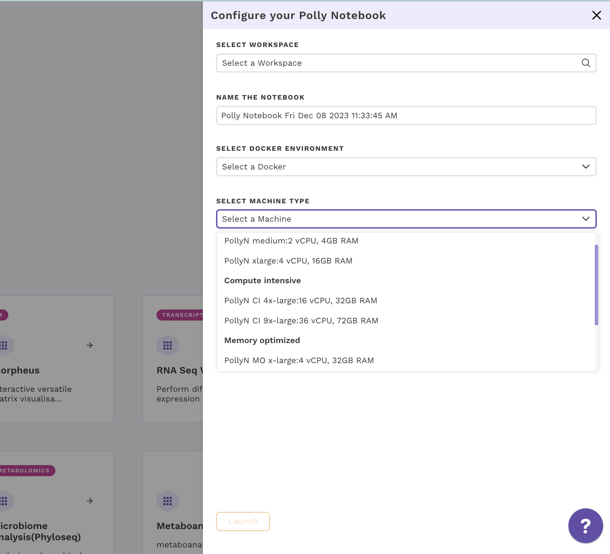

The size of the data varies from a few MBs to hundreds of GBs, and in order to process and analyze this huge data, one would need the computation power from a small machine to a large workstation. Polly Notebook supports configurations having 2 to 72 GB Ram and 1 to 36 CPU cores. The menu to select a machine configuration will pop up when you create a new notebook or upload a notebook and try to open it for the first time.

 
**Figure 9.** Menu to select various machine configurations

Most of the machine configurations are already specified to cover a wide variety of use cases. More machine configuration can also be made available on request (contact us at (polly@elucidata.io)) 

. The general machine configurations are divided into three broad categories:

*   **General purpose:** Configurations from 1 to 4 CPU cores and 2 to 16 GB RAM fall under this category. The various configurations are:

| Name          | CPU/Cores | RAM   |
|---------------|-----------|-------|
| PollyN medium | 2         | 4 GB  |
| PollyN xlarge | 4         | 16 GB |

*   **Compute Intensive(CI):** Configurations from 16 to 36 CPU cores and 32 to 72 GB RAM fall under this category. The various configurations are:

| Name           | CPU/Cores | RAM   |
|----------------|-----------|-------|
| PollyN CI 4x-large | 16        | 32 GB |
| PollyN CI 9x-large | 36        | 72 GB |

*   **Memory-Optimized(MO):** Configurations from 4 to 8 CPU cores and 32 to 64 GB RAM fall under this category. The various configurations are:

| Name           | CPU/Cores | RAM   |
|----------------|-----------|-------|
| PollyN MO x-large | 4         | 32 GB |
| PollyN MO 2x-large | 8         | 64 GB |
| PollyN MO 4x-large | 16        | 120GB |

**Note:**

**Machines options**

Machine options on notebooks are renamed for better categorization. Each polly machine will have the prefix PollyN where N stands for notebooks.
In addition, we have added the prefix CI for compute-intensive machines, MO for memory intensive, and GPU for GPU machines
