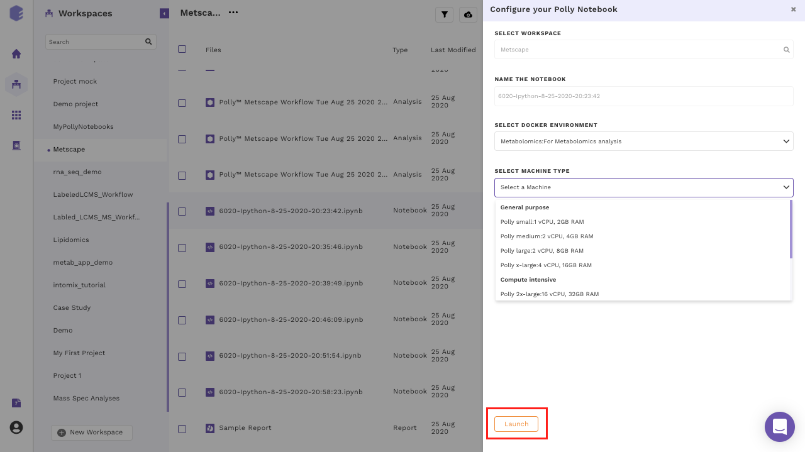

The size of the data varies from few MBs to hundreds of GBs, and in order to process and analyze this huge data, one would need the computation power from a small machine to a large workstation. Polly Notebook supports configurations having 2 to 72 GB Ram and 1 to 36 CPU cores. The menu to select a machine configuration will pop-up when you creates a new notebook or uploads a notebook and tries to open it for the first time.

 
**Figure 8.** Menu to select various machine configurations

Most of the machine configuration are already specified to cover the wide variety of use cases. More machine configuration can also be made available on request (contact us at [polly@elucidata.io](polly@elucidata.io)). The general machine configurations are divided into three broad categories:

*   **General purpose:** Configurations from 1 to 4 CPU cores and 2 to 16 GB RAM fall under this category. The various configurations are:

| Name          | CPU/Cores | RAM   |
|---------------|-----------|-------|
| Polly small   | 1         | 2 GB  |
| Polly medium  | 2         | 4 GB  |
| Polly large   | 2         | 8 GB  |
| Polly x-large | 4         | 16 GB |

*   **Compute Intensive:** Configurations from 16 to 36 CPU cores and 32 to 72 GB RAM fall under this category. The various configurations are:

| Name           | CPU/Cores | RAM   |
|----------------|-----------|-------|
| Polly 2x-large | 16        | 32 GB |
| Polly 3x-large | 36        | 72 GB |

*   **Memory-Optimized:** Configurations from 4 to 8 CPU cores and 32 to 64 GB RAM fall under this category. The various configurations are:

| Name           | CPU/Cores | RAM   |
|----------------|-----------|-------|
| Polly 2x-large | 4         | 32 GB |
| Polly 3x-large | 8         | 64 GB |
| Polly 4x-large | 16        | 120GB |

