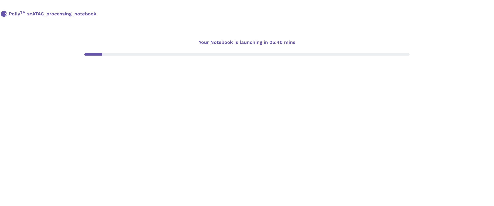
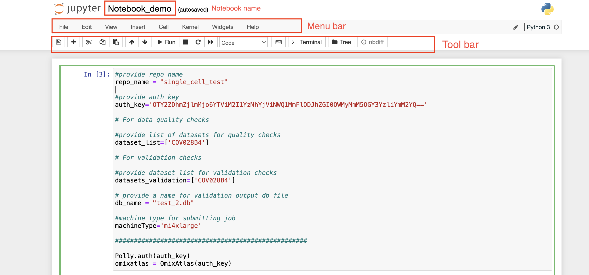
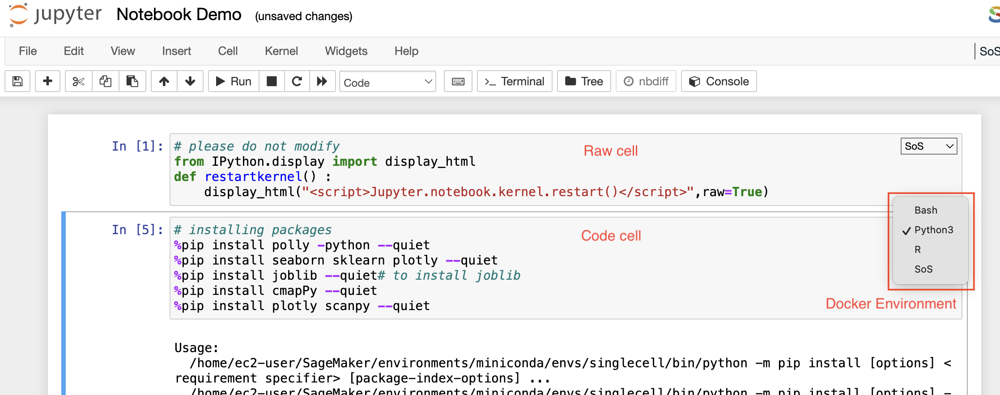
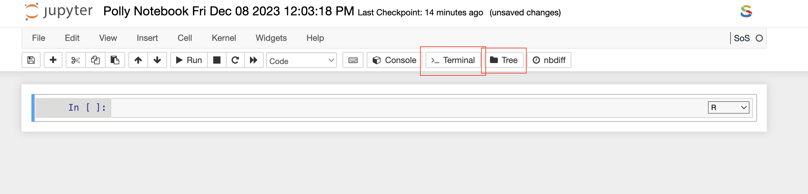
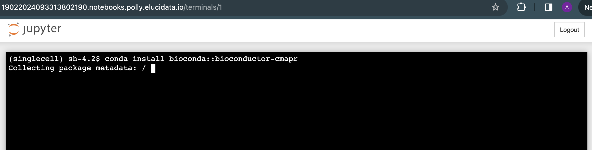
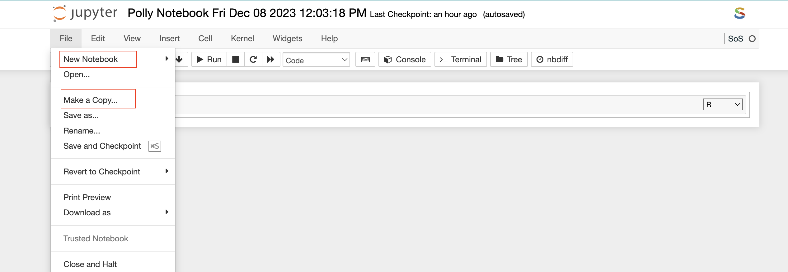

Upon selecting a pre-configured docker environment and a computational machine, a Polly Notebook starts launching on a new tab of the browser. Based on the type of computational machine chosen while launching a Polly Notebook you will see a progress bar that will tell you that your new notebook is opening.

 
**Figure 10.** Progress bar upon launching a Polly Notebook

Once the server is ready, you will see the new notebook opened on the browser. The interface is very similar to that of a Jupyter notebook.

 
**Figure 11.** Polly Notebook interface

On the top left, you can see a pre-defined name given to the notebook in case a new notebook is created. Towards the top right, you can see the Polly Workspace name, and below it, you can see the kernel/docker environment selected for opening the notebook.

*   **Menu bar:** There are multiple tabs present in the menu bar section which can be used to operate various functions in the notebook. For example, under the *File* tab, you can select the Rename option to change the name of the current active notebook.

*   **Toolbar:**  It contains multiple icons that allow you to perform various operations that are frequently used.

##Structure of Polly Notebook

The Polly notebook comprises a sequence of cells. There are three types of cells: **markdown cells**, **raw cells**, and **code cells**. In each of these types, you can input multi-line content and each cell can be executed by pressing *Shift+Enter*, or by clicking either the *Run cells* option on *Cell* tab in the menu bar or the “Play” button in the toolbar.

 
**Figure 12.** Structure of a Polly Notebook

**Markdown cells**

You can record the computational process in a proficient manner using *rich text*. The Markdown language allows you to define a structure to the notebook by using markdown headings. It gives a basic method to play out text markup, that is, to determine which parts of the text should be stressed (italics), bold, form lists, etc.

**Raw cells**

You can write output directly in the *raw cells*. A raw cell is not evaluated by a notebook meaning anything written in the raw cell goes to the output when that cell is executed.

**Code cells**

A *code cell* allows you to edit and write a new code. The *code cell* executes the code written by you based on the kernel selected while launching the notebook. The *code cell* can include multiple programming languages as well as seen on the bottom right side of the image above. The above example is of a Pollyglot Docker environment which allows you to select multiple programming languages in the same notebook thus, you can select the type of kernel you prefer to code on.

Once the *code cell* is executed, the results that are computed by sending the code to the kernel are displayed as an output below the cell. Again to execute a *code cell*, you can click on the “Run” button, and if you want to stop the computation process of a particular *code cell*, then the “Interrupt” button needs to be selected in the toolbar.

**Run Button**

The "Run" button triggers the execution of the currently selected code or active cell, facilitating the immediate processing and evaluation of the code for interactive development.

**Interrupt button**

The "Interrupt" button halts the execution of a running code or program, allowing users to stop ongoing processes and regain control.

 
**Figure 13.** Running a code cell

**Terminal**

Once the *Terminal* option is selected from the toolbar, it launches a new tab on the browser and provides access to the command-line interface to execute any set of commands. You have access to all the file types which are available in the docker environment and those can be managed through the terminal as well. The terminal option also allows you to install Python or R packages (as described later), manage system binaries and system configurations, and help you work with code repositories hosted on GitHub, Bitbucket, etc.

 
**Figure 15.** Terminal screen window

 
**Tree**

This refers to a hierarchy of elements, with a root node and branches connecting various nodes. When discussing file and directory structures, a tree is often used to visualize the organization of files and folders.

 
 **File Explorer**

Similar to the above option, if you select the *File Explorer* option, a new tab opens up in the browser and you can view different file types and directories present in the docker environment. Under the *Files* tab, the list of all the files and directories is available to you and any modification such as deleting, uploading, or modifying by opening a file type can be done.

**Note**: Access to this page will be unavailable; however, you can still delineate the file format and incorporate it into your code. 

 
**Figure 16.** File Explorer window

You can also launch a new notebook by selecting the *New* button on the top right corner of the page in *File Explorer*. The new notebook will open in a new tab and will be available only till the parent instance is open. Once they close it, it will not be saved anywhere.

 
**Figure 17.** Launching a new notebook using *File Explorer*

*File Explorer* window also allows you to view, edit, or create various file types in an interactive manner. The *Text File* option in the New button can be used to create a new text file. For viewing or editing a file, you can click on the file and a text editor will open in a new tab of the browser. You can view or edit the file and save the changes made in the file. The text editor also allows you to select a programming language from the Language tab to edit and convert the file format.

 
**Figure 18.** Opening a file using a Text editor

##Accessing Workspace files in Notebook

**Accessing individual files using Python and R functions**

For carrying on analysis, if you require any input files which are available in Polly Workspaces, those files can be fetched using a set of commands. You can list all the files present in the Workspace and then select the individual file by the following command:

<pre><code>## Lists all the files present in the project
list_project_file()
## The file will be downloaded in the current working directory
download_project_file('sample_file.csv')
</code></pre>

After finishing the analysis, you can push back the newly generated output files again to the Workspace using the following command

<pre><code>## Save the file to the project
save_file_to_project('sample_file.csv')
</code></pre>

 
**Figure 19.** Accessing individual files in a notebook

**Note:**

*    These functions cannot access files within folders in workspace. To access those files, use CLI commands.

**Accessing files and directories using CLI commands**

The contents of any directory within a Workspace can be listed using the following command on a notebook terminal or a bash cell.

<pre><code>polly files list --workspace-path "<path/to/the/directory>" -y
</code></pre>

Here, the path of the directory has to start with “polly://”. To view the contents within a folder called “Data” in the workspace, the following command will have to be executed on the notebook terminal.

<pre><code>polly files list --workspace-path "polly://Data" -y
</code></pre>

To access the directory in the notebook, the following command will have to be executed on the notebook terminal or a bash cell.

<pre><code>polly files sync -s "<path/to/the/project/directory>" -d "<absolute/path/to/the/notebook/directory>" -y
</code></pre>

Here, `-s` refers to source and `-d` refers to destination. If the folder called “Data” is to be accessed from Workspace in the notebook folder called “Input”, execute the following command.

<pre><code>polly files sync -s "polly://Data" -d "Input" -y
</code></pre>

To save notebook directories back to the Workspace, keep the source as notebook directory and destination as Polly Workspace in the same command as mentioned above.

<pre><code>polly files sync -s "<absolute/path/to/the/notebook/directory>" -d "<path/to/the/project/directory>" -y
</code></pre>

To save the folder called “Output” back to Polly Workspace, use the following command.

<pre><code>polly files sync -s "Output" -d "polly://" -y</code></pre>

Similarly, if an individual file needs to be accessed in a notebook, use the following command

<pre><code>polly files copy -s "" -d "" -y
</code></pre>

Here, `-s` refers to source and `-d` refers to destination. If the file called “Input1.csv” is to be accessed from Workspace folder “Data” in the notebook folder called “Input”, execute the following command.

<pre><code>polly files copy -s "polly://Data/Input1" -d "Input/Input1.csv" -y</code></pre>

An individual file can be saved back to workspace by interchanging source and destination in the mentioned command. 

<pre><code>polly files copy -s "Input/Input1.csv" -d "polly://Data/Input1" -y</code></pre>

##Installing Packages

Although most of the required packages and tools can be made available to you via the customized docker environment, sometimes you might require to install new packages to carry on the analysis. For installing the packages, you can choose two options based on their convenience, you can do it on the Notebook itself or via the terminal.

**Installing packages and system binaries using the Notebook cell**

You can install the required packages and system binaries by running the usual installation codes on the code cell of a notebook.

*   **For Python packages:** You can run the following command in the code cell with Python kernel selected to install the required packages.

<pre><code># for installing packages DON'T forget to use sudo. It will not ask for password.
!sudo pip install <package-name>
</code></pre>
 
*   **For R packages:** You can run the following command in the code cell with R kernel selected to install the required packages.

<pre><code># for installing packages DON'T forget to use sudo. It will not ask for password.
## Installing CRAN packages
!sudo  R -e 'install.packages(c("package-name"), repos="https://cloud.r-project.org/")'

## Installing Bioconductor packages
!sudo R -e 'BiocManager::install(c("package-name"), update = TRUE, ask = FALSE)'
# If error finding BiocManager then install it first using the following command and re-run the above command.
!sudo  R -e 'install.packages(c("BiocManager"), repos="https://cloud.r-project.org/")'
</code></pre>

 
**Figure 20.** Installing R and Python packages

*   **For System binaries:** You can also install the system binaries by running the following command in the *code cell* selecting the *bash* kernel.

<pre><code># System binaries
sudo apt install <package-name>
 
# If the above command outputs package not found, You can run this command to update the system package indices
sudo apt-get update
</code></pre>

 
**Figure 21.** Installing System binaries using the Notebook *code cell*

**Installing packages and system binaries via Terminal**

Another option is also available to install various packages and system binaries using the terminal. You can access the terminal as described in the document above. The commands for installation are almost similar to commands used while installing using a notebook *code cell*.

*   **For Python packages:** You can run the following command directly on the terminal to install the required packages. Once the package installation is successful, you can import the package in your notebook.

<pre><code># for installing packages DON'T forget to use sudo. It will not ask for password.
> sudo pip install <package-name>
</code></pre>

 
**Figure 22.** Installing Python packages using the Terminal

*   **For R packages:** You are required to go to the terminal and open the R Kernel using “sudo R” and then install the required R packages. Once the package installation is successful, you can import the library in your notebook  R kernel as usual.

<pre><code>## You can install R package by opening R terminal
> sudo R
 
## Install CRAN packages using the following command
> install.packages(c('pkg-name'), dependencies=TRUE, repos=<Enter your choice cran mirror link>)
# For cran mirror link: You can use either of your choice or this one : "https://cran.cnr.berkeley.edu/"

## Install Bioconductor packages using the following command
> BiocManager::install(c("pkg-name"), update = TRUE, ask = FALSE)
# If error finding BiocManager then install it first using the following command and re-run the above command.
> install.packages("BiocManager")
</code></pre>

 
**Figure 23.** Installing R packages using the Terminal

*   **For System binaries:** You can also install the system binaries by running the following command directly on the terminal itself.

<pre><code># System binaries
> sudo apt install <package-name>
 
# If the above command outputs package not found, You can run this command to update the system package indices
> sudo apt-get update
</code></pre>

 
**Figure 24.** Installing System libraries using the Terminal

