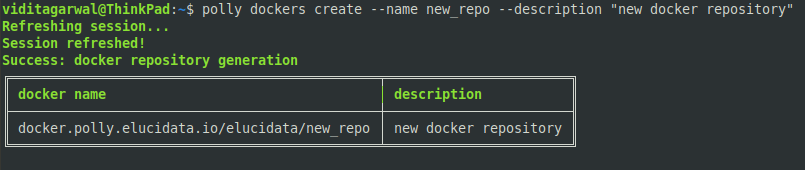
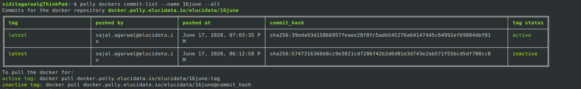

Polly has its own docker repository where dockers can be managed. The advantage of the Polly Docker Repository is that these dockers can also be stored within the same platform as data, code, and analyses and to access the stored dockers all you need is the Polly login credential.

**Docker login and logout**

In order to login/logout of the docker repository you can run the following command:

<pre><code>polly dockers login</code></pre>
<pre><code>polly dockers logout</code></pre>

The output generated from the above command should then be run on the terminal.

**Note:**

*   Add `sudo` before the command if required according to system settings.

 
**Figure 4.** Example output generated from above commands

**Create a Docker Repository**

Docker repository is a collection of dockers where you can publish and access your docker images. Here you can store one or more versions of your docker image. Every docker can have a tag and if a docker with the same tag is pushed again, it will overwrite the older docker after saving its older version that can still be accessed and used.

There can be multiple such repositories for an organization and only the members of your organization with Polly login credentials can assess them.

Use the following command to create a docker repository:

<pre><code>polly dockers create --name ,< docker_repository_name > --description < description of the repository ></code></pre>

 
**Figure 5.** Docker Repository Generation

**List docker repositories**

You can list all the stored docker repositories in your organization by using this command. 

<pre><code>polly dockers list --all</code></pre>

 
**Figure 6.** Polly Docker List

**List docker repositories commits**

You can list specific repository to view the various commits or tags stored within it through the Polly docker commit list. 

<pre><code>polly dockers commit-list --name < docker_repository_name > --all</code></pre>

 
**Figure 7.** Docker Commit List

In order to reduce the indecision when there are multiple dockers with the same name and same tag, you can distinguish them by their unique identifier which is assigned to every docker commit. In case the unique identifier is not passed in the command, the latest version of the docker with that tag will be used.

You can go back to older commit as well if required by using its tag and unique identity listed in the Polly docker commit list.

**Polly Dockers Path**

Typical path of a docker on Polly is 

<pre><code>docker.polly.elucidata.io/< organization >/< dockername >:< tag ></code></pre>

**Note:**

*    You can have two dockers with the same tag as well, in which case, the latest commit for that tag will be called by default if you call that docker. To call the docker with an older commit, commit hash will be required to specify in the path. 

<pre><code>docker.polly.elucidata.io/< organization >/< dockername >@< commit_hash ></code></pre>

The following example contains 2 docker images with the same tag. The latest image has the tag “active“. The active image can just be called by using the usual path. 

<pre><code>docker.polly.elucidata.io/elucidata/16June:latest</code></pre>

The image with the inactive tag can be called by specifying the commit hash.

<pre><code>docker.polly.elucidata.io/elucidata/16June@sha256:5747316366b8cc9e3021cd7286f42b2d6d81e3d743e2ab571f55bcd5df788cc8</code></pre>

 
**Figure 8.** Example of Docker with different tag status

**Pull/push of dockers**

The commands for docker’s pull/push are the same commands that you use for pulling and pushing from any other docker registry. The only difference is the path of the docker.

Example commands to pull a docker would be:

<pre><code>docker.polly.elucidata.io/elucidata/16June:latest</code></pre>

<pre><code>docker pull docker.polly.elucidata.io/elucidata/16june@sha256:5747316366b8cc9e3021cd7286f42b2d6d81e3d743e2ab571f55bcd5df788cc8</code></pre>
