## Single cell RNA-seq workflow on Polly Notebook:

The Polly notebook is a Jupyter Polyglot notebook that supports multiple kernels across different cells of the same notebook. Polly CLI is pre-installed in the docker and can be used here. For the sake of this use case, we will refer to the Single cell dataset and the pipeline recommended [here](https://satijalab.org/seurat/articles/pbmc3k_tutorial.html "https://satijalab.org/seurat/articles/pbmc3k_tutorial.html").

1\. To begin with the analysis, download the raw data given at the link above and upload it in your workspace through Polly GUI as shown below:

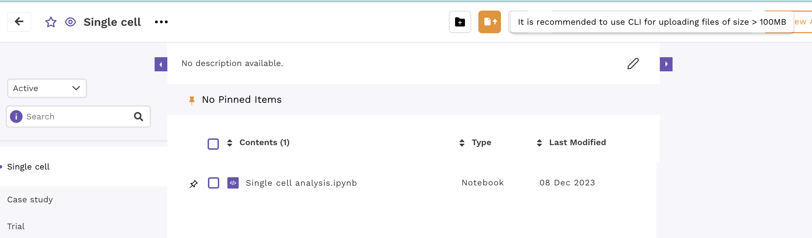 
**Figure .7** Polly workspace

Once the dataset is uploaded, it will be visible in the workspace as shown below:

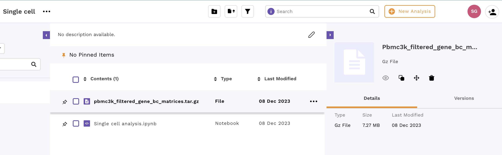 
**Figure .7.2** Uploaded data in workspace

2\. Launch a new Polly notebook in your workspace with the desired docker environment and machine type

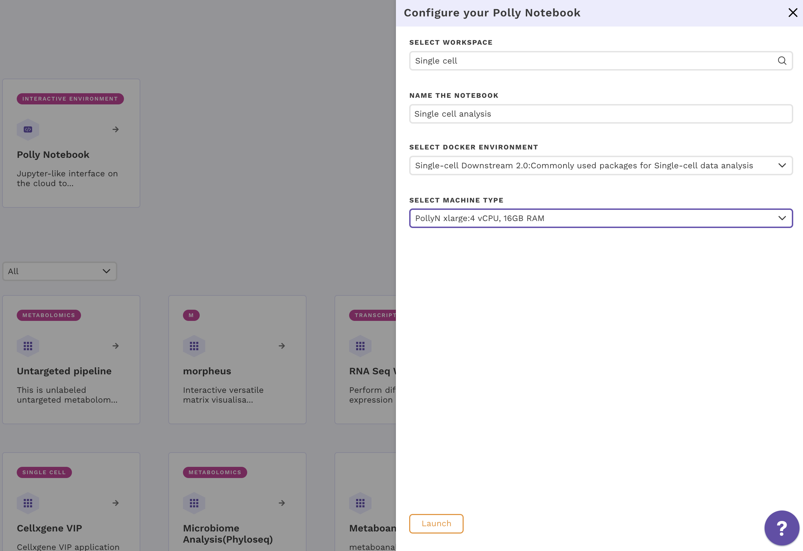 
**Figure .8** Polly notebook

3\. Read the dataset from your workspace to a notebook instance to make it accessible for analysis as below using Polly CLI in Bash kernel:

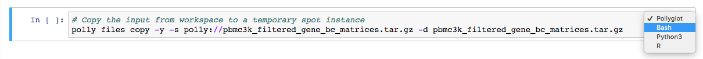 
**Figure .9** Polly files copy

4\. Uncompress the file read in the notebook instance:

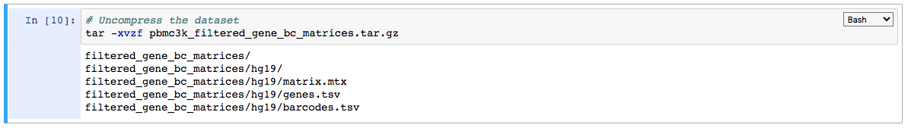 
**Figure .10** Untar data

Please note that the uncompressed directory filtered\_gene\_bc\_matrices and its contents will be lost on closing the notebook session. If the uncompressed folder is required to be saved (although not necessary here), it can be done as below:

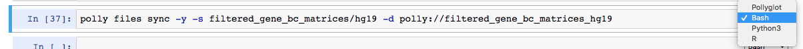 
**Figure .11** Polly files sync

You can also rename the folder while syncing with the workspace. Further, on refreshing the workspace page, you will be able to see the compressed data added along with your notebook and the downloaded data.

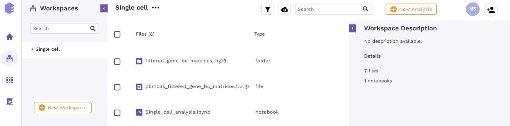 
**Figure .12** Polly workspace with data

5\. Follow the reference link and perform the scRNA-seq analysis as per the steps described in R. One step is shown below as an example.

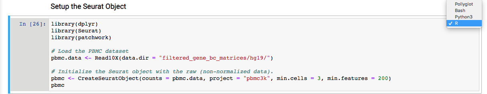 
**Figure .13** Seurat analysis

6\. In case a particular R library of interest is not available in the pre-built environment, you can easily install it in the notebook instance using the notebook itself or the Terminal from Polly Offerings menu as shown below:

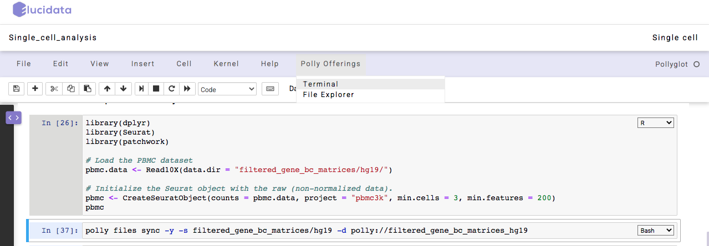 
**Figure .14** Polly Offerings

Enter the R console (note the usage of sudo) and install the desired library. Here, as an example, we will install library(pryr). First, we can check that it is missing by calling the library in R as below:

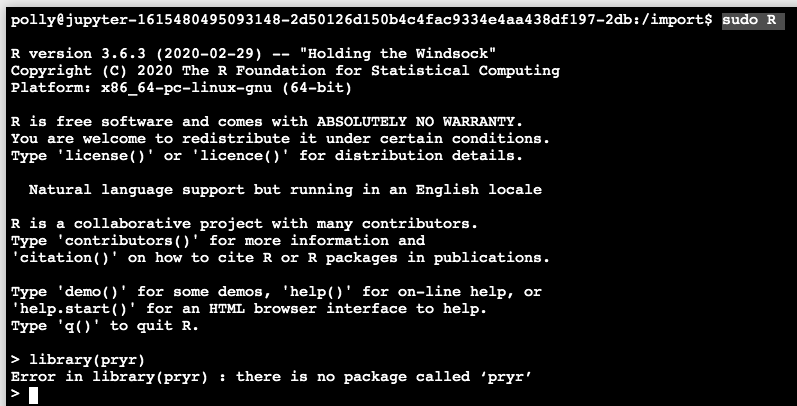 
**Figure .15** Missing R library

You can install the library from Bioconductor as below:

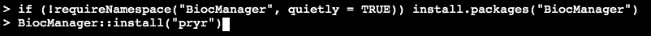 
**Figure .16** Installing R library

7\. Please remember that the output files generated during the analysis will also need to be saved/copied in the workspace specifically, else they will be lost on exiting the session. The individual files can be copied using the polly files copy command as shown below:

<pre><code>polly files copy -y -s “output.txt“ -d polly://Folder/output.txt</code></pre>

8\. Finally, a recommendation for long running jobs; please run them using the standalone Polly CLI tool to be able to launch them in the backend.

Enjoy analyzing your data with Polly CLI!!
