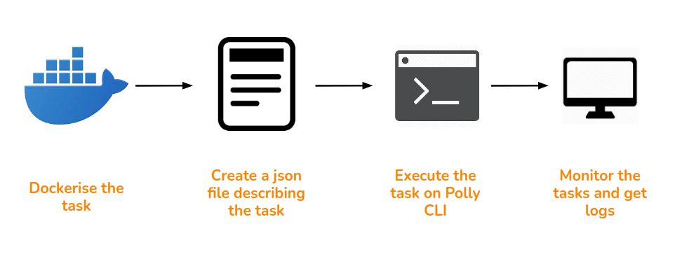
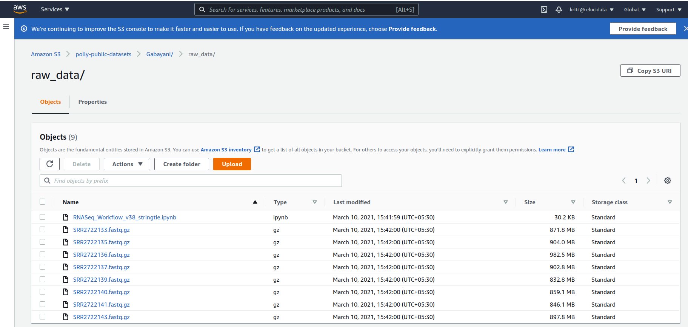
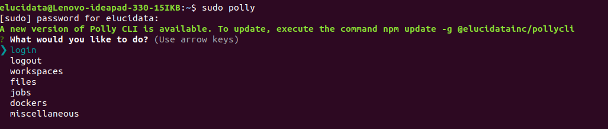
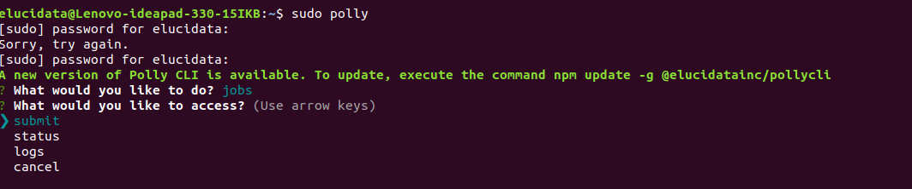
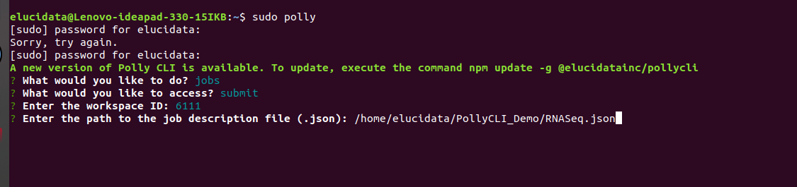
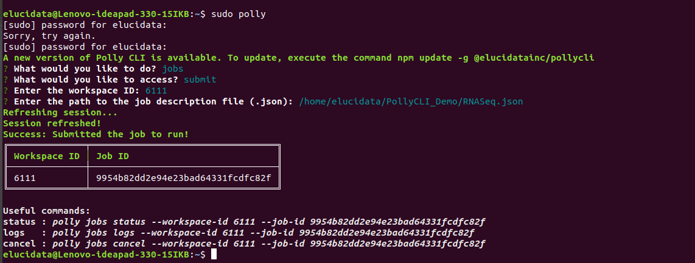

## Automated RNA-seq workflow on Polly CLI:

The RNA-seq pipeline implemented in our work environment has been completely automated using a few different tools integrated together. These include SoS, Docker, AWS and PollyCLI. The schematic diagram below gives an overview of the workflow implementation:

 
**Figure .1** RNA-seq implementation schema

**1\. Running the workflow as a single command via SoS**

Script of Scripts (SoS) is a workflow system to provide a flexible and easily manageable computational environment for the development and execution of scripts written in one or more languages within the same workflow. The SoS workflow makes the routine computational jobs hassle-free. The automated RNA-seq workflow set up on Polly is implemented using SoS to be able to run it as a single command. You could refer to the specific documentation [here](https://vatlab.github.io/sos-docs/ "https://vatlab.github.io/sos-docs/") for more details.

**2\. Containerizing the workflow executables and dependencies using Docker**

Docker is a container system which allows you to bundle all your desired tools, packages and kernel dependencies into one bucket which makes it highly portable and scalable for regular large scale data analysis. To build a docker for your specific task, we first create a docker file that contains all the installing commands for the required packages. An example docker file is shared below.

**Dockerfile:**

<pre><code>FROM docker.polly.elucidata.io/elucidata/rnaseq_pipeline:v1

ARG DEBIAN_FRONTEND=noninteractive
RUN pip3 install papermill
RUN apt-get -y update && apt-get -y clean && apt-get -y autoremove \
     apt -y --fix-broken install && apt-get -y update && apt-get -y upgrade \
     dpkg --configure -a && apt-get -y install -f 
RUN apt-get update 
RUN pip3 install regex
RUN apt install -y git
RUN apt-get -y install nodejs
RUN apt-get -y install npm
RUN npm install -g @elucidatainc/pollycli
RUN pip3 install papermill[all] sos-papermill ipypublish && apt -y --no-install-recommends install latexmk \
     && R -e 'install.packages(c("fastqcr", "reshape", "patchwork"))' && R -e 'BiocManager::install(c("DESeq2", "edgeR"))' \
     && apt-get -y --no-install-recommends install texlive-xetex texlive-fonts-recommended texlive-generic-recommended pandoc \
     && R -e 'install.packages(c("ggsci"))' && R -e 'BiocManager::install(c("rtracklayer"))' && R -e 'install.packages(c("data.table"))' \
     && R -e 'install.packages("mapgct.tar.gz", type="source", repos=NULL)'
COPY ./invoke.sh /invoke.sh
RUN chmod +x /invoke.sh
CMD ["/bin/bash","-c","/invoke.sh"]</code></pre>

The docker file is a simple text file that contains commands to build layers on top of an existing image file (an existing docker/container of the desired set of executables and dependencies). As you can see, the FROM command points to the base/parent image on top of which other tools and packages are to be added. The RUN command allows you to add multiple layers to the base image. The CMD command allows you to run custom scripts while building the docker. You could refer to the detailed documentation on creating a docker file [here](https://docs.docker.com/engine/reference/builder/#:~:text=A%20Dockerfile%20is%20a%20text,command%2Dline%20instructions%20in%20succession. "https://docs.docker.com/engine/reference/builder/#:~:text=A%20Dockerfile%20is%20a%20text,command%2Dline%20instructions%20in%20succession.").

**Entry point: invoke.sh**

<pre><code>export AWS_ACCESS_KEY_ID=${AWS_ACCESS_KEY_ID}
export AWS_SECRET_ACCESS_KEY=${AWS_SECRET_ACCESS_KEY}

aws s3 cp s3:
//${BUCKET_NAME}/${INPUT_DATA_PATH}${NOTEBOOK_NAME} ./

sos run ${NOTEBOOK_NAME} ${WORKFLOW} --bucket-name ${BUCKET_NAME} \
--path-files ${INPUT_DATA_PATH} --reference-genome ${REFERENCE_GENOME} \
--paired-or-single ${SINGLE_OR_PAIRED} --String_Parameter ${STRING_PARAMETER} ${EXTRA_ARGS}</code></pre>

The invoke.sh script is a custom script integrated in the docker to launch your analysis when the docker is ported to your work environment. It is linked with the docker file via the CMD command. This file gets executed as a single command for running the workflow while submitting the jobs.

**3\. Storing and accessing the input raw reads on AWS cloud**

The pipeline fetches input data and the workflow notebook saved on AWS S3 bucket for now. Below is a snapshot of the data directory on the cloud.

 
**Figure .2** Raw data on AWS S3

**4\. Connecting the SoS, Docker and AWS cloud to Polly CLI through a JSON file:**

The main input for running the RNA-seq workflow would be a JSON file that stores information about the computational resources and specific docker to be used in the analysis. All the other parameters used in the pipeline like reference genome, input reads, sequencing type, etc. are also part of the JSON file. The JSON file links the cloud with Polly CLI here to allow for smooth running of the SOS workflow from your local system. Below is an example JSON file shared for the pipeline.

<pre><code>{
    "machineType": "mi4xlarge",
    "image": "docker.polly.elucidata.io/elucidata/rnaseq-alignment",
    "tag": "v1",
    "name": "RNAseq report generation",
    "env": {
      "NOTEBOOK_NAME": "RNASeq_Workflow_v38_stringtie.ipynb",
      "WORKFLOW": "rnaseq",
      "BUCKET_NAME": "polly-public-datasets",
      "INPUT_DATA_PATH": "Gabayani/",
      "REFERENCE_GENOME": "mm10",
      "SINGLE_OR_PAIRED": "single",
      "STRING_PARAMETER": "9",
      "EXTRA_ARGS":"--no-Report --no-Metadata-File Metadata.csv --no-SampleColumn ID --no-PCACohort Group",
      "PYTHONUNBUFFERED":"0"
    },
    "secret_env": {
      "AWS_ACCESS_KEY_ID": "xxxxxxxxxxxxxxxxx",
      "AWS_SECRET_ACCESS_KEY": "yyyyyyyyyyyyyyyyyyy"
    }
  }</code></pre>

As you can see above, the JSON file has a specific <key> : <value> format which is very convenient for parsing the parameters defined in it. Below are some of the keys that are described in the JSON file for the automated RNA-seq analysis pipeline:

*   **machineType:** This describes the specifications (CPU and RAM) of a machine to be used for launching the job. The different machine types supported by Polly are mentioned [here](https://docs.elucidata.io/Scaling%20compute/Polly%20CLI.html#create-job-description-json-file "https://docs.elucidata.io/Scaling%20compute/Polly%20CLI.html#create-job-description-json-file").
    
*   **image:** Docker image to be used for the job, this docker image should be stored on any docker container registry like Amazon ECR, docker hub or Polly docker registry.
    
*   **tag:** Tag of the image, see the docker [reference page](https://docs.docker.com/engine/reference/commandline/tag/ "https://docs.docker.com/engine/reference/commandline/tag/") to understand what a tag is.
    
*   **name:** Name for the job as shown in the listing of jobs through Polly CLI
    
*   **env:** Environment variables for the job to be run. Please note that this is highly dependent on the docker that you are using. However one must realize that this is a way to run highly customizable jobs for various workflows. Anything can be passed here which is ultimately understood by an invoke.sh script which is inside a docker (the variables defined here are accessed in the invoke.sh script). See the contents of invoke.sh above in step 2.
    
    *   **NOTEBOOK\_NAME:** Name of the SoS notebook which contains the workflow. The notebook should be in the same directory as the FastQ files or in the starting folder.
        
    *   **WORKFLOW:** The workflow which needs to be executed in the SoS notebook. See [SoS documentation for workflows](https://vatlab.github.io/sos-docs/workflow.html#content "https://vatlab.github.io/sos-docs/workflow.html#content") for more detail. In short, an SoS notebook can contain multiple workflows, this parameter selects the workflow to be executed.
        
    *   **BUCKET\_NAME:** S3 bucket name on which the data is present. 
        
    *   **INPUT\_DATA\_PATH:** Path of the data within the s3 bucket. The parameters BUCKET\_NAME and INPUT\_DATA\_PATH will be combined to create the URL, for example, *s3://polly-public-datasets/Novagene\_Shashank/JNK1\_OneFile/* will be created by using these.
        
    *   **PYTHONUNBUFFERED:** This is to force the stdin, stdout and stderr to be totally unbuffered (same as with python -u).
        
    *   **EXTRA\_ARGS:** Extra parameters to be passed to RNAseq workflow. These are mostly arguments telling to skip some steps.
        
*   **secret\_env:** Secret environment variables to be passed to docker. These won't be stored in the database. Primarily these will be credentials.
    

**5\. Executing and managing the bundled workflow in Polly CLI:**

i. Once you have the workflow notebook, input reads and JSON file ready, you can login to your Polly CLI account from your local machine (as shown below).

 
**Figure .3** Polly CLI login

ii. Then simply submit your job through Polly CLI as below. Select jobs option and select the submit option to initiate the job.

 
**Figure .4** Polly CLI submit

iii. Provide the workspace-id and JSON file path  
  
 
**Figure .5** Polly CLI JSON input

iv. After, submitting the job, you can track its progress with the commands suggested by Polly as shown below.

 
**Figure .6** 	Polly CLI job tracking

