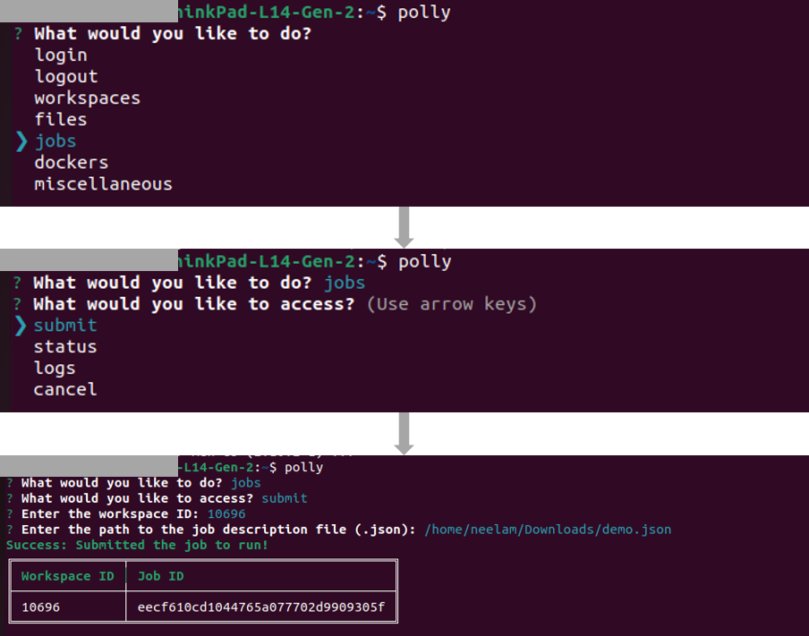
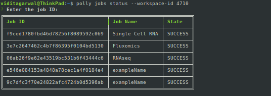
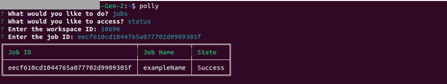
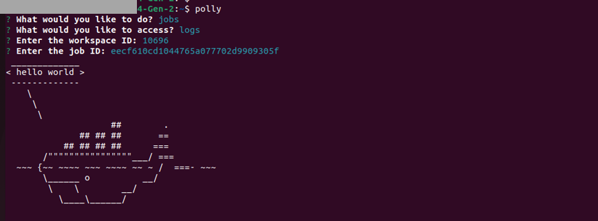

To execute the job, execute the following command

<pre><code>polly jobs submit</code></pre>

On executing this command, you will be asked to enter the id of the workspace where the job should be run and the path to the job description JSON file. With this, the job will be submitted to run and Job ID will be created. This Job ID will be needed to check the status and the logs of the submitted job.

**Note:**   

*   You do not need to create a new Workspace for running a job. You can simply list the older Workspaces and run a job in an already created Workspace.

 
**Figure 1.** Submit Jobs

Alternatively, users can submit a job using interactive command prompt as shown below.

 
**Figure 2.** Submit Jobs

##Monitor Job status

**Get job status **

*   The following command can be used to view the status of a particular job.

<pre><code>polly jobs status --workspace-id <workspace id> --job-id <job id></code></pre>

 
**Figure 3.** Single Job Status

*   The following command can be used to view the statuses of all the jobs in a workspace.

<pre><code>polly jobs status --workspace-id <workspace id></code></pre>

A prompt to enter job id will appear which when kept blank gets all the job statuses in a workspaces.

 
**Figure 4.** All Job Statuses in a Workspace

*   The following command can be used to view the status of a particular job.
`polly jobs status --workspace-id  --job-id`

*   The following command can be used to view the statuses of all the jobs in a workspace.
`polly jobs status --workspace-id`

*   If you are within a Polly environment while accessing Polly CLI (like notebook or CLI job), workspace id can be auto-detected by passing `--yes` or `-y` in the command instead of `--workspace-id` parameter.

Alternatively, users can check jobs status using interactive commnd prompt.

 
**Figure 5.**Job Status in a Workspace

**Get job logs**

To view the logs of any job, use the following command:

<pre><code>polly jobs logs --workspace-id <workspace id> --job-id <job id></code></pre>

This will give the logs for the job. In case the job is still running, it will give the logs generated till that instant.

 
**Figure 6.** Job Logs

Alternatively, users can log jobs status using interactive commnd prompt.

 
**Figure 7.** Job logs

**Note:**  

*   If you are within a Polly environment while accessing Polly CLI (like notebook or CLI job), workspace id can be auto-detected by passing `--yes` or `-y` in the command instead of `--workspace-id` parameter.

##Polly CLI help

If help is needed for any command, just type `--help` at the end of the command and execute.

 
**Figure 13.** Polly CLI Help

## Some useful gists

*   [Accessing Polly files in and out of a job](https://gist.github.com/GeorgeSabu/8a3251e263d93b08413ce2c56d8af45d)

*   [Running a cluster of jobs with different parameters](https://gist.github.com/GeorgeSabu/e89891da1d86fbaa3afa0655a4ede899)

*   [Bash script to identify when a job finishes](https://gist.github.com/GeorgeSabu/4fbc359fa9ee2bf4d3cb05df3b60db81)
