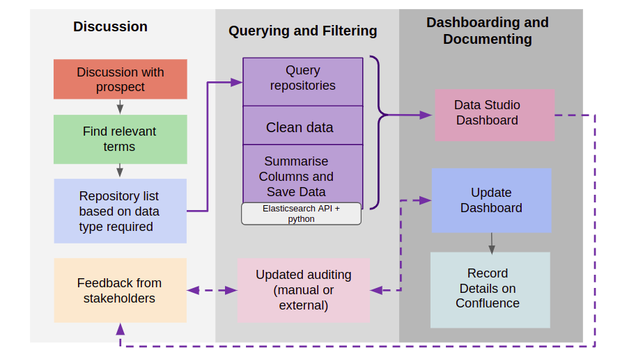
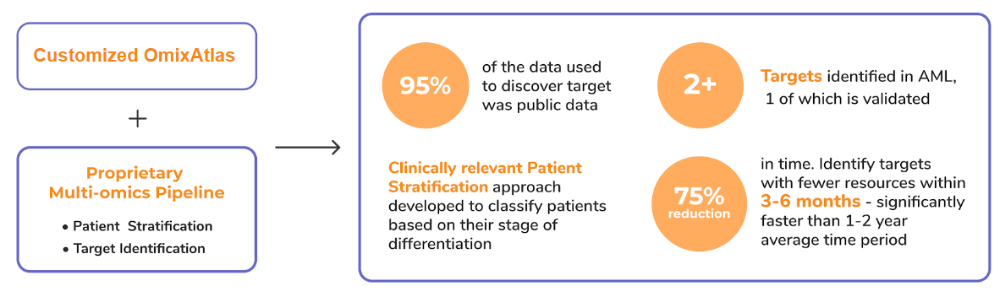
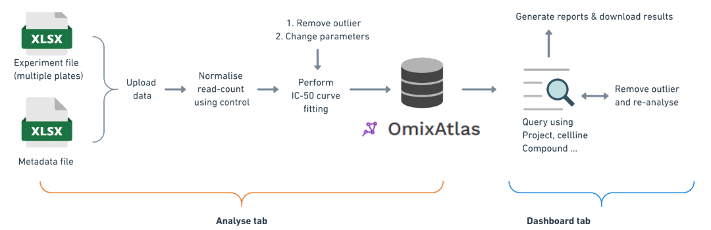
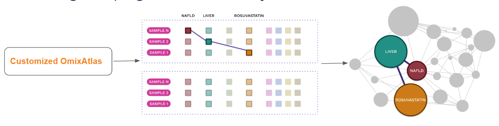
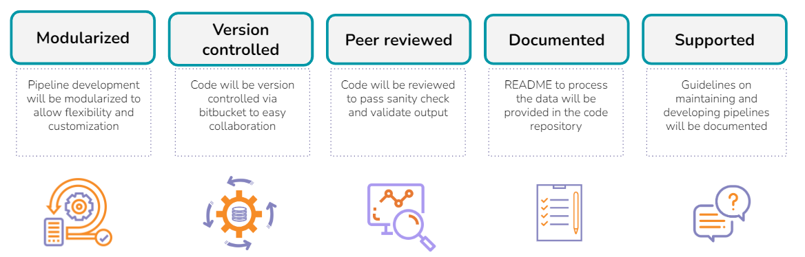

#### **What is data audit?**

The process of data audit begins with a discovery call to understand the data requirements of the prospective customer. The data requirements are captured via questionnaire. Using the points noted in the questionnaire. Accordingly, data audit is performed,

- Internal Data Audit - Finding data on Polly OmixAtlas That is relevant to the customer requirements
- External Data Audit - Find relevant data that is not yet incorporated on Polly OmixAtlas ( if number of datasets is less than 50 we will also do external audit using External Data audit )

The data is then used to create dashboards to review it with the prospect to know more about their data needs. These dashboards help us convey to the customers that,

- We have data they need and we are also able to talk about how this audit is possible because we have standardized schema and annotation
- We have standard process to communicate about data available on Polly
- Can work on their curation needs for custom curation

Initially, after the first call with the prospect, the data audit performed aims to give the customer a broad view of the data of their interest on Polly. In the follow-up calls the data audit process becomes more pin-pointed based on additional requests from the customer like request for gene knockout data, stage data, patient data and more.

**Data Audit Workflow**

The process of data audit can be divided into 3 main phases

- Discussion Phase - Gathering customer requirements, finding relevant terms and feedback
- Querying and Filtering Phase - Querying data on Polly (usually done using ElasticSearch API), cleaning and summarizing data.
- Dashboarding and Documenting - Connecting data to Google Data Studio page, updating the dashboard as required and documenting the process on Confluence

 

#### **What are the data types?**

| Data types | Description | Repositories |
| --- | --- | --- |
| Transcriptomics | Is the **study of the transcriptome** —the complete set of RNA transcripts that are produced by the genome, under specific circumstances. The main platforms available are RNA-Seq which is a high-throughput sequencing method or microarray. | HPA, GDC, GEO, CPTAC, Liver OA, cBioPortal, LINCS, TCGA, GTex |
| GWAS | A **genome-wide association study** (abbreviated GWAS) is a research approach used to identify genomic variants that are statistically associated with a risk for a disease or a particular trait. | UKBioBank, gnomAD |
| Mutation | A mutation is **a change in the DNA sequence of an organism**. Mutations can result from errors in DNA replication during cell division, exposure to mutagens or molecular instability. | TCGA, cBioPortal, CPTAC, Liver OA |
| Copy Number Variation | Copy number variation is **a type of structural change** where a region of DNA ( \>\> 10bp ), which is duplicated , deleted, inverted or is any aberrant structure. | GDC, CPTAC, cBioPortal, TCGA |
| Proteomics | Is the **study of the proteome** —the set of proteins that are produced by the cell,tissue under specific circumstances. The main platforms available are ELISA (enzyme linked immunosorbent assay) Elispot (enzyme linked immunosorbent spot) and RPPA (reverse phase protein array) | CPTAC, TCGA, ImmPort, Liver OA |
| Gene Dependency| Algorithm generated score to define the gene required for the cancer to proliferate/survive | DepMap |
| Lipidomics | Is the **study of the lipidome** —the complete set of lipids that are produced by the cell, tissue under specific circumstances. | Metabolomics, TEDDY, CPTAC. Liver OA |
| Drug Response | The measurement ( IC50 ) of how much substance is required to inhibit a biological process like proliferation/survivability | PharmacoDB |
| Metabolomics | Is the **study of the metabolome** —the complete set of metabolites that are produced by the cell,tissue under specific circumstances. | TEDDY, CPTAC, Liver OA, Metabolomics |
| miRNA | Quantifies **the micro RNA transcripts** that are produced by the cell,tissue under specific circumstances. | TCGA, Liver OA, CPTAC, GDC |
| Titer | A titer is **a measurement of the amount or concentration of a substance in a solution**. It usually refers to the amount of antibodies found in a person's blood. | ImmPort |
| Methylation | Quantifies **the epigenetic change that requires transfer of methyl group** which regulates gene expression by recruiting proteins involved in gene repression or by inhibiting the binding of transcription factor(s) to DNA | CPTAC, cBioPortal, TCGA |
| PCR | **Polymerase chain reaction (PCR)** is a method widely used to rapidly make millions to billions of copies (complete or partial) of a specific DNA sample | ImmPort |
| Fusion | Quantifies **the structural change that produces a aberrant RNA transcript** which may cause undesired changes in gene function. | cBioPortal |
| Single cell | Is the **study of the transcriptome** —the complete set of RNA transcripts that are produced by a cell under specific circumstances. | Liver OA, Single Cell |
| Drug Screens | Is **transcriptomics** data generated after large amounts of drugs are screened in cell lines to study the effect of drug at various doses and/or timepoints | DepMap, Liver OA |
| Cytometry | Cytometry is **the measurement of number and characteristics of cells**. Variables that can be measured by cytometric methods include cell size, cell count, cell morphology, cell cycle phase, DNA content, and the existence or absence of specific proteins on the cell surface or in the cytoplasm. | ImmPort |
| Phosphoproteomics | Phosphoproteomics is a branch of **proteomics** that identifies, catalogs, and characterizes proteins containing a phosphate group as a posttranslational modification. | CPTAC |
| RNAi | Is a **transcriptomics** data generated after a RNA sequence-specific suppression of gene expression by double-stranded RNA, through translational or transcriptional repression. | DepMap |
| Acetylproteomics | Acetylation is **a highly conserved and reversible post-translational modification**. It mainly takes part in regulating gene expression through modifying nuclear histones, but can also regulate several metabolic enzymes and metabolism pathways. | CPTAC |
| Gene Effect | The measurement of the effect size of knocking out a gene, normalized against the distributions of non-essential and pan-essential genes | DepMap, Liver OA |
| Gene Expression Reliability | A reliability score is set for all genes and indicates the level of reliability of the analyzed protein expression pattern based on available protein/RNA/gene characterization data. | HPA |
| Exome Sequencing | Sequencing exome which is the coding region of the genome |
| Structural Biology | Is the 3D structural coordinates of a protein which may also have ligand/small molecule bound | RCSB |
| Lab measurement | Non-omics data like those from **blood clinical chemistry results** like blood reports that have Whole Blood Count, Red Blood Count, lipid profile | ImmPort |
| SNP array | SNP array is **a type of DNA microarray which is used to detect polymorphisms within a population**. A single nucleotide polymorphism (SNP), a variation at a single site in DNA, is the most frequent type of variation in the genome. | GEO |

#### What usecases do we have for curated data (prioritise cancer/treatment data)?

We have the following use cases for curated data -

- Enabling target discovery using publicly available data
  - Aggregate data from public and propreitary data
  - Set up bioinformatics processing pipelines to convert raw data to usable formats
  - Data infrastructure on Polly makes data findable for reuse and insight generation

- Enabling curation of high-throughput drug screen data
  - Centralized data management, processed data and metadata are stored together
  - Generates experiment level/project level reports

 

- Knowledge graph generation on Polly
  - Aggregate data from public and proprietary data
  - Create richer knowledge graphs across 35 million auto curated entities on Polly
  - Use over 50 billion data points to form relationships over curated metadata

- ETL pipelines support from our Subject matter experts
  - Access to large group of bioinformatics and software experts
  - Utilize extensive experience in developing and deploying pipelines for wide variety of pharmaceutical and biotech startups

