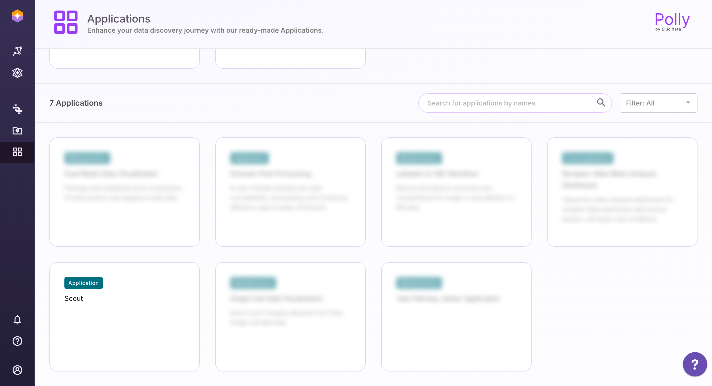
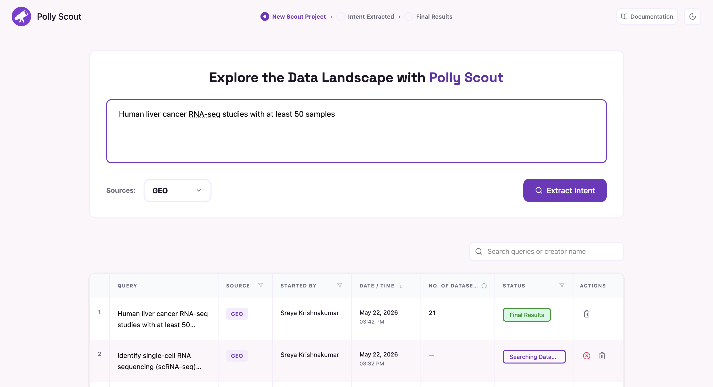
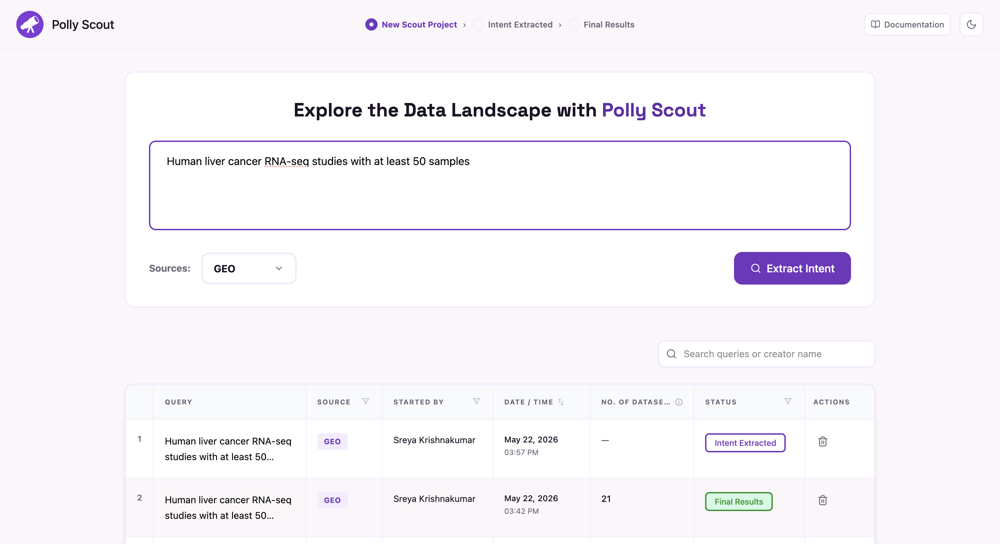
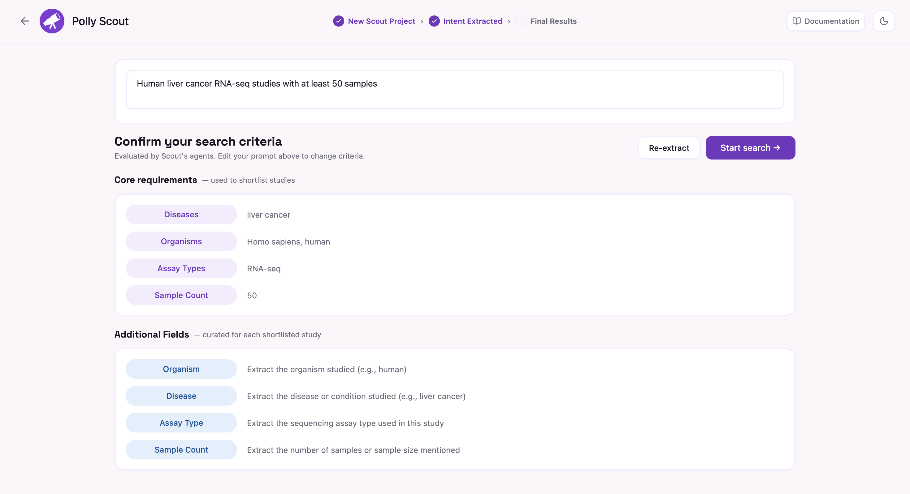
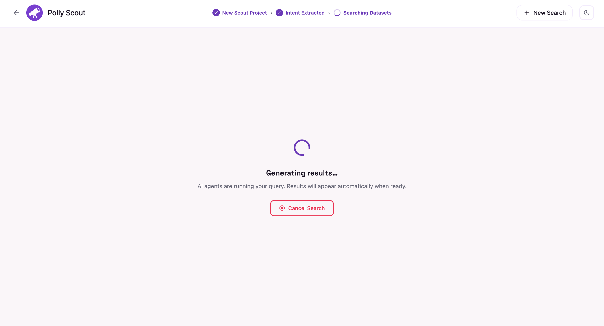
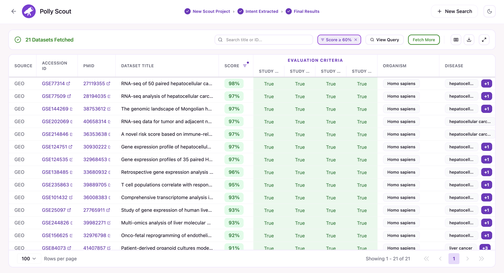
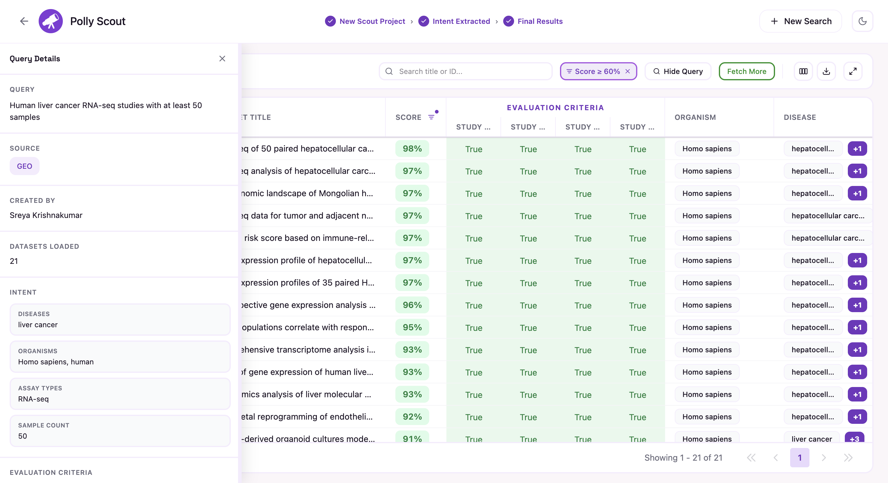
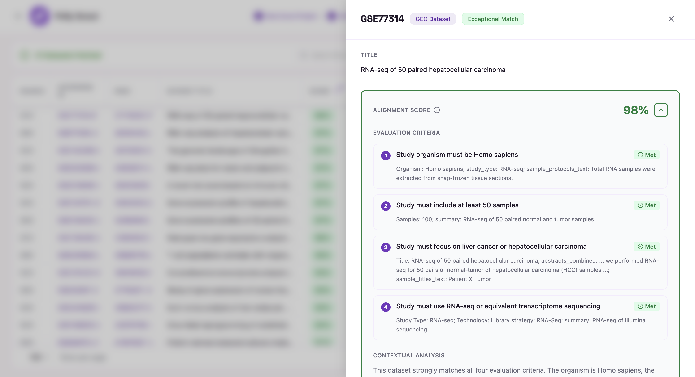
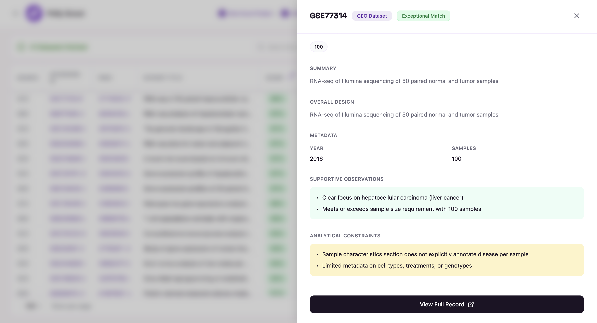

# Polly Scout

Welcome to the Polly Scout documentation portal. This guide will walk you through authenticating, executing plain-language searches, reviewing AI-extracted parameters, and navigating your dataset results.

## 1. Getting Started & Authentication

To use Scout, you must have an active session with your main Polly account. Scout securely and automatically utilizes your active session for a seamless single sign-on experience.

- **Sign In to Polly:** Open your Polly platform interface and log into your account.
- **Launch Scout:** Navigate to the applications menu inside Polly and select the **Scout** application card. 
 
Launch Polly Scout

- **Access the Dashboard:** Once selected, you will be taken directly to the Scout Home Dashboard to begin your data discovery.

 
Scout Landing Page

## 2. Submitting Your Search Criteria

Scout eliminates the need for complex database queries by allowing you to look for datasets using plain, conversational language.

- **Write Your Query:** Type your search criteria naturally in the main search bar. For example: *"Human liver cancer RNA-seq studies with at least 50 samples"*.
 
Extract Intent

- **Select Data Sources:** Choose where you want to search by selecting from available data repositories like **GEO**, **ClinicalTrials**, or other integrated sources.
- **Extract Intent:** Click the **"Extract Intent"** button. Polly Scout will immediately begin parsing your natural language query into clear, structured criteria.

## 3. Reviewing & Approving Search Intent

Before running a search across entire databases, Polly Scout breaks down your query to show you exactly how it intends to filter the information. It automatically captures and groups all relevant biological entities for your confirmation.

 
Review Intent

- **Review Everything:** Carefully check all extracted criteria fields displayed on the **Intent Review page**.
- **Modify & Re-extract:** If Polly Scout did not completely capture your search intent, simply modify your natural language query in the text box and click **"Re-extract"**.
- **Start Search:** Once you are fully satisfied with the extracted criteria, click **"Start Search"** to confirm your parameters and initiate the pipeline.

 
Result Generation

> **Cancelling a Search:** You can stop a search at any time while results are being generated by clicking "Cancel Search". Once a search is cancelled, datasets already loaded at the time of cancellation will be shown, but further results cannot be evaluated.

## 4. Results & Exploration

After confirming your intent, Polly Scout dynamically identifies, aligns, and scores relevant datasets.

 
Results View

> **Note on Threshold Filtering:** By default, only datasets with an alignment score of **>=60%** are displayed. Users can easily modify or adjust this threshold filtering value within the controls table settings.

### Results Table Controls
Manage and customize your dataset views using the control suite built directly into the results dashboard:

| Control Tool | Function & Description |
| :--- | :--- |
| **Column Picker** | Click **"Columns"** on the top right to toggle metadata fields on and off. This list is scrollable when multiple columns are available. |
| **Fetch More Datasets** | Click the **"Fetch More"** button to load the next batch of scored datasets into your view. *Note: Highly relevant datasets appear on the first page, and result relevance decreases with subsequent datasets.* |
| **CSV Export** | Click the **"Download"** icon to instantly download your current filtered view as a standalone spreadsheet. |
| **View Query** | Click **"View Query"** to expand a sidebar audit showing your original text prompt and the parsed intent layout. |

 
View Query

### Deep-Dive Dataset Exploration
To inspect any specific finding closer, simply click on its row inside the results table. This opens an expanded details panel:

 
View Dataset

- **Alignment Scores:** A transparent, itemized breakdown showing how well the dataset satisfies each individual evaluation criterion.
- **Metadata Summaries:** A clean overview of the study design, sample count details, publication year, and compiled supportive observations or analytical constraints.
- **Direct External Linking:** Access deep links out to the official source records on **GEO** or **PubMed** for rapid validation and deep research.
 
Metadata & External Linking

## 5. Query Pipeline Stages

- **New Scout Project:** The initial landing state of a freshly created project. The search interface is active, but natural language criteria and target repositories have not yet been defined or submitted.
- **Intent Extracted:** The AI engine has successfully parsed your unstructured text prompt. The structured biological criteria and filters are fully populated and visible on the interface for user review and approval.
- **Searching Datasets:** Your intent has been reviewed and approved. The discovery tool is actively executing the query background task: scanning, mapping, and scoring data repositories against your criteria.
- **Final Results:** The pipeline has completed its run across all selected data sources. The final compiled list of datasets has been scored, finalized, and is ready for exploration, refining, or export.
- **Cancelled:** The active background pipeline processing sequence was manually aborted by the user before completion.
- **Low Relevance Studies:** The pipeline successfully completed execution, but all discovered biological entries generated an overall alignment score of less than **60%**.
- **No Studies Found:** The search engine completely scanned your chosen data repositories but returned no matches for your criteria.
